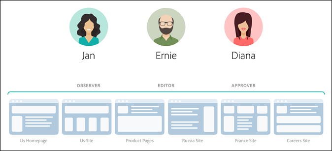
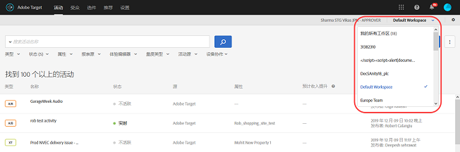
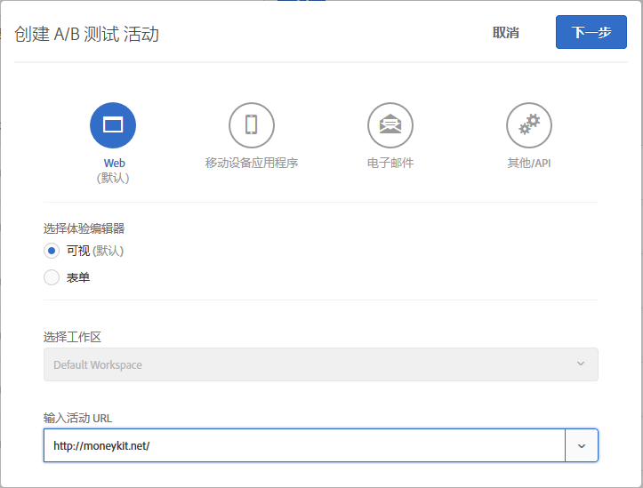
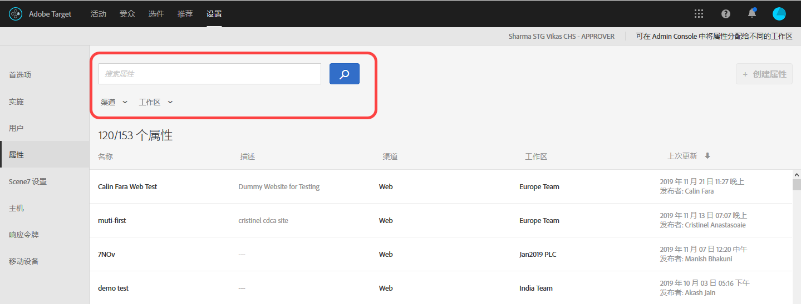

#  企业用户权限{#enterprise-user-permissions}

Enterprise user permissions is a means of formal administering enterprise-wide user access to [!DNL Target]. Add users to [!DNL Target], assign permissions based on their roles, and create workspaces for teams based on different departments, global locations, channels, and other logical groupings. You can assign users the roles of [!UICONTROL Observer], [!UICONTROL Editor], or [!UICONTROL Approver].

## 确定您是否有权访问企业用户权限

>[!NOTE]
>
>“属性和权限”功能作为  Premium 解决方案的一部分提供。[!DNL Target]如果没有 [!DNL Target] Premium 许可证，它们将无法在 [!DNL Target] Standard 中使用。
>
>Your [!DNL Target] implementation can be using any version of at.js or mbox.js.

You can tell whether your organization has a Standard or Premium license by clicking the [!UICONTROL Administration] link at the top of the [!DNL Target] UI.

* **[!DNL Target Standard]客户&#x200B;**: 如果您看到“用[!UICONTROL 户]”选项卡([!UICONTROL “管理”>“用户]”)(而不是“属[!UICONTROL 性”选项卡])，则您的组织具有[!DNL Target Standard]许可证。[!DNL Target Standard]客户应按照“用户[”中](/help/administrating-target/c-user-management/c-user-management/user-management.md)的说明在中添加用户和分配权限[!DNL Adobe Admin Console]。

* **[!DNL Target Premium]客户&#x200B;**: 如果您看到“属[!UICONTROL 性]”选项卡([!UICONTROL “设置”>“属性]”)和“用[!UICONTROL 户”选项卡]，则您的组织具有[!DNL Target Premium]许可证。[!DNL Target Premium]客户应按照本文章和[配置企业权限](/help/administrating-target/c-user-management/property-channel/properties-overview.md)中的相关说明进行操作。

## 在开始使用企业权限之前

>[!IMPORTANT]
>
>Ensure that you read the [Caveats](../../../administrating-target/c-user-management/property-channel/property-channel.md#section_9714311B1CD9497A86F4910F8AE635E2) section below before proceeding with enterprise permissions.

## Terms and definitions used in this section {#section_F8D229544FEA41C3BC2EFD1F95AA0116}

The following terms are used throughout this section and might be new to users wanting to use the Properties and Permissions functionality in [!DNL Target] Premium.

### 属性

Properties are similar in nature to those within [!DNL Adobe Platform Launch] in that they use a unique snippet of code to differentiate them.

Web 属性是一个规则库和一种嵌入代码。Web 属性可以是一个或多个域和子域的任意组合。

通过在对 Target 的任何调用（mbox、api 等）中添加特定名称/值对作为参数，更改为 [!DNL Target].

属性属于特定渠道（Web、移动设备、电子邮件或 API/其他）。

### 工作区（产品配置文件）

工作区允许组织为一组特定用户分配一组特定属性。工作区在许多方面与 [!DNL Adobe Analytics] 中的报表包相似。

注意： 工作区在中称 [!UICONTROL 为“产品] ”用户档案 [!DNL Adobe Admin Console for Enterprise]。

如果您所在的组织是跨国组织，则您可能拥有两个工作区：一个用于欧洲网页、属性或网站，而另一个用于美国网页、属性或网站。如果您所在的组织拥有多个品牌，则您的每个品牌可能有其独立的工作区。

用户可以包含在多个工作区中，甚至可以在每个工作区拥有不同的角色。

Users can have different views of [!DNL Adobe Target] by moving between workspaces, similar to how [!DNL Analytics] users have different views of [!DNL Analytics] by moving between Report Suites.

工作区可以包括完全不同的受众、代码选件和活动。

在迁移到新的企业权限模型之前创建的所有受众和活动将归组在“默认工作区”中，如下所述。

All activities created via [!DNL Adobe Experience Manager] (AEM), [!DNL Adobe Mobile Services], and [!DNL Adobe Target Classic] will be part of the &quot;Default Workspace.&quot;

### 默认工作区

All existing workspaces (product profiles) within [!DNL Admin Console] are merged into a single workspace called &quot;Default Workspace&quot; during your organization&#39;s migration to the new Enterprise Permissions model.

>[!IMPORTANT]
>
>请勿删除默认工作区。

All user roles and access to all [!DNL Target] functionality remains exactly the same as they were prior to the migration to the new Enterprise Permissions model.

### 用户组

您可以创建用户组（例如开发人员、分析师、营销人员、管理人员等），然后为其分配多个 Adobe 产品和工作区中的相应权限。为新团队成员分配不同 Adobe 产品中的所有相应权限的过程就像将他们添加到某个特定用户组一样简单。

### 角色和权限

角色和权限决定了用户在 [!DNL Target] 实施中创建和管理活动所需的访问权限级别。在 [!DNL Target] 中，角色包括：

| 角色 | 描述 |
|--- |--- |
| 审批者 | 可以创建、编辑，以及激活或停止活动。 |
| 编辑者 | 可以在活动激活前创建和编辑活动，但不能批准启动活动。 |
| 观察者 | 可以查看活动，但不能创建或编辑活动。 |
| 发布者 | 与“观察者”角色类似(可以视图活动，但不能创建或编辑它们)。 但是，“发布者”角色具有激活活动的其他权限。 |

### 渠道

渠道是指用于传递 [!DNL Target] 活动的内容类型：网页、移动设备应用程序、电子邮件等。

创建新活动时，该活动会创建在当前选定的工作区中。您将在第一个对话框中看到渠道选择选项，允许您为活动选择所需的渠道：Web、移动应用程序、电子邮件或其他/API。

## Permissions overview {#section_DC2172520DA84605B218A5E9FB6D187A}

以下信息说明了先前在 [!DNL Target] 中强制执行权限的方式，以及如何使用“[!UICONTROL 属性]”和“[!UICONTROL 权限]”功能强制执行这些权限。

新的[!UICONTROL 权限]功能允许您创建不同的项目（在 [!DNL Adobe Admin Console for Enterprise] 中称为“产品配置文件”），从而让您可以为一个用户分配不同的权限，并指定该用户对每个项目的访问权限。这些不同的项目好比 [!DNL Adobe Analytics] 中各个报表包的工作方式。每个项目都可以拥有其特定用户，而这些用户可以具有适用于一组属性的特定角色。因此，客户将能够根据区域、环境（开发、测试、生产）、渠道或其他自定义标准来限制用户拥有的查看、编辑和批准访问权限，如下所示：

例如，某一位特定用户可能在美国网站上具有“批准”访问权限，但在欧洲移动设备应用程序上仅具有“查看”访问权限。该用户可能无法访问甚至无法查看亚太地区的 Web 和移动设备属性上提供的活动。

当前 [!DNL Target][!UICONTROL “权限]”模型具有三种权限角色（观察者、编辑者和审批者），如下图所示：

每个角色都具有不同级别的权限：

| 角色 | 描述 |
|--- |--- |
| 审批者 | 可以创建、编辑，以及激活或停止活动。 |
| 编辑者 | 可以在活动激活前创建和编辑活动，但不能批准启动活动。 |
| 观察者 | 可以查看活动，但不能创建或编辑活动。 |
| 发布者 | 与“观察者”角色类似(可以视图活动，但不能创建或编辑它们)。 但是，“发布者”角色具有激活活动的其他权限。 |
请注意，每个用户的角色都适用于您帐户中包含 [!DNL Target] 标记的每个页面、属性或网站，如下所示：

新的 [!DNL Target][!UICONTROL “权限]”模型具有相同的三种权限角色（观察者、编辑者和审批者）；但是，您可以为各个页面、属性或网站分别分配用户的权限角色，如下所示：

在此示例中，Jan 拥有美国主页和美国网站的审批者权限，拥有法国网站的观察者权限。

此外，Jan 将无法在 [!DNL Target] 中查看她无权查看的页面、属性或网站，如下所示：

在此示例中，Jan 无法查看产品页面、俄罗斯网站和职业网站。

## 用例方案 {#section_F3CE8576959E4F4CB13BEEED38311DD8}

以下用例可能有助于了解属性、项目、角色和权限如何帮助您通过 [!DNL Target] 实现营销目标：

### 跨国组织

如果您所在的组织是跨国组织，则您可能拥有两个工作区：一个用于欧洲网页、属性或网站，而另一个用于美国网页、属性或网站。重组后，使用上图中的人物，您可以设置类似于以下所述的工作区和权限：

* **Jan**：Jan 是该组织美国网页、属性和网站的卓越中心优化负责人。她可能在 Adobe Experience Cloud 中拥有系统管理员权限。

   在她的角色中，她拥有美国主页和美国网站的审批者权限。在拥有审批者权限的情况下，她可以创建、编辑以及激活或停止活动。

   Jan 还需要咨询法国的优化团队，因此她拥有法国网站的观察者权限，对活动拥有只读访问权限。Jan 可以查看活动，但不能创建或编辑这些活动。

   由于 Jan 不具有允许她查看产品页面、俄罗斯网站或职业网站的角色，因此她无法查看这些网站的活动。

* **Ernie**：Ernie 是该组织的营销经理，负责美国市场的营销工作。

   因为对于组织来说，Ernie 刚上任不久，并且不太熟悉 Target 的使用，所以他拥有美国主页、美国网站和产品页面的编辑者权限。在拥有编辑者权限的情况下，Ernie 可以在活动开始之前创建和编辑活动，但他无法批准启动活动，只有具有审批者权限的人（例如 Jan）先批准活动才能将其投入生产。

   由于 Ernie 不具有允许他查看俄罗斯网站、法国网站或职业网站的角色，因此他无法查看这些网站的活动。

* **Diana**：Diana 现在是该组织的分析师，并拥有美国主页、美国网站、产品页面、俄罗斯网站和法国网站的观察者权限，因此她能够以只读方式访问活动。Diana 可以查看活动，但不能创建或编辑这些活动。

   由于 Diana 不具有允许她查看职业网站的角色，因此她无法查看这些网站的活动。

### 多品牌组织

如果您是多品牌组织的成员，则可以为每个品牌的网页、属性或网站设置单独的工作区。

重组后，使用上图中的人物，您可以设置类似于以下所述的项目和权限：

* **Jan**：Jan 是一家医疗保健组织卓越中心的优化负责人，该组织在医院产品和消费品领域开展业务。她可能在 Adobe Experience Cloud 中拥有系统管理员权限。

   在她的角色中，她拥有医院网站的审批者权限。在拥有审批者权限的情况下，她可以创建、编辑以及激活或停止活动。

   Jan 还需要咨询客户产品领域的优化团队，因此拥有该网站的观察者权限，对活动拥有只读访问权限。Jan 可以查看活动，但不能创建或编辑这些活动。

* **Ernie**：Ernie 是组织的营销经理，负责客户产品领域的市场营销。

   但因为对于组织来说，Ernie 刚上任不久，并且不太熟悉 Target 的使用，所以他拥有客户网站的编辑者权限。在拥有编辑者权限的情况下，Ernie 可以在活动开始之前创建和编辑活动，但他无法批准启动活动，只有具有审批者权限的人（此情景中不是 Jan）先批准活动才能将其投入生产。

   因为 Ernie 不具有允许他查看医院网站的角色，所以他无法查看该网站的活动。

* **Diana**：Diana 现在是该组织的分析师，并获得了医院网站和客户网站的观察者权限，因此她能够对活动进行只读访问。Diana 可以查看活动，但不能创建或编辑这些活动。

## Target UI Property and Permissions touchpoints {#section_3414371393BB42999A268628B5456EC9}

您可以在 [!DNL Target] UI 中的各个位置看到新的权限功能。

* **“工作区”（“产品配置文件”）下拉列表：**“工作区”下拉列表显示在“[!UICONTROL 活动]”、“[!UICONTROL 受众]”和“[!UICONTROL 选件]”页面的顶部。选择所需的工作区对列表进行筛选，可以只显示所选工作区中的项目。

   

* **活动创建：**&#x200B;创建新活动时，该活动会创建在当前选定的工作区中。您将在第一个对话框中看到渠道选择选项，允许您为活动选择所需的渠道：Web、移动应用程序、电子邮件或其他/API。

   

* **受众创建：**&#x200B;创建新受众时，该受众会创建在当前选定的工作区中。
* **选件创建：**&#x200B;创建新选件时，该选件会创建在当前选定的工作区中。
* **属性页（设置>属性）:** 您可以使用“ [!UICONTROL 搜索] ”框搜索属 [!UICONTROL 性列表] 。

   

## 注意事项 {#section_9714311B1CD9497A86F4910F8AE635E2}

Consider the following when using or configuring properties and permissions in [!DNL Target] Premium:

* **重要信息**：请勿删除包含活动的工作区。如果删除，请联系客户关怀部门恢复这些活动。
* 在使用“我的所有工作区”视图时：

   * 您可以查看您拥有适当角色和访问权限的所有工作区的活动、受众和选件。
   * 当您选择“我的所有工作区”视图时，会将一个新列添加到“活动”、“受众”和“选件”页面，其中列出了项目的工作区以及与该项目关联的用户权限（观察者、编辑者或审批者）。
   * 在“我的所有工作区”视图中创建活动、受众或选件时，必须选择要在其中创建项目的工作区。只能选择您拥有编辑者或审批者权限的工作区。
   * 在“我的所有工作区”视图中复制活动、受众或选件时，必须选择要在其中复制项目的工作区。只能选择您拥有编辑者或审批者权限的工作区。

* 以下“管理”页面上的任何设置都可由任何工作区中的任何“审批者”控制：

   * 可视化体验编辑器
   * 报表
   * Scene7配置
   * 实施
   * 属性
   * 主机
   * 环境
   * 响应令牌
   * 用户

* 用户无法将资源从一个工作区（产品配置文件）移动到另一个工作区。但是，可以将资源从一个工作区（产品配置文件）复制到另一个工作区。
* 从 [!DNL Audiences] 页面查看受众时，页面加载速度低于预期。如果您以任何方式与搜索栏进行互动，则会加快受众的显示速度。这是一个已知问题，将在即将发布的更新中修复。此问题不会影响在活动创建工作流中选择受众。
* 以下资源属于新的企业权限模型的一部分：

   * 客户获得权限后，在 Target Standard/Premium 中创建的活动、受众和代码选件。（注意：客户必须获得 Target Premium 的使用授权。）
   * 可以添加到默认工作区中的现有活动的属性；不过这一项可能会进行更改。
   * 只有在 Target Premium 中创建的新资源（例如活动、代码选件和受众）才能按权限（启用企业权限后）进行限制。
   * 外部资源仅供默认工作区中的用户使用。默认工作区中的用户角色会应用到全局（适用于所有 Target 请求和所有 Target 资源）。

* 以下资源&#x200B;*不*&#x200B;属于新的企业权限模型的一部分：

   * 图像选件
   * 所有“推荐”资源，其中包括标准库、设计库、目录、推荐设置。
   * 在启用企业权限之前，可以复制在 Target Premium 中创建的现有资源（例如活动、代码选件和受众），但不能将这些资源移动到其他工作区。
   * 使用以下解决方案或方法创建的活动、受众、代码选件、图像选件或任何其他资源不受企业权限模型控制，但将属于默认工作区一部分：Target Classic、Adobe Experience Manager (AEM)、Adobe Mobile Services，以及通过 API 创建的资源。通过 API 创建的资源（包括活动、受众、代码选件和图像选件）。
   * 目前，图像选件（存储在 `https://[tenantName].marketing.adobe.com/content/mac/[tenantName]/target/offers.html#image-library` 下的资产）不受企业权限模型控制。
   * 只有当目标链接或目标页面是包含在活动中的属性的一部分时，clickTracking 和重定向才会正常工作。此外，使用 `targetPageParams()` 函数时，clickTracking 可能无法正常工作。`targetPageParamsAll()` 是推荐的函数。

   [!DNL Target]目前， 要求执行跟踪的任何页面上都具有 `at_property` 令牌。如果令牌：(1) 不存在，(2) 在对活动进行设置（在 VEC 内）时未被检测到，或者 (3) 未通过 `targetPageParamsAll()` 函数传递给 clickTracking mbox，则量度不会递增，并将显示为“0”。

   这同样适用于使用重定向的活动。目标页面必须具有 `at_property` 令牌，并可在 VEC 内进行设置时被识别。

   在将来的版本中，即使在不具有 `at_property` 令牌的页面或具有不同 `at_property` 令牌的页面上，Target 也将能正常工作。

* [Adobe I/O API 调用](https://developers.adobetarget.com)不支持企业用户权限功能。

## 常见问题解答 {#faqs}

关于企业权限的常见问题解答包含以下内容：

### 我是否可以将活动从一个工作区移动到另一个工作区？

很遗憾，您无法将活动从一个工作区移动到另一个工作区。但是，您可以将活动复制到任何工作区，因为报表数据不会延续。有关详细信息，请参阅[使用工作区时复制/编辑活动](../../../c-activities/edit-activity.md#section_45A92E1DD3934523B07E71EF90C4F8B6)中的“使用工作区时复制/编辑活动”。

迁移之前创建的活动将继续在默认工作区中以相同的方式运行，除非已对它们进行编辑，已为它们分配属性。特定工作区下的活动将会获得分配给该工作区的属性，因此，其行为可能与迁移之前有所不同。

### 为什么我会收到一则错误消息，指示没有与此活动相关联的属性，即使分配了属性也是如此？

如果使用 [!DNL Adobe Launch] 实施了 [!DNL Target] 并收到一则错误消息，指示没有与活动关联的属性，请使用 `targetPageParams` 函数传递 `at_property` 参数。

### 如果重定向页面和活动 URL 属于不同的属性，那么是否会记录点击跟踪转化？

如果页面和活动 URL 属于不同的属性，则不会在该页面上记录点击跟踪。

请注意以下情景（适用于 at.js 和 mbox.js）：

* 页面 1 属于属性 1。
* 页面 2 属于属性 2。
* 在活动中，页面 1 重定向到包含点击跟踪的页面 2。

当访客在浏览器中打开页面 1 时，他或她将被重定向到页面 2。由于页面 2 并不符合交付活动的条件，因此其 Target 调用在响应中不包含点击跟踪。

如果重定向页面和活动 URL 属于同一属性，则点击跟踪可按预期工作。有关更多信息，请参阅[点击跟踪](/help/c-activities/r-success-metrics/click-tracking.md)。

## 培训视频

以下视频包含有关本文中所讨论概念的详细信息。

### Training Video: Enterprise Permissions Training Video 

学习目标：

* Adobe Target 用户可以具有三个角色级别
* 属性和工作区的概念，以及这些边界和分组如何工作以允许控制用户的访问权限级别
* 贵组织需要考虑的不同属性示例

>[!VIDEO](https://video.tv.adobe.com/v/19042/)

### 办公时间： Target高级工作区

此视频是“办公时间”的录像，“办公时间”是 Adobe 客户关怀团队发起的一项计划。

* 创建工作区(产品用户档案)
* 创建属性
* 添加用户
* 更新实施

>[!VIDEO](https://video.tv.adobe.com/v/23643/)
