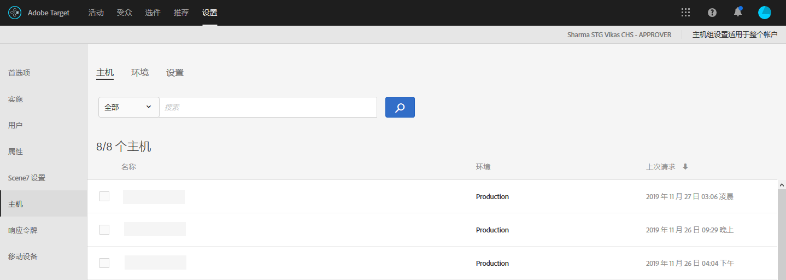

# 主机{#hosts}

可组织您的网站和预生产环境，以便轻松管理和分隔报表。

主机管理的主要目标是确保网站上不会意外出现任何不活跃的内容。Host management also lets you separate report data by [environment](/help/administrating-target/environments.md).

主机是从中发出请求 [!DNL Target] 的任何域。 在网站上，它通常是 `location.hostname` 发出请求的URL的属 [!DNL Target] 性。

默认情况下， [!DNL Target] 不会限制可以发出请求并 [!DNL Target] 接收响应的 [!DNL Target] 主机。 当新主持人发出请求时，它们会自动工作。 这还允许在您不知道或无法预料的不同域上进行测试。 如果要覆盖此默认行为，可设置允许列表或阻止列表以限制将与哪些主机一起使用 [!DNL Target]。

要管理主机，请单击“管 **[!UICONTROL 理]** ”> **[!UICONTROL “主机]**”。

## Recognizing hosts {#concept_0D4B43E23AA9408F8B28A57ED754BF65}

要识别主机并将其添加到主 [!UICONTROL 机列表] ，必须满足以下条件：

* At least one [!DNL Target] request must exist on the host
* 主机上的某个页面必须具有以下项：

   * 准确的at.js或mbox.js引用
   * 请 [!DNL Target] 求或自动生成的全局请 [!DNL Target] 求

* The page with the [!DNL Target] request must be viewed in a browser

After the page is viewed, the host is listed in the [!UICONTROL Hosts] list, allowing you to manage it in an environment, as well as preview and launch activities and tests.

>[!NOTE]
>
>其中包含所有个人开发服务器。

将某个主机添加到“[!UICONTROL 主机]”列表后，请确保该主机已被识别。

1. 单击“ **[!UICONTROL 管理]** ” > **[!UICONTROL “主机]**”。
1. 如果您的主机不在列表中，请刷新浏览器。

   By default, a newly recognized host is placed in the [!UICONTROL Production] environment. 这是最安全的环境，因为该环境不允许从这些主机中查看不活跃的活动。

1. （视情况而定）单 **[!UICONTROL 击]** “移动”图  )，将主机移入“开发 [!UICONTROL ”、“暂]存”或其他环境。

>[!NOTE]
>
>The [!UICONTROL Production] environment cannot be deleted, even if you rename it. 生产环境被视为您提供最终的活跃活动和测试的环境。该环境默认不允许查看不活跃的营销活动。

## Sort or search the Hosts list {#section_068B23C9D8224EB78BC3B7C8580251B0}

To sort the [!UICONTROL Hosts] list, click any column header ([!UICONTROL Name], [!UICONTROL Environment], or [!UICONTROL Last Requested]) to sort the list in ascending or descending order.

To search the [!UICONTROL Hosts] list, type a search term in the [!UICONTROL Search Hosts] box.

## Create allowlists that specify hosts that are authorized to send Target requests to Target. {#allowlist}

You can create an allowlist that specifies hosts (domains) that are authorized to send [!DNL Target] requests to [!DNL Target]. 所有生成请求的其他主机将收到注释掉的授权错误响应。 By default, any host that contains a [!DNL Target] request registers with [!DNL Target] in the [!UICONTROL Production] environment and has access to all active and approved activities. If this is not the desired approach, you can instead use the allowlist to record specific hosts that are eligible to make [!DNL Target] requests and receive [!DNL Target] content. All hosts will continue to display in the [!UICONTROL Hosts] list, and environments can still be used to group these hosts and assign different levels to each, such as whether the host can see active and/or inactive activities.

创建允许列表:

1. 在“主机 [!UICONTROL ”列表] ，单击“对主 **[!UICONTROL 机授权”]**。
1. 启用“为 **[!UICONTROL 内容投放启用授权主机]** ”切换。
1. Add the desired hosts in the **[!UICONTROL Host contains]** box, as desired.

   可列出多个主机，每个主机单独占一行。

1. Add the desired hosts in the **[!UICONTROL Host does not contains]** box, as desired.

   可列出多个主机，每个主机单独占一行。

1. 单击&#x200B;**[!UICONTROL 保存]**。

If a [!DNL Target] request is made on an unauthorized host, the call will respond with `/* no display - unauthorized mbox host */`.

>[!IMPORTANT]
>
>**安全最佳实践**:如果使用的ubox功 [!DNL Target]能，请注允许列表意，此还将控制重定向器可导航到的域 [的列表](/help/c-implementing-target/c-non-javascript-based-implementation/working-with-redirectors.md) 。 确保在将ubox用作实施的一部分时添加要重定向到的任何域。 如果允许列表未指定，将 [!DNL Adobe] 无法验证重定向URL并防止潜在的恶意重定向。
>
>允许列表优先于环境。 在使用功能之前，您应清除所允许列表有主机，然后只有允许的主允许列表机才会显示在主机列表中。 然后，您可以将主机移到所需的环境中。

有时，您的环境中会显示来自其他网站的域。如果域调用您的at.js或mbox.js，则列表中将显示域。 例如，如果某人将您的一个网页复制到其服务器，那么该域便会显示在您的环境中。您也可以看到来自蜘蛛引擎、语言翻译网站或者本地磁盘驱动器的域名。

如果 `mboxHost` 在 API 调用中进行传递，则会为传入的环境记录转化。If no environment is passed, the host in the call defaults to [!UICONTROL Production].

You can also create a denylist that specifies hosts (domains) than cannot send [!DNL Target] requests to [!DNL Target] by adding the desired hosts in the [!UICONTROL Host Does Not Contain] box.

>[!NOTE]
>
>由于“授权主机”列表同时用于 [!DNL Target] 主机和默认重定向主机，因此您必须添加所有已批准使用Javascript SDK(at.js)的现有域 [!DNL Adobe Target] 以及 ** ubox默认重定向URL中使用的所有域。 您还必须在将来向该允许列表添加任何新的类似域。

## Delete a host {#section_F56355BA4BC54B078A1A8179BC954632}

如果您不再需要某个主机，您可以删除该主机。

1. From the [!UICONTROL Hosts] list, click the **[!UICONTROL Delete]** icon.
1. 单击&#x200B;**[!UICONTROL 删除]**&#x200B;以确认删除。

>[!NOTE]
>
>如果任何人浏览到包含主机请求的页面，则主机 [!DNL Target] 将再次列出。

## 主机故障诊断 {#concept_B3D7583FA4BB480382CC7453529FE1B7}

如果遇到主机方面的问题，请尝试使用以下故障诊断提示解决问题：

**主持人不显示在帐户的列表中。**

* 在浏览器中刷新“[!UICONTROL 主机]”页面。
* 确认请 [!DNL Target] 求正确，包括at.js或mbox.js引用。
* Try browsing to one of the [!DNL Target] requests on the host. It&#39;s possible that no [!DNL Target] request on the host was ever rendered in a browser.

**“[!UICONTROL 主机]”列表中出现随机或未知的域。**

A domain appears in this list if a request to [!DNL Target] is made from the domain. 您常常可以看到来自蜘蛛引擎、语言翻译网站或者本地磁盘驱动器的域。如果列出的域不是您的团队所使用的域，则可以单击“[!UICONTROL 删除]”将其移除。

**我的[!DNL Target]请求返回/*没有显示——未授权的mbox主机*/。**

If a [!DNL Target] request is made on an unauthorized host, the request will respond with /* no display - unauthorized mbox host */.
