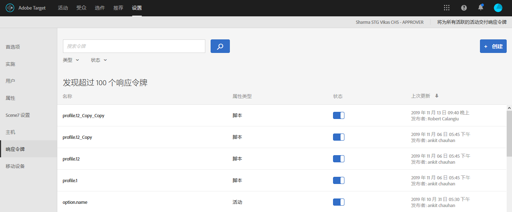
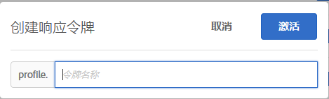

# 响应令牌{#response-tokens}

响应令牌允许您自动输出特定于 Target 的信息（营销活动详细信息、用户配置文件信息、地域信息等等），以便在调试或与第三方系统（例如 Clicktale）集成时使用

Adobe Target Classic 具有一个称为服务器插件的功能，允许您发送通过 mbox 响应来执行的 JavaScript。响应令牌与插件类似：它们允许您将特定于 Target 的信息显示到其他地方。响应令牌允许您选择要利用的变量，然后将它们作为 mbox 响应的一部分发送。要实现此操作，您只需通过开关启用一个变量，该变量即会与 mbox 响应一起发送，这可以通过网络调用进行验证。响应令牌也可以在预览模式下工作。

插件和响应令牌之间的一个主要区别是，插件将 JavaScript 交付到页面时就会在交付时立即执行，而响应令牌交付的是一个对象，可以在交付之后使用事件监听程序读取该对象并对其执行操作。有关更多信息，请参阅 [at.js 自定义事件](/help/c-implementing-target/c-implementing-target-for-client-side-web/atjs-custom-events.md)和下文的示例。使用响应令牌更安全，且能够更轻松地开发和维护第三方集成。

>[!NOTE]
>
>响应令牌在at.js 1.1或更高版本中可用。 mbox.js 不支持响应令牌。

| 在用的 Target 库 | 建议的操作 |
|--- |--- |
| at.js | 确保您使用的是 at.js 版本 1.1 或更高版本。有关下载最新版本 at.js 的信息，请参阅[下载 at.js](/help/c-implementing-target/c-implementing-target-for-client-side-web/how-to-deployatjs/implementing-target-without-a-tag-manager.md)。有关每个 at.js 版本新功能的信息，请参阅 [at.js 版本详细信息](/help/c-implementing-target/c-implementing-target-for-client-side-web/target-atjs-versions.md)。<br>我们鼓励使用 at.js 的客户使用响应令牌而不是插件。某些插件依赖的内部方法在 mbox.js 中存在，而在 at.js 中不存在；这些插件将被交付，但交付会失败。有关更多信息，请参阅 [at.js 限制](/help/c-implementing-target/c-implementing-target-for-client-side-web/t-mbox-download/c-target-atjs-implementation/target-atjs-limitations.md)。 |
| mbox.js | 在使用 mbox.js 时，仍支持使用和交付插件。<br>但是，我们鼓励使用 mbox.js 和插件的客户改用 at.js 和响应令牌。有关与 mbox.js 相比使用 at.js 具有的优势的信息，请参阅 [at.js 常见问题解答](/help/c-implementing-target/c-implementing-target-for-client-side-web/c-target-atjs-faq/target-atjs-faq.md)。有关迁移的信息，请参阅[从 mbox.js 迁移到 at.js](/help/c-implementing-target/c-implementing-target-for-client-side-web/t-mbox-download/c-target-atjs-implementation/target-migrate-atjs.md)。<br>在弃用 Target Classic（2017 年 11 月）之后，您可能需要联系客户关怀团队以编辑或停用现有插件。在弃用 Target Classic 并停用不需要的插件之前，您应该对插件先进行审核。<br>您不能在 Target Standard/Premium 中创建新插件。请改用响应令牌。<br>应停用旧的 SiteCatalyst 插件，并改为[将 Adobe Analytics 作为 Adobe Target 报表源](/help/c-integrating-target-with-mac/a4t/a4t.md) (A4T)。ttMeta 插件应停用并替换为 [Adobe Experience Cloud 调试器](https://chrome.google.com/webstore/detail/adobe-experience-cloud-de/ocdmogmohccmeicdhlhhgepeaijenapj)。 |

## 使用响应令牌 {#section_A9E141DDCBA84308926E68D05FD2AC62}

1. 确保您使用的是 [!DNL at.js] 版本 1.1 或更高版本。

   有关更多信息，请参阅[下载 at.js](../c-implementing-target/c-implementing-target-for-client-side-web/how-to-deployatjs/implementing-target-without-a-tag-manager.md#concept_1E1F958F9CCC4E35AD97581EFAF659E2)。

1. 在 [!DNL Target] 中，单击&#x200B;**[!UICONTROL 设置]** &gt; **[!UICONTROL 响应令牌]**。

   

1. 激活所需的响应令牌，例如 `activity.id`、`option.id`，等等。

   以下参数默认可用：

   | 类型 | 参数 | 注释 |
   |--- |--- |--- |
   | 内置配置文件 | `profile.activeActivities` | 返回该访客符合条件的 `activityIds` 数组。它会随着符合条件的用户数量的增加而递增。例如，在交付两个不同活动且包含两个 mbox 的页面上，第二个 mbox 将包含这两个活动。 |
   |  | `profile.isFirstSession` | 返回“true”或“false”。 |
   |  | `profile.isNewSession` | 返回“true”或“false”。 |
   |  | `profile.daysSinceLastVisit` | 返回自该访客上次访问后已过的天数。 |
   |  | `profile.tntId` | 返回访客的 tntID |
   |  | `profile.marketingCloudVisitorId` | 返回访客的 Experience Cloud 访客 ID。 |
   |  | `profile.thirdPartyId` | 返回访客的第三方 ID。 |
   |  | `profile.categoryAffinity` | 返回访客最喜欢的类别。 |
   |  | `profile.categoryAffinities` | 将该访客排名前 5 的类别的数组作为字符串返回。 |
   | 活动 | `activity.name`<br>`activity.id`<br>`experience.name`<br>`experience.id`<br>`option.name`<br>`option.id` | 当前活动的详细信息。请注意，“option”等同于“offer”。 |
   | 地域 | `geo.country`<br>`geo.state`<br>`geo.city`<br>`geo.zip`<br>`geo.dma`<br>`geo.domainName`<br>`geo.ispName`<br>`geo.connectionSpeed`<br>`geo.mobileCarrier` | 请参阅[地域](/help/c-target/c-audiences/c-target-rules/geo.md)以了解在活动中使用地域定位的详细信息。 |

   用户配置文件属性和客户属性也会显示在列表中。

   >[!NOTE]
   >
   >包含特殊字符的参数不会显示在列表中。只支持字母数字字符和下划线。

1. （视情况而定）如果您想将配置文件参数用作响应令牌，但该参数由于尚未通过 mbox 调用进行传递，因此还没有加载到 Target UI 中，这种情况下，您可以使用“创建”按钮将该配置文件添加到 UI。

   单击&#x200B;**[!UICONTROL 创建]**，提供令牌名称，然后单击&#x200B;**[!UICONTROL 激活]**。

   

1. 创建一个活动。

使用 [at.js 自定义事件](/help/c-implementing-target/c-implementing-target-for-client-side-web/atjs-custom-events.md)来监听 mbox 响应并读取响应令牌。

以下代码示例可将一个 [!DNL at.js] 自定义事件处理程序直接添加到 HTML 页面：

```
<html> 
  <head> 
    .... 
    <script src="at.js"></script> 
    <script> 
      document.addEventListener(adobe.target.event.REQUEST_SUCCEEDED, function(e) { 
        console.log("Request succeeded", e.detail); 
      }); 
    </script> 
  <head> 
  <body> 
  ... 
  </body> 
</html>
```

以下步骤说明如何使用 Adobe Dynamic Tag Manager (DTM) 添加 [!DNL at.js] 自定义事件处理程序：

1. 登录到 DTM。
1. 浏览到相应的属性。
1. 打开 Target 工具。

   由于 DTM 本身不支持 at.js，因此您必须使用代码编辑器。

1. 在代码编辑器中，将以下代码附加到 [!DNL at.js]：

   ```
   document.addEventListener(adobe.target.event.REQUEST_SUCCEEDED, function(e) { 
     console.log("Request succeeded", e.detail); 
   });
   ```

如果您想将所有内容都放到单个文件中，可以将以下代码片段添加到库页脚 [at.js 设置页面](../c-implementing-target/c-implementing-target-for-client-side-web/how-to-deployatjs/implementing-target-without-a-tag-manager.md#concept_2FA0456607D04F82B0539C5BF5309812)中。

```
document.addEventListener(adobe.target.event.REQUEST_SUCCEEDED, function(e) { 
  console.log("Request succeeded", e.detail); 
});
```

## 响应令牌常见问题解答 {#section_3DD5F32C668246289CDF9B4CDE1F536D}

**激活或停用响应令牌需要使用哪个角色？**

响应令牌只能由具有 Target 管理员角色的用户激活或停用。

**如果我运行的是 at.js 1.0 或更低版本，会出现什么情况？**

您将看到响应令牌，但 at.js 无法使用它们。

**如果我在网站的部分页面上使用 at.js 1.1（或更高版本），但在其他页面上使用 mbox.js，会出现什么情况？**

响应令牌将会交付给 [!DNL at.js] mbox 响应，但不会交付给 [!DNL mbox.js] 响应。

**我是否可以同时使用 Target Classic 插件和响应令牌？**

插件和响应令牌可以并行使用；但是，将来会弃用插件。

**响应令牌是通过所有 mbox 响应进行交付，还是仅通过交付活动的 mbox 进行交付？**

响应令牌仅通过交付活动的 mbox 进行交付。

**我的 Target Classic 插件包含 JavaScript。如何使用响应令牌复制其功能？**

当迁移到响应令牌时，此类型的 JavaScript 将需要保留在您的代码库或标记管理解决方案中。您可以使用 [!DNL at.js] 自定义事件触发此代码，并将响应令牌值传递给您的 JavaScript 函数。

**为什么我的配置文件/客户属性参数不会显示在响应令牌列表中？**

Target 通常每 15 分钟刷新一次参数。此刷新取决于用户操作，并且只有在您查看响应令牌页面时才会刷新数据。如果您的参数未显示在响应令牌列表中，可能是因为 Target 尚未刷新数据。

此外，如果您的参数包含除字母数字字符以外的其他任何字符或除下划线以外的任何符号，则该参数不会显示在列表中。目前，仅支持字母数字和下划线字符。

**如果我使用配置文件脚本或配置文件参数创建响应令牌，然后删除该配置文件脚本或参数，响应令牌是否仍会交付内容？**

响应令牌从用户配置文件中提取信息，然后交付该信息。如果删除配置文件脚本或参数，并不意味着该信息已从用户配置文件中删除。用户配置文件仍包含与该配置文件脚本对应的数据。因此，响应令牌将继续交付内容。对于没有将这些信息保存在他们的配置文件中的用户或新访客，则不会交付令牌，因为数据不在他们的配置文件中。

Target 不会自动关闭令牌。如果您要删除配置文件脚本并且不再希望交付该令牌，则必须自行关闭该令牌。

**我重命名了我的配置文件脚本，但为什么使用该脚本的令牌仍使用旧名称？**

如上所述，响应令牌处理的是为用户保存的配置文件信息。即使您重命名了配置文件脚本，但已经访问过您的网站的用户已将旧配置文件脚本值保存在他们的配置文件中，因此令牌将继续提取已保存在用户配置文件中的旧值。如果您现在想要以新名称交付内容，则必须关闭以前的令牌，然后打开新令牌。

**如果我的属性发生了更改，它们何时会从列表中删除？**

Target 会定期刷新属性。任何未开启的属性都会在下次刷新时被删除。但是，如果您有一个已开启的属性并且该属性已被删除（例如，您删除了一个用作令牌的配置文件脚本），则该属性将不会从属性列表中删除，除非您将其关闭。如果删除或重命名属性，Target 只会从列表中删除已关闭的属性。

## 通过 at.js 向 Google Analytics 发送数据 {#section_04AA830826D94D4EBEC741B7C4F86156}

通过在 HTML 页面中添加以下代码，即可通过 at.js 向 Google Analytics 发送数据：

```
<script type="text/javascript"> 
  (function(i, s, o, g, r, a, m) { 
    i['GoogleAnalyticsObject'] = r; 
    i[r] = i[r] || function() { 
      (i[r].q = i[r].q || []).push(arguments) 
    }, i[r].l = 1 * new Date(); 
    a = s.createElement(o), 
      m = s.getElementsByTagName(o)[0]; 
    a.async = 1; 
    a.src = g; 
    m.parentNode.insertBefore(a, m) 
  })(window, document, 'script', 'https://www.google-analytics.com/analytics.js', 'ga'); 
  ga('create', 'Google Client Id', 'auto'); 
</script> 
 
<script type="text/javascript"> 
  document.addEventListener(adobe.target.event.REQUEST_SUCCEEDED, function(e) { 
    var tokens = e.detail.responseTokens; 
 
    if (isEmpty(tokens)) { 
      return; 
    } 
 
    var activityNames = []; 
    var experienceNames = []; 
    var uniqueTokens = distinct(tokens); 
 
    uniqueTokens.forEach(function(token) { 
      activityNames.push(token["activity.name"]); 
      experienceNames.push(token["experience.name"]); 
    }); 
 
    ga('send', 'event', { 
      eventCategory: "target", 
      eventAction: experienceNames, 
      eventLabel: activityNames 
    }); 
  }); 
 
  function isEmpty(val) { 
    return (val === undefined || val == null || val.length <= 0) ? true : false; 
  } 
 
  function key(obj) { 
     return Object.keys(obj) 
    .map(function(k) { return k + "" + obj[k]; }) 
    .join(""); 
  } 
 
  function distinct(arr) { 
    var result = arr.reduce(function(acc, e) { 
      acc[key(e)] = e; 
      return acc; 
    }, {}); 
   
    return Object.keys(result) 
    .map(function(k) { return result[k]; }); 
  } 
</script>
```

## 调试（类似于 ttMeta 插件） {#section_DB3392B6E80749C1BFB520732EDF3BCE}

通过向 HTML 页面添加以下代码，可以创建与 ttMeta 插件等效的调试工具：

```
<script type="text/javascript" > 
  document.addEventListener(adobe.target.event.REQUEST_SUCCEEDED, function (e) { 
    window.ttMETA= typeof(window.ttMETA)!="undefined" ? window.ttMETA : []; 
 
    var tokens=e.detail.responseTokens; 
 
    if (isEmpty(tokens)) { 
      return; 
    } 
     
    var uniqueTokens = distinct(tokens); 
 
    uniqueTokens.forEach(function(token) { 
      window.ttMETA.push({ 
        'CampaignName': token["activity.name"], 
        'CampaignId' : token["activity.id"], 
        'RecipeName': token["experience.name"], 
        'RecipeId': token["experience.id"], 
        'OfferId': token["option.id"], 
        'OfferName': token["option.name"], 
        'MboxName': e.detail.mbox}); 
      console.log(ttMETA); 
    }); 
  }); 
 
  function isEmpty(val){ 
    return (val === undefined || val == null || val.length <= 0) ? true : false; 
  } 
 
  function key(obj) { 
     return Object.keys(obj) 
    .map(function(k) { return k + "" + obj[k]; }) 
    .join(""); 
  } 
 
  function distinct(arr) { 
    var result = arr.reduce(function(acc, e) { 
      acc[key(e)] = e; 
      return acc; 
    }, {}); 
   
    return Object.keys(result) 
    .map(function(k) { return result[k]; }); 
  } 
</script>
```

## 培训视频：响应令牌和 at.js 自定义事件{#section_3AA0A6C8DBD94A528337A2525E3E05D5}

观看以下视频，了解如何使用响应令牌和 at.js 自定义事件将 Target 中的配置文件信息共享到第三方系统。

>[!VIDEO](https://video.tv.adobe.com/v/23253/?captions=chi_hans)
