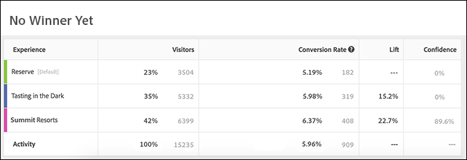
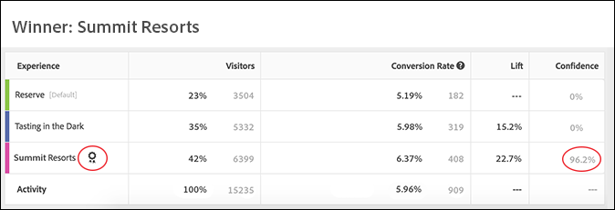

# 解释自动分配报告 {#determine-a-winner}

通过检查目标UI中的重要指标（包括提升和置信度）来解释自动分配A/B活动的结果。

许多营销人员会在结果指示明确的入选者之前，过早地错误宣布入选体验。现在，我们可使您更轻松地确定入选者。

## 了解“自动分配”活动中的提升度和置信度报告 {#lift-confidence}

在“自动分配”活动中，第一个体验（默认情况下名为“体验A”）始终在“报告”选项卡上定义为“控制”体验。 在用于确定体验性能的建模中，此体验不被视为真正的统计控制，但是它被视为报表中某些数字的参考或基准。

每次体验的“提升”数值和95%范围始终参考定义的“控制”体验计算。 定义的“控制”体验不能具有相对于自身的提升度，因此会报告此体验的空“—”值。 与A/B测试不同，在“自动分配”测试中，如果体验的性能比定义的控件差，则不会报告负提升值；而是显示“—”。

显示的置信区间栏表示围绕体验转化率平均估计值的95%置信区间。 这些内容还与定义的“控制”体验有关。 “控制”体验的栏始终呈灰色。 “控制”体验的置信区间下方的置信区间部分为红色，而“控制”体验上方的置信区间部分为绿色。

当领先体验的95%置信区间与任何其他体验不重叠时，会发现优胜者。 入选体验在体验名称左侧和“入选方”横幅中使用绿色星形徽章进行指定。 当看不到星形时，该横幅将显示“尚未获胜者”，并且尚未找到获胜者。

当前领先或入选体验旁边还会报告“信心”数字。 仅在领先体验的置信度达到至少60%之前才会报告此数字。 如果“自动分配”实验中确实存在两种体验，则此数字表示该体验的表现优于其他体验的信心级别。 如果“自动分配”实验中存在两个以上的体验，则此数字表示该体验的表现优于定义的“控制”体验的信心级别。 如果“控制”体验成功，则不报告“信心”数字。

## 查看 Target UI 中的入选者标记 {#section_24007470CF5B4D30A06610CE8DD23CE3}

使用[!UICONTROL 自动分配]功能时，[!DNL Target] 会在活动页面的顶部显示一个标记，在活动达到最低转化次数，且具有足够的置信度之前，该标记会一直指示“还没有入选者”。

在宣布明确的入选者后，[!DNL Target] 会显示“入选者: 体验 X。”

>[!NOTE]
>
>自动分配活动旨在从所有体验选项中找出最佳体验，而不仅仅是与控制体验进行两两比较。

## 自动分配的统计保证 {#section_7AF3B93E90BA4B80BC9FC4783B6A389C}

在 A/B 活动结束时，自动分配会保证确定的入选者具有 5% 的有效误报率。这意味着确定的入选者实际不是所有活动体验中的最佳体验的概率仅为 5%。对于 A/A 测试（包含相同的体验），我们可以断定测试的误报率低于 5%。对于 A/A 测试（具有相同的体验），预期行为是无限期地运行，因此应该永远不会出现入选者标记。

自动分配不使用基于 p 值的置信度。

自动分配活动的“置信度”列（如下图所示）显示了在 1% 的误差范围（即，算法使用的最高转化率与第二高转化率之间的最低可检测效果为 1%）内某个体验成为入选者的概率。请注意，算法使用 [Bernstein 不等式](https://en.wikipedia.org/wiki/Bernstein_inequalities_(probability_theory))来计算此概率。

常规 A/B 测试将基于 p 值计算置信度。自动分配则不使用 p 值。p 值可“大致”计算出某个特定体验与控制体验存在差异的概率。这些 p 值只能用于确定体验是否与控制体验存在差异。这些值不能用于确定体验是否与其他体验（非控制体验）存在差异。

下图显示了一个还没有入选者的活动：

下图显示了一个已经有入选者的活动：

## 常见问题解答 {#section_C8E068512A93458D8C006760B1C0B6A2}

**活动已经进行几天了。为何所有的置信度值仍显示为 0%？**

所有活动在报表的“[!UICONTROL 置信度]”列显示 0% 的原因如下：

* 手动 A/B 测试和自动分配使用不同的统计数据来显示置信度值。

   手动 A/B 测试使用的是基于 [Student t 检验](https://en.wikipedia.org/wiki/Student%27s_t-test)的 p 值。P 值是指在体验与控制体验之间找到观察到的差异（或更极端的差异）的概率（但实际上根本不存在这样的差异）。这些 P 值只能用于确定在给定体验与控制体验相同的情况下，观察到的数据是否一致。这些值不能用于确定体验是否与其他体验（非控制体验）存在差异。

   自动分配显示的是某个特定体验是所有活动体验中的入选者的真实性概率。这意味着只有入选体验（最有可能入选的体验）的置信度值将为非零数值。所有其他体验很有可能落选，因此将显示 0% 的置信度值。

* 仅当入选体验达到 60% 的置信度后，自动分配才会开始显示置信度。这些置信度级别通常出现在正常A/B测试完成所需时间的一半左右（尽管这并不保证）。 To determine how long a normal A/B test would run, please use a [sample size calculator](https://docs.adobe.com/content/target-microsite/testcalculator.html): plug control's conversion-rate in "Baseline conversion rate," "5%" for "Lift," and 95% for "Confidence." 通常情况下，在每个体验达到其所需样本量的至少 50% 之后，置信度便会开始显示。这可使您了解置信度将从何时开始显示。
* 如果报表中所有置信度值均显示为 0%，则有可能是进入活动的时间过早。

