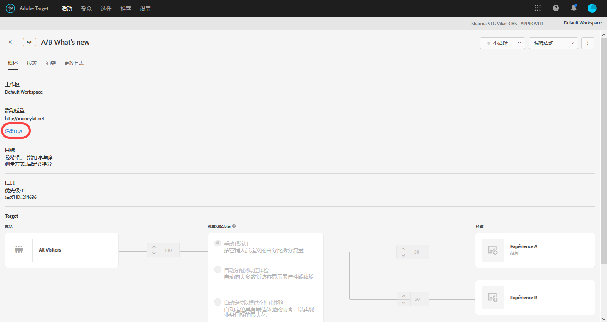
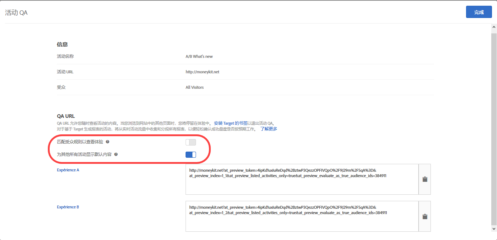

# 活动 QA {#activity-qa}

使用 QA URL 来执行简单的端到端活动 QA，它提供了永不变更的预览链接、可选的受众定位以及从实时活动数据中分段的 QA 报表。

## 概述 {#section_11B761A522A14E61978275772210A4C2}

通过活动 QA，您能够在启动 Target 活动之前，对其进行全面的测试。活动 QA 具备以下功能：

* 可与团队成员共享链接，不论体验或活动是否进行了更新，这些链接永远不会更改，也不需要重新生成。借助此功能，您可以在整个用户历程中全面测试您的活动。
* 可选择遵守受众条件，在对体验外观进行 QA 时，营销人员可以选择测试定位标准或忽略定位标准，而不一定非要满足受众条件.
* 可捕获 QA 报表，以便营销人员能够确认量度可按预期递增，并且 QA 报表数据可与生产报表（对于非 A4T 报表）分开保存。
* 能够单独预览体验，或结合其他满足交付标准（页面/mbox/受众）的实时活动一起预览体验。
* 能够对整个用户历程进行 QA。在活动 QA 过程中，只需使用 QA 链接访问网站一次，即可浏览整个网站。您可以一直停留在“活动 QA”模式中，直到您结束会话或使用 [Target QA 书签](../../c-activities/c-activity-qa/activity-qa-bookmark.md#concept_A8A3551A4B5342079AFEED5ECF93E879)强制自己退出此模式。如果您的活动涉及多个网页，此功能会特别有用。

   >[!NOTE]
   >
   >对于版本2的at.js实施，这是正确的。*x* 或更高版本。 对于at.js 1。*x* and mbox.js实施中，仅当访客的浏览器不阻止第三方Cookie时，这才适用。

## 访问和共享 QA URL {#section_1C59BAA247B247BDB125D1BE8EAD4547}

1. 在活动的“[!UICONTROL 概述]”页面（适用于除自动个性化以外的所有其他活动类型）中，单击&#x200B;**[!UICONTROL 活动 QA]** 链接。

   

1. 配置以下设置：

   

   * **匹配受众规则以查看体验：** 有时，您可能想要确认受众匹配是否可以正常工作。在其他时候，您可能只想要检查活动的外观。如果将此设置切换到“开”位置，则测试人员必须满足定位要求，才有资格查看体验。对于体验定位 (XT) 活动，只提供了一个活动 URL。您所看到的体验取决于您符合哪一个定位规则。

      如果将此设置切换到“关”位置，则单击链接即可查看体验，而不论您是否符合相应条件。执行 QA 时，您可以在要求遵守受众定位条件或不要求遵守受众定位条件之间来回切换。

   * **为其他所有活动显示默认内容：** 如果将此选项切换到“开”位置，则会为其他所有活动显示默认内容（例如，会单独显示预览，而不考虑同一页面/mbox 上的所有其他实时活动）。

      如果将此设置切换到“关”位置，请考虑以下几点：

      * 如果您测试的活动与其他实时活动之间存在冲突，则会应用[常规的优先级规则](../../c-activities/priority.md#concept_1780C11FEA57440499F0047DD6900E0F)。因此，您可能看不到想要对其进行 QA 的活动。
      * 量度会在已查看的活动中递增，但这仅限于 QA 报表环境。

1. 单击 **[!UICONTROL 完成]，以保存所做的更改。**
1. 与组织中的成员共享活动链接 URL，以便进行测试。

   活动链接永远不会失效，因此如果有人对活动或体验进行了修改，您也无需重新发送链接。但是，如果您应用了受众库中的其他受众，而不只是编辑活动，则您需要重新共享生成的新链接。

   使用每个活动链接 URL（体验 A、体验 B 及其他体验的链接），您可以从相应的体验开启用户历程。您可以单击为某个体验生成的 URL，然后按常规方式浏览网站，以查看多个页面上的体验（如果存在多个页面）。每个体验只会生成一个 URL，即使体验涉及多个页面（模板测试或多页面测试）也是如此。

   由于活动 QA 具有粘滞性，因此您可以通过浏览网站来查看其他页面。请注意，对于版本2的at.js实施，这是正确的。*x* 或更高版本。 对于at.js 1。*x* and mbox.js实施中，仅当访客的浏览器不阻止第三方Cookie时，这才适用。

1. 要查看从活动链接 URL 生成的报表，请单击活动的 **[!UICONTROL 报表]** 页面，单击 **[!UICONTROL 设置]** 图标 ()，然后从 **[!UICONTROL 环境]** 下拉列表中选择 **[!UICONTROL QA 模式]**。

## 注意事项 {#section_B256EDD7BFEC4A6DA72A8A6ABD196D78}

* 各类型活动（自动个性化 (AP) 活动除外）的“[!UICONTROL 概述]”页面上均会显示“[!UICONTROL 活动 QA]”链接。对于 AP 活动，您可以使用[预览链接](../../c-activities/t-automated-personalization/experience-preview.md#task_586C6655A6FD4AF08F5678FC3F481EFC)。
* 活动 QA URL 适用于将 Analytics 用作报表源 (A4T) 的活动。使用“活动 QA”执行 QA 时生成的点击将与活动数据传输到同一个报表包，即使在激活活动后也是如此。
* “活动 QA”不会显示已存档活动或已过期活动的内容。如果停用已结束的活动，则必须再次保存该活动才能使“活动 QA”生效。
* Target Standard/Premium 中导入的活动（例如从 Target Classic 导入）不支持 QA URL。
* 在自动分配、自动定位和“推荐”活动中，该模式不会受在活动 QA 中捕获的访问次数的影响。
* 活动 QA 具有粘滞性，因此以“活动 QA”模式浏览网站后，您必须终止 Target 会话，或者需要让 Target 将您从“活动 QA”模式中释放出来，然后才能像普通访客一样查看您的网站。可使用 [Target QA 书签](../../c-activities/c-activity-qa/activity-qa-bookmark.md#concept_A8A3551A4B5342079AFEED5ECF93E879)强制自己退出“活动 QA”模式。

   您也可以手动强制自己退出该模式，方法是在网站上使用具有空值的 `at_preview_token` 参数（例如 `https://www.mysite.com/?at_preview_token=`）来加载页面。

* 如果在创建活动时指定了“URL is”[基于表单的编辑器中的细化](../../c-experiences/form-experience-composer.md#task_FAC842A6535045B68B4C1AD3E657E56E)或[可视化体验编辑器中的页面交付选项](../../c-experiences/c-visual-experience-composer/viztarget-options.md#reference_3BD1BEEAFA584A749ED2D08F14732E81)，则 QA URL 将无效，因为活动 QA 会附加 URL 参数。要解决此问题，请单击 QA URL 以转到您的网站，并从该 URL 中删除附加的参数，然后再加载新的 URL。
* 如果您有at.js 1。*x*&#x200B;或mbox.js，如果您使用Safari或其他阻止第三方Cookie的浏览器，则活动QA模式将不会粘滞。 在这些情况下，您必须向导航到的每个URL添加预览参数。
* 如果一个活动使用了多个体验受众（例如同一个活动中同时包含一个美国网站和一个英国网站），则不会为存在的四种组合（体验 A/美国网站，体验 A/英国网站，体验 B/美国网站，体验 B/英国网站）各生成一个 QA 链接。而是只会创建两个 QA 链接（体验 A 和体验 B），且用户必须符合相应受众条件才能看到相应的页面。例如，英国的 QA 用户将无法看到美国网站。
* 所有 `at_preview` 参数和值均已进行 URL 编码。在大多数情况下，一切都会按预期运行；但是，有些客户使用的负载平衡器或 Web 服务器可能会尝试对查询字符串参数再次进行编码。

   由于此双重编码过程，我们尝试对 `at_preview_token` 进行解码时，Target 将无法提取正确的令牌值，从而导致无法正常预览。

   为此，我们建议您联系 IT 团队，以确保将所有预览参数都列入白名单，以便这些值不会发生任何形式的改变。

   下表列出了可以列入域白名单的参数：

   | 参数 | 类型 | 值 | 描述 |
   |--- |--- |--- |--- |
   | `at_preview_token` | 加密的字符串 | 必填；没有默认值 | 一个加密实体，包含允许在 QA 模式下执行的营销活动 ID 列表。 |
   | `at_preview_index` | 字符串 | 留空 | 参数格式为 `<campaignIndex>` 或 `<campaignIndex>_< experienceIndex>` 两个索引均以 1 开头。 |
   | `at_preview_listed_activities_only` | 布尔 (true/false) | 默认值：false | 如果为“true”，则会处理 `at_preview_index` 参数中指定的所有营销活动。 如果为“false”，则会处理页面中的所有营销活动，即使未在预览令牌中指定这些营销活动也是如此。 |
   | `at_preview_evaluate_as_true_audience_ids` | 字符串 | 留空 | 在 mbox 请求范围内应始终（在定位和报表级别）计算为“true”的 segmentId-s 的下划线（“_”）分隔列表 |
   | `_AT_Debug` | 字符串 | 窗口或控制台 | 控制台日志记录或新窗口。 |
   | `adobe_mc_ref` |  |  | 可将默认页面的引荐 URL 传递到新页面。如果使用了 `AppMeasurement.js` 版本 2.1（或更高版本），则 [!DNL Adobe Analytics] 会将此参数值用作新页面上的引荐 URL。 |
   | `adobe_mc_sdid` |  |  | 可将 [!DNL Supplemental Data Id] (SDID) 和 [!DNL Experience Cloud Org Id] 从默认页面传递到新页面，以便 Analytics for Target (A4T) 能够将默认页面上的 Target 请求与新页面上的 Analytics 请求“拼合”到一起。 |

* Target QA 模式 UI 仅显示多页面活动中体验的第一个 URL。假设您要创建一个历程测试，并且将从 URL1 移动到 URL2。但是，如果要单独转到 URL2，请复制针对 URL1 提供的所有 URL 参数，并在放置“?”后将其应用于 URL2，正如 URL1 中所看到的一样。