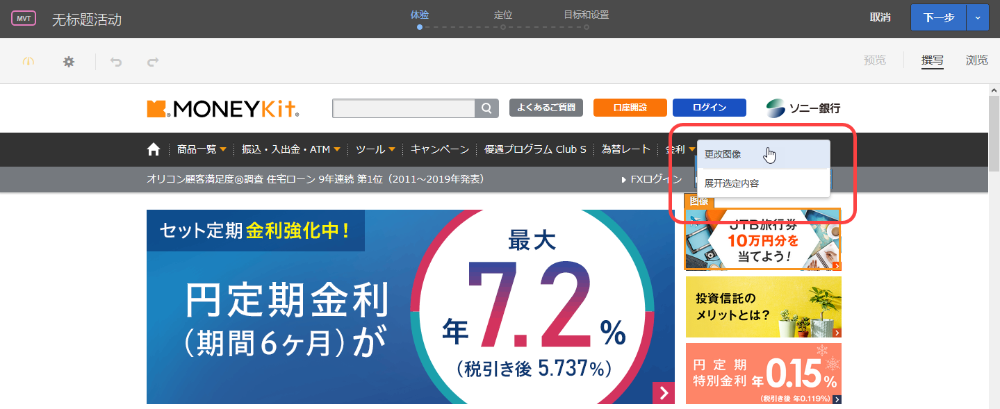
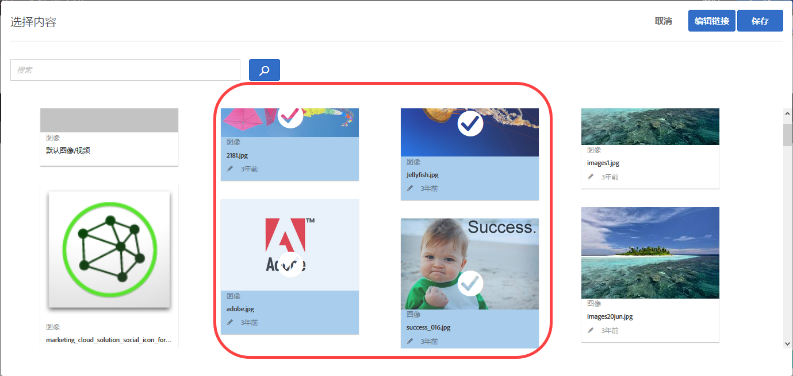
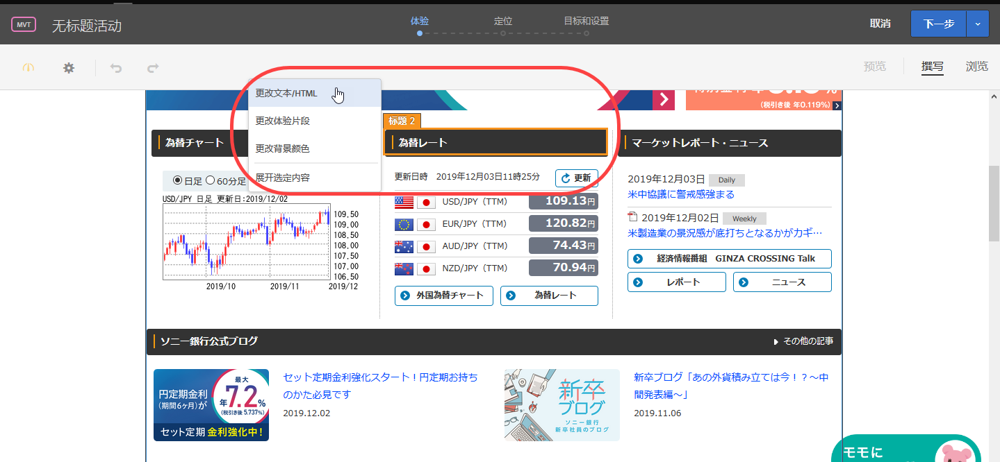

# 创建组合{#create-combinations}

可使用可视化体验编辑器创建要包含在测试中的选件。

>[!NOTE]
>
>选择页面上的对象时，您可以单击**[!UICONTROL 展开选定内容]**，以便在除了最初选定的元素之外，还选择父元素。选择任意父元素时，该元素的所有子元素均会自动选定。您可以多次展开选定内容。

使用可视化体验编辑器，可以编辑选件、选件名称以及位置名称。做出更改后，会出现一个叠加图以显示何处发生了更改。

## 图像选件 {#section_A48333211DB149ED926AE467D0032914}

可在某个位置测试多个图像选件，以确定哪个图像最为成功。

1. 单击页面上的某个图像，然后选择**[!UICONTROL 更改图像]**。

   

1. 选择要包含在测试中的所有图像，然后单击**[!UICONTROL 保存]**。

   

每个图像会成为该位置的独立体验。

## HTML 选件 {#section_DF016101AFA9412C9B99862C23DE77B1}

可在某个位置测试多个文本/HTML 选件，以确定哪个选件最为成功。

1. 单击页面上的某个文本/HTML 选件，然后单击**[!UICONTROL 更改文本/HTML]**。

   

1. 单击**[!UICONTROL 添加文本/HTML 选件]，为选件提供名称，然后键入或粘贴该文本/HTML 选件的代码。**

   

   >[!NOTE]
   >
   >Internet Explorer 10 不支持 HTML5 输入占位符。因此，如果您使用的是 IE 10，则在输入内容时“添加内容”占位符文本会一直保留在“文本”字段中。

   重复执行上述步骤以添加任何其他要包含的文本/HTML 选件。

1. 单击**[!UICONTROL 保存]**。

每个文本/HTML 选件会成为该位置的独立体验。

## 最佳实践 {#section_2E98C23D2F1A460FA732A31799CE6291}

* 在测试中仅包含所需数量的位置，切勿包含多余位置。测试中包含的体验每增加一个即会显著增加实现可接受结果所需的流量和时间。例如，如果您有 2 个页面元素，每个页面元素具有 3 个选件，则总共会有 9 (3x3) 种可能的组合。如果在 3 个元素中，有 2 个元素包含 3 个可能的选件，而另外 1 个元素具有 2 个选件，则总共会有 18 (3x3x2) 种可能的组合。每增加一个元素和选件，组合的数量均会显著增多。
* 在创建多变量测试时，您可以从测试中排除 10% 以上的体验，但前提是您确认了随后必须使用离线报表进行分析的警告。
* 利用预览功能可以避免不需要的内容组合。例如，您可能具有两个图像，但它们二者对同一个项目或服务提供不同的折扣。那么在同一页面上同时显示这两个图像便不合常理，很有可能会造成困惑。
* 使用流量估算器确保设计的测试符合您的页面接收的流量。请确保流量估算器为您的测试配置显示绿色指示灯，这样您才能获得所需的结果。
* 至少须测试三个元素。如果要测试的元素比这少，则运行一组 A/B 测试。
* 建议每个元素的替代项之间存在显著的不同。
* 虽然并不强制要求，但最好让每个元素具有相同数量的替代项。

