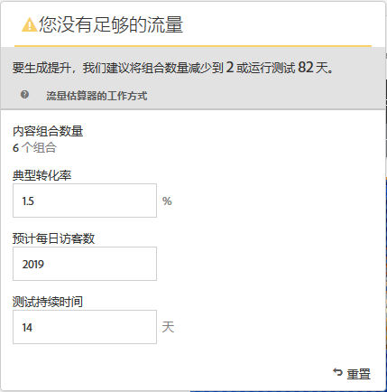
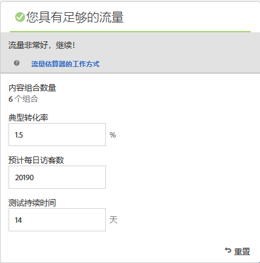

# 创建多变量测试{#create-a-multivariate-test}

[!UICONTROL 利用视觉体验书写器] (CMS)，您 [!DNL Target] 可以在启用Target的页面上轻松地创建测试并修改其中 [!DNL Target]页面的部分。

使用 Target 点击式编辑器，您可以选择任意位置，然后添加多个选件。

[!UICONTROL Multivariate Test] (MVT)获取第一个页面报告。换言之，多变量测试会在某个特定的 URL 上运行，而测试中包含为该页面设计的所有体验。

1. 单击 **[!UICONTROL 创建活动]** &gt; **[!UICONTROL 多变量测试]**。

   

   >[!NOTE]
   >
   >可用的活动类型取决于您的 Target 帐户。有些活动类型可能不会显示在列表中。For example, [!UICONTROL Automated Personalization] is a [Target Premium feature](/help/c-intro/intro.md#premium).
   >
   >For more information about the various activity types available in [!DNL Target] and their differences, see [Activities](../../../c-activities/activities.md#concept_D317A95A1AB54674BA7AB65C7985BA03). See [Target Activity types](/help/c-activities/target-activities-guide.md) to help you decide which activity type best suites your needs.

1. Select **[!UICONTROL Visual (Default)]**, if necessary.

   

   >[!NOTE]
   >
   >如需 VEC 的故障诊断信息，或者当您遇到问题时，请参阅[可视化体验编辑器故障诊断](/help/c-experiences/c-visual-experience-composer/r-troubleshoot-composer/troubleshoot-composer.md)。
   >
   >The [!UICONTROL Choose Workplace] option in the preceding illustration is a [Target Premium](/help/c-intro/intro.md) feature. 如果您看不到此选项，则您的组织有Target Standard许可证。]

1. (Conditional) If you are a Target Premium customer, [choose a workspace](/help/administrating-target/c-user-management/property-channel/property-channel.md).

1. [指定要测试的页面的URL](../../../c-activities/c-multivariate-testing/t-create-multivariate-test/url.md#concept_C12E4A85FF3B4E518E3110F6CF1AF9C0) ，然后单击 **[!UICONTROL 下]** 一步。

   >[!NOTE]
   >
   >请使用完整的 URL，即在开头包含 HTTP 或 HTTPS。

   如果显示了一条消息，要求您为浏览器启用混合内容，请按消息中的说明进行操作。为浏览器启用混合内容后，重新从步骤 1 开始操作。

   此时会打开可视化体验编辑器。

1. 键入活动的名称。

   

   活动名称中不允许使用以下字符：

   | 字符 | 描述 |
   |--- |--- |
   | / | 正斜线 |
   | ? | 问号 |
   | # | 数字符号 |
   | : | 冒号 |
   | = | 等号 |
   | + | 加号 |
   | - | 减号 |
   | @ | @ 符号 |

1. [在每个位置中创建选件](../../../c-activities/c-multivariate-testing/t-create-multivariate-test/add-offers.md#concept_DCE6B45C30F7419B8EC17AFDEE8D8AA6)。

   

   您可以添加以下类型的选件：

   * HTML
   * 图像
   * 文本

1. Click **[!UICONTROL Preview]** to [preview your experiences](/help/c-activities/c-multivariate-testing/t-create-multivariate-test/preview-experiences.md).

   

   您可以查看每个体验，并排除不希望包含在测试中的任何体验。To exclude one or more experiences, select the desired checkboxes, then click **[!UICONTROL Exclude]** .

   

1. [使用流量估算器](../../../c-activities/c-multivariate-testing/t-create-multivariate-test/traffic-estimator.md#task_71AA6922AFD447EA8C5E610A78ABA714)来检验测试计划的可行性。

   

   下图指示活动的流量不足。

   

   下图指示活动的流量不足。

   

1. Click **[!UICONTROL Next]** to advance to the [!UICONTROL Targeting] page.]

1. 选择受众，以及您希望参加活动的符合条件的访客所占的百分比。

   

   例如，您可以将准入资格限制为 50% 的访客或 45% 的“加州”受众。

   >[!NOTE]
   >
   >除了选择现有受众之外，您还可以合并多个受众来创建临时组合受众，而不是创建新受众。有关更多信息，请参阅[合并多个受众](../../../c-target/combining-multiple-audiences.md#concept_A7386F1EA4394BD2AB72399C225981E5)。

1. [查看测试摘要](../../../c-activities/c-multivariate-testing/t-create-multivariate-test/test-summary.md#reference_971AB225963A4DC18EEB5B0E20F0A4A7) 并进行任何所需的更改，然后单击 **[!UICONTROL 下一]** 步。

1. [指定测试的目标和设置](../../../c-activities/c-multivariate-testing/t-create-multivariate-test/goals-and-settings.md#reference_B25389FD6F3A4989801E740364B089CC)。

1. 单击 **[!UICONTROL 保存并关闭]** 以创建活动。

## 培训视频：创建多变量测试 (9:25)

以下视频演示了如何使用 Target 三步引导式工作流规划并创建多变量测试。

* 定义和设计多变量测试
* 创建多变量测试

>[!VIDEO](https://video.tv.adobe.com/v/17395?captions=chi_hans)
