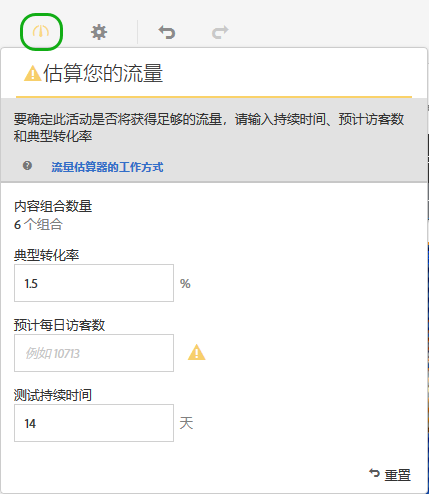
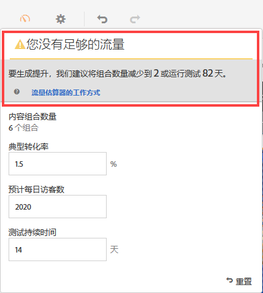

# 估算成功测试所需的流量{#estimate-the-traffic-required-for-a-successful-test}

由于多变量测试会对多个体验进行比较，因此非常重要的一点是，您需要知道多少流量才能提供有意义的结果。流量估算器会使用与您的页面相关的统计数据以及正在测试的体验数量，来估算需要多少流量以及需要多长时间的测试才能使测试成功。

流量估算器可预测确保获得以下结果所需的样本量：

* 95% 置信度

   这表示如果没有任何实际提升，则误报的概率为 5%（100% - 置信水平）。
* 80% 统计功效

   这表示测试检测出 25% 或更高实际提升度的概率为 80%。
* 25% 最低可靠检测提升度

   Target 将计算要使检测出 25% 或更高实际提升度的概率达到 80% 所需的流量。

测试会使用 Bonferroni 校正法对多个比较进行校正。此方法已知具有保守性，但通过强制使用相对较高的最低可靠检测提升度与这一特性相抵消。

流量估算器还可提供反馈，让您了解是否有足够的流量来确保您设计的测试取得成功。

1. 在体验编辑器中，单击&#x200B;**[!UICONTROL 流量]**&#x200B;图标。

   此时将打开流量估算器。您可以再次单击&#x200B;**[!UICONTROL 流量]**&#x200B;图标以隐藏流量估算器。

   

1. 提供典型转化率、预计每日访客数和测试持续时间。

   * [!UICONTROL 内容组合数量]：根据在任何排除后作为活动的一部分创建的体验的数量自动进行计算。
   * [!UICONTROL 典型转化率]：转化率以百分比表示，根据估算或 Analytics 系统中的以往数据得出
   * [!UICONTROL 预计每日访客数]：这是指根据定位标准有可能会查看此页面的访客数量。可以基于您的分析数据。
   * [!UICONTROL 测试持续时间]：您希望该活动运行的天数。

   流量估算器使用这些统计数据来确定运行一个成功的测试需要进行哪些调整。

   系统会计算您输入的值并在流量估算器的顶部区域附近显示计算结果。

   

   当您更改这些数字时，估算的结果也会相应改变。例如，如果您测试的体验数量很多，而转化率和展示次数过低，则流量估算器会显示测试取得成功所需的运行时间。或者，如果您的流量较低，流量估算器可能会建议您减少体验数量，以便能够将测试运行所需的天数。

   如果流量不足，您可以执行以下任一操作或同时执行以下两项操作：

   * 减少选件组合数量和位置数量。
   * 延长测试持续时间。

   调整数字直到流量估算器表示已有足够流量，然后对您的测试进行相应设计。

   

