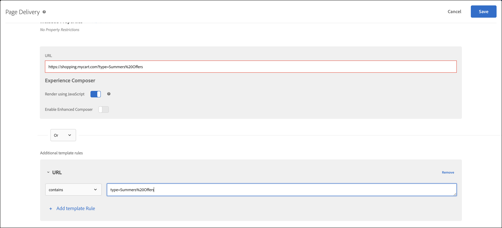

# 内容交付故障诊断

如果您的页面没有显示预期内容，可以采取以下步骤来对内容交付进行调试。

* 仔细检查您的活动或营销活动代码。键入错误或其他错误可能会导致无法显示预期内容。
* 使用 mboxTrace 或 mboxDebug 为 [!DNL Target] 请求排除故障。
* 使用 Adobe Experience Cloud Debugger（一个易于使用的工具，它与 mboxDebug 提供几乎相同的信息）为 [!DNL Target] 请求排除故障。

当您在您的页面上设置 [!DNL Target] 以确保触发 Target 请求并且设置 Cookie 时，mboxDebug 特别有用。但是，在调试内容交付时，mboxDebug 并不会提供有用的详细信息。如果活动未显示在页面上或页面上显示了不需要的内容，请使用 mboxTrace 对页面进行细致的检查和调试。

## 检索要用于调试工具的授权令牌 {#section_BED130298E794D1FA229DB7C3358BA54}

由于 mboxTrace 和 mboxDebug 可将营销活动数据和配置文件数据披露给外部各方，因此需要授权令牌。可在 [!DNL Target] UI 中检索授权令牌。令牌的有效时间为 6 个小时。

您必须具有以下用户权限之一才能生成身份验证令牌：

* 至少[!UICONTROL “编辑者”]权限（或[!UICONTROL “审批者”]）

   有关 [!DNL Target Standard] 客户的详细信息，请在“用户”**&#x200B;中参阅[指定角色和权限](/help/administrating-target/c-user-management/c-user-management/user-management.md#roles-permissions)。有关 [!DNL Target Premium] 客户的详细信息，请参阅[配置企业权限](/help/administrating-target/c-user-management/property-channel/properties-overview.md)。

* 工作区/产品配置文件级别的管理员角色

   工作区仅对 [!DNL Target Premium] 客户可用。有关更多信息，请参阅[配置企业权限](/help/administrating-target/c-user-management/property-channel/properties-overview.md)。

* [!DNL Adobe Target] 产品级别的管理员权限（系统管理员权限）

要检索授权令牌，请执行以下操作：

1. 单击&#x200B;**[!UICONTROL “管理”]**>**[!UICONTROL “实现”]**。
1. 从“调试器工具”部分中，单击&#x200B;**[!UICONTROL “生成新的身份验证令牌”]**。

   

1. 将生成的令牌作为一个参数添加到 URL 中，以启用任一高级调试工具。

   

## mboxTrace {#section_256FCF7C14BB435BA2C68049EF0BA99E}

通过 mboxTrace，可接收附加到 [!DNL Target] 响应的跟踪信息。跟踪信息反映 [!DNL Target] 调用的结果（例如，转化或展示）以及任何其他可能有助于确定为何发生此特定结果的数据，如在营销活动中从中作出选择的一组可用分支。使用此信息可调试内容发送服务。

可用的参数如下：

| mboxTrace 选项 | 结果 |
|--- |--- |
| `?mboxTrace=console` | 作为对象打印到控制台日志中。 对于at.js，不会像在mbox.js中一样弹出新的浏览器窗口或输出到控制台（现在已弃用），您而是需要检查网络请求，并在“预览”(Chrome)或“响应”(Firefox)下查看。 |
| `?mboxTrace=json` | 作为 JSON 文字字符串打印到控制台日志中 |
| `?mboxTrace=window` | 作为 JSON 字符串打印到弹出窗口中 |
| `?mboxTrace=disable` | 关闭跟踪会话模式 |

**示例 mboxTrace 调用**

`https://www.mysite.com/page.html?mboxTrace=window&authorization=f543abf-0111-4061-9619-d41d665c59a6`

输出显示有关您内容的详细信息。mboxTrace 显示有关您的营销活动或者活动和个人资料的详细信息。它还提供执行之前的个人资料快照，以及在执行之后所发生变化的快照。同时，也显示为各个位置评估了哪些营销活动或活动。

某些信息包含匹配和不匹配的客户群和定位 ID：

* **SegmentId**：客户群的 ID，来自可重复使用的客户群库或为特定营销活动创建的匿名客户群库。
* **TargetId**：定位的 ID，来自定位表达式库或营销活动中任意客户群的匿名定位。
* **Unmatched**：在此调用中，请求不符合这些客户群或定位的要求。
* **Matched**：请求符合指定客户群或定位的要求。

**在推荐页面上使用 mboxTrace**：在具有推荐的页面上添加 mboxTrace 作为查询参数会将页面上的推荐设计替换为 mboxTrace 详细信息窗口，后者显示关于您的推荐的深入信息，包括：

* 返回的推荐与请求的推荐
* 使用的键值，以及该键值是否在生成推荐
* 标准生成的推荐与备用推荐
* 标准配置
* 应用的排除和包含
* 收集规则

您不需要在查询参数中包含 `=console`、`=json` 或 `=window`。完成 mboxTrace 详细信息后，添加 `=disable`，然后按 **[!UICONTROL Enter]** 返回到正常显示模式。

您网站的正常功能和外观不受 mboxTrace 的影响。访客可以看到您的常规推荐设计。

## mboxDebug {#mboxdebug}

要使用 mboxDebug，请将 mboxDebug 参数附加到您 URL 的末尾。下表包含关于与 [!DNL Target] 响应相关的 URL 参数的信息。

>[!NOTE]
>
>某些 mboxDebug 参数无论是否进行身份验证均可用。

| URL 参数 | 用途 |
|--- |--- |
| `mboxDebug=1` | 调试器 将此参数添加到任何定义了 Target 请求的 URL 将打开一个弹出窗口，其中显示有用的调试详细信息。Cookie 信息、PCid 和会话 ID 值都会写出，并且用户可看到所有 URL。单击 Target 请求 URL 以显示对该 [!DNL Target] 要求的响应。有关更多信息，请参阅 [mbox_debug.pdf](/help/assets/mbox_debug.pdf)。 |
| `mboxDebug=x-cookie` | 修改 Cookie |
| `mboxDisable=1` | 停用页面上的 mbox |
| `mboxDebug=x-profile` | 查看配置文件集。 |
| `mboxDebug=x-time` | 显示每个 [!DNL Target] 请求的响应时间 |
| `mboxOverride.browserIp=<Insert IP address>` | 测试地理定位 使用此 URL 参数测试地理定位。输入 IP 地址作为此属性的值，Test&amp;Target 的地理定位功能会评估该 IP 地址，查找营销活动中设置的与其匹配的任何地理定位或客户群。 |

>[!NOTE]
>
>确保 URL 片段位于查询字符串参数之后。第一个 `#` 之后的任何内容均为片段标识符，并导致调试参数无法正常运行。

## Adobe Experience Cloud Debugger {#section_A2798ED3A431409690A4BE08A1BFCF17}

借助 Adobe Experience Cloud 调试器，您可以快速、轻松地了解 Target 实施。您可以快速查看库配置、检查请求以确保正确传递自定义参数、打开控制台日志记录以及禁用所有 Target 请求。在 Experience Cloud 中通过身份验证，即可使用强大的 MboxTrace 工具检查活动和受众资格以及访客个人资料。

有关更多信息，请参阅下面的培训视频：

有关更多详细信息，请参阅[使用 Adobe Experience Cloud Debugger 调试 at.js](/help/c-implementing-target/c-implementing-target-for-client-side-web/c-target-debugging-atjs/target-debugging-atjs.md)。

## 推荐中未显示最畅销商品 {#section_3920C857270A406C80BE6CBAC8221ECD}

*`SiteCatalyst: purchase`* 调用无法用于“购买”算法流量数据。请改用 *`orderConfirmPage`* 调用。

## 检查活动优先级 {#section_3D0DD07240F0465BAF655D0804100AED}

用 [!DNL Target Standard/Premium] 创建的基于表单的活动可能与在 [!DNL Target Classic] UI 中创建的优先级相同并使用相同 [!DNL Target] 请求的活动发生冲突。

## 自定义代码无法在 Internet Explorer 8 中生成预期结果。 {#section_FAC3651F19144D12A37A3E4F14C06945}

Target 不再支持 IE 8。

## 未设置 Target Cookie {#section_77AFEB541C0B495EB67E29A4475DF960}

如果您的网站具有一个子域（例如 [!DNL us.domain.com]），但您需要在 [!DNL domain.com]（而不是 [!DNL us.domain.com]）上设置 Target Cookie，则必须覆盖 `cookieDomain` 设置。有关更多信息，请参阅 [targetGlobalSettings()](/help/c-implementing-target/c-implementing-target-for-client-side-web/targetgobalsettings.md)。

## 如果某个元素也是 Adobe Experience Manager 个性化的一部分，则 Target 内容会闪烁或无法显示。 {#section_9E1DABEB75AB431FB9F09887E6DD07D3}

如果某个 DOM 元素是 Adobe Experience Manager (AEM) 个性化定位和 Target 活动的一部分，则 Target 内容可能会闪烁或无法显示。

要修复这种状况，您可以在运行 Target 的页面上禁用 AEM 个性化。

## 由于 URL 无效，无法交付重定向选件和远程选件。 {#section_7D09043B687F43B39DAEDF17D00375AC}

如果重定向选件或远程选件使用无效的 URL，则可能无法交付该选件。

对于重定向选件，[!DNL Target] 响应可包含 `/* invalid redirect offer URL */`

或

对于远程选件，[!DNL Target] 响应可包含 `/* invalid remote offer URL */`

可在浏览器中或使用 mboxTrace 检查 [!DNL Target] 响应。有关有效 URL 的更多信息，请参阅 [https://tools.ietf.org/html/std66](https://tools.ietf.org/html/std66)。

## 我的网站上不触发 [!DNL Target] 请求。

如果所使用的 doctype 无效，则 at.js 不触发 Target 请求。at.js 需要 HTML 5 doctype。

## 确保 [!DNL Target] 活动正确处理包含查询字符串参数的 URL。 {#query-strings}

[!UICONTROL 活动 URL] 确定授予访客参加活动资格并向用户呈现活动体验的页面。在活动创建期间出现提示时，键入完整的 URL 并不总是能确保在该网站页面上提供内容，尤其是当 URL 包含查询字符串参数时。

默认情况下，[!UICONTROL 可视化体验编辑器] (VEC) 打开[可视化体验编辑器设置](/help/administrating-target/visual-experience-composer-set-up.md)中指定的页面。您也可以在活动创建期间指定不同页面。

要在 VEC 打开后显示不同的页面，请单击&#x200B;**[!UICONTROL 配置齿轮图标]** > 选择&#x200B;**[!UICONTROL 页面传递]** > 在[!UICONTROL 活动 URL] 字段中指定所需 URL。

但是，如果 URL 包含查询字符串参数呢？它是否会生效并显示个性化内容？在此场景中，无论目标受众是谁，您都可以在基础 URL 之外包括模板规则，以定义您的查询参数。

以下选项可用于包括额外的模板规则：

### 选项 1：复制 URL 并使用“包含”选项将其保留在模板规则中。

此选项确保该 URL 符合活动的条件，但请注意，其上可能会附加极端情况，会影响您的报告数据，包含基础 URL 的 URL 会有额外的记录。

在此场景中，URL 是 `https://shopping.mycart.com?type=Summers%20Offers` 而额外的模板规则“包含”相同的 URL，以 OR 分隔符分隔：

### 选项 2：限制 URL“包含”只具有查询字符串的条件。

之前选项中讨论的极端情况适用于此选项，但这里的条件性设置仅限为查询字符串。

在此场景中，URL 是 `https://shopping.mycart.com?type=Summers%20Offers` 而额外的模板规则仅“包含”查询字符串，以 OR 分隔符分隔：

### 选项 3：不定向到完整 URL，而是利用 URL 的特定部分。

在此场景中，URL 是 `https://shopping.mycart.com?type=Summers%20Offers`，额外的模板规则指定[!UICONTROL 查询] 的 [!UICONTROL type ] > [!UICONTROL  为（区分大小写）] > type=Summers%20Offers，以 OR 分隔符分隔：

## 培训视频

以下视频包含有关本文中所讨论概念的详细信息。

### 添加扩展 

>[!VIDEO](https://video.tv.adobe.com/v/23114t2/)

### 基本 Adobe Target 调试 

>[!VIDEO](https://video.tv.adobe.com/v/23115t2/)

### Mbox 跟踪 

>[!VIDEO](https://video.tv.adobe.com/v/23113t2/)
