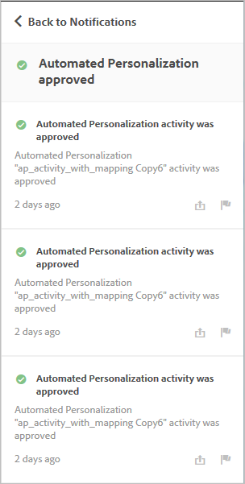

# 活动通知{#activity-notifications}

通过使用 Adobe Pulse，Target 可以与其他 Adobe Experience Cloud 解决方案交换通知。Target 会为所有活动类型发送两种通知：活动上线时以及活动被停用时。

如果用户的 [!DNL Experience Cloud] 中包含 [!DNL Target Standard/Premium] 产品，则用户可以在所有解决方案中查看来自 [!DNL Target] 的通知。

有关设置通知的信息，请参阅 [文档](https://marketing.adobe.com/resources/help/en_US/mcloud/notifications.html) 中的 [!DNL Adobe Experience Cloud] 通知。

可在 [!DNL Target] 中的任意位置（活动创建工作流除外）访问通知。单击页面标题中的铃铛图标可显示或隐藏通知 Widget。

[!DNL Target] 会为所有活动类型发送两种通知：

* 活动激活且选件交付开始时：

   例如：

   

* 活动停用且选件交付停止时：

   例如：

   

计划活动在到达开始日期后开始以及在到达结束日期后结束时，也会显示类似的通知。

所有 [!DNL Target] 通知都会显示已批准或已停用活动的名称，并包含“Adobe Target”字样以便于识别。

如果一个活动发送了多个类型相同的通知，则这些通知会整合到一个卡片中，并在其中显示通知数量。例如：

单击通知卡片可查看各个通知的详细信息。

例如，如果单击上面显示的卡片，则会显示三个通知：

## 限制 {#section_B466EB20B2554CE7B1915374B39F4322}

* 通知中不会显示是谁批准、停用或导入了活动。
* MVT 通知会显示为“A/B 测试”，因为此类活动已在 [!DNL Target Classic] 中同步为 A/B 营销活动。

