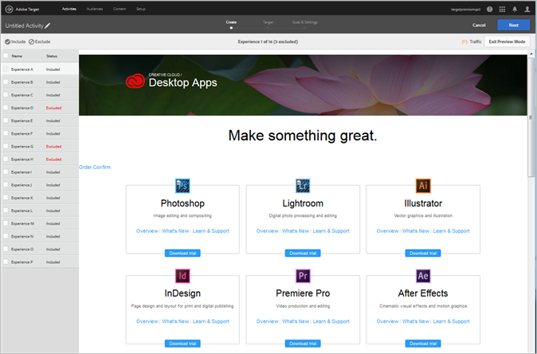

#  在可视化体验编辑器中预览自动个性化体验{#preview-experiences-for-automated-personalization-in-the-visual-experience-composer}

由于自动个性化测试会对页面上的多个选件进行比较，因此预览每个体验中的页面将会很有帮助。

1. 在体验编辑器中，单击**[!UICONTROL 预览]**。

   此时将显示一个包含所有体验的列表。

   

1. 单击列表中的某个特定体验，以查看该体验。

1. 要将某个体验从活动中排除，请选择该体验，然后单击**[!UICONTROL 排除]**。

   

   您可能会选择排除显示冲突变体的体验，或在美学上未实现平衡的体验。

   默认情况下，自动个性化活动中包含所有体验。要包含之前已被排除的体验，请选择该排除的体验，然后单击**[!UICONTROL 包含]**。

单击**[!UICONTROL 退出预览模式]**，以返回到体验编辑器，从而进行更改；或单击**继续]以进入“定位”步骤。[!UICONTROL **
