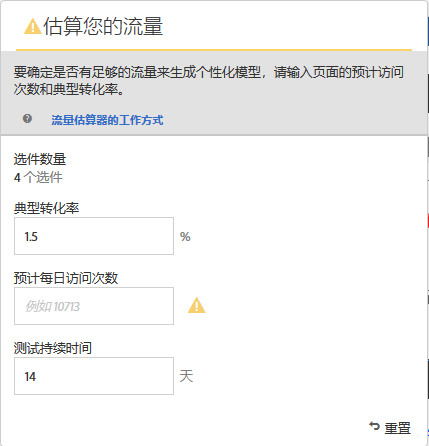
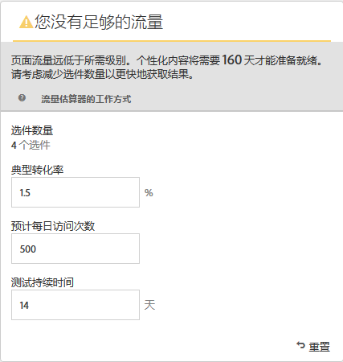
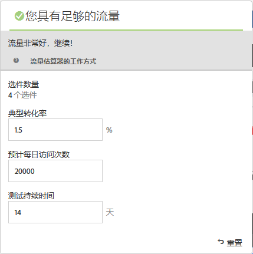

#  估算成功所需流量{#estimate-the-traffic-required-for-success}

流量估算器会提供反馈，让您了解是否有充足的流量来确保活动成功。

由于自动个性化活动使用多个选件组合，因此应务必了解需要多少流量才能得出有意义的结果。流量估算器使用有关页面的统计数据和要测试的体验数量来估算使活动取得成功所需的流量和测试持续时间。

通过比较页面的预计展示次数和典型转化率，流量估算器可确定是否有足够的流量来生成个性化模型。对于成功的活动，在理想的情况下，正确的样本量可确保个性化内容在活动持续时间的一半时间或 14 天内（以较短者为准）准备就绪。这样便可以有充足的时间来获取个性化内容，并学习要交付哪些内容。

请记住，在个性化算法构建完成之前，Target 会一直随机提供体验。如果选件的个性化模型已准备就绪，且 Target 可以开始交付个性化内容，则该选件旁边会显示复选标记图标。由于只有在个性化模型准备就绪后才会出现提升，因此显示的指示标记可帮助您设置正确的预期。在可视化体验编辑器 (VEC) 中使用流量估算器可以在个性化模型准备就绪时获得相关指示。

1. 在体验编辑器中，单击&#x200B;**[!UICONTROL 流量]**。

   

   此时将打开流量估算器。您可以再次单击&#x200B;**[!UICONTROL 流量]**&#x200B;以隐藏流量估算器。

   

1. 提供典型转化率（或此活动的预期转化率）、预计每日活动展示次数，及测试持续时间。

   * 内容组合数量：根据在任何排除后作为活动的一部分创建的体验的数量自动进行计算。
   * 典型转化率：转化率以百分比表示，根据估算或 Analytics 系统中的以往数据得出。
   * 预计每日访问次数：这是指根据定位标准能够访问活动的访客每日进行的访问次数。可以基于您的分析数据。请注意，此数值应为访问次数，而不是独特访客数。
   * 测试持续时间：您希望该活动运行的天数。

   流量估算器使用这些统计数据来确定运行一个成功的测试需要进行哪些调整。

   系统会计算您输入的值并在流量估算器的顶部区域附近显示计算结果。

   

   当您更改这些数字时，估算的结果也会相应改变。例如，如果您测试的组合数量很多，而转化率和展示次数过低，则流量估算器会显示测试取得成功所需的运行时间。或者，如果您的流量较低，流量估算器可能会建议您减少选件组合数量，以便能够将测试运行所需的天数。

   如果流量不足，您可以执行以下任一或所有操作：

   * 考虑使用自动定位来创建多个体验（其中每个体验变体中存在一些选件变化），而不使用自动个性化。
   * 减少自动个性化活动中的选件组合数量。
   * 延长活动持续时间。

   调整数字直到流量估算器表示已有足够流量，然后对您的测试进行相应设计。

   

   如果流量充足，“流量”图标会显示一个绿色勾号。如果流量不足，该图标会显示一个红色警告标签。
