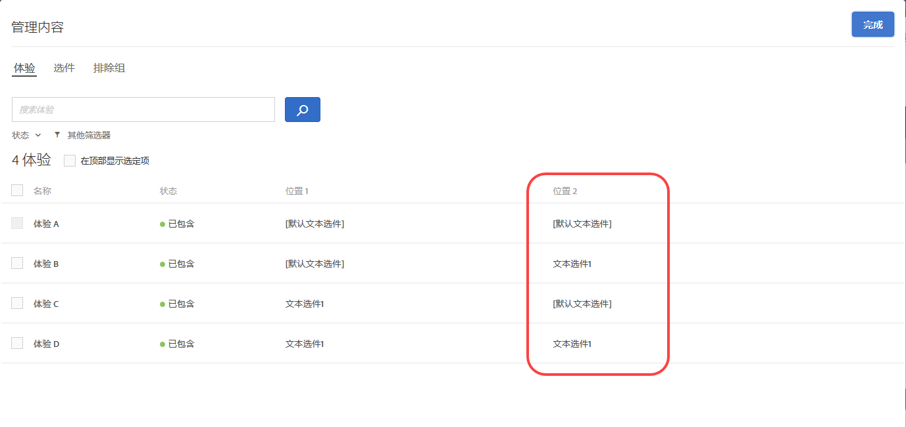
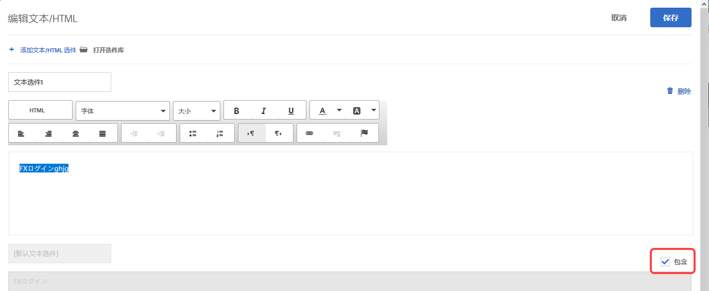
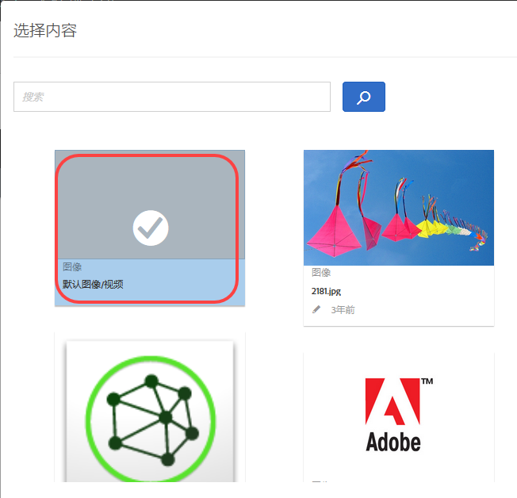

#  管理排除项{#manage-exclusions}

通过创建排除组、排除重复的选件、排除特定体验以及排除自动个性化 (AP) 活动中的默认内容来管理排除项。

## 创建排除组 {#task_AAAA6C7239A84F7696C8492F04B575A2}

可在自动个性化 (AP) 活动中创建排除组，以确保自动排除具有指定选件的体验。

排除组是一种非常有用的方法，可确保不同位置的相同体验中不会出现不兼容的选件。例如，假设您有两个选件：一个选件是所有商品八折优惠，而另一个选件是所有商品八五折优惠。您一定不希望在同一个体验中同时向访客显示这两个选件。如果您将这两个选件添加到一个排除组，便可以确保永远不会出现这种情况。

您还可以限制能够在 AP 活动中查看特定选件的受众。有关更多信息，请参阅 [Target 自动个性化选件](/help/c-activities/t-automated-personalization/ap-target-offers.md)。

**创建排除组：**

1. [创建或编辑 AP 活动](/help/c-activities/t-automated-personalization/create-ap-activity.md)时，单击标题栏中的&#x200B;**[!UICONTROL 管理内容]**。

   

1. 在“[!UICONTROL 管理内容]”对话框中，单击&#x200B;**[!UICONTROL 排除组]**。

   

   如果您之前已经创建一些排除组，它们会显示在列表中。如果您尚未创建排除组，系统会提示您创建一个排除组。

1. 单击&#x200B;**[!UICONTROL 创建排除组]**。

   

1. （必需）为排除组指定一个描述性名称。

   描述性名称可以帮助您或他人快速找到排除组并了解其用途。

1. 查找并选择要添加到排除组的所需选件。

   您可以在排除组中选择来自相同位置的多个选件。

1. 单击&#x200B;**[!UICONTROL 保存]**。

之后，排除组中的选件将自动从相同的体验中排除。

## 排除重复的选件 {#concept_4EF78013F80E48EFA024AE0274C9F037}

在[!UICONTROL 自动个性化]活动的不同位置中使用来自选件库的选件时，应防止选件出现重复。

例如，在您的一个活动中，一个页面上可能有 6 个位置和 12 个选件。活动中的多个位置可能存在相同的选件。此功能可阻止同一个活动中的不同位置同时显示重复的选件。

单击&#x200B;**[!UICONTROL 配置]** > **[!UICONTROL 重复的选件]**，然后单击&#x200B;**[!UICONTROL 允许重复项]**&#x200B;或&#x200B;**[!UICONTROL 不允许重复项]**。

## 排除特定体验 {#task_C17D36EF58AF4908B17A3D84CA6DE85A}

如果您想要从自动个性化活动中排除某些选件组合，则可以排除特定的体验。

某些体验可能不适合组合在一起使用，或者您可能想要限制测试的体验数量，以减少活动所需的流量。

1. [创建或编辑 AP 活动](/help/c-activities/t-automated-personalization/create-ap-activity.md)时，单击标题栏中的&#x200B;**管理内容**。

   

   “[!UICONTROL 体验]”列表显示了所有内容和位置选项经过排列组合而生成的各个体验。

1. 根据需要排除相应的体验。

   要排除特定的体验，您可以将鼠标悬停在所需体验上，然后单击“排除”图标。

   

   或者，您也可以批量排除/包含体验，方法是选中相关体验的复选框，然后单击对话框右上角的 **[!UICONTROL 排除]**&#x200B;图标。选中一个或多个体验后，“[!UICONTROL 排除]”图标即会显示。

   

   您可以通过单击“[!UICONTROL 状态]”下拉列表来筛选此列表视图，以仅查看排除或包含的体验。

   此时，选中的体验将从活动中排除，且其“[!UICONTROL 状态]”将显示为“[!UICONTROL 已排除]”。

   

## 排除默认内容 {#task_DCB4528989DF4C05A3A4729E5891D18F}

在某些情况下，您可能不希望将默认内容包含在自动个性化活动中。访问此设置的方式不同于创建排除组。通过此方法，您可以在 AP 活动中的某个位置仅使用一个选件（与默认内容不同）。

排除默认内容是一种非常有用的方法，可用于更改页面上其余内容的外观，以使其符合您在 AP 活动中所测试的选件。例如，假设您想要匹配所测试选件的调色板，则可以更改页面的背景颜色并排除默认的背景颜色。

**使用可视化体验编辑器 (VEC) 排除默认内容：**

1. While [creating or editing an AP activity](/help/c-activities/t-automated-personalization/create-ap-activity.md), select the content you want to replace and click to access **[!UICONTROL Change Text/HTML]**, **[!UICONTROL Change Image]**, or **[!UICONTROL Change Background Color]**.
1. 在出现的对话框中，创建新的内容，然后取消选中默认内容右侧的&#x200B;**包含**&#x200B;复选框（或在“选择内容”屏幕中取消选中“默认图像/视频”）。

   “[!UICONTROL 包含]”复选框的位置可能会因内容/选件类型而略有不同。

   对于文本/HTML 内容：

   

   对于图像/视频内容：

   

   对于背景颜色：

   

1. 单击&#x200B;**[!UICONTROL 保存]**。

   您可以在“[!UICONTROL 管理内容]”下方看到使用指定的选件创建的体验。您会注意到，“[!UICONTROL 管理内容]”中不存在使用已排除的默认选件创建的任何体验。

   

**使用基于表单的体验编辑器排除默认内容：**

1. 创建或编辑 AP 活动时，在&#x200B;**[!UICONTROL 内容]**&#x200B;下方单击&#x200B;**[!UICONTROL 更改文本/HTML]**&#x200B;或&#x200B;**[!UICONTROL 更改图像选件]**。
1. 在出现的对话框中，创建新的内容，然后取消选中默认内容右侧的&#x200B;**[!UICONTROL 包含]**&#x200B;复选框（或在“选择内容”屏幕中取消选中“默认图像/视频”）。

   “包含”复选框的位置可能会因内容/选件类型而略有不同。

   对于文本/HTML 内容：

   

   对于图像/视频内容：

   

1. 单击&#x200B;**[!UICONTROL 保存]**。

   您可以在“[!UICONTROL 管理内容]”下方看到使用指定的选件创建的体验。您会注意到，“[!UICONTROL 管理内容]”中不存在使用已排除的默认选件创建的任何体验。

   
