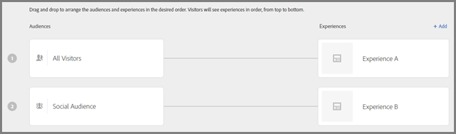
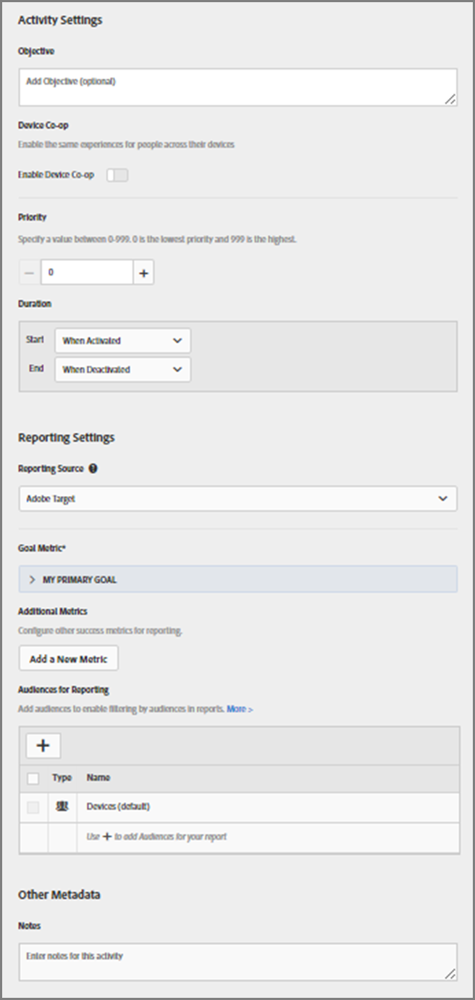

# 创建体验定位活动{#create-an-experience-targeting-activity}

使用可视化体验编辑器，可在启用了 Target 的页面上创建体验定位活动，并在 Target 中修改页面的各个部分。

1. 在[!UICONTROL 活动]**列表中，单击[!UICONTROL 创建活动]&gt;****[!UICONTROL 体验定位]**。

   

   >[!NOTE]
   >
   >可用的活动类型取决于您的 Target 帐户。有些活动类型可能不会显示在列表中。

   有关活动类型的信息，请参阅[活动](../../../c-activities/activities.md#concept_D317A95A1AB54674BA7AB65C7985BA03)。
1. 输入[活动 URL](../../../c-activities/t-experience-target/t-xt-create/xt-activity-url.md#concept_D28549AAA0A14E3BB5F05F32BE8ABC90)，然后单击**[!UICONTROL 下一步]**。

   

   如果您的帐户配置了默认 URL，则默认情况下将显示该 URL。您可以将默认 URL 更改为其他 URL。

   如需 VEC 的故障诊断信息，或者当您遇到问题时，请参阅[可视化体验编辑器故障诊断](../../../c-experiences/c-visual-experience-composer/r-troubleshoot-composer/troubleshoot-composer.md#reference_77743144F10143A3A89D56E116D296E4)。

   如果您希望使用基于表单的体验编辑器，请选择相应的选项。请参阅[基于表单的体验编辑器](https://marketing.adobe.com/resources/help/en_US/target/target/t_form_experience_composer.html)。

   此时会打开可视化体验编辑器，其中显示了在 URL 中指定的页面。
1. 在提供的空白处键入该活动的名称。

   

   活动名称中不允许使用以下字符：

   | 字符 | 描述 |
   |--- |--- |
   | `/` | 正斜线 |
   | `?` | 问号 |
   | `#` | 数字符号 |
   | `:` | 冒号 |
   | `=` | 等号 |
   | `+` | 加号 |
   | `-` | 减号 |
   | `@` | @ 符号 |

1. [创建任何新体验](../../../c-activities/t-experience-target/t-xt-create/xt-add-experience.md#task_454646F2895242D3B92DC395A0CE1A00)（通过更改页面上的元素）。

   体验编辑器（请参阅[体验](../../../c-experiences/experiences.md#concept_1D011219034B492BB03C08B3BB80E3F0)）将打开您在帐户首选项中指定的页面。要显示其他页面，请在体验编辑器中单击地球图标，在“选择 URL”框中输入 URL，然后单击**[!UICONTROL 继续]**。如果您输入的 URL 所对应的网站不包含 Target Standard JavaScript 代码，则您将无法选择页面元素。

   默认情况下，可视化体验编辑器不允许更改包含 JavaScript 的元素，如旋转横幅。如果您希望能够使用可视化体验编辑器更改这些元素，则可以选择禁用 JavaScript。

   >[!NOTE]
   >
   >在对一个或多个体验的页面进行更改后，如果您更改了 URL，则系统将使用新页面重置体验，而且您所做的更改也会丢失。

   将鼠标悬停在页面中的元素上时，这些元素会高亮显示。任何高亮显示的元素都可以使用体验编辑器进行更改。

   如果您曾使用 Target Classic（以前为 Test&amp;Target）在页面上创建了 mbox，则该 mbox 将显示为一个元素，该元素会显示 mbox 名称，且可以像其他任何元素一样进行修改。

   >[!NOTE]
   >
   >如果您交付的图像来自主页以外的其他来源（例如将一个在 akamai.net 上托管的图像交付到 dell.com），则该图像不会出现在流程图中显示的页面缩览图中。

1. 单击**[!UICONTROL 下一步]**。

   此时会打开流程图。

   

   流程图会引导您完成以下步骤：选择活动的受众和设置体验。
1. 将鼠标悬停在受众上，单击显示的**[!UICONTROL 编辑]**图标（三个垂直省略号），单击**[!UICONTROL 更改受众]**，然后为活动中的首个体验选择受众。

   

   此时会显示受众库。受众库中包含以前定义的受众，其中包括作为 Target 的一部分预先构建的一些常用受众。您可以从库中选择一个受众，也可以[创建新受众](../../../c-target/c-audiences/audiences.md#concept_65BE870D290E412D8BBF557EEA67C271)。要向所有参加者显示相同的体验，请选择“所有访客”。

   >[!NOTE]
   >
   >除了选择现有受众之外，您还可以合并多个受众来创建临时组合受众，而不是创建新受众。有关更多信息，请参阅[合并多个受众](../../../c-target/combining-multiple-audiences.md#concept_A7386F1EA4394BD2AB72399C225981E5)。

   在创建受众时，您可以选择一个位置 (mbox) 并指定该位置的参数。在“自定义参数”下，选择 mbox，然后指定所需的参数。

   >[!NOTE]
   >
   >打开受众列表时会在后台自动导入受众，导入的受众为 10 分钟之前的受众。

   通过单击显示的[!UICONTROL 编辑]图标（三个垂直省略号），然后单击[!UICONTROL 删除受众]，您可以删除现有受众。
1. 单击**[!UICONTROL 添加体验定位]**。

   >[!NOTE]
   >
   >如果您要将体验定位到某个受众，则必须先选择该受众，然后才能添加体验。此时将显示一则消息提醒您选择受众。

1. (可选)单击**[!UICONTROL 添加]**并设置其他定位体验。

   

   完成此步骤后，单击**[!UICONTROL 继续]。**
1. 指定活动的[目标和设置](../../../c-activities/t-experience-target/t-xt-create/xt-goals-and-settings.md#reference_B25389FD6F3A4989801E740364B089CC)。

   

1. 单击**[!UICONTROL 保存并关闭]**。
