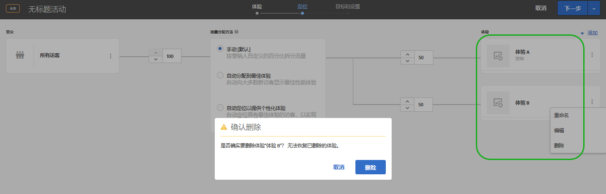

# 添加体验{#add-experience}

可视化体验编辑器提供了一个可视化界面，用于编辑您页面上的体验。

有关体验的更多详细信息，请参阅[体验](../../../c-experiences/experiences.md#concept_A2E10F6AFB3D4AEAB6951EE14688848D)。

1. 单击**[!UICONTROL 添加体验]**。

   >[!NOTE]
   >
   >如果您要将体验定位到某个受众，则必须先选择该受众，然后才能添加体验。此时将显示一则消息提醒您选择受众。

1. 出现提示时，输入活动 URL。键入完整的 URL（包括 `https://`**），然后单击[!UICONTROL 继续]**。

   体验编辑器（请参阅[体验](../../../c-experiences/experiences.md#concept_1D011219034B492BB03C08B3BB80E3F0)）将打开您在帐户首选项中指定的页面。要显示其他页面，请在体验编辑器中单击地球图标，在“选择 URL”框中输入 URL，然后单击**[!UICONTROL 继续]**。如果您输入的 URL 所对应的网站不包含 Target Standard JavaScript 代码，则您将无法选择页面元素。

   默认情况下，可视化体验编辑器不允许更改包含 JavaScript 的元素，如旋转横幅。如果您希望能够使用可视化体验编辑器更改这些元素，则可以选择禁用 JavaScript。

   >[!NOTE]
   >
   >在对一个或多个体验的页面进行更改后，如果您更改了 URL，则系统将使用新页面重置体验，而且您所做的更改也会丢失。

1. 选择要更改的元素，然后进行所需的更改。

   将鼠标悬停在页面中的元素上时，这些元素会高亮显示。任何高亮显示的元素都可以使用体验编辑器进行更改。

   如果您曾使用 Target Classic（以前为 Test&amp;Target）在页面上创建了 mbox，则该 mbox 将显示为一个元素，该元素会显示 mbox 名称，且可以像其他任何元素一样进行修改。

   有关可对显示页面上的元素执行以更改体验的操作列表，请参阅[可视化体验编辑器选项](/help/c-experiences/c-visual-experience-composer/viztarget-options.md)。

   >[!NOTE]
   >
   >如果您交付的图像来自主页以外的其他来源（例如将一个在 akamai.net 上托管的图像交付到 dell.com），则该图像不会出现在流程图中显示的页面缩览图中。

1. 完成对体验的设计之后，单击复选标记按钮。

   活动图显示如下：

   

   如果体验包含跨域内容，则缩览图可能不会准确显示，而是由一个图标替代。

1. 指定将看到活动中的每个体验的访客所占的百分比。

   您可以向同一个受众显示多个体验。将会有一个图表显示您选择的受众，以及您已添加到该活动的各个体验。指定每个体验的显示次数所占的百分比。您可以将百分比平分到所有体验，或者也可以为每个体验指定较高或较低的百分比。所有体验的百分比总和必须等于 100%。您还可以单击**[!UICONTROL 添加体验]，以向该活动中添加其他体验。**

   完成此步骤后，单击**[!UICONTROL 继续]。**

## 重命名、编辑或删除体验

请注意，在 A/B 测试或体验定位 (XT) 活动中，您可以单击某个体验中的“更多”（三个垂直省略号）图标，并根据需要从以下选项中进行选择：

* 重命名
* 编辑
* 删除

请注意，在命名或重命名体验时，不允许使用以下字符：

| 字符 | 描述 |
|--- |--- |
| / | 正斜线 |
| ? | 问号 |
| # | 数字符号 |
| : | 冒号 |
| = | 等号 |
| + | 加号 |
| - | 减号 |
| @ | @ 符号 |

## 复制体验

您可以复制 A/B 测试中的体验，以便可以对其进行细微更改，而无需重头开始重新创建体验。

在**[!UICONTROL 体验]**页面（三步引导式工作流的步骤 1）中，依次单击三个垂直省略号图标 &gt; **[!UICONTROL 复制]**。

## 培训视频：使用可视化体验编辑器

以下视频提供了有关使用可视化体验编辑器选项的信息。(7:17)

* 更改页面的内容
* 更改页面的布局

>[!VIDEO](https://video.tv.adobe.com/v/17399)
