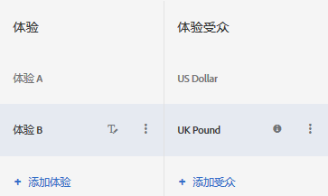

# A/B 测试中的多个体验受众{#multiple-experience-versions-in-an-a-b-test}

在 A/B 活动中，您可以将相同体验的不同版本定位到不同的受众。在可视化体验编辑器或基于表单的体验编辑器中，您可以为一个体验设置多个受众。

随着用户配置文件发生更改，用户可以在多个体验受众之间进行切换。用户在活动的生命周期内并不仅限于参加同一个体验。

例如，如果您网站上的各个页面或产品使用了统一设计，而且您想要对多个受众（例如使用不同浏览器语言的访客）使用同一个体验，则可以设置多个体验版本。您可以向英语访客和日语访客呈现同一个体验，而唯一的区别在于显示的文本分别为访客所用的语言。收集到的体验数据不区分语言，这样，报表就可以显示体验而不是某个体验版本的效果。

如果不能设置多个体验版本，那么您就必须为每种语言（本示例）分别设置不同的测试，然后手动整合结果，以便了解这个具有两种语言的体验效果如何。这样会降低结果的准确性。由于访客是随机分配的，有些测试的计算结果甚至可能没有任何意义。

通过创建体验的不同版本，您可以获取更准确的信息，而无需进行手动计算，也无需做出假设。

**方案**

您要测试两个体验，分别是已进行地理定位的横幅与通用横幅。不同的地理位置需要不同的横幅，但是这个测试的主要目的在于确定进行地理定位是否会比显示通用内容取得的效果更好。如果您为每个位置都设置单独的体验，那么您实际上是要对比各地理位置的表现情况，而不是测试与使用通用横幅相比，进行地理定位是否有助于您实现成功目标。

在这种情况下，您需要设置特定于地理位置的体验版本，以便您能够对已进行地理定位的体验和未进行地理定位的控制体验进行对比测试。

1. [创建 A/B 活动](../../../c-activities/t-test-ab/t-test-create-ab/test-create-ab.md#task_68C8079BF9FF4625A3BD6680D554BB72)（按常规步骤操作）。

   配置具有多个版本的体验时，请按照以下步骤所示，为每个版本选择相应的受众。

1. 选择体验，然后单击&#x200B;**[!UICONTROL 配置]** &gt; **[!UICONTROL 受众]** &gt; **[!UICONTROL 多个受众]**。

   

1. 单击&#x200B;**[!UICONTROL 添加受众]**，然后选择要定位的第一个受众。对每个受众重复执行上述步骤。

   

   如果受众尚不存在，请单击[创建受众](../../../c-target/c-audiences/create-audience.md#task_E18BD77A9A8F4ED0AC50569F94556558)，然后对其进行设置。

   如果访客符合多个受众的条件，则会返回适用于所有受众的内容，但页面上呈现的实际上是适用于列表中最后一个受众的内容。

1. 继续设置活动。

**最佳实践**

* 选择相互排斥的受众。如果活动是在 VEC 中创建的，且访客符合多个受众的条件，则会返回适用于所有受众的内容，但页面上显示的实际上是适用于最后一个所列受众的内容。
* 活动图中定义的活动参加受众是通过“与”条件与体验受众进行组合的。因此，要参加活动，访客必须符合活动受众的条件，同时还必须符合某个体验受众的条件。
* 将相同的受众作为报表中的区段进行添加。这样可帮助您查看较高级别的体验测试结果（如体验 A 与体验 B），以及较低级别的体验测试结果（如体验 A 与体验 B 的仅“浏览器语言 ja_JP”）。这仅适用于基于 Target 的报表，而不适用于基于 Analytics 的报表。

