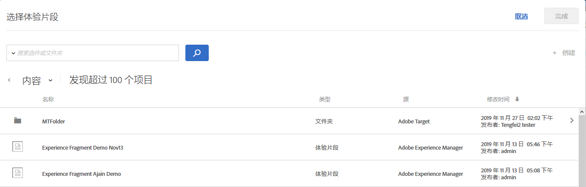

# AEM 体验片段{#aem-experience-fragments}

Information about using experience fragments created in [!DNL Adobe Experience Manager] (AEM) in [!DNL Target] activities to aid optimization or personalization.

>[!NOTE]
>
>This feature requires that you are an [!DNL Adobe Experience Manager] ([!DNL AEM]) customer. 有关更多信息，请参阅下面的[要求](../../c-experiences/c-manage-content/aem-experience-fragments.md#section_AE6F0971E1574B3AA324003599B96E5A)。

## 概述 {#section_95A91830530F493B81C5C9CDB9B783EA}

Using experience fragments created in [!DNL AEM] in [!DNL Target] activities lets you combine the ease-of-use and power of [!DNL AEM] with powerful Automated Intelligence (AI) and Machine Learning (ML) capabilities in [!DNL Target] to test and personalize experiences at scale.

[!DNL AEM] 可将您的所有内容和资产汇集到一个中心位置，以帮助实施您的个性化策略。[!DNL AEM]通过 ，您能够在一个位置轻松创建适用于桌面、平板电脑和移动设备的内容，而无需编写代码。无需为每个设备创建页面。 [!DNL AEM] 使用您的内容自动调整每个体验。

[!DNL Target] 允许您根据一组基于规则且由 AI 驱动的机器学习方法（这些方法包含行为、上下文和离线变量），交付大量的个性化体验。With [!DNL Target] you can easily set up and run [A/B Test](/help/c-activities/t-test-ab/test-ab.md) and [Multivariate](/help/c-activities/c-multivariate-testing/multivariate-testing.md) (MVT) activities to determine the best offers, content, and experiences.

Experience fragments represent a huge step forward to link the content/experience creators and managers to the optimization and personalization professionals who are driving business outcomes using [!DNL Target].

## 要求 {#section_AE6F0971E1574B3AA324003599B96E5A}

You must be provisioned with the experience fragments functionality within [!DNl Target]. In addition, you must be using [!DNL AEM] 6.3 with the appropriate service pack or [!DNL AEM] 6.4 (or later). 您的客服专员可以帮助您确保满足使用此功能的要求：

* [!DNL Adobe Experience Manager] 6.4（或更高版本）。
* [!DNL Adobe Experience Manager] 6.3 SP2（或更高版本）。
* [!DNL Adobe Target Standard] 或帐 [!DNL Adobe Target Premium] 户。
* Contact [Adobe Target Customer Care](/help/cmp-resources-and-contact-information.md#reference_ACA3391A00EF467B87930A450050077C) to enable the integration and to provide you with authentication details.

## Creating and configuring experience fragments in [!DNL AEM] {#section_745C8EFE29F547A2958FDBF61A5ADF7B}

In order to use [!DNL AEM] experience fragments in [!DNL Target], you must perform the following steps:

### 第1步：与 [!DNL AEM][!DNL Target]

有关详细信息，请参阅：

* **[!DNL AEM]6.3 **:在[Adobe Experience Manager 6.3文档中](https://docs.adobe.com/docs/en/aem/6-3/administer/integration/marketing-cloud/opt-in.html),_选择Adobe Analytics和Adobe目标&#x200B;_。
* **[!DNL AEM]6.4 **:在[Adobe Experience Manager 6.4文档中](https://helpx.adobe.com/experience-manager/6-4/sites/administering/using/opt-in.html),_选择Adobe Analytics和Adobe目标&#x200B;_。
* **[!DNL AEM]6.5 **:在[Adobe Experience Manager 6.5文档中](https://helpx.adobe.com/experience-manager/6-5/sites/administering/using/opt-in.html),*选择Adobe Analytics和Adobe目标*。

### 步骤 2：创建体验片段

Experience fragments are created in [!DNL AEM]. 有关详细信息，请参阅：

* **[!DNL AEM]6.3 **:Adobe Experience Manager 6.3文档中的Experience Fragments **。
* **[!DNL AEM]6.4 **:Adobe Experience Manager 6.4文档中的Experience Fragments **。
* **[!DNL AEM]6.5 **:Adobe Experience Manager 6.5文档中的Experience Fragments **。

### Step 3: Configure [!DNL AEM] to share the experience fragment with [!DNL Target]

1. From within [!DNL AEM], select the desired experience fragment or its containing folder, then click **[!UICONTROL Properties]**.
2. 单击&#x200B;**[!UICONTROL 云服务]**&#x200B;选项卡，然后从&#x200B;**[!UICONTROL 云服务配置]**&#x200B;下拉列表中选择 **[!UICONTROL Adobe Target]**。

   >[!NOTE]
   >
   >The previous step assumes that someone in your organization has created the [!DNL Adobe Target] configuration.

3. 单击&#x200B;**[!UICONTROL 保存并关闭]**。

### 步骤 4：发布体验片段并将其导出到 [!DNL Target]

根据您的 [!DNL AEM] 版本，请参阅以下链接以获取分步说明：

* **[!DNL AEM]6.3 **:将[Experience Fragment导出到](https://helpx.adobe.com/experience-manager/6-3/sites/administering/using/experience-fragments-target.html)*Adobe Experience Manager 6.3文档中的目标*。
* **[!DNL AEM]6.4 **:将[Experience Fragment导出到](https://docs.adobe.com/content/help/en/experience-manager-64/administering/integration/experience-fragments-target.html)*Adobe Experience Manager 6.4文档中的目标*。
* **[!DNL AEM]6.5 **:将[Experience Fragment导出到](https://helpx.adobe.com/experience-manager/6-5/sites/administering/using/experience-fragments-target.html)*Adobe Experience Manager 6.5文档中的目标*。

## Using experience fragments in DNL Target activities {#section_17CE4BE6B2B74CCEBAE0C68DEB84ABB9}

After performing the preceding tasks, the experience fragment displays on the [!UICONTROL Offers] page in [!DNL Target].

>[!NOTE]
>
>[!DNL Target]当前， 会每隔 10 分钟查找一次要导入的体验片段。The imported experience fragment should be available in [!DNL Target] within ten minutes, but this time frame should shorten going forward.

>[!IMPORTANT]
>
>The experience fragment is currently imported into [!DNL Target] as an HTML offer. Note that the experience fragment &quot;master&quot; version remains in [!DNL AEM]. You cannot edit the experience fragment in [!DNL Target].

您可以将鼠标悬停在列表中的体验片段上，然后单击 [!UICONTROL 视图] 图标  ，以查看有关体验片段的其他信息，包括其公共优惠投放URL及其路径 [!DNL AEM] 。

You can consume experience fragments in [!DNL Target] activities using the [Visual Experience Composer](/help/c-experiences/c-visual-experience-composer/visual-experience-composer.md) (VEC) or the [Form-Based Experience Composer](/help/c-experiences/form-experience-composer.md).

>[!NOTE]
>
>To fully utilize the [!DNL Target] AI and ML functionality, you can select [Auto-Allocate](../../c-activities/automated-traffic-allocation/automated-traffic-allocation.md#concept_A1407678796B4C569E94CBA8A9F7F5D4) or [Auto-Allocate](/help/c-activities/automated-traffic-allocation/automated-traffic-allocation.md) while creating an A/B Test.

**要使用VEC消耗体验片段，请执行以下操作：**

1. 在 [!DNL Target]Visual [Experience Composer中创建或编辑体验时，单击页面上要插入内容的位置，然后选择所需的选项以显示“选择体验片段](../../c-experiences/experiences.md#concept_A2E10F6AFB3D4AEAB6951EE14688848D)[!DNL AEM] ”列表。

   * [!UICONTROL 此项前插入]
   * [!UICONTROL 此项后插入]
   * [!UICONTROL 与体验片段交换]
   The [!UICONTROL Experience Fragment] list displays all of the content created in [!DNL AEM] that is now natively available from within [!DNL Target].

   >[!NOTE]
   >
   >[!UICONTROL 与体验片段交换]选项不适用于图像。如果您想要对图像使用此选项，请单击包含所需图像的容器元素。

   

1. Select the desired experience fragment, then click **[!UICONTROL Done]**.
1. 完成活动配置。

   有关配置各种类型的活动的更多信息，请参阅以下主题：

   * **A/B 测试：**[创建 A/B 测试](../../c-activities/t-test-ab/t-test-create-ab/test-create-ab.md#task_68C8079BF9FF4625A3BD6680D554BB72)
   * **自动分配：**[自动分配](../../c-activities/automated-traffic-allocation/automated-traffic-allocation.md#concept_A1407678796B4C569E94CBA8A9F7F5D4)
   * **自动定位：**[自动定位以提供个性化体验](../../c-activities/auto-target-to-optimize.md#concept_67779E5B7F67427A97D7EA2A6FB919B3)
   * **自动个性化 (AP)：**[创建自动个性化活动](../../c-activities/t-automated-personalization/create-ap-activity.md#task_8AAF837796D74CF893CA2F88BA1491C9)
   * **体验定位 (XT)：**[创建体验定位活动](../../c-activities/t-experience-target/t-xt-create/xt-create.md#task_D6B3429AC31549E1A70EDF04B3DDC765)
   * **多变量测试 (MVT)：**[创建多变量测试](../../c-activities/c-multivariate-testing/t-create-multivariate-test/create-multivariate-test.md#task_BF870FA60A8245AB8F0B775BE32EA710)
   * **推荐：**[创建“推荐”活动](../../c-recommendations/t-create-recs-activity/create-recs-activity.md#task_6874328773C64C44A73F0A130AD3F96F)

**要使用基于表单的体验书写器使用体验片段，请执行以下操作：**

1. 在 [!DNl目标中]，在基于表单的体验列表中创建或编辑体验时，选择页面上要插入内容的位置，然后选择 [Change Experience Fragment](../../c-experiences/form-experience-composer.md#task_FAC842A6535045B68B4C1AD3E657E56E)[!DNL AEM]**** （更改体验片段）以显示“选择体验片段”（选择“体验片段创建”）。

   

   The [!UICONTROL Experience Fragment] list displays all of the content created in [!DNL AEM] that is now natively available from within [!DNL Target].

1. 选择所需的体验片段，然后单击&#x200B;**[!UICONTROL 保存]**。
1. 完成活动配置。

## 注意事项 {#considerations}

* [!DNL Target]当前， 会每隔 10 分钟查找一次要导入的体验片段。The imported experience fragment should be available in [!DNL Target] within ten minutes, but this time frame should shorten going forward.
* The experience fragment is currently imported into [!DNL Target] as an HTML offer. Note that the experience fragment &quot;master&quot; version remains in [!DNL AEM]. You cannot edit the experience fragment in [!DNL Target].
* 您可以将JSON优惠作为体验片段导入 [!DNL Target]。 但是，这些优惠将作为HTML优惠导入。 JSON优惠（体验片段）当前在UI中不完全受 [!DNL Target] 支持。

## 培训视频：将DNL AEM体验片段与Adobe目标教 {#section_C0EDC54063464F41A182492D2045BC64} 程 

以下视频向您展示了如何设置和使用体验片段：

>[!VIDEO](https://video.tv.adobe.com/v/22383)

>[!NOTE]
>
>4时 [!DNL AEM] 54分讨论的深层链接功能已被删除。

有关详细信息，请参 [阅AEM Sites视频和教程页面上的](https://docs.adobe.com/content/help/en/experience-manager-learn/sites/personalization/experience-fragment-target-offer-feature-video-use.html) “将体验片段与Adobe *目标结合使用* ”。
