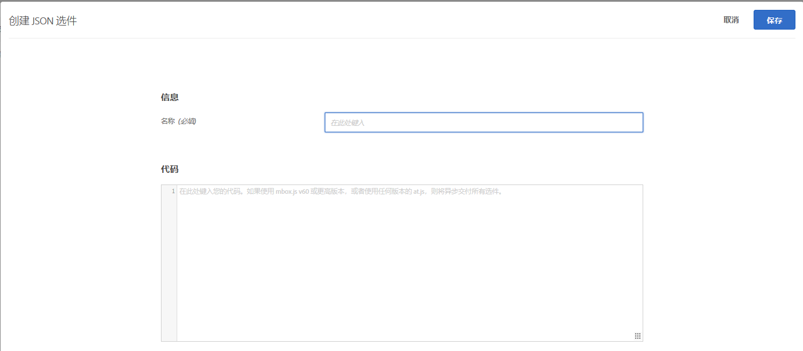
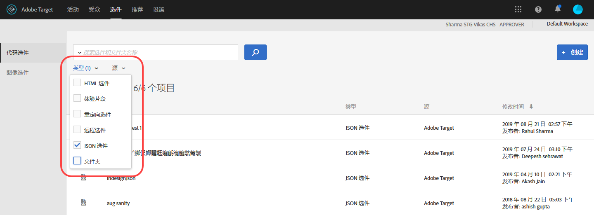

# 创建 JSON 选件{#create-json-offers}

可在选件库中创建 JSON 选件，以在基于表单的体验编辑器中使用。

JSON 选件可在基于表单的活动中使用，从而能够实现以下用例：需要使用 Target 决策发送 JSON 格式的选件，以供在 SPA 框架或服务器端集成中使用。

使用 JSON 选件时，请考虑以下信息：

* JSON 选件目前仅适用于 AB 和 XT 活动。
* JSON 选件只能在基于表单的活动中使用。
* 使用服务器端 API、Mobile SDK 或 NodeJS SDK 时，可以直接检索 JSON 选件。
* 在浏览器中，只能通过 at.js 1.2.3（或更高版本）并使用 [getOffer()](/help/c-implementing-target/c-implementing-target-for-client-side-web/adobe-target-getoffer.md) 来检索 JSON 选件，检索时可以使用 `setJson` 操作进行筛选。
* JSON 选件可作为原生 JSON 对象而不是字符串来交付。这些对象的用户不必再将对象作为字符串处理后再将其转换为 JSON 对象。
* 与其他选件（例如 HTML 选件）不同，JSON 选件不会自动应用，因为 JSON 选件不是可视化选件。开发人员必须编写相应代码，以便使用 [getOffer()](/help/c-implementing-target/c-implementing-target-for-client-side-web/adobe-target-getoffer.md)。
* 如果您使用的是 mbox.js，JSON 选件将不受支持。

## 创建 JSON 选件 {#section_BB9C72D59DEA4EFB97A906AE7569AD7A}

1. 单击&#x200B;**[!UICONTROL 选件]**，然后选择&#x200B;**[!UICONTROL 代码选件]**&#x200B;选项卡。
1. 单击&#x200B;**[!UICONTROL 创建]** > **[!UICONTROL JSON 选件]**。

   

1. 键入选件名称。
1. 在&#x200B;**[!UICONTROL 代码]**&#x200B;框中键入或粘贴您的 JSON 代码。
1. 单击&#x200B;**[!UICONTROL 保存]**。

## 示例 {#section_A54F7BB2B55D4B7ABCD5002E0C72D8C9}

JSON 选件仅在使用基于表单的体验编辑器创建的活动中受支持。目前，唯有通过直接 API 调用才能使用 JSON 选件。

示例如下：

```
adobe.target.getOffer({ 
  mbox: "some-mbox", 
  success: function(actions) { 
    console.log('Success', actions); 
  }, 
  error: function(status, error) { 
    console.log('Error', status, error); 
  } 
});
```

传递到 success 回调的操作是一个对象数组。假设我们只有一个 JSON 选件，且该选件具有以下内容：

```
{ 
  "demo": {"a": 1, "b": 2} 
}
```

操作数组将具有以下结构：

```
[ 
 { 
   action: "setJson", 
   content: [{ 
     "demo": {"a": 1, "b": 2} 
   }] 
 }  
]
```

要提取 JSON 选件，您需要遍历各个操作，并使用 `setJson` 操作找到所需的操作，然后再遍历内容数组。

## 用例 {#section_85B07907B51A43239C8E3498EF58B1E5}

假设将以下 JSON 选件交付到您的网页：

```
{ 
    "_id": "5a65d24d8fafc966921e9169", 
    "index": 0, 
    "guid": "7c006504-c6f7-468d-a46f-f72531ea454c", 
    "isActive": true, 
    "balance": "$2,075.06", 
    "picture": "https://placehold.it/32x32", 
    "tags": [ 
      "esse", 
      "commodo", 
      "excepteur", 
    ], 
    "friends": [ 
      { 
        "id": 0, 
        "name": "Carla Lyons" 
      }, 
      { 
        "id": 1, 
        "name": "Ollie Mooney" 
      }, 
    ], 
    "greeting": "Hello, Stephenson Fernandez! You have 4 unread messages.", 
    "favoriteFruit": "strawberry" 
} 
  
```

以下代码显示了如何访问“greeting”属性：

```
adobe.target.getOffer({   
  "mbox": "name_of_mbox", 
  "params": {}, 
  "success": function(offer) {           
        console.log(offer[0].content[0].greeting); 
  },   
  "error": function(status, error) {           
      console.log('Error', status, error); 
  } 
});
```

## 按 JSON 选件类型筛选选件 {#section_52533555BCE6420C8A95EB4EB8907BDE}

您可以按 JSON 选件类型对选件库进行筛选，方法是单击&#x200B;**[!UICONTROL 类型]**&#x200B;下拉列表，然后选中 **[!UICONTROL JSON]** 复选框。



