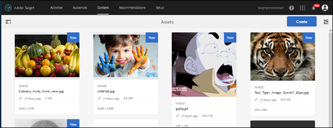

# 搜索内容并创建智能收藏集{#search-content-and-create-smart-collections}

可按关键字搜索资产并保存搜索文件夹（称为智能收藏集），这些文件夹会使用搜索结果自动更新。

本节包含以下信息：

* [按关键字搜索资产](../../c-experiences/c-manage-content/filter-and-search-content.md#section_2465A71BC95942588F586B1EC8B9E5DB)
* [保存智能收藏集](../../c-experiences/c-manage-content/filter-and-search-content.md#section_5C95159543B5405EB8C8E47B518DF4AB)

## 按关键字搜索资产 {#section_2465A71BC95942588F586B1EC8B9E5DB}

1. 单击&#x200B;**[!UICONTROL 选件]** > **[!UICONTROL 图像选件]**&#x200B;以访问“[!UICONTROL 资产库]”。

   您可以单击右上角的“[!UICONTROL 卡片视图]”图标，以卡片视图格式显示资产。

   或

   您可以单击右上角的“[!UICONTROL 列表视图]”图标，以列表视图格式显示资产。

1. 单击左上角的&#x200B;**[!UICONTROL 仅内容]**&#x200B;图标，以显示搜索框。

   

1. 在搜索框中，键入与要查找的资产有关的关键字，然后按 Enter 键。

## 保存智能收藏集 {#section_5C95159543B5405EB8C8E47B518DF4AB}

您可以创建保存的搜索（称为智能收藏集），以便在执行类似搜索时节省时间。保存的搜索会创建智能收藏集，该收藏集会使用搜索结果自动更新。

1. 单击&#x200B;**[!UICONTROL 选件]** > **[!UICONTROL 图像选件]**&#x200B;以访问“[!UICONTROL 资产库]”。

   

1. 单击左上角的&#x200B;**[!UICONTROL 仅内容]**&#x200B;图标，以在左边栏中显示“[!UICONTROL 筛选器和选项]”面板。
1. 单击&#x200B;**[!UICONTROL 浏览]**&#x200B;图标，以显示“[!UICONTROL 选择路径]”对话框。

   

1. 浏览到所需的文件夹并将其选定（需要根据此文件夹来创建智能收藏集），然后单击&#x200B;**[!UICONTROL 确认]**&#x200B;图标。

   

1. （可选）从多个选项中进行选择（例如选择文件类型和大小）以缩小筛选范围。
1. 单击“**[!UICONTROL 筛选器和选项]**”面板底部的[!UICONTROL 保存智能收藏集]，以显示“保存”选项。

   

1. 指定智能收藏集的名称，如果您希望自己的 **[!UICONTROL 帐户中的所有用户都能够访问此智能收藏集，请选中]**&#x200B;公共[!DNL Target]复选框，然后再单击&#x200B;**[!UICONTROL 保存]**。

   该智能收藏集随即会添加到保存的搜索列表中，以供将来使用：

   

您可以编辑保存的智能收藏集，方法是从“[!UICONTROL 保存的搜索]”下拉列表中选择相应的智能收藏集以将其打开，然后单击“[!UICONTROL 编辑智能收藏集]”。
