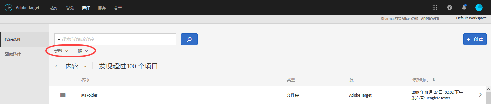
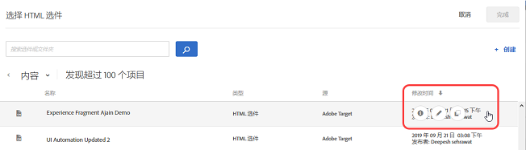
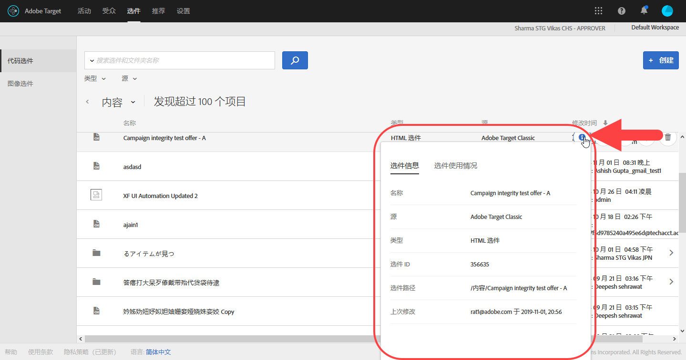
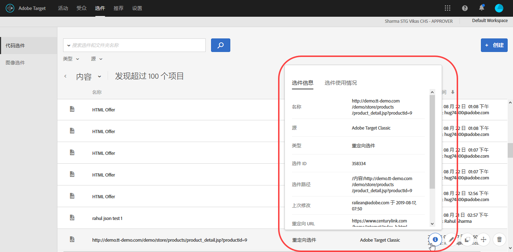
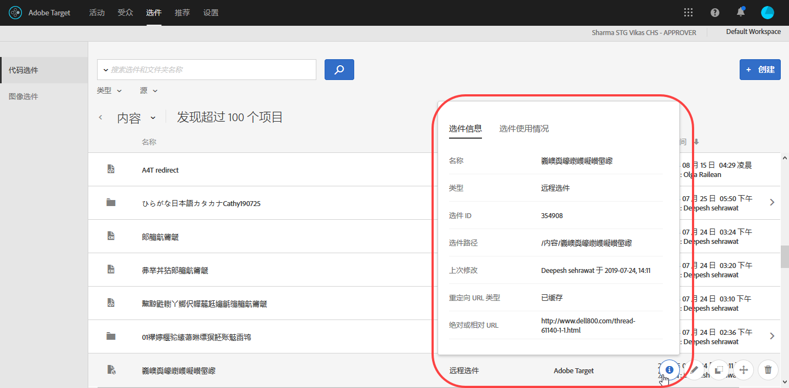

# 选件{#offers}

可使用选件库来管理代码选件和图像选件内容。

>[!NOTE]
>
>在 2017 年 1 月版的 [!DNL Target Standard/Premium] 用户界面中，可以看到通过 [!DNL Target Classic]、[!DNL Adobe Experience Manager] (AEM)、[!DNL Adobe Mobile Services] (AMS) 及 API 创建的选件。过去两年使用这些方法更新的选件也将可见（例如在 2015 年 1 月版及更高版本中）。您组织中的任何用户首次打开“[!UICONTROL 选件]”页面时，都将会进行初始同步。初始同步所需的时间将取决于数据量。初始同步完成后，数据将以增量方式进行同步。如果您之前将代码和图像放置在同一个文件夹中，则在此版本中，[!DNL Target] 会将代码和图像拆分到两个重复的文件夹中。请注意，更新日期和时间是指文件夹迁移的日期和时间，而不是指最初创建文件夹的日期和时间。

单击&#x200B;**[!UICONTROL 选件]**&#x200B;可打开选件库。选件库中包含通过 [!DNL Target Standard/Premium]、[!DNL Target Classic]、[!DNL Adobe Experience Manager] (AEM)、[!DNL Adobe Mobile Services] (AMS) 及 API 设置的选件。在 [!DNL Target Classic] 或其他解决方案中创建的选件可以在 [!DNL Target Standard/Premium] 中进行编辑。

“[!UICONTROL 选件]”页面右侧有两个选项卡，即“代码选件”和“图像选件”，您可以在这两个选项卡中按类型查看选件。

您可以按类型（HTML 选件、重定向选件、远程选件或文件夹）筛选选件，也可以按来源（Adobe Target、Adobe Target Classic、Adobe Experience Manager、Adobe Mobile Services 或 API）筛选选件。

您可以通过将鼠标悬停在所需项目上，然后单击“编辑”或“复制”图标，来编辑或复制文件夹或选件。

## 查看选件定义 {#section_6B059DD121434E6292CAB393507D010E}

您可以在选件库中的弹出卡片上查看选件定义详细信息，而无需打开选件。

例如，下面是一个 HTML 选件的定义卡片，通过在“内容”列表中将鼠标悬停该选件上，然后单击信息图标，可访问该卡片：

其中提供了以下信息：

* 名称
* 来源
* 类型
* 选件 ID
* 选件路径
* 上次修改时间

在每个选件的定义弹出卡片中单击“[!UICONTROL 选件使用情况]”选项卡，可查看引用了代码选件的活动。此功能不适用于图像选件。利用此功能，您可以避免在编辑选件时对其他活动造成影响。信息包含“实时活动”和“不活跃的活动”。

下面是一个重定向选件的定义卡片：

其中提供了以下信息：

* 名称
* 来源
* 类型
* 选件 ID
* 选件路径
* 上次修改时间
* 重定向 URL
* 包含所有 URL 参数（已开启或已关闭）
* 传递 mbox 会话 ID（已开启或已关闭）

下面是一个远程选件的定义卡片：

其中提供了以下信息：

* 名称
* 来源
* 类型
* 选件 ID
* 选件路径
* 上次修改时间
* 重定向 URL 类型
* 绝对或相对 URL

## 培训视频：内容存储库 

以下视频包含有关管理选件的信息。

* [Experience Cloud 资产库](https://docs.adobe.com/content/help/en/core-services/interface/assets/creative-cloud.html)与 Target 内容库之间的关联
* 自定义 HTML 选件
* 可视化体验编辑器中的自定义 HTML 选件

>[!VIDEO](https://video.tv.adobe.com/v/17387)