# 修改{#modifications}

有关“修改”页面的信息，该页面允许您查看对页面所做的修改并添加其他修改（CSS 选择器、Mbox 和自定义代码）。

“修改”页面会显示您在可视化体验编辑器 (VEC) 中对页面进行的所有更改，该页面允许您通过单击每个页面元素并[选择某个操作](../../../c-experiences/c-visual-experience-composer/viztarget-options.md#reference_3BD1BEEAFA584A749ED2D08F14732E81)来进行其他更改。您所做的每个更改都会在“[!UICONTROL 修改]”列表中单独显示为一个操作或元素。您还可以添加修改，其中包括以下修改类型：CSS 选择器、Mbox 和自定义代码。

## “修改”概述{#section_EE27E7572AA74397BBDED563B2B3D509}

“[!UICONTROL 修改]”页面会显示您在 VEC 中对页面进行的所有更改。您所做的每个更改都会在“[!UICONTROL 修改]”列表中单独显示为一个操作或元素。

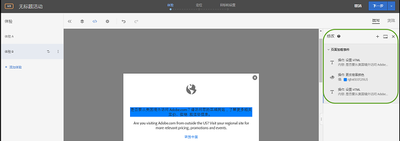

在使用 VEC 对内容交付方式进行配置时，可使用“修改”页面来对 Target 所选的选择器进行细微更改。您可以更改内容，也可以更改 HTML 属性。您还可以编辑代码以在 mbox 中创建 HTML 选件的等效内容。

使用“修改”页面可执行以下操作：

* 查看在可视化编辑器中执行的操作。

   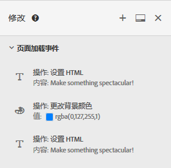

* 编辑现有的操作。将鼠标悬停在所需的修改上，然后单击&#x200B;**[!UICONTROL 修改]图标。**

   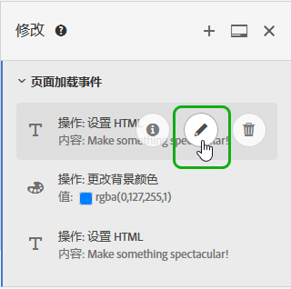

   进行更改。

   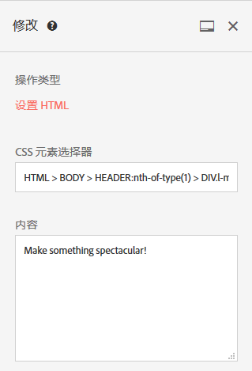

* 删除现有的操作。将鼠标悬停在所需的修改上，然后单击&#x200B;**[!UICONTROL 删除]图标。**

   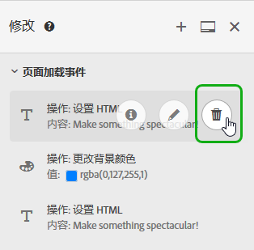

* 添加新修改。单击&#x200B;**[!UICONTROL 添加修改]或“+”图标，然后按照以下所述指定更改。**

   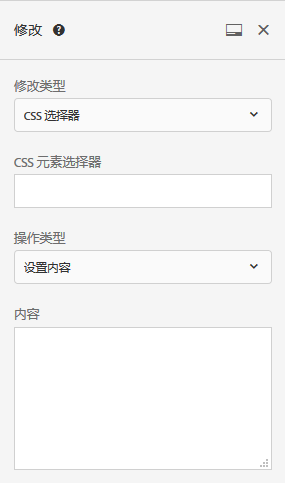

   请注意，创建一个修改后，Target 会在“修改”面板顶部显示一个“+”图标，而不是在面板底部显示“添加修改”按钮。

* 将“修改”面板垂直停放在 Target UI 侧面或水平停放在底部。单击[!UICONTROL 停放]图标可在两种设置之间切换。

   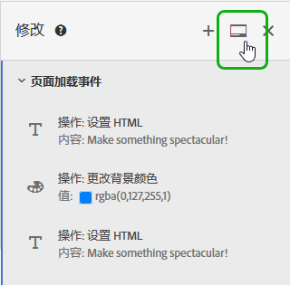

   下图显示了停放在屏幕底部的“修改”面板：

   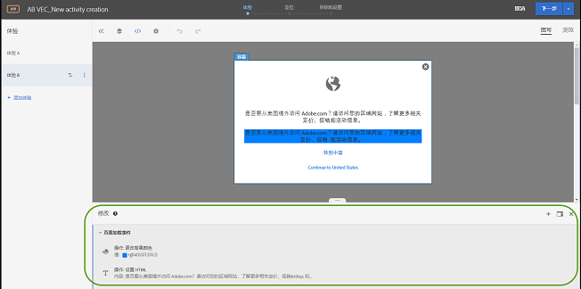

## 添加修改 {#section_C7ABCD5731A048CB8F90EDC31A32EDF9}

1. 要显示所选体验的[!UICONTROL 修改]页面，请在 VEC 中单击&#x200B;**[!UICONTROL 修改]** &lt;/&gt; 图标。

   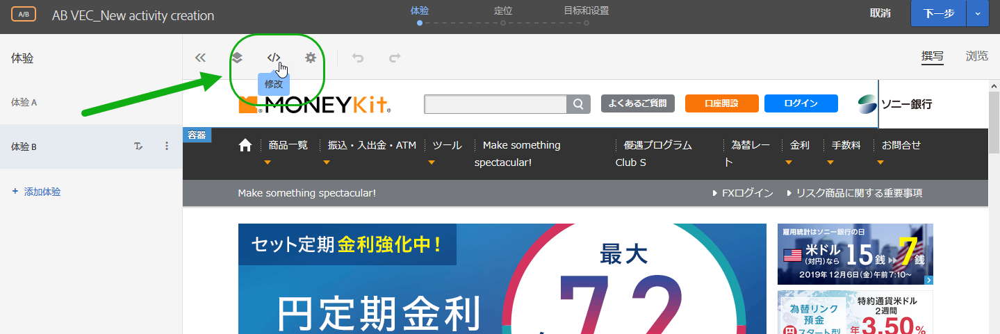

   >[!NOTE]
   >
   >要在基于表单的体验编辑器中打开“修改”面板，请创建或编辑 HTML 选件。有关更多信息，请参阅[基于表单的体验编辑器](../../../c-experiences/form-experience-composer.md#task_FAC842A6535045B68B4C1AD3E657E56E)。

   此时会打开“[!UICONTROL 修改]”页面，该页面将屏幕分为两部分，左侧为可视化模式，右侧为“修改”面板。单击[!UICONTROL 停放]图标，将“修改”面板垂直停放在 Target UI 侧面或水平停放在底部。请注意，以下图示中的体验 A 先前未进行任何修改。

   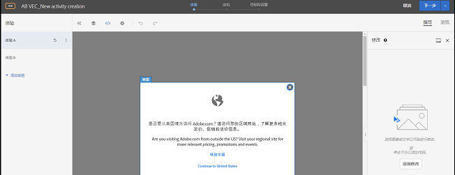

   在右侧的“[!UICONTROL 修改]”面板中，体验 B 显示了先前进行的修改。

   

1. 要添加修改，请执行以下操作：

   * 如果先前未对体验进行任何修改，请单击右侧“[!UICONTROL **修改]”面板底部的**[!UICONTROL 添加修改]按钮。
   * 如果先前已对体检进行了修改，请单击右侧“[!UICONTROL 修改]”面板顶部的“+”图标。
   “修改”面板将显示：

   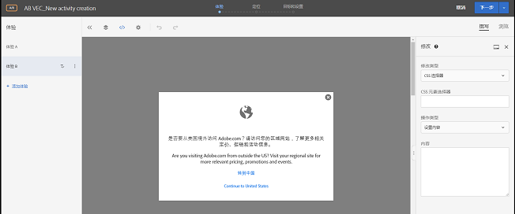

1. 从&#x200B;**[!UICONTROL 修改类型]下拉列表中，选择所需类型：**

   | 修改类型 | 详细信息 |
   |--- |--- |
   | CSS 选择器 | 在“CSS 元素选择器”框中，指定要修改的所需 CSS 元素，选择操作类型（设置内容或设置属性），然后填写所需信息和所需内容。 |
   | Mbox | 指定 Mbox 名称和所需内容。 |
   | 自定义代码 | 指定可选名称，根据需要选中或取消选中[!UICONTROL 在 `<HEAD>` 部分中添加代码]复选框，然后添加自定义代码。<br>如果选中[!UICONTROL 在 `<HEAD>` 部分中添加代码]，则会将自定义代码添加到 `<head>` 部分，并且不会等待主体或页面加载事件完成后才执行该代码。只添加 `<script>` 和 `<style>` 元素。添加 `<div>` 标记和其他元素可能会导致其余的 `<head>` 元素出现在 `<body>` 中。如果您使用的是 mbox.js 版本 60 或更高版本或者 at.js 的任何版本，则所有选件都将进行异步交付。<br>如果取消选中[!UICONTROL 在 `<HEAD>` 部分中添加代码]，则自定义代码会在 `<body>` 标记之后立即执行。有代码将封装在一个 `<div>` 中以保留 DOM 结构。如果您使用的是 mbox.js 版本 60 或更高版本或者 at.js 的任何版本，则所有选件都将进行异步交付。<br>**注意**：脚本是异步运行的。这意味着您不能使用 `document.write` 或类似的脚本方法。<br>自定义代码提供了一个非可视化界面，用于在 VEC、基于表单的体验编辑器和 HTML 选件编辑器中，查看、编辑和添加新操作。该面板提供了体验的代码视图，用于帮助您构建更复杂的体验，微调现有的体验，以及对问题进行故障诊断。<br>自定义代码适用于熟悉 HTML、JavaScript 和 CSS 的高级用户。代码视图可以帮助您调整或微调更改，或修复选择器问题。您也可以使用它来添加新的自定义代码和操作。您可以添加多个自定义代码，并为每个自定义代码提供可选名称。<br>**注意**：自定义代码目前仅适用于 A/B 和体验定位 (XT) 活动。如果应用了重定向选件，自定义代码将无法用于叠加。<br>自定义代码支持以下用例：<ul><li>添加要在页面顶部执行的自定义 JavaScript、HTML 或 CSS</li><li>查看或编辑修改后由 VEC 生成的代码</li><li>为选择器设置 HTML 内容（仅限 CSS 选择器）</li><li>在 HTML 元素上设置一个属性</li><li>添加要在区域 mbox 中交付的选件内容</li><li>使用 jQuery 在 DOM-ready 时进行交换</li><li>不使用 jQuery 在 DOM-ready 时进行交换（不支持 Internet Explorer 8）</li><li>通过“elementOnLoad”插件与 DOM 轮询进行交换</li><li>自定义重定向</li></ul>自定义代码可提供：<ul><li>行号以实现更好的可用性。</li><li>语法高亮显示以帮助避免 HTML 选件出现语法错误。</li><li>创建多个自定义代码并为每个自定义代码提供可选名称的功能。创建多个自定义代码可为将来进行调试提供便利。例如，您可以使用描述性名称为每个修改创建单独的自定义代码，而不是创建单个自定义代码来完成多个修改。拥有单独的自定义代码可使修改更加模块化且更易于管理。请注意，无法保证活动中的多个自定义代码按照创建这些代码的顺序执行。</li></ul>“修改”面板将屏幕分为可视化模式和代码模式。两种模式保持同步。以可视化方式进行的每一个修改都在代码视图中具有与之对应的一行代码。同样，在代码视图中进行的每一个更改也会显示在可视化体验中。单击代码视图中的任何一行，即可在可视化页面上选中与之对应的元素。<br>自定义代码支持 HTML、脚本和样式。可以添加或编辑任何有效的 HTML 代码或脚本。 |

1. 根据需要添加其他修改。

## 自定义代码用例 {#section_26CB3360097D400FB02E20AE5FDBA352}

**[!UICONTROL 自定义代码]面板包含在页面加载开始时执行的代码。**

您可以执行 `<head>` 标记中的 JavaScript 代码。代码不会等待 `<body>` 标记出现在 DOM 中才开始执行。

适用于后续可视化操作的选择器取决于此选项卡中添加的 HTML 元素。

“自定义代码”面板通常用于将 JavaScript 或 CSS 添加到页面的顶部。


使用&#x200B;**[!UICONTROL 自定义代码]选项卡可执行以下操作：**

* 使用内联 JavaScript，或链接到外部 JavaScript 文件

   例如，要更改元素的颜色：

   ```
   <script type="text/javascript"> 
   document.getElementById("element_id").style.color = "blue"; 
   </script> 
   ```

* 配置内联样式，或链接到外部样式表

   例如，要为叠加元素定义一个类：

   ```
   <style> 
   .overlay 
   { position: absolute; top:0; left: 0; right: 0; bottom: 0; background: red; } 
   </style> 
   ```

* 添加 HTML 代码片段来定义新元素

   例如，通过以下 HTML 代码片段，使用上面定义的 CSS 类创建一个叠加 `<div>`：

   ```
   <div class="overlay"></div>
   ```

* 使用 jQuery 在 DOM-ready 时进行交换

   ```
   <style>#default_content {visibility:hidden;}</style> 
   <script> 
   jQuery( document ).ready(function() { 
       jQuery("#default_content").html( "<span style='color:red'>Hello <strong>Again</strong></span>" ); 
       jQuery("#default_content").css("visibility","visible"); 
   }); 
   </script> 
   ```

* 不使用 jQuery 在 DOM-ready 时进行交换（不支持 Internet Explorer 8）

   ```
   <style>#default_content {visibility:hidden;}</style> 
   <script> 
   document.addEventListener("DOMContentLoaded", function(event) {  
       document.getElementById("default_content").innerHTML = "<span style='color:red'>Hello <strong>Again</strong></span>"; 
       document.getElementById("default_content").style.visibility="visible"; 
   }); 
   </script> 
   ```

* 通过 `elementOnLoad` 插件与 DOM 轮询进行交换

   这样做的好处是此交换会在 DOM-ready 之前进行。该插件处理预先隐藏和显示，并且需要元素上的 id。

   ```
   <style>#default_content {visibility:hidden;}</style> 
   <script> 
   /*elementOnLoad DOM Swizzling v3 ==>Mbox.js Extra Javascript*/window.elementOnLoad=function(e,l){var m=document.getElementById(e);if(m){setTimeout(function(){l(m);setTimeout(function(){m.style.visibility='visible';m.style.display='block'},20)},20)}else{setTimeout(function(){elementOnLoad(e,l)},20)}},addEvent=function(a){var d=document,w=window,wa=w.addEventListener,da=d.addEventListener,e='load',o='on'+e;if(wa){wa(e,a,false)}else if(da){da(e,a,false)}else if(d.attachEvent){w.attachEvent(o,a)}};addEvent(function(){setTimeout("elementOnLoad=function(){}",500)}); 
   elementOnLoad('default_content',function(e){ 
       e.innerHTML = "<span style='color:red'>Hello <strong>Again</strong></span>"; 
   }); 
   </script> 
   ```

* 自定义重定向传递现有参数、`s_tnt` 参数（用于旧版集成到 Analytics）、反向链接参数和 mbox 会话

   ```
   <style type="text/css">body{display:none!important;}</style> 
   <script type="text/javascript"> 
    var qs='';window.location.search?qs=window.location.search+'&':qs='?'; 
    window.location.replace('//www.mywebsite.com/'+qs+'s_tnt=${campaign.id}:${campaign.recipe.id}:${campaign.recipe.trafficType}&s_tntref='+encodeURIComponent(document.referrer)+'&mboxSession='+mboxFactoryDefault.getSessionId().getId()+''+window.location.hash+''); 
   </script> 
   ```

* 添加 Adobe Target 体验模板，以在自定义代码中使用。Target 体验模板是具有可配置输入的预编码示例，用于执行常见的营销人员用例。这些体验模板将作为执行常见用例的起始点，通过 VEC 或基于表单的体验编辑器免费提供给开发人员和营销人员。用例包括灯箱、轮播、倒计时等等。

   有关更多信息，请参阅[体验模板](../../../c-experiences/c-visual-experience-composer/c-vec-code-editor/experience-templates.md#concept_109BBD7EABC04DD39E6B7B1687786652)。

## 自定义代码最佳实践 {#section_10DFFD9FB92A43C1BB444A45E0272B28}

**始终将自定义代码包装在一个元素中。**

例如：

```
<div id="custom-code"> 
// My Code goes here 
</div>
```

如果需要进行任何修改，在此容器内更改即可。

如果您不再需要该自定义代码，则只需将此容器保留为空，而不需要将其移除。这可确保其他体验修改不受影响。

**请勿将元素 ID“CDQID”用于代码编辑器中对页面所做的修改。**

Target 将值为“CDQID”的新元素 ID 应用于由 Target 修改的页面上的任何元素。由于 Target 已应用此 ID，因此不应使用该 ID 在代码编辑器中进行任何进一步修改或调整。

**请勿在自定义代码脚本中执行 document.write 操作。**

脚本是异步执行的。这通常会导致 `document.write` 操作显示在页面上错误的位置。不建议在自定义代码内创建的脚本中使用 `document.write`。

**如果您创建了一个元素并对其进行了修改，请不要删除原始元素。**

每次更改都会在“修改”面板中创建一个新元素。由于第二个操作修改了元素 1，因此如果删除元素 1，则该操作将没有任何可修改的内容，从而导致该更改不再有效。有关更多信息，请参见下面的“故障诊断”。

**如果您将自定义代码功能用于两个定位到相同 URL 的活动，请务必小心。**

如果您将自定义代码功能用于两个定位到相同 URL 的活动，则 JavaScript 将会注入到这两个活动的页面中。Target 会自动确定交付内容的顺序。请确保代码不依赖于位置。您需要确保代码中没有冲突。

## 对自定义代码自定义代码故障诊断 {#section_6C965CBC31C348D7AA5B57B63DAB9E7F}

**我收到一个警告，指出由于页面中的结构变化，无法应用某个操作。这是什么意思？**

此消息表示，自上次保存活动以后，您的页面结构已发生更改。

可以使用“浏览”模式找到缺少的选择器。我们建议您按照警告消息中的指示，删除每个体验然后重新创建，以确保您的内容如预期般显示。


***当我删除一个元素时，我看到一条警告显示“删除此操作可能影响后续的操作”。这是什么意思？***

例如，如果您执行了 2 项操作：

* 将一个类添加到 Element 1
* 为 Element 1 编辑 HTML

每次更改都会在“修改”面板中创建一个新元素。因为第 2 个操作修改了 Element 1，如果删除 Element 1，则第 2 个操作将没有任何可修改的内容，因此更改不再有效。

换言之，如果您添加一个带有文本的元素，然后在单独的操作中使用不同的文本对该元素进行编辑，则“修改”面板会将这两个操作显示为不同的元素。在编辑元素时，您创建了一个新元素，该元素修改了之前创建的原始元素，在其中包含已编辑的文本。如果删除了原始元素，则编辑后的文本将无法找到被编辑的元素，而且也不会显示出来。第二个元素会保留在元素列表中，但不会对页面产生影响，因为它所更改的元素不再存在。

***我在脚本中使用`document.write`创建的一个元素没有出现在我预期的位置。***

脚本是异步执行的。这通常会导致 `document.write` 操作显示在页面上错误的位置。Adobe 不建议在自定义代码内创建的脚本中使用 `document.write`。

***我的 JavaScript 在自定义代码中显示错误。***

任何不是有效 JavaScript 的内联 JavaScript 都会在自定义代码中显示错误。

***我无法撤消自定义代码中的更改。***

当前不支持撤消“修改”面板和自定义代码中的编辑和删除操作。撤消其中一个操作可能会导致 VEC 中的体验与自定义代码中显示的实际操作不一致。但是，如果自定义代码中的操作处于正确的状态，则不会影响交付。这是一个用户界面问题。要刷新体验，请保存该体验并重新打开它，或者继续到下一步后再返回。这两种操作都可以重新加载体验，以使体验按预期显示，并与“修改”面板中的操作一致。

**自定义代码无法在 Internet Explorer 8 中生成预期结果。**

Target 不再支持 IE8。
