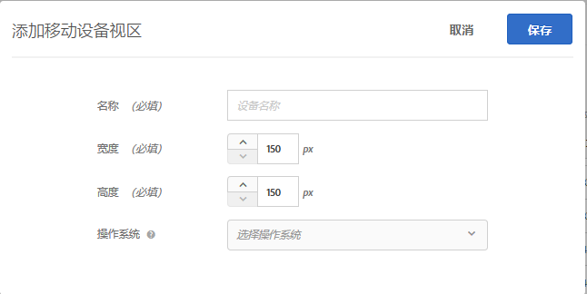
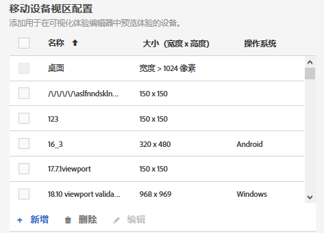
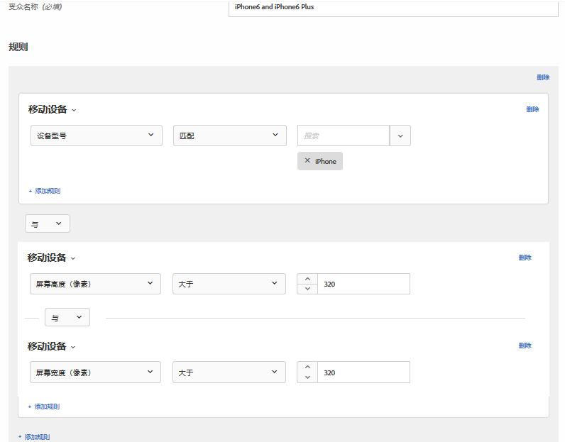

# 适用于响应式体验的移动设备视区{#mobile-viewports-for-responsive-experiences}

移动设备视区可帮助您预览活动在各种大小的屏幕上的显示效果。

移动设备视区预览功能是专为响应式网站设计的。如果您的网站是响应式网站，而且桌面页面与移动设备页面中使用的元素相同，只是配置不同，则可以使用移动设备视区。如果您具有一个结构不同的独立移动设备网站（例如 [!DNL m.mysite.com]），则可以使用[多页面活动](../../c-experiences/c-visual-experience-composer/multipage-activity.md#concept_277E096063E14813AC5D8EDFA1D2ED48)。

>[!NOTE]
>
>如果与重定向选件叠加发生了重叠，则移动设备视区将不可用。

视区通过网页在屏幕上所填充的矩形大小来定义。视区是指浏览器窗口减去滚动条和工具栏后的大小。浏览器使用“CSS 像素”。很多设备（例如使用 Retina 显示屏的设备）的视区小于其宣称的设备分辨率。

下面是一些常用设备的视区和分辨率。请切记在 Target 中使用视区大小。

| 设备 | 视区大小 | 设备分辨率 |
|---|---|---|
| iPhone X | 375 宽 x 812 高 | 1125 宽 x 2436 高 |
| iPhone 8 Plus | 414 宽 x 736 高 | 1080 宽 x 1920 高 |
| iPhone8 | 375 宽 x 667 高 | 750 宽 x 1334 高 |
| iPhone 7 Plus | 414 宽 x 736 高 | 1080 宽 x 1920 高 |
| iPhone7 | 375 宽 x 667 高 | 750 宽 x 1334 高 |
| iPhone6 | 375 宽 x 667 高 | 750 宽 x 1334 高 |
| iPhone6s | 414 宽 x 736 高 | 1080 宽 x 1920 高 |
| iPad Pro | 1024 宽 x 1366 高 | 2048 宽 x 2732 高 |
| iPad 第三代和第四代 | 768 宽 x 1024 高 | 1536 宽 x 2048 高 |
| iPad Air 1 和 2 | 768 宽 x 1024 高 | 1536 宽 x 2048 高 |
| iPad Mini | 768 宽 x 1024 高 | 768 宽 x 1024 高 |
| iPad Mini 2 和 3 | 768 宽 x 1024 高 | 1536 宽 x 2048 高 |
| Nexus 6P | 411 宽 x 731 高 | 1440 宽 x 2560 高 |
| Nexus 5X | 411 宽 x 731 高 | 1080 宽 x 1920 高 |
| Google Pixel | 411 宽 x 731 高 | 1080 宽 x 1920 高 |
| Google Pixel XL | 411 宽 x 731 高 | 1440 宽 x 2560 高 |
| Google Pixel 2 | 411 宽 x 731 高 | 1080 宽 x 1920 高 |
| Google Pixel 2 XL | 411 宽 x 731 高 | 1440 宽 x 2560 高 |
| Samsung Galaxy Note 5 | 480 宽 x 853 高 | 1440 宽 x 2560 高 |
| LG G5 | 480 宽 x 853 高 | 1440 宽 x 2560 高 |
| One Plus 3 | 480 宽 x 853 高 | 1080 宽 x 1920 高 |
| Samsung Galaxy S9 | 360 宽 x 740 高 | 1440 宽 x 2960 高 |
| Samsung Galaxy S9+ | 360 宽 x 740 高 | 1440 宽 x 2960 高 |
| Samsung Galaxy S8 | 360 宽 x 740 高 | 1440 宽 x 2960 高 |
| Samsung Galaxy S8+ | 360 宽 x 740 高 | 1440 宽 x 2960 高 |
| Samsung Galaxy S7 | 360 宽 x 640 高 | 1440 宽 x 2560 高 |
| Samsung Galaxy S7 Edge | 360 宽 x 640 高 | 1440 宽 x 2560 高 |
| Nexus 7 (2013) | 600 宽 x 960 高 | 1200 宽 x 1920 高 |
| Nexus 9 | 768 宽 x 1024 高 | 1536 宽 x 2048 高 |
| Samsung Galaxy Tab 10 | 800 宽 x 1280 高 | 800 宽 x 1280 高 |
| Chromebook Pixel | 1280 宽 x 850 高 | 2560 宽 x 1700 高 |

多个网站列出了常用设备的视区大小。例如，请参 [阅https://viewportsizer.com/devices/](https://viewportsizer.com/devices/) ，或查阅设备制造商的网站。

如果您想要将活动交付到某一特定设备上的用户，请在活动图中选择适合该设备的受众。使用移动设备 Web 编辑器可在该设备上编辑活动页面。如果您想要在整个数字体验中运行某个活动，并确保该活动在所有设备上都展现良好的外观，请不要应用定位，而是使用移动设备视区按各种屏幕大小预览该活动。

如果您有一个响应式网站，您的网站通常会设计为当使用具有特定屏幕大小的设备访问时以不同的视图打开。这些可触发新视图的屏幕大小称为“CSS 断点”**。将 CSS 断点保存到 Target 后，您便能够在定义的每个视图中预览体验。在 Target 界面中，每个体验都会显示在一个移动设备视区中。单击显示屏顶部的相应视区，即可打开每个屏幕大小所对应的视图。

如果您的网站不是响应式网站，您仍然可以使用移动设备 Web 编辑器查看网站，但前提是您的活动已定位到某个特定设备。

>[!NOTE]
>
>您可以在移动设备视区中编辑体验，但您所做的更改会应用到所有视区和设备，而不仅仅是应用到您正在使用的视区。同样，在常规桌面视图中编辑体验时，所有屏幕大小的页面均会发生相应的更改，而不仅仅是桌面视图中的页面。当前，我们尚不支持进行特定于视区的页面更改。

## 移动设备视区配置 {#task_B4B161499DC0470584ED922A4D20FCAB}

可配置您希望在创建体验时可供使用的任何移动设备视区。

1. 单击&#x200B;**[!UICONTROL 设置]**>**[!UICONTROL &#x200B;首选项]**。
1. 在“帐户首选项”页面的“移动设备视区配置”部分中，单击&#x200B;**[!UICONTROL 新增]**，以添加移动设备视区。

   要更改现有移动设备视区的配置，请选择该视区，然后单击“编辑”（铅笔）图标。

   

1. 键入移动设备视区的名称。

   为移动设备视区键入一个便于识别的描述性名称。名称最长可包含 36 个字符。
1. 输入移动设备的屏幕大小，包括宽度和高度。

   宽度可以介于 150 到 968 像素之间。高度可以介于 150 到 1280 像素之间。

   >[!NOTE]

1. （可选）选择设备的操作系统。

   选项：

   * Android
   * iOS
   * Windows
   * Symbian
   * Blackberry
   如果您使用[增强型体验编辑器](../../c-experiences/experiences.md#section_34265986611B4AB8A0E4D6ACC25EF91D)，并选择了一种操作系统，则 Target 会在您查看页面时模拟该设备。例如，如果您的响应式网站在 Android 和 iOS 中具有不同的外观，则 Target 会模拟这一行为。
1. 单击&#x200B;**[!UICONTROL 保存]**。

## 创建响应式体验 {#task_D6332438B5EE48CCA8AF199270F1CAEF}

可向 Target 活动中添加移动设备视区，以便创建要在移动设备屏幕上显示的响应式体验。

1. 创建一个活动。
1. 在可视化体验编辑器中，单击&#x200B;**[!UICONTROL 设置]**齿轮图标，然后选择**[!UICONTROL &#x200B;添加移动设备视区]**。
1. 单击&#x200B;**[!UICONTROL 设备]**图标，然后启用每个应具有移动设备视区的设备。

   

   移动设备视区将按宽度以从小到大的顺序排列。
1. 根据需要编辑移动设备视区。

   对体验做出的任何更改（例如，如果您更改了标题中的文本）会应用到所有设备上的体验。

   将鼠标悬停在视区名称上，以查看视区大小。
1. 如有需要，可通过单击方向图标，在纵向模式和横向模式之间进行切换。

   * 纵向：
   * 横向：

## 用例：定位两个 iPhone 版本 {#task_CC3144BF5BA54034996E1D3DB0BC1A35}

此用例展示了如何使用 Target Standard 的移动设备视区功能配置 2 个 iPhone 版本（iPhone 6 和 iPhone 6 Plus）的体验。

1. 在 Target Standard 中，单击&#x200B;**[!UICONTROL 设置]**>**[!UICONTROL &#x200B;首选项]**。
1. 在“首选项”页面的“移动设备视区配置”部分中，创建 iPhone 6 和 iPhone 6 Plus 的移动设备视区。

   对每个视区使用以下设置：

   | 名称 | 宽度 | 高度 | 操作系统 |
   |---|---|---|---|
   | iPhone6 | 375 | 667 | iOS |
   | iPhone 6 Plus | 414 | 736 | iOS |

   

1. 创建一个包含要定位的体验的活动。
1. 选择要将其定位到以下访客的体验：通过 iPhone 6 或 iPhone 6 Plus 访问网站的访客。
1. 选择目标后，单击&#x200B;**[!UICONTROL 创建受众]**，然后配置受众（如下图所示）：

   

   由于手机可以旋转为横向，如果要求高度和宽度同时大于 320，则结合 iPhone 设备机型考虑，只有 iPhone 6 和 iPhone 6 Plus 能够满足此条件。
1. 单击&#x200B;**[!UICONTROL 保存]**。
1. 按常规方式继续设置活动。

## 培训视频

以下视频包含有关本文中所讨论概念的详细信息。

### 可视化体验编辑器（第 2 个，共 2 个）(7:29)

以下演示视频包含有关通过可视化体验编辑器使用移动设备视区的信息：

* 重命名和复制体验
* 创建重定向体验
* 将活动定位到单个 URL 或一组 URL
* 创建多页面活动
* 预览和构建响应式网站的体验
* 使用叠加高亮显示元素类型

>[!VIDEO](https://video.tv.adobe.com/v/17401)

### Adobe Target 中的帐户首选项

以下视频包含有关如何在帐户首选项中设置移动设备视区的信息，相关介绍开始于视频的 4:40。

>[!VIDEO](https://video.tv.adobe.com/v/17379)