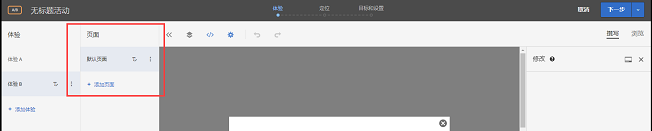

# 多页面活动{#multipage-activity}

多页面活动可使您跨多个页面创建一个故事，并且每个页面都有一个特定的设计。

例如，您可能需要测试一个购买量超过一定数量后免运费的选件。您可能希望该选件显示在登陆页面、类别页面和某些产品页面上，但是对于每种类型的页面，您还希望以不同的大小、在不同的位置显示。您可以在主页上显示一个明显的选件，然后在其他相关页面上通过一些较小的选件来加强该选件。

您还可以使用多页面活动来为桌面和非响应式移动设备网站定义不同的布局。如果网站具有独立的移动设备网站，例如 [!DNL m.mysite.com]，而不是 [!DNL `www.mysite.com`]，则应该创建一个[多页面活动](../../c-experiences/c-visual-experience-composer/multipage-activity.md#concept_277E096063E14813AC5D8EDFA1D2ED48)，并将 [!DNL m.mysite.com] 添加为独立的页面，然后应用移动编辑，以便对同一体验的桌面版和移动设备版做出适当的更改。对于响应式移动设备网站，应使用[移动体验编辑](../../c-experiences/c-visual-experience-composer/mobile-viewports.md#concept_8E45527C4ABC41D59AA3553BEDC76FA5)。

>[!NOTE]
>
>当同一选件在多个页面上具有不同的外观时，需要设计多页面活动。如果同一选件在所有页面上具有相同的外观，则使用[测试模板](../../c-experiences/c-visual-experience-composer/temtest.md#task_2539D51A18044F82B0D9895636546781)更为有效。

在多页面测试中，您可以为每个页面指定模板规则。例如，在多页面测试中，您可以向类别页面应用模板规则，从而在主页和所有类别页面上运行多页面测试。请参阅[在相似页面上包含相同体验](../../c-experiences/c-visual-experience-composer/temtest.md#task_2539D51A18044F82B0D9895636546781)。

要将页面添加到测试，请执行以下操作：

1. 单击&#x200B;**[!UICONTROL 配置]**&#x200B;齿轮图标。
1. 单击&#x200B;**[!UICONTROL 添加其他页面]**。

   屏幕左侧会显示一个导航栏。

   

1. 使用该导航栏指定页面并设置默认页面。

   单击&#x200B;**[!UICONTROL 添加页面]**&#x200B;可添加其他页面。

   单击三个垂直省略号图标可显示“操作”菜单：

   

   可使用此菜单重命名页面、在多页面活动中执行重定向测试，或删除页面。

1. 使用可视化体验编辑器设计选件在各个页面上的外观。

