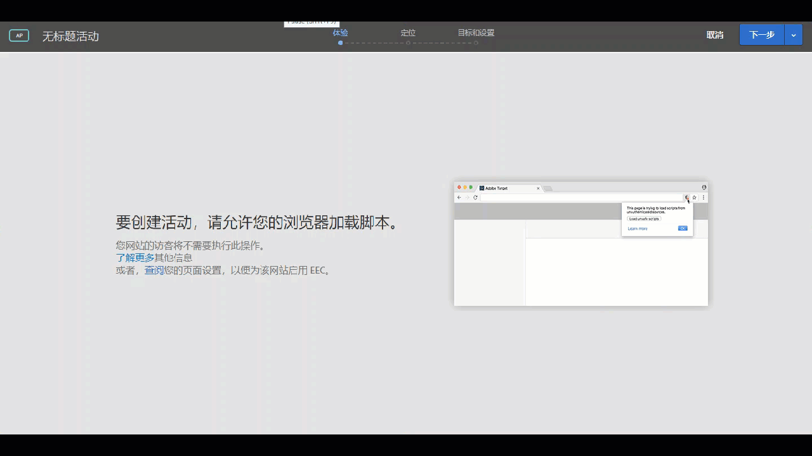

# 在浏览器中启用混合内容{#enabling-mixed-content-in-your-browser}

如果安全内容与不安全内容混合在一起，某些浏览器可能会阻止页面显示。

## 在浏览器中启用混合内容 {#concept_46D022D50280468C9EF6D5DF6EFC911C}

如果安全内容与不安全内容混合在一起，某些浏览器可能会阻止页面显示。

如果可视化体验编辑器 (VEC) 尝试打开包含混合（安全和不安全）内容的页面，系统会显示一条消息，告知您如何禁用浏览器中的阻止功能，以便打开 HTTP 网站或包含混合调用（HTTPS 和 HTTP）的网站。

以前，虽然不允许使用混合内容，但是您在创建活动时仍然能够执行三步引导式工作流的步骤 1 中的某些操作。现在，Target 会阻止执行步骤 1 中的操作。显示此消息时，您必须先启用混合内容，然后才能继续操作。

浏览器的安全设置可能会阻止将混合内容或不安全 (HTTP) 内容加载到安全 (HTTPS) 页面或框架（例如 VEC）。如果您不希望禁用浏览器的安全设置，则需要使用 HTTPS 网站。

如果您的网站在不安全的域（即 HTTP 域）上运行，您需要允许 VEC 加载活跃的混合内容。

>[!NOTE]
>
>允许混合内容仅会对 VEC 造成影响，而不会影响您已上线的网站。

有关更多信息，请参阅“Mozilla 开发人员网络”**(MDN) 网站上的[混合内容](https://developer.mozilla.org/en-US/docs/Web/Security/Mixed_content)。

## 在 Firefox 中启用混合内容 {#task_5448763B8DC941FD80F84041AEF0A14D}

默认情况下，Firefox 会阻止包含混合（安全和不安全）内容的页面。建议您永久更改此设置以便使用 [!DNL Target]。

<!-- 

target/t_mixed_content_firefox.xml

 -->

1. 在 Firefox 的地址栏中输入 `about:config`。
1. 确认 Firefox 显示的警告消息。
1. 在搜索栏中，键入 `block_active`。
1. 双击 ` **[!UICONTROL security.mixed_content.block_active_content]**`。

   其值随即会从“True”更改为“False”。当值显示为“False”时，即表示操作已完成。建议您在更改此设置后重新启动计算机。

## 在 Internet Explorer 中启用混合内容 {#task_59E7D13C04DF486C92CD78D0C63DDDE8}

默认情况下，Internet Explorer 会阻止包含混合（安全和不安全）内容的页面。建议您永久更改此设置以便使用 Target Standard。

<!-- 

target/t_mixed_content_ie.xml

 -->

1. 在 Internet Explorer 中，单击“设置”图标，然后单击 **[!UICONTROL Internet 选项]**。
1. 打开“[!UICONTROL 安全]”选项卡。
1. 选择 **[!UICONTROL Internet]**，然后单击&#x200B;**[!UICONTROL 自定义级别]**。
1. 选择&#x200B;**[!UICONTROL 其他]**。
1. 在[!UICONTROL 其他]下方，启用&#x200B;**[!UICONTROL 显示混合内容]**。
1. 单击&#x200B;**[!UICONTROL 确定]** &gt; **[!UICONTROL 是]** &gt; **[!UICONTROL 应用]**。

建议您在更改此设置后重新启动计算机。

## 在 Chrome 中启用混合内容 {#task_FF297A08F66E47A588C14FD67C037B3A}

如果您通过安全连接访问网站，Google Chrome 会验证网页上的内容是否已安全传输。

<!-- 

target/t_mixed_content_chrome.xml

 -->

请参阅 Google Chrome 帮助中的[此页面包含不安全的内容](https://support.google.com/chrome/answer/1342714?hl=en)。
