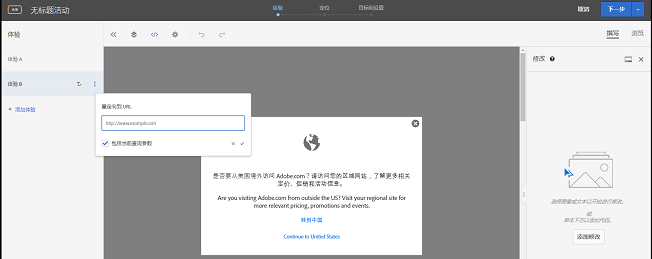

# 重定向到 URL{#redirect-to-a-url}

当您想要将访客发送到不同的页面，而不是在相同页面上显示内容时，请使用此选项。

您可能有两个完全不同的页面来进行测试，而非只更改页面中的部分内容。在此示例中，您的 A/B 测试要比较页面 A 与页面 B。为此，需设置一个包含两个体验的 A/B 测试营销活动：其中一个体验指向默认的页面 A，而另一个体验则重定向到页面 B。在“体验操作”菜单中（可通过单击体验所对应的字母标签找到此菜单），选择&#x200B;**[!UICONTROL 重定向到 URL]**，并指定页面 B 的 URL。该选件会配置为将访客重定向到其他页面。

重定向选件执行 JavaScript 代码以重定向浏览器。由于该选件使用了 `window.location.replace();` 方法，因此从中对访客进行重定向的页面不会存储到浏览器历史记录中。这允许访客仍然使用浏览器中的返回键。

重定向选件具有以下几项限制：

* 对于使用了 A4T 的活动中所包含的重定向选件，您的实施必须满足某些最低要求。除此之外，还有一些重要信息需要您知悉。有关更多信息，请参阅[重定向选件 - A4T 常见问题解答](../../c-integrating-target-with-mac/a4t/r-a4t-faq/a4t-faq-redirect-offers.md#concept_21BF213F10E1414A9DCD4A98AF207905)。
* 使用基于表单的体验编辑器时，不应在页面所包含的 mbox 中使用重定向选件。只应该从 HTML `<head>` 所包含的脚本标记中使用重定向选件。您应该始终使用自动创建的全局 mbox 并为该全局 mbox 设置重定向选件。

>[!NOTE]
>
>如果您希望传递登陆页的引荐链接值，建议您使用 HTML 选件，而不是重定向选件。

要创建重定向选件，请执行以下操作：

1. 创建一个体验。
1. 将鼠标悬停在创建的体验上，然后单击“重定向到 URL”图标 ()。

   

1. 键入 URL。
1. 如有需要，选择用于包括当前查询参数的选项。

   如果选中此选项，则访客 URL 中位于 ? 后面的所有内容都将在进行重定向时被附加到重定向 URL 中。

   默认情况下，此选项处于选中状态。
1. （可选）创建其他规则。

   其他规则可以基于以下任何一项：

   * URL
   * 域
   * 路径
   * 话题标签 (#) 片段
   * 查询
   * mbox 参数
   可以使用 AND 或 OR 将其他规则连接到活动 URL。您添加的所有规则将使用 AND 进行相互评估。
