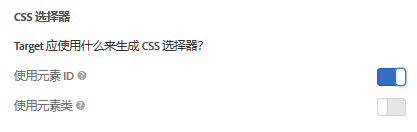

# 可视化体验编辑器中使用的元素选择器

元素选择器是可以标识一个或多个元素的 CSS 表达式。

您可以在 Mozilla 开发人员网络 (MDN) 上的[选择器](https://developer.mozilla.org/en-US/docs/Web/Guide/CSS/Getting_started/Selectors)文档中找到与 CSS 选择器有关的基本信息。

您可以设置要在帐户首选项中使用元素类还是元素 ID。单击&#x200B;**[!UICONTROL “管理”>“可视体验书写器”]**，然后选择首选CSS选择器。



>[!NOTE]
>
>元素类可以在 A/B 测试、自动个性化以及多变量测试活动中用作选择器。

有关何时使用 CSS 选择器以及何时使用唯一 ID 的信息，请参阅[可视化体验编辑器最佳实践和限制](/help/c-experiences/c-visual-experience-composer/experience-composer-best-practices.md#concept_E284B3F704C04406B174D9050A2528A6)。

## Adobe [!DNL Target]如何为元素{#section_D89D954BCBFB486CA081BE183776A475}生成选择器

Target 使用简单的算法来创建选择器。下面非常简略地介绍了生成逻辑：

1. 例如，如果某个元素的 ID 为 `id="container"`，则该元素的选择器便为 `#container`。

   例如：

   ```html
   <div class="wrapper">
     <div id="container"> <!-- Selector is computed for this element -->
       <ul class="navigation">
         <li class="item active"> Home </li>
         <li class="item"> Men </li>
         <li class="item"> Women </li>
         <li class="item"> Kids </li>
       </ul>
     </div>
   </div>
   ```

1. 如果某个元素包含类属性，则 Target 会尝试使用该元素上存在的任何类的第一个类。

   Target 会尝试解析该父元素，直到找到 `<HTML>` 元素或具有 ID 的元素。当某个元素包含 ID 且选择器是基于其下级子元素进行计算时，可以使用该元素的 ID 来创建选择器。

   例如：

   ```html
   <div class="wrapper">
     <div id="container"> <!-- id is present here. It contributes to selector -->
       <ul class="navigation">
         <li class="item active"> Home </li> <!-- Selector is computed for this element -->
         <li class="item"> Men </li>
         <li class="item"> Women </li>
         <li class="item"> Kids </li>
       </ul>
     </div>
   </div>
   ```

   在此示例中：

   选择器：`#container` > `ul.navigation:eq(0)` > `li.item:eq(0)`（“>”表示直接子项。)

   `eq` 告知索引存在一个具有“tagName=UL”的元素，且第一个类为 `navigation`。因此，`index` 为 0。有关更多信息，请参阅 MDN 中的[选择器](https://developer.mozilla.org/en-US/docs/Web/Guide/CSS/Getting_started/Selectors)文章。

1. 如果元素不包含类，则 Target 会使用元素的 `tagName` 并向上遍历父元素，直到找到 `<HTML>` 元素或具有 ID 的元素。

   例如：

   ```html
   <div class="wrapper">
     <div id="container"> <!-- id is present here. It contributes to selector -->
       <ul class="navigation">
         <li> Home </li>
         <li> Men </li>
         <li class="active"> Women </li>
         <li> Kids </li><!-- Selector is computed for this element -->
       </ul>
     </div>
   </div>
   ```

   选择器：`#container` > `ul.navigation(0)` > `li:nth-of-type(4)`

   要了解更多信息，请参阅 [CSS Tricks 网页上的 nth-of-type](https://css-tricks.com/almanac/selectors/n/nth-of-type/)。

在上面的流程中：

* 您可以使用任何 CSS 选择器，前提是该选择器可唯一标识 DOM 中的元素。
* 上述方法即是 Target 使用的方法。Target 并不强制使用此方法。只要满足第 1 点中的要求，您便可以添加任何选择器。
* 您可以在选择器中使用任何属性。本文档仅以类名称为例。
