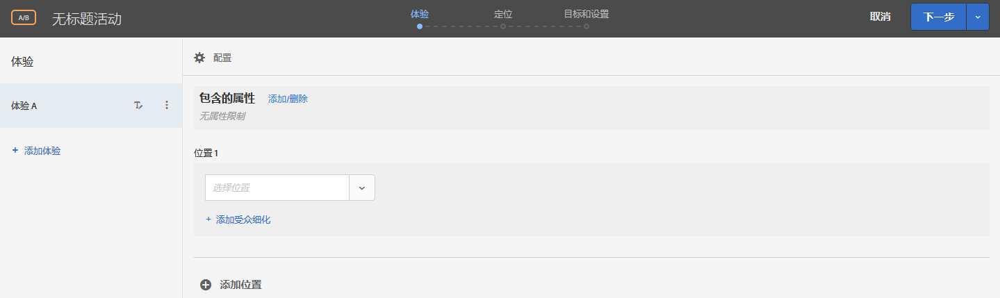
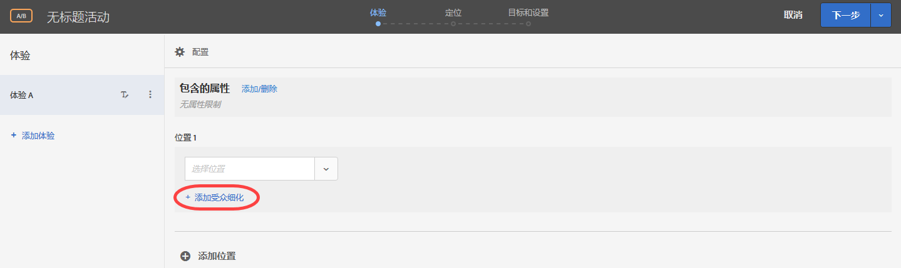
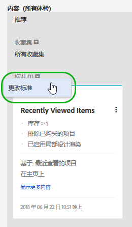
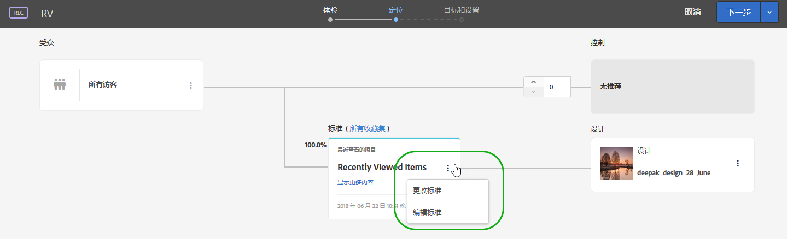

# 基于表单的体验编辑器{#form-based-experience-composer}

基于表单的体验编辑器是一个非可视化体验和选件创建界面，当可视化体验编辑器不可用或不实用时，它有助于创建在 A/B 测试、体验定位、自动个性化和“推荐”活动中使用的体验。例如，您可以使用基于表单的编辑器为电子邮件、网亭和语音助手中的交付创建体验和选件。

如果您创建的是“推荐”活动，则不存在任何体验。需选择您的标准和设计。如果您选择多个标准或设计，则 Target 会自动生成体验。

1. 单击&#x200B;**[!UICONTROL 创建活动]**，然后选择要创建的活动类型。

   基于表单的体验编辑器适用于 A/B 测试活动、体验定位活动、自动个性化活动和“推荐”活动。
1. 从&#x200B;**[!UICONTROL 新建活动]**&#x200B;对话框中选择[!UICONTROL 基于表单的体验编辑器]。

   此时会打开基于表单的体验编辑器。

   

   如果您创建的是“推荐”活动，此屏幕会有所不同。“推荐”活动不包含体验。
1. 命名活动。
1. 选择位置。

   在“选择位置”框中单击时，即会显示一个可用位置列表。从这些位置中选择一个位置。要选择通过 target.js 交付的全局位置，请选择“target-global-mbox”。

   您还可以输入一个未在此处列出的位置。如果尚未在页面上创建或查看 mbox，则可以使用此方法。键入位置的名称。输入尚不存在的位置时务必要仔细。如果位置拼写或大小写与调用 mbox 时使用的拼写和大小写不匹配，则活动将无法交付。手动输入的位置会保存到位置列表中。
1. 单击&#x200B;**[!UICONTROL 添加受众细化]**，然后为此活动选择一个或多个[受众](../c-target/target.md#concept_A782F8481A5041EBA75103CB26376522)。

   

   在基于表单的体验编辑器中，已将“细化”替换为完整受众功能。现有活动的细化功能已迁移到[仅限该活动的受众](../c-target/creating-activity-only-audience.md#concept_A6BADCF530ED4AE1852E677FEBE68483)。
1. 选择要在该位置中显示的内容类型。

   

1. 为选定的内容类型指定内容。

   **更改 HTML 选件：**&#x200B;选择一个 HTML 选件。

   **更改图像选件：**&#x200B;选择 Target 内容库中保存的某个图像。

   您还可以添加指向图像的链接（点进链接、目标链接、登陆链接，等等）。

   1. 单击[!UICONTROL 更改图像选件]。
   1. 选择所需的图像，然后单击[!UICONTROL 编辑链接]。
   1. 指定您网站上的所需 URL 或页面，然后单击[!UICONTROL 更新]。
   **更改 JSON 选件：**&#x200B;选择一个 JSON 选件。

   **更改体验片段：**&#x200B;选择一个体验片段。

   **更改重定向选件：**&#x200B;选择一个重定向选件。

   **更改远程选件：**&#x200B;选择一个远程选件。

   **创建 HTML 选件:**

   1. 单击[!UICONTROL 选件]，然后选择[!UICONTROL 代码选件]选项卡。
   1. 单击[!UICONTROL 创建] > [!UICONTROL HTML 选件]。
   1. 键入选件名称。
   1. 在代码框中键入或粘贴您的 HTML 代码。
   1. 单击[!UICONTROL 保存]。
   **创建 JSON 选件：**

   1. 单击[!UICONTROL 选件]，然后选择[!UICONTROL 代码选件]选项卡。
   1. 单击[!UICONTROL 创建] > [!UICONTROL JSON 选件]。
   1. 键入选件名称。
   1. 在代码框中键入或粘贴您的 JSON 代码。
   1. 单击[!UICONTROL 保存]。
   对于“推荐”活动，“内容”下拉列表中提供了“添加推荐”选项。单击&#x200B;**[!UICONTROL 添加推荐]**，然后选择页面类型。接下来，按照界面中定义的常规步骤[创建“推荐”活动](/help/c-recommendations/t-create-recs-activity/create-recs-activity.md)。

   在基于表单的体验编辑器中选择推荐标准时，现在有一个指向所选标准卡片的直接链接，以便您快速方便地对标准进行编辑。

   

   从 Target 三步引导式工作流的“定位”页面中：

   

1. （可选，适用于 AB 活动、自动个性化和体验定位）要对其他位置重复执行此流程，请单击 `Add Location`，然后配置位置和内容。
1. 单击&#x200B;**[!UICONTROL 继续]**，然后为您选择的活动类型完成常规的活动创建步骤。

* [创建 A/B 测试](../c-activities/t-test-ab/t-test-create-ab/test-create-ab.md#task_68C8079BF9FF4625A3BD6680D554BB72)
* [创建体验定位活动](../c-activities/t-experience-target/t-xt-create/xt-create.md#task_D6B3429AC31549E1A70EDF04B3DDC765)
* [创建“推荐”活动](../c-recommendations/t-create-recs-activity/create-recs-activity.md#task_6874328773C64C44A73F0A130AD3F96F)

## 培训视频：基于表单的编辑器 教 

以下视频演示了基于表单的编辑器。

* 使用基于表单的体验编辑器创建活动
* 了解何时使用基于表单的体验编辑器，何时使用可视化体验编辑器
* 使用细化来定位位置

>[!VIDEO](https://video.tv.adobe.com/v/17390)