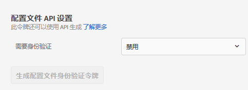
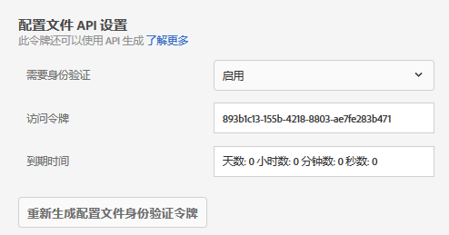

# 配置文件 API 设置{#profile-api-settings}

可为通过 API 进行的批量更新启用或禁用身份验证，并生成配置文件身份验证令牌。

[!DNL Adobe Target] 会为每一个用户创建并维护一个配置文件。This profile is stored on the [!DNL Target] edge cluster and is updated in real time after every visit, however, you can update a profile individually or in bulk via API.

为了提高安全性，您可以要求批量更新 API 调用必须在请求的标头中传递有效的访问令牌。Users with [!UICONTROL Approver] permissions can generate and enable profile API authentication tokens.

**使用 Target UI 设置身份验证要求并生成访问令牌：**

1. 单击“ **[!UICONTROL 管理]** ”>“ **[!UICONTROL 实施]**”。
1. 在“ **[!UICONTROL 用户档案]** API **[!UICONTROL ”下]** 滑，“需要身份验证”切换到启用或禁用位置。

   

1. (Conditional) If you enabled authentication requirements, click **[!UICONTROL Generate New Pfofile Authentication Token]**.

   

   令牌将根据“[!UICONTROL 到期时间]”框中所列的时间到期。

   >[!NOTE]
   >
   >您也可以通过 API 生成配置文件身份验证令牌。有关更多信息，请参阅 [Adobe Target 开发人员网站](https://developers.adobetarget.com/)上的[配置文件](https://developers.adobetarget.com/api/#profiles)。

1. 复制生成的令牌，并按以下格式将其包含在请求的标头中：&quot;授权&quot; : &quot;持有者&quot;。

Click [!UICONTROL Generate New Profile Authentication Token] to regenerate the token as needed.

>[!IMPORTANT]
>
>重置此令牌会导致使用当前令牌的 API 调用失败。这将需要更新使用此令牌的任何脚本或应用程序。
