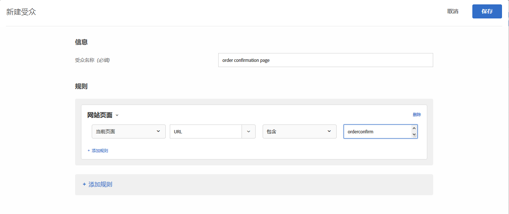

# 全局 mbox 常见问题解答{#global-mbox-frequently-asked-questions}

有关全局 mbox 的常见问题解答 (FAQ) 列表。

## 如果我设置了跨多个域的 Target 帐户，那么我是否可以拥有多个全局 mbox？{#section_B7252BA6C3BB4EF4AE9E53F47FD58ABD}

您的帐户仅支持一个全局 mbox。

您可以通过向活动中添加 URL 规则来限制活动运行的位置。有关更多信息，请参阅[在相似页面上包含相同体验](../../../c-experiences/c-visual-experience-composer/temtest.md#task_2539D51A18044F82B0D9895636546781)。

您还可以在页面上使用 [targetPageParams](/help/c-implementing-target/c-implementing-target-for-client-side-web/targetpageparams.md) 来传递参数，然后在 [!UICONTROL 可视化体验编辑器] (VEC) 的“配置 URL”部分选择这些参数，或者在基于表单的体验编辑器中通过将参数添加为“细化”来选择这些参数。

## 如何在 Target 全局 mbox 中传递收入数据？{#section_17AEA933BADA4D169CCEDF5833C41306}

要在 target-global-mbox 中收集收入和订单信息，必须将“mbox 参数”发送到 Target。这些参数是名称/值对，用于将更多信息发送到 Target。Target 会自动查找这些参数（保留名称），以使用它们来填充收入数据。

对于 `orderConfirmPage`，您应该传入 `orderTotal`、`orderId` 和 `productPurchasedId`。有关更多信息，请参阅[创建订单确认 mbox - mbox.js](../../../c-implementing-target/c-implementing-target-for-client-side-web/t-mbox-download/orderconfirm-create.md#task_0036D5F6C062442788BB55E872816D82)。

必须通过 `targetPageParams()` () 将这些相同的参数发送到 target-global-mbox。有关更多信息，请参阅[将参数传递到全局 Mbox](../../../c-implementing-target/c-implementing-target-for-client-side-web/t-mbox-download/c-understanding-global-mbox/pass-parameters-to-global-mbox.md#concept_33362A04146C4E3C8E7089B65F38B5E5)。

您可能还想要向转化中添加定位功能，以便 Target 仅在有人查看了订单确认页面后才在 target-global-mbox 中计入转化次数，如下所示：

上图所示的“网站页面”部分包含以下几个选项：“当前页面”、“URL”、“包含”及“orderconfirm”。

上图中的选项包含以下设置：

* **您希望如何衡量此活动：**&#x200B;收入
* **报表的默认视图：**&#x200B;每位访客带来的收入 (RPV)
* **受众采取的哪项操作可指示您的目标已达到？** 已查看 mbox，target-global-mbox