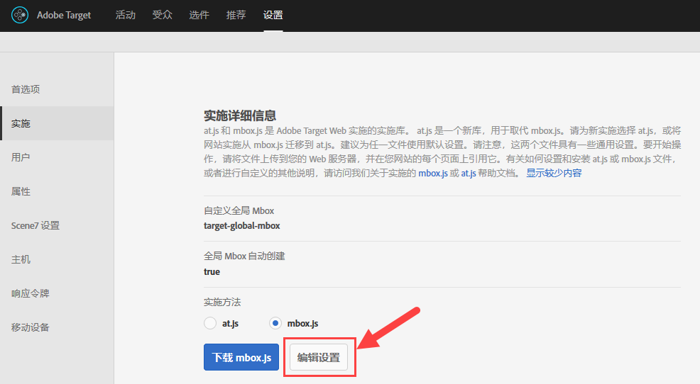
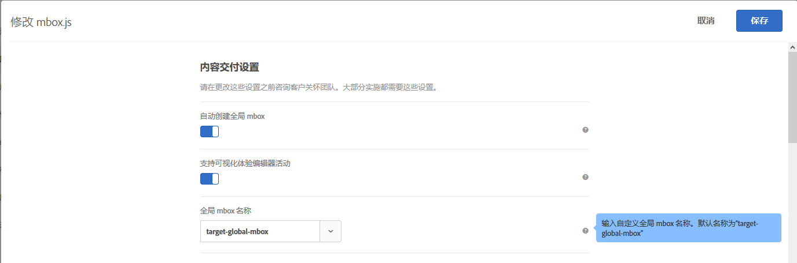
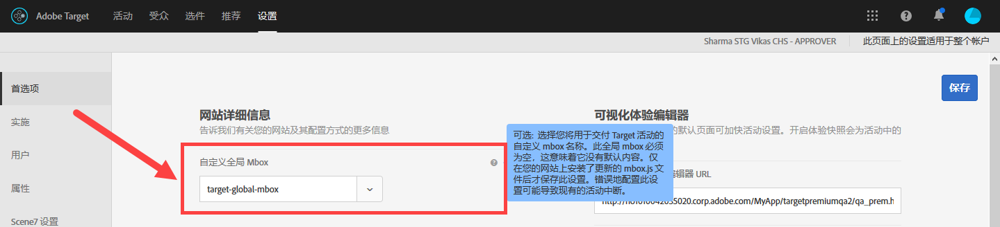

# 自定义全局 mbox{#customize-a-global-mbox}

此信息可帮助您自定义既可用于 at.js，也可用于 mbox.js 的全局 mbox。

1. 编辑 mbox.js。

   转到 **[!UICONTROL Target]** &gt; **[!UICONTROL 设置]** &gt; **[!UICONTROL 实施]**。

   * 对于 mbox.js，单击&#x200B;**[!UICONTROL 编辑 mbox.js 设置]**。
   * 对于 [!DNL at.js]，在“实施方法”下选择 **[!UICONTROL at.js]**，然后单击&#x200B;**[!UICONTROL 编辑 at.js 设置]**。
   

1. 编辑 [!DNL mbox.js] 或 [!DNL at.js]。

   禁用&#x200B;**[!UICONTROL 自动创建全局 mbox]**，然后添加从 [!DNL Target Standard/Premium] 交付活动时要使用的自定义全局 mbox 的名称。此自定义全局 mbox 还用于点击跟踪。

   

   完成后，单击&#x200B;**[!UICONTROL 保存]。**
1. 在您的网站上实施 [!DNL mbox.js] 或 [!DNL at.js] 库。

* 对于 mbox.js，请参阅 [Mbox.js 实施](../../../../c-implementing-target/c-implementing-target-for-client-side-web/t-mbox-download/mbox-download.md#task_4EAE26BB84FD4E1D858F411AEDF4B420)。
* 对于 at.js，请参阅 [at.js 实施](../../../../c-implementing-target/c-implementing-target-for-client-side-web/t-mbox-download/c-target-atjs-implementation/target-atjs-implementation.md#concept_8AC8D169E02944B1A547A0CAD97EAC17)。

1. 在您的版本中安排进行转换。

   在您准备好 [!DNL Target Standard/Premium] 以开始将全局 mbox 用于所有活动后，您便可以立即开始执行此步骤。

   更新自定义全局 mbox 的名称，以使其匹配上面步骤 2 中所使用的名称。

   

   >[!IMPORTANT]
   >
   >保存后，您帐户中的所有活动都会与此 mbox 同步。如果此 mbox 不在您的网站上，则所有活动都将停止运行。

   单击&#x200B;**[!UICONTROL 保存]**。
