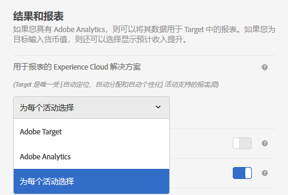

# 活动设置 - A4T 常见问题解答{#activity-settings-a-t-faq}

本主题包含有关活动设置和使用 Analytics 作为 Target 报表源 (A4T) 的常见问题解答。

## 哪些活动类型支持将 Analytics 作为报表源 (A4T)？{#section_5E4F58CD25A5424E869E6FE0803968EF}

有关完整列表，请参阅[将 Adobe Analytics 作为 Adobe Target 报表源 (A4T)](../../../c-integrating-target-with-mac/a4t/a4t.md#concept_7540C8C04259434AB6EE33B09F47A1DE) 中的“支持的活动类型”。

## 我刚刚创建了一个活动。但是为何看不到任何数据？ {#section_9F8092BE4225442896F926540292F221}

创建活动后，Target 会将一个分类文件发送到 Analytics。虽然 Analytics 会捕捉并处理数据，但是数据要等到分类文件更新后才会显示在报表中。该过程最长可能需要 24 小时。如果 48 小时后您还没有看到数据，请[联系客户关怀团队](/help/cmp-resources-and-contact-information.md#reference_ACA3391A00EF467B87930A450050077C)。或者，如果您知道自己将启动某个活动，您可以提前几天创建该活动，在保存该活动后，便会发送分类。这样一来，数据在活动启动时就会显示在报表中。请注意，在 Analytics 中处理数据需要 45 到 90 分钟时间。

## 创建新活动时，我为何不能选择 Analytics 作为报表源？ {#section_9F4F69C3085F4C2480AF439127EB27CD}

您可以在“设置”中更改“报表设置”选项。

1. 在 Adobe Target 中，单击&#x200B;**[!UICONTROL 设置]**。
1. 在&#x200B;**[!UICONTROL 用于报表的 Experience Cloud 解决方案]**&#x200B;下拉列表中，单击&#x200B;**[!UICONTROL 为每个活动选择]**。

随即会在&#x200B;****&#x200B;目标和设置]屏幕中启用&#x200B;**[!UICONTROL 报表源]下拉列表，以用于创建和编辑活动。[!UICONTROL **

要始终将 Analytics 用作报表源，请从“设置”的相应下拉列表中选择 **[!UICONTROL Adobe Analytics]。**
