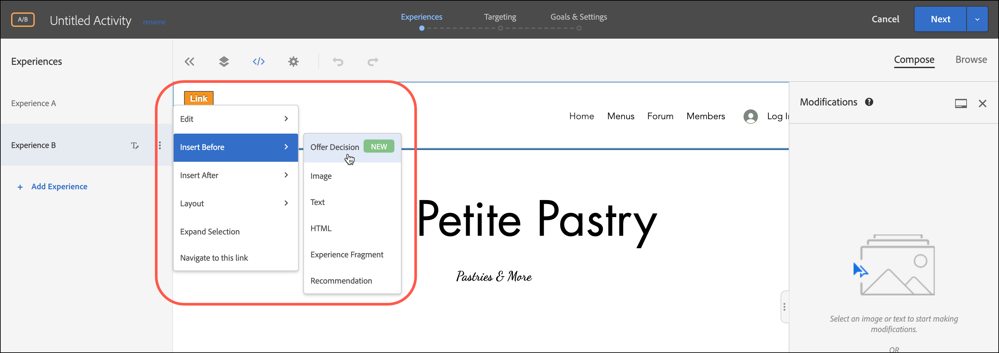

# 使用优惠决策

使用 [!DNL Adobe Target] with [!DNL Adobe Journey Optimizer] 选件决策，以确定并在web和移动设备上为访客提供下一个最佳选件。

添加在中创建的选件决策 [!DNL Adobe Journey Optimizer] to [!DNL Target] 活动（手动） [!UICONTROL A/B测试] 或 [!UICONTROL 体验定位])使用 [!UICONTROL 可视化体验编辑器] (VEC)或 [!UICONTROL 基于表单的编辑器] 在由 [!DNL Target].

>[!NOTE]
>
>本主题中描述的选件决策功能计划于2022年1月13日发布，其中包含 [!DNL Target Standard/Premium] 22.1.1版本。

有关 [!DNL Adobe Journey Optimizer]，请参阅 [开始使用Journey Optimizer](https://experienceleague.adobe.com/docs/journey-optimizer/using/get-started/get-started.html) 在 *Journey Optimizer* 文档。

有关选件决策的更多信息，请参阅 [关于决策管理](https://experienceleague.adobe.com/docs/journey-optimizer/using/offer-decisioniong/get-started/starting-offer-decisioning.html) 在 *[!DNL Journey Optimizer]文档*.

## 先决条件

在中使用选件决策 [!DNL Target]，则需要满足以下条件：

* [!DNL Adobe Target Standard] 或 [!DNL Adobe Target Premium] 使用实施 [Adobe Experience Platform Web SDK](/help/c-implementing-target/c-implementing-target-for-client-side-web/aep-web-sdk.md).

   实施时，该功能不可用 [!DNL Target] 使用at.js或其他 [!DNL Target] SDK。

* [!DNL Adobe Journey Optimizer Ultimate] (AJ0 +Offer decisioning)或 [!DNL Adobe Experience Platform] 和 [!UICONTROL offer decisioning] 应用程序服务附加组件。

## 用例示例

以下示例是如何使用 [!DNL Target]/[!DNL Adobe Journey Optimizer] 集成在 [!DNL Target] 活动：

### 体育推销

作为体育联盟的营销人员，您希望在您的主页（在桌面和移动网站上）上个性化内容。 您希望基于多个维度对内容进行个性化，并向商店相关的特许经营商品提供优惠。 您感兴趣的是：

* 访客最喜爱的团队
* 最近的运动员/运动员活动（例如，团队运动、合同更新或受伤）

例如，您希望为以下每个区域提供个性化体验：多特蒙德、法兰克福和波鸿以及这些球队的隐性和显性粉丝用户。 作为量度，您需要查看对商品网站的访问和点击。

要设计 [!UICONTROL A/B测试] 活动(50/50拆分)，分为默认体验和个性化体验（包括针对每个地区和团队的选件决策）。 您需要使用此活动来确定个性化体验与控制体验的转化和提升度。

### 游戏流平台

作为游戏组织的营销人员，您希望为来自不同地理位置的桌面用户和移动用户提供一个个性化的游戏流平台选件：德国、法国、墨西哥和巴西。 当访客从其中一个地区访问桌面或移动设备网站时，您希望提供使用当地语言进行游戏流播放的选件，并支付相应的当地货币价格。

在 [!DNL Adobe Journey Optimizer]，您可以为每个定位的地理位置创建一个个性化主页主页主页主页选件，以及一个具有默认主页主页主页主页主页的后备选件。 然后，您可以创建选件决策，以包含这些选件及其资格规则。 然后，在 [!DNL Target]，您可以创建 [!DNL Experience Targeting] (XT)活动，并将该选件决策插入到您的桌面或移动设备网站中，以向访客提供个性化体验。

## 创建使用选件决策的体验：

1. 编辑或创建手册时 [!UICONTROL A/B测试] 或 [!UICONTROL 体验定位] (XT)活动 [!UICONTROL 可视化体验编辑器] (VEC)，单击某个页面元素以显示 [选项菜单](/help/c-experiences/c-visual-experience-composer/viztarget-options.md).

   

   >[!NOTE]
   >
   >您还可以创建使用 [!UICONTROL 选件决策] 在 [[!UICONTROL 基于表单的体验编辑器]](/help/c-experiences/form-experience-composer.md).

1. 单击 **[!UICONTROL 此项前插入]**, **[!UICONTROL 此项后插入]**&#x200B;或 **[!UICONTROL 替换内容]**，然后单击 **[!UICONTROL 选件决策]**.

   的 [!UICONTROL 选件决策] 选项在编辑或创建时可用 [手动 [!UICONTROL A/B测试]](/help/c-activities/t-test-ab/test-ab.md#types) 或 [[!UICONTROL 体验定位]](/help/c-activities/t-experience-target/experience-target.md) (XT)活动。 此选项不适用于其他活动类型。 菜单中的可用选项因所选元素而异。

   

1. 在 **[!UICONTROL 添加选件决策]** 对话框中，选择所需的沙盒和版面。

   A [沙盒](https://experienceleague.adobe.com/docs/experience-platform/sandbox/ui/overview.html){target=_blank} [!DNL Adobe Experience Platform] 允许您将实例分区为虚拟环境。 例如，您可能具有生产环境和暂存环境。 A [投放](https://experienceleague.adobe.com/docs/journey-optimizer/using/offer-decisioniong/create-components/creating-placements.html){target=_blank}(位于 [!DNL Adobe Journey Optimizer] 有助于确保正确的选件内容显示在正确的位置。

   

1. 选择所需的选件决策，然后单击 **[!UICONTROL 创建]**.

   

   您的网站会显示在VEC中，您可以在 [!UICONTROL 修改] 窗格。 您可以将鼠标悬停在修改上，然后单击 [!UICONTROL 预览] 图标以检查选件决策。

   

   您可以通过单击 [!UICONTROL 选件预览] 对话框，包括备用选件。 回退选件是当访客不符合收藏集中任何个性化选件的条件时显示的默认选件。

   

1. 通过完成 [!UICONTROL 定位] 和 [!UICONTROL 目标和设置] 三步引导式工作流的步骤。

   >[!IMPORTANT]
   >
   >确保 [!DNL Target] 活动是个性化的，请确保当前活动开始/结束日期与 [!DNL Adobe Journey Optimizer]. 如果 [!DNL Target] 开始/结束日期在选件决策的开始/结束日期范围（默认日期）之外 [!DNL Target] 内容会向访客显示。

   

## 注释和限制

在处理选件决策时，请考虑以下注释和限制：

* offer decisioning集成适用于 [!DNL Target] 基于 [Adobe Experience Platform Web SDK](/help/c-implementing-target/c-implementing-target-for-client-side-web/aep-web-sdk.md). 此功能在实施时不可用 [!DNL Target] 使用at.js或其他 [!DNL Target] SDK。

* Target/Adobe Journey Optimizer集成支持 [手动 [!UICONTROL A/B测试]](/help/c-activities/t-test-ab/test-ab.md#types) 和 [[!UICONTROL 体验定位]](/help/c-activities/t-experience-target/experience-target.md) (XT)活动。 此功能不适用于其他活动类型。

* 包含文本/html内容类型的选件不支持deliveryURL内容交付。 只有在客户端负责显式获取和编写内容的情况下，基于表单的体验编辑器才支持deliveryURL。

* [!DNL Target] 报表不提供选件决策级别的报表。

* 可视化 [QA链接](/help/c-activities/c-activity-qa/activity-qa.md) 表示 [!DNL Target] 包含选件决策的体验会影响 [!DNL Adobe Journey Optimizer] 来做决定。
