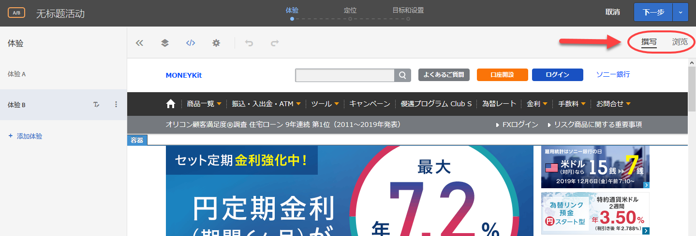

# Target 优化和个性化常见问题解答{#target-optimization-and-personalization-faq}

有关使用 Adobe Target 中的功能的常见问题列表，以及更多信息和相关链接。

## 一般信息 {#section_CE5713B5AAC341C9A75586C107797FA3}

**我可以如何查看其他客户怎样利用 Adobe Target 以获得更好的结果？**

这里是我们的[客户成功案例](https://www.adobe.com/in/marketing-cloud/target/resources.html#x)中的一部分。可以从中了解客户如何利用 Target 改进优化和个性化设置以实现业务目标。

请注意，其中一些案例研究利用了 Adobe Target Premium 的功能。

**我可以在哪里了解最新的 Target 功能？**

请参阅我们的[发行说明](../r-release-notes/release-notes.md#reference_8FE40B43A5A34DDF8F26A53D55EE036A)以查看最新版本的详细信息。我们还在线提供了有关所有[过去版本](../r-release-notes/release-notes-for-previous-releases.md)的信息。

**Adobe 是否有社区/论坛，以便我可以找到与 Target 有关的答案和更多信息？**

您可以来我们的 [ Target 社区论坛](../cmp-resources-and-contact-information.md#concept_9C203A8AED054DFFA9A504811DB6BA42)，我们为这里为客户提供帮助，但更重要的是，我们希望 Adobe Target 实际使用者之间可以相互帮助。毕竟，社区和论坛的成功取决于成员的积极参与。成为社区的一员，提出您的问题并寻求相应答案。

**Target 支持哪些浏览器？**

有关更多详情，请阅读我们的[支持的浏览器](../c-implementing-target/c-considerations-before-you-implement-target/supported-browsers.md#reference_01B4BF99E7D545A7998773202A2F6100)矩阵图。请注意，支持的浏览器分为两个方面：Target Standard/Premium Experience Cloud 界面支持，以及桌面/设备上的最终用户浏览器支持。

## Target JavaScript 库（at.js 和 mbox.js） {#section_C2AC78DFDAD84981A8C84DF20893E340}

**我应该使用哪个实施 JavaScript 文件，at.js 还是 mbox.js？**

at.js 是我们最新、最好的 JavaScript 库。mbox.js 是我们的旧版本。请参阅 [at.js 的好处](/help/c-implementing-target/c-implementing-target-for-client-side-web/t-mbox-download/c-target-atjs-implementation/target-atjs-implementation.md#benefits)以了解这两个库之间的差异。所有新客户都应使用 at.js。

所有现有的 mbox.js 客户都应迁移到 at.js。在进行迁移之前，请详细了解[从 mbox.js 迁移到 at.js](../c-implementing-target/c-implementing-target-for-client-side-web/t-mbox-download/c-target-atjs-implementation/target-migrate-atjs.md#task_DE55DCE9AC2F49728395665DE1B1E6EA) 中介绍的步骤。

## 活动 {#section_CB95B3BF9934445DB98E8A7E22FC2CF6}

**我是否可以执行一种严格且具有统计意义的活动，在使用控制体验的同时找到入选和落选的体验？**

使用 [A/B 测试](../c-activities/t-test-ab/test-ab.md#task_05E33EB15C4D4459B5EAFF90A94A7977)（“手动定位”选项）以及[样本量计算器](../c-activities/t-test-ab/sample-size-determination.md#section_286EB6E671184239BB1552F0387DAEB5)以获得最佳结果。

**我如何知道应在何时停止活动？**

过早停止活动可能会导致错误的结论。请注意[常见的陷阱并确保在实践操作中避免这些陷阱](../c-activities/t-test-ab/common-ab-testing-pitfalls.md#section_DF01A97275E44CA5859D825E0DE2F49F)。另请参阅 [A/B 测试应该持续多长时间](/help/c-activities/t-test-ab/sample-size-determination.md)？

**如果时间比较紧，我该如何执行活动？**

**在测试时是否可以优化我的目标？**

使用我们的[报表来确定入选体验](../c-activities/automated-traffic-allocation/determine-winner.md#concept_5741A89ED7224E1285A3BC34B2CCD0F9)。

**我是否可以执行一个活动，在该活动中采用一定程度的个性化作为该活动的一部分？**

请查看[使用自动定位进行 A/B 测试](../c-activities/auto-target-to-optimize.md#concept_67779E5B7F67427A97D7EA2A6FB919B3)选项。

**我如何知道哪类活动最适合我的需求？**

请阅读 [Target 活动指南](../c-activities/target-activities-guide.md#concept_D974B0918EB74B3B8CB07ACD32BF37A1)以了解相关情景，Adobe Target 提供的每个选项都有对应的情景可以利用。

请务必考虑使用[推荐活动](../c-recommendations/recommendations.md#concept_7556C8A4543942F2A77B13A29339C0C0)。

**我如何才能发现页面上的哪些元素组合对页面的成功有帮助？每个元素可以提供多大的帮助？**

在元素归因分析中试试我们的[全因子多变量 (MVT) 活动](../c-activities/c-multivariate-testing/multivariate-testing.md#concept_628695CDC71B449B8DCC2F5654C11499)，看看它是否符合您的需求。

请注意，流量需求会随着 MVT 活动而增加。

**我是否可以在页面结构不同的情况下跨多个页面运行活动？**

**我是否可以在不同位置应用选件（例如签出漏斗）？**

尝试使用[多页面活动功能](../c-experiences/c-visual-experience-composer/multipage-activity.md#concept_277E096063E14813AC5D8EDFA1D2ED48)，该功能允许您在体验中使用多个页面。

**我如何确保一旦实现目标（主要或次要）后，用户不会再次进入该活动，而是会看到不同的活动？**

通过使用每个目标都提供的[高级设置](../c-activities/t-test-ab/t-test-create-ab/ab-goals-and-settings.md#section_E2FE441AFB324E498793ABB025ED9974)选项可轻松实现此目的。您可以决定用户实现目标后的情况，以及您希望如何增加计数。

而在这种情况下，您可以选择“递增计数、释放用户并阻止再次进入”以及“默认/其他活动内容”以实现该目标。您也可以了解一下其他选项。

**我在我的活动中创建了多个目标。我是否可以创建一系列目标作为漏斗以用于报表和分析？**

**例如，我想在用户实现目标 A 时考虑目标 B，以便我可以跟踪特定漏斗的数值。**

使用我们的“量度依赖关系”功能是 Target 实现此目标的最佳方式。只需[添加其他成功量度的依赖关系](../c-activities/r-success-metrics/success-metrics.md#section_7CE95A2FA8F5438E936C365A6D43BC5B)即可。您可以选择“已实现”和“未实现”等选项，同时还可以通过多种方式组合量度以创建所需的任意组合。

**我要如何设立一个活动来实现我的目标？**

实现[目标](../c-activities/t-test-ab/t-test-create-ab/ab-goals-and-settings.md#reference_B25389FD6F3A4989801E740364B089CC)的步骤如下。

首先应了解您想要在哪个方面进行优化。是收入、转化还是参与度？您可以在目标区域中找到这些选项。对于每个选项，您可以进一步定义当用户在您的网站上执行何种操作时，即表示您的目标已实现。

这可以通过三步引导式工作流的步骤 3 中的“主要目标”设置实现。您还可以添加其他目标，以便帮助您更好地创建报表。

**我是否可以安排在固定时间开始和结束活动？**

使用三步活动工作流中的[“目标和设置”步骤中的“计划”功能](../c-activities/t-test-ab/t-test-create-ab/ab-goals-and-settings.md#section_DCBDC354261F420EBD4B43EA34947BAC)来指定开始日期和结束日期。

请记住激活该活动。只有实时活动才遵守指定的计划。达到结束日期后，活动会进入“已结束”状态。

**我是否可以仅在“定位”步骤中进行更改，而不是执行整个三步引导式工作流进行编辑？**

[根据需要从活动概述页面直接进入所需步骤](../c-activities/edit-activity.md#concept_BB064C0D4A194BD1A1AE7CCA1E6BB8F0)，然后使用“保存并关闭”选项退出该步骤即可轻松实现这一点。

**我是否可以停留在特定步骤、不断修改活动（例如选件文本或自定义代码），然后在另一个选项卡中执行 QA？**

这也是可行的。只需[使用提供的“保存”选项即可进行增量更改而不退出该步骤](../c-activities/edit-activity.md#concept_BB064C0D4A194BD1A1AE7CCA1E6BB8F0)。

**如何预览和 QA 我刚刚创建的活动？**

使用我们的[强大的 QA 模式功能](../c-activities/c-activity-qa/activity-qa.md#concept_9329EF33DE7D41CA9815C8115DBC4E40)来执行 QA。您可以与您的 QA 团队分享链接，还可以对包括报表在内的端到端活动进行测试，以充分确保活动开始后，会按照预期和经过测试的方式运行。

**我如何使用 Target 的决策功能接收可用于单页应用程序 (SPA) 或服务器端集成的体验/选件？**

使用包含 [JSON 选件](../c-experiences/c-manage-content/create-json-offer.md#concept_63C7BEE1F0DB4A7596D997219B7C136D)的[基于表单的活动](../c-experiences/form-experience-composer.md#task_FAC842A6535045B68B4C1AD3E657E56E)的强大功能来实现您的目标。

**我已经设置了 2 个活动。我如何知道访客最终会看到哪一个活动？**

**我可以设置一些活动的优先顺序吗？**

使用三步引导式工作流步骤 3 提供的“优先级”设置（“目标与设置”页面）来[定义活动的优先级](../c-activities/t-test-ab/t-test-create-ab/ab-goals-and-settings.md#section_DCBDC354261F420EBD4B43EA34947BAC)。

有两种选项：

* 默认选项，共三个等级（低/中/高）
* 自定义选项，范围从 0 到 999。对于自定义优先级，请启用细粒度优先级功能（设置 > 首选项）

## 受众{#section_FA6314777ABC46D8B198D6F388051460}

**我是否可以在活动中创建特定于该活动的受众区段？我不认为应在受众库中创建此类受众，因为没有可以重复使用的地方。**

改用我们的[仅限该活动的受众功能](../c-target/creating-activity-only-audience.md#concept_A6BADCF530ED4AE1852E677FEBE68483)来定义活动的本地受众。

**我如何根据用户的位置来进行定位？**

尝试使用[地理位置受众](../c-target/c-audiences/c-target-rules/geo.md#concept_5B4D99DE685348FB877929EE0F942670)。阅读有关此功能的准确度级别信息。

**我是否可以根据会话页面上的某些属性来定位用户？**

最佳方式是使用 mbox 和[自定义受众](../c-target/c-audiences/c-target-rules/custom-parameters.md#concept_C4C6E00D7C5A4BE9B72D471DB2E3027B)来提供合适的体验。

**我是否可以根据多次访问中的访客属性提供体验？**

**我是否可以将流量随机拆分成两部分？**

尝试使用[配置文件脚本功能](../c-target/c-visitor-profile/profile-parameters.md#concept_8C07AEAB0A144FECA8B4FEB091AED4D2)。尽管需要您编写代码，但它是对体验进行个性化的一种很有效的方式。

**我能否启动只有少数访客的活动？**

使用 [Target 三步引导式工作流步骤 2（“定位”页面）](../c-activities/t-test-ab/t-test-create-ab/ab-audience.md#concept_A268236C1224451DB7844BF67F41A087)中提供的百分比分配控件来确定如何设置活动。

**我也有 Adobe Analytics，并希望将其与 Target 结合使用。将这两种解决方案集成之后，我可以获得哪些关键功能？**

请了解一下产品的以下几个方面：

* [Analytics for Target (A4T)](../c-integrating-target-with-mac/a4t/a4t.md#concept_7540C8C04259434AB6EE33B09F47A1DE)
* [客户属性](../c-target/c-visitor-profile/working-with-customer-attributes.md#concept_16C5C434D32D4EB1AD44A71821F3DEE8)
* [受众](../c-integrating-target-with-mac/mmp.md#concept_F4863DE4C92D4805AB690B4B3D487969)

## 体验 {#section_5959536B8D6A4BEA8FAA1273338F3451}

**我是否可以在页面结构相同的情况下跨多个页面运行活动？**

使用[模板规则](../c-experiences/c-visual-experience-composer/temtest.md#task_2539D51A18044F82B0D9895636546781)，将许多结构类似的页面包含到活动中，同时仍通过提供的单个 URL 创建体验。

**我已经厌烦了当我尝试在可视化体验编辑器 (VEC) 中加载我的页面时，一直看到“允许您的浏览器加载脚本”消息。怎样才能让我不再看到这条消息？**

这是因为您的网站具有混合内容，即网站从 HTTP 和 HTTPS 两种资源提取内容。请让您的 IT 团队将网站内容全部移到 HTTPS。

在此之前，请按照[在浏览器中启用混合内容](../c-experiences/c-visual-experience-composer/r-troubleshoot-composer/mixed-content.md#concept_46D022D50280468C9EF6D5DF6EFC911C)中的说明来允许浏览器加载混合内容。这是目前大多数浏览器采用的一种安全功能。

**即使尚未部署 Target at.js 库，是否仍可以在我的网站上尝试使用可视化体验编辑器 (VEC)？**

尝试使用[增强型体验编辑器](../c-experiences/experiences.md#section_34265986611B4AB8A0E4D6ACC25EF91D)加载页面。

**为什么我的网站没有在可视化体验编辑器 (VEC) 中加载？**

尝试使用我们的帮助页面中列出的[故障诊断信息](../c-experiences/c-visual-experience-composer/r-troubleshoot-composer/troubleshoot-composer.md#reference_77743144F10143A3A89D56E116D296E4)。如果这些方法都不起作用，请联系 [Adobe 支持](../cmp-resources-and-contact-information.md#reference_ACA3391A00EF467B87930A450050077C)。

此外，我们还提供了[基于表单的方法](../c-experiences/form-experience-composer.md#task_FAC842A6535045B68B4C1AD3E657E56E)，这些方法可以帮助您。

另请阅读[增强型体验编辑器](../c-experiences/experiences.md#section_34265986611B4AB8A0E4D6ACC25EF91D)何时以及为何有用。您可能还需要联系您的 IT 部门， [allowlist Adobe&#39;s proxy servers](../c-experiences/c-visual-experience-composer/experience-composer-best-practices.md#concept_E284B3F704C04406B174D9050A2528A6) as well.

**我有一个响应网站。在创建活动时，如何确定要使用的关键设备？**

尝试使用[移动设备视区](../c-experiences/c-visual-experience-composer/mobile-viewports.md#concept_8E45527C4ABC41D59AA3553BEDC76FA5)功能。请注意，只有在启用增强型体验编辑器后才能使用该功能。

**我有多个域。其中一个域需要启用增强型体验编辑器，而其他域则需要将其禁用。我该如何处理？**

您可以随时覆盖默认设置，改为[在活动级别使用增强型体验编辑器选项](../c-experiences/experiences.md#section_34265986611B4AB8A0E4D6ACC25EF91D)（设置 > 首选项）。

**为何我看不到交换图像的选项？**

联系 Adobe 以[确保已为 Scene7 设置您的帐户](../administrating-target/scene7-settings.md#task_37AD0768EFBA4E588955FE3D5DD670A5)。配置完毕后，您将可以轻松地将图像与其他图像进行交换。

**我想在两个不同的体验之间进行测试，例如现金折扣与百分比折扣，但我希望能够正确定位体验（针对来自不同国家/地区的人员显示不同的区域设置文本或不同货币）。我该如何处理？**

您可以使用我们的[多个体验版本功能](../c-activities/t-test-ab/t-test-create-ab/target-experience-to-multiple-audiences.md#task_0138112E283A4A5B9F8AB9AAF2FBC2FF)轻松实现此目的。请注意此类测试中有关交付的细微差别

**如何查看我在可视化体验编辑器 (VEC) 中所做的修改？**

[代码编辑器](../c-experiences/c-visual-experience-composer/c-vec-code-editor/vec-code-editor.md#concept_B3A6E9EE3A60406DB640E205EA1745B5)中会始终显示您所做的更改。“修改”选项卡会显示您应用于选件的 CSS 选择器或 mbox。

请注意，CSS 选择器是一个 Sizzle 选择器。您可以使用此部分进行细微的修改或快速删除某些选件。

**我希望将 JavaScript 作为实验/活动的一部分进行传递，以便实时对某些动态元素进行修改，或者只需将调用发送到第三方解决方案。我该如何处理？**

其中一种方法是使用[自定义代码编辑器](../c-experiences/c-visual-experience-composer/c-vec-code-editor/vec-code-editor.md#concept_B3A6E9EE3A60406DB640E205EA1745B5)。使用此方法在该区域输入您的 JavaScript，然后它将会得到交付。根据您的需要，您可以选择将其交付到标头或主体的顶部。

**为什么我在可视化体验编辑器 (VEC) 中无法前往登录页面或我不知道具体 URL 的某个深埋页面？**

使用编辑和浏览功能，导航至所选页面并开始创建您的体验。

**我如何才能转到在 Target 三步引导式工作流步骤 2（“定位”页面）中所选择的体验？**

单击步骤 2 中的体验名称前面的缩略图，便可来到您选择的体验。

**我是一名前 Target Classic 用户。我是否可以在某些用例中使用我的 mbox？**

使用[基于表单的方法](../c-experiences/form-experience-composer.md#task_FAC842A6535045B68B4C1AD3E657E56E)来创建活动。

**我能否确保在用户可能使用的所有设备上都始终如一地提供相同的体验？**

试试我们的 [Device Co-op](https://docs.adobe.com/content/help/en/device-co-op/using/home.html)，它允许您通过 Co-op 确定性地和概率性地链接用户的多个设备。

如果您在 Co-op 之中，只需单击“目标和设置”页面上的标志即可启用该功能。此时，报表会更改为反映“人员”而不是“访客”。请咨询您的 Adobe 联系人以获取有关此功能的更多信息，因为这不适用于所有区域。

**为何我没有看到我想要看到的选件/体验，反而看到了一些其他的活动？**

使用我们的[调试器](../c-activities/c-troubleshooting-activities/content-trouble.md#concept_D2548B486C984B1E97ED7A72075B8EEA)并检查是否存在[活动冲突](../c-experiences/c-visual-experience-composer/activity-collisions.md#concept_0BC6B929592744DFA7DA01FF4F91052E)。

## 选件 {#section_A547B1EAD0B34FD38D3B87AAF62E3963}

**我想要测试一个全新的、完全不同的页面，而不仅仅是进行细微的更改。**

**我希望将用户引导至登陆页面，例如一个新发布的产品。**

**我该如何处理？**

我们提供了[重定向 URL 功能](../c-experiences/c-manage-content/offer-redirect.md#task_33C80CD722564303B687948261484F94)，可让您将用户重定向到所选页面（包含或不包含当前查询参数）。

**为什么 QA 过程中未进行内容交付？**

您的网站可能拥有动态 ID、重复 ID 或元素上的动态类。您可能必须在帐户级别（或者在活动级别，如果问题特定于域或页面）评估网站首选项的选项。请参阅 [CSS 选择器](/help/administrating-target/visual-experience-composer-set-up.md#css)。

**为何我没有看到我想要看到的选件/体验，反而看到了一些其他的活动？**

使用我们的[调试器](../c-activities/c-troubleshooting-activities/content-trouble.md#concept_D2548B486C984B1E97ED7A72075B8EEA)并检查是否存在[活动冲突](../c-experiences/c-visual-experience-composer/activity-collisions.md#concept_0BC6B929592744DFA7DA01FF4F91052E)。

**我能不能使用 Target 的决策功能接收可用于单页应用程序 (SPA) 或服务器端集成的体验/选件？**

使用包含 [JSON 选件](../c-experiences/c-manage-content/create-json-offer.md#concept_63C7BEE1F0DB4A7596D997219B7C136D)的[基于表单的活动](../c-experiences/form-experience-composer.md#task_FAC842A6535045B68B4C1AD3E657E56E)的强大功能来实现您的目标。

## 报表（包括 Analytics for Target—A4T）{#section_8AECC69BEEB7422E894E7EC44A50BA0A}

**我也有 Adobe Analytics，并希望将其与 Target 结合使用。将这两种解决方案集成之后，我可以获得哪些关键功能？**

请了解一下产品的以下几个方面：

* [Analytics for Target (A4T)](../c-integrating-target-with-mac/a4t/a4t.md#concept_7540C8C04259434AB6EE33B09F47A1DE)

* [客户属性](../c-target/c-visitor-profile/working-with-customer-attributes.md#concept_16C5C434D32D4EB1AD44A71821F3DEE8)

* [受众](../c-integrating-target-with-mac/mmp.md#concept_F4863DE4C92D4805AB690B4B3D487969)

**我是否可以根据多个用户区段对报表进行细分？**

有关信息，请参考三步引导式活动工作流步骤 3 中的“目标和设置”页面上提供的[报表的受众功能](../c-activities/t-test-ab/t-test-create-ab/ab-goals-and-settings.md#section_13119392051044FBA6387D9B3B1C43CF)。

您可以选择添加 50 个此类区段以及应用程序点（活动条目或特定量度），从而进行有效的细分。

请注意，Target 会在您添加这些受众之后收集这方面的数据，因此如果您在运行测试之前未添加区段，那么很遗憾，您就无法收集这些数据进行细分了。

**我无法在运行活动之前定义受众。我发现 Target 活动中对定义报表受众进行了限制。**

**怎样才可以让这个过程更轻松一点？**

这就涉及 [Analytics for Target (A4T)](../c-integrating-target-with-mac/a4t/a4t.md#concept_7540C8C04259434AB6EE33B09F47A1DE) 的方便之处。如果您拥有 Adobe Analytics，只需将来将源选为 Analytics，即可消除此限制。现在，您可以在任何时间对任何受众进行分析，而无需预先定义报表受众。

**我是否可以执行离线报表计算？**

使用“报表”页面上的[“将报表导出为 CSV”和“将订单详细信息下载到 CSV”选项](../c-reports/downloading-data-in-csv-file.md#concept_3F276FF2BBB2499388F97451D6DE2E75)，即可下载所需的报表数据。

**我是否可以更改用于评估报表的控制体验？或者将计数方法从“访客”更改为“访问次数”？**

使用](../c-reports/c-report-settings/report-settings.md#concept_4BB6A7FDAB6F4806A632F9CD989B8BFA)报表页面上的“设置”齿轮[可进行这些更改。阅读更多有关这些设置的信息，了解计算结果的差异。

**我应如何解读报表？**

我们尝试通过以下功能制作尽可能直观的报表：[置信区间栏、提升度范围、显著性/置信度和多个量度选项、表格和图形视图、运行平均值等等](../c-reports/c-report-settings/report-settings.md#concept_4BB6A7FDAB6F4806A632F9CD989B8BFA)，以便进行有效且简便的报表分析。显然，如果您使用 [Analytics for Target (A4T)](../c-integrating-target-with-mac/a4t/a4t.md#concept_7540C8C04259434AB6EE33B09F47A1DE) 活动进行进一步的受众分析，您可以查看 Analytics。

## 响应令牌 {#section_C2A7118B4B62482A9D630C2212112A3D}

**我是否可以与第三方系统（如 Google Analytics 或 ClickTale）进行集成，以将提供的活动信息传递给最终用户以供分析？**

我们的[响应令牌功能](../administrating-target/response-tokens.md#concept_2B21B222F6A344D68CA5929817E836C4)也为我们提供了解决方案。

## 疑难解答 {#section_6B8B4DC62AE34066A8C55915E9EC6C19}

**我如何了解 Adobe Target 的可用性状态？**

可使用 [Adobe 系统状态页面](../r-release-notes/system-status-updates.md#concept_5CBDF506BEFA40E483CC7DE0DA915EAD)查看 Adobe 产品以及包括 Target 在内的 Experience Cloud 解决方案的状态。此页面可帮助您确定您遇到的问题是否因系统更新或日常维护所致。

**你们是否提供故障诊断指南？**

很抱歉您遇到了问题。请试试 [Target 故障诊断](../r-troubleshooting-target/troubleshooting-target.md#reference_A9DB82675D044BD8861F6752A4EE6839)，其中提供许多故障诊断主题的链接。

## Target 移动设备应用程序 {#section_07BA89F2C38747158ECD5B153274AEAF}

**我们有一个移动版 SKU。我是否可以在移动设备上创建活动？**

要在移动设备上进行优化和个性化，您需要使用[基于表单的活动](../c-experiences/form-experience-composer.md#task_FAC842A6535045B68B4C1AD3E657E56E)以及 [Adobe SDK](../c-target-mobile-app/mobile-enable-target-in-sdk.md#task_FCA99AD0785A44E995468776AE76FE91)。了解更多[适用于移动设备应用程序的 Target](../c-target-mobile-app/target-mobile-app.md#concept_80126FF457724DE788CE37264A047559) 的信息。

## Target API {#section_714E85EFF6E3400389EF2E40D538E1DA}

**我在哪里可以了解有关 Target API 的更多信息？**

我们提供了关于 API 的详尽文档。请参阅[交付 API、NodeJS SDK 和推荐 API 文档](/help/c-implementing-target/c-api-and-sdk-overview/api-and-sdk-overview.md)。