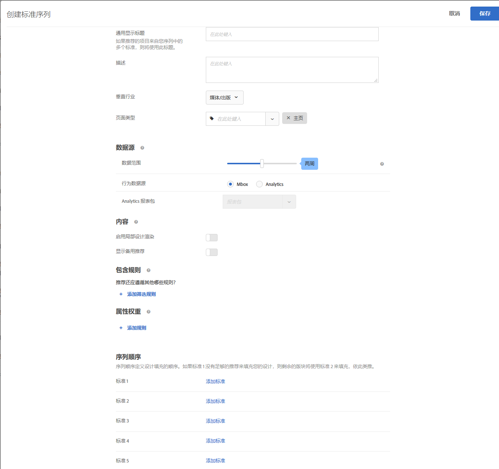

#  创建标准序列{#create-criteria-sequences}

可使用最多包含五个标准的序列来加强对“推荐”活动中显示的项目的控制。

>[!NOTE]
>
>标准序列不能用于 [!UICONTROL  2016 年 10 月版发行之前创建的]推荐[!DNL Target Premium]活动。

要创建标准序列，您必须先创建要包含到序列中的标准。请参阅[创建标准](../../c-recommendations/c-algorithms/create-new-algorithm.md#task_8A9CB465F28D44899F69F38AD27352FE)，以了解更多信息。

在单个标准无法返回足够多的结果，从而无法填充设计的情况下，通过使用标准序列，您可以提供更多具有针对性的推荐，而不是使用更为宽泛的备用推荐。一般情况下，标准序列会从更具体的定位开始，然后逐步进行到更宽泛的定位，因而返回的结果也会由少到多逐步增加。

例如，一个产品页面的标准序列可能会遵循以下顺序：

1. 基于当前项目，来自同一品牌
1. 基于当前项目，来自所有品牌
1. 基于内容相似性
1. 基于最畅销商品
1. 基于整个网站中查看次数最多的项目

一个主页的标准序列可能会遵循以下顺序：

1. 基于访客上次购买的项目
1. 基于访客最喜爱的项目
1. 基于访客最喜爱的类别
1. 基于最畅销商品
1. 基于整个网站中查看次数最多的项目

可通过多种方式来访问“[!UICONTROL 创建标准序列]”屏幕。某些屏幕选项会根据您访问该屏幕的方式而有所不同。

* 创建“[!UICONTROL 推荐]”活动时，在“[!UICONTROL 选择标准]”屏幕上单击&#x200B;**[!UICONTROL 新建]** > **[!UICONTROL 创建标准序列]**。您将可以选择保存新建的标准序列，以供在其他“[!UICONTROL 推荐]”活动中使用。
* 编辑[!UICONTROL 推荐]活动时，在页面上的[!UICONTROL 推荐位置]框中单击，然后选择&#x200B;**[!UICONTROL 更改标准]**。在“[!UICONTROL 选择标准]”屏幕上，单击&#x200B;**[!UICONTROL 新建]** > **[!UICONTROL 创建标准序列]**。您将可以选择保存新建的标准，以供在其他“[!UICONTROL 推荐]”活动中使用。
* 在&#x200B;**[!UICONTROL 推荐]** > **[!UICONTROL 标准]**&#x200B;库屏幕上，单击&#x200B;**[!UICONTROL 创建标准]** > **[!UICONTROL 创建标准序列]**。您在此处创建的标准会自动设置为可用于所有“[!UICONTROL 推荐]”活动。

1. 单击&#x200B;**[!UICONTROL 创建标准]**&#x200B;或&#x200B;**[!UICONTROL 新建]**。

   

1. 选择&#x200B;**[!UICONTROL 创建标准序列]**。

   

1. 键入序列的&#x200B;**[!UICONTROL 名称]**。

   这是用于描述序列的“内部”名称。您的网站访客将不会看到此名称。
1. 如果使用序列中的多个标准来填充&#x200B;**[!UICONTROL 推荐]**&#x200B;设计，请键入要在页面上显示的[!UICONTROL 通用显示标题]。

   例如，如果设计中可能包含基于多个“[!UICONTROL 推荐]”键的项目，您可能希望将“查看了这个项目的客户也查看了...”替换为“为您推荐”。
1. 键入对标准序列的简短&#x200B;**[!UICONTROL 描述]**。

   描述应有助于您识别标准序列，因而可以包含有关序列用途的信息。
1. 选择&#x200B;**[!UICONTROL 垂直行业]**。

   系统会自动显示默认垂直行业。
1. 选择&#x200B;**[!UICONTROL 页面类型]**。

   您可以选择多个页面类型。

   垂直行业和页面类型可一起用于对已保存的标准序列进行分类，从而使其更易于在其他“[!UICONTROL 推荐]”活动中重复使用。
1. 设置&#x200B;**[!UICONTROL 内容]**&#x200B;规则。

   创建标准序列时，构成序列的单个标准所具有的备用推荐和局部设计渲染设置将被忽略。要使用备用推荐和局部设计渲染，您必须为序列启用这两项功能。选择相应的切换开关。如果您选择允许使用备用推荐，则还可以选择是否要对备用推荐应用包含规则。
1. 设置序列顺序。

1. 单击&#x200B;**[!UICONTROL 添加标准]**。
1. 在“添加标准”屏幕上，选择一个标准。
1. 单击&#x200B;**[!UICONTROL 添加]**。

   您最多可以在一个序列中添加五个标准。
1. 单击&#x200B;**[!UICONTROL 保存]**。

   标准序列随即会显示在“标准”列表中。

   

   有关推荐逻辑选项的更多信息，请参阅[标准](../../c-recommendations/c-algorithms/algorithms.md#concept_4BD01DC437F543C0A13621C93A302750)。

## 培训视频：在“推荐”中创建标准 (12:33) 

本视频包含以下信息：

* 创建标准
* 创建标准序列
* 上传自定义标准

>[!VIDEO](https://video.tv.adobe.com/v/27694?quality=12)
