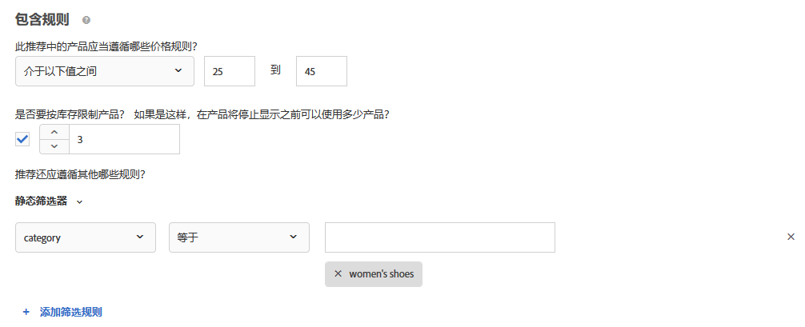
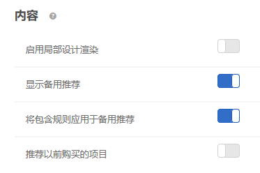

#  创建标准{#create-criteria}

标准控制着 Recommendations 活动的内容。可创建标准以显示最适合您的活动的推荐。

## 创建标准 {#task_8A9CB465F28D44899F69F38AD27352FE}

标准控制着 [!DNL Recommendations] 活动的内容。可创建标准以显示最适合您的活动的推荐。

可通过多种方式来访问“[!UICONTROL 创建新标准]”屏幕。某些屏幕选项会根据您访问该屏幕的方式而有所不同。

* 创建 [!DNL Recommendations] 活动时，在&#x200B;**[!UICONTROL 选择标准]**&#x200B;屏幕上单击[!UICONTROL 新建]。您将可以选择保存新建的标准，以供在其他 [!DNL Recommendations] 活动中使用。
* 编辑 [!DNL Recommendations] 活动时，在页面上的[!UICONTROL 推荐位置]框中单击，然后选择&#x200B;**[!UICONTROL 更改标准]**。在[!UICONTROL 选择标准]屏幕上，单击&#x200B;**[!UICONTROL 新建]**。您将可以选择保存新建的标准，以供在其他 [!DNL Recommendations] 活动中使用。
* 在&#x200B;**[!UICONTROL 推荐]** > **[!UICONTROL 标准]**&#x200B;库屏幕上，单击&#x200B;**[!UICONTROL 创建标准]**。您在此处创建的标准会自动设置为可用于所有 [!DNL Recommendations] 活动。

1. 单击&#x200B;**[!UICONTROL 创建标准]**&#x200B;或&#x200B;**[!UICONTROL 新建]**。

   

1. 选择&#x200B;**[!UICONTROL 创建标准]**。

   

1. 键入&#x200B;**[!UICONTROL 标准名称]**。

   这是用于描述标准的“内部”名称。例如，您可能希望将标准命名为“利润最高的产品”，但是不希望公开显示此名称。请参阅下一步骤，以设置公开显示的标题。

1. 为使用该标准的所有“推荐”键入一个要在页面上公开显示的&#x200B;**[!UICONTROL 显示标题]**。

   例如，使用此标准显示推荐时，您可能想要显示“查看了这个项目，也查看了那个项目的人”或“相似产品”。

1. 键入对标准的简短&#x200B;**[!UICONTROL 描述]**。

   描述应该有助于您识别该标准，并且可以包含与标准用途相关的信息。

1. 选择&#x200B;**[!UICONTROL 垂直行业]**：

   * [!UICONTROL 零售/电子商务]
   * [!UICONTROL 潜在客户拓展/B2B/金融服务]
   * [!UICONTROL 媒体/出版]

   根据您选择的垂直行业，其他标准选项将会发生相应的更改。

1. 选择&#x200B;**[!UICONTROL 页面类型]**。

   您可以选择多个页面类型。

   垂直行业和页面类型可一起用于对已保存的标准进行分类，从而使其更易于在其他 [!DNL Recommendations] 活动中重复使用。

1. 选择&#x200B;**[!UICONTROL 推荐键]**。

   有关基于键的标准的更多信息，请参阅[使推荐基于推荐键](../../c-recommendations/c-algorithms/create-new-algorithm.md#task_2B0ED54AFBF64C56916B6E1F4DC0DC3B)。

1. 选择&#x200B;**[!UICONTROL 推荐逻辑]**。

   有关推荐逻辑选项的更多信息，请参阅[标准](../../c-recommendations/c-algorithms/algorithms.md#concept_4BD01DC437F543C0A13621C93A302750)。

   >[!NOTE]
   >
   >If you select **[!UICONTROL Items]**/ **[!UICONTROL Media with Similar Attributes]**, you will have the option to set [content similarity rules](../../c-recommendations/c-algorithms/create-new-algorithm.md#concept_5402DAFA279C4E46A9A449526889A0CB).

1. 设置&#x200B;**[!UICONTROL 数据范围]**&#x200B;以确定在决定要显示的推荐时所使用的可用历史用户行为数据的时间范围。

   如果您的网站拥有大量流量且行为更改频繁，请选择较短的数据范围。较短的范围可使 [!DNL Recommendations] 能够更好地响应市场和业务的变化。例如，较短的范围意味着 [!DNL Recommendations] 将在访客开始季节性购物时就检测到访客行为的变化（例如返校购物季或圣诞节），并推荐适合这些购物季的项目。

   如果您没有大量数据，或访客行为不经常更改，则您可以选择较长的范围。但是，对于许多网站，较短的范围会生成更好的推荐。

   可用的数据范围包括：

   * 两天
   * 一周
   * 两周
   * 一个月
   * 两个月

1. 选择所需的&#x200B;**[!UICONTROL 行为数据源]**：“[!UICONTROL mbox]”或“[!UICONTROL Analytics]”。

   如果您选择“[!UICONTROL Analytics]”，则还应选择所需的报表包。

1. 设置&#x200B;**[!UICONTROL 内容]**&#x200B;规则。

   内容规则用于确定当推荐的项目数量不足以填满您的设计时，将发生什么情况。例如，如果您的设计有五个项目的空间，但您的标准只会导致推荐三个项目，那么您可以将剩余的空间留空，也可以使用备用推荐来填满额外的空间。

   选择相应的切换开关：

   * [!UICONTROL 启用局部设计渲染]
   * [!UICONTROL 显示备用推荐]
   * [!UICONTROL 推荐以前购买的项目]

   此设置基于 `productPurchasedId`。如果您销售的是人们通常只买一次的物品，例如皮划艇，那么此选项很有用。如果您销售的是人们会再次回来购买的物品，例如洗发水或其他个人物品，则应禁用此选项。

1. 设置&#x200B;**[!UICONTROL 包含规则]**。

   包含规则可确定哪些项目将会包含在您的推荐中。可用的选项取决于您的垂直行业。

   有关更多详细信息，请参阅[包含规则](../../c-recommendations/c-algorithms/create-new-algorithm.md#task_28DB20F968B1451481D8E51BAF947079)。

1. 配置&#x200B;**[!UICONTROL 属性权重]**。

   您可以添加多个规则，以根据有关内容目录的重要描述或元数据对算法“稍加影响”。例如，您可以对促销项目应用更高的权重，以便它们更频繁地显示在推荐中。

   请参阅[属性加权](../../c-recommendations/c-algorithms/create-new-algorithm.md#task_2AEDA0DB15B74770B76F6982B24C2E42)。

1. 完成后，单击&#x200B;**[!UICONTROL 保存]**。

   如果您是在创建新的“[!UICONTROL 推荐]”活动或编辑现有活动，则默认情况下会选中&#x200B;**[!UICONTROL 保存标准供以后使用]**&#x200B;复选框。如果您不想在其他活动中使用该标准，请在保存前清除该复选框。

### Adobe Analytics

如果标准使用 [!DNL Adobe Analytics] 作为行为数据源，则创建标准后，其可用性的时间取决于所选报表包和回顾窗口是否已用于任何其他标准。

* **一次性报表包设置**：首次将报表包与给定数据范围回顾时间范围一起使用时，[!DNL Target Recommendations] 可能需要 2 到 7 天的时间才能从 [!DNL Analytics] 完全下载所选报表包的行为数据。此时间范围取决于 [!DNL Analytics] 系统负载。
* **使用已经可用的报表包新建或编辑标准**：在创建新标准或编辑现有标准时，如果所选报表包已经与 [!DNL Target Recommendations] 一起使用，并且其数据范围等于或小于所选的数据范围，则数据立即可用，而无需一次性设置。在这种情况下，或者如果在未修改所选报表包或数据范围的情况下对算法的设置进行编辑，则该算法将在 12 小时内运行或者重新运行。
* **持续的算法运行**：数据每天从 [!DNL Analytics] 流向 [!DNL Target Recommendations]。例如，对于[!UICONTROL 已查看的亲和度]推荐，当用户查看产品时，产品查看跟踪调用将以近实时的方式传递到 [!DNL Analytics]。[!DNL Analytics] 数据会在第二天早些时候被推送到 [!DNL Target]，然后 [!DNL Target] 会在 12 小时内运行算法。

## 使推荐基于推荐键 {#task_2B0ED54AFBF64C56916B6E1F4DC0DC3B}

基于键的推荐可利用访客行为上下文来显示相关结果。

有两种类型的推荐：

* **热门程度：**&#x200B;根据“查看次数最多”、“最畅销”和“热门量度”列出项目。对于热门程度标准，键为空。
* **基于键：**&#x200B;包含其余标准。推荐提供了多种键类型以供选择。选项包括“当前项目”和“配置文件参数”，这些选项允许您以编程方式设置要推荐的值的键。您可以通过使每个标准基于不同的键来对多个标准进行相互测试。

每个标准都在其自身的选项卡中进行定义。流量会在不同的标准测试中均匀拆分。换句话说，如果您有两个标准，则流量会在这两个标准之间平均拆分。如果您有两个标准和两个设计，则流量会在四种组合之间平均拆分。您也可指定一定数量的网站访客（百分比），这部分访客将看到默认内容以进行对比。在这种情况下，指定百分比的访客会看到默认内容，其余的访客则会在您的标准和设计组合之间进行分配。

1. 创建新推荐，或选择现有推荐，然后单击&#x200B;**[!UICONTROL 编辑]**。
1. 要更改推荐键，请从[!UICONTROL 推荐键]下拉列表中选择新键，然后单击&#x200B;**[!UICONTROL 保存]**

   由于不同的逻辑映射到不同的推荐键，因此不同的推荐会让自身放置在不同类型的页面上。有关每个键的更多信息，请参阅以下部分。

### 当前项目

推荐由访客当前正在查看的项目决定。

推荐会向对指定项目感兴趣的访客显示可能令其感兴趣的其他项目。

如果选择该选项，`entity.id` 值必须作为显示 mbox 中的参数传递。

**逻辑（标准）**

* [!UICONTROL 具有相似属性的项目]
* [!UICONTROL 查看了这个项目，也查看了那个项目的人]
* [!UICONTROL 查看了这个项目，但购买了那个项目的人]
* [!UICONTROL 购买了这个项目，也购买了那个项目的人]
* [!UICONTROL 网站亲和度]

**在您网站上的什么位置使用**

单项目页面，例如产品页面。

请勿在空的搜索结果页面上使用。

### 当前类别 

推荐由访客当前正在查看的产品类别决定。

推荐会显示指定产品类别中的项目。

如果选择该选项，`entity.categoryId` 值必须作为显示 mbox 的参数传递。

**逻辑（标准）**

* 最畅销商品
* 查看次数最多

**在您网站上的什么位置使用**

单类别页面。

请勿在空的搜索结果页面上使用。

### 自定义属性 {#custom}

推荐由使用 user.*x* 或 profile.*x* 属性存储在访客配置文件中的项目确定。

如果选择该选项，配置文件属性中必须存在 `entity.id` 值。

**逻辑（标准）**

* [!UICONTROL 查看了这个项目，也查看了那个项目的人]
* [!UICONTROL 查看了这个项目，但购买了那个项目的人]
* [!UICONTROL 购买了这个项目，也购买了那个项目的人]
* [!UICONTROL 总体行为]
* [!UICONTROL 查看次数最多]
* [!UICONTROL 最畅销商品]

如果键是自定义配置文件属性，并且算法类型是“查看次数最多”或“最畅销商品”，则会显示一个名为“按以下项的唯一值分组”的新下拉列表，其中包含已知实体属性（ID、类别、利润、价值、库存和环境除外）的列表。该字段为必填。

**在您网站上的什么位置使用**

可以在任何页面上使用。

**使用自定义推荐键**

您可以使推荐基于自定义配置文件属性的值。例如，假定您要根据访客最近添加到其队列中的影片显示推荐的影片。

1. 从&#x200B;**[!UICONTROL 推荐键]**&#x200B;下拉列表中选择自定义配置文件属性（例如“最近添加到观看列表的节目”）。
1. 然后，选择&#x200B;**[!UICONTROL 推荐逻辑]**（例如“查看了这个项目，也查看了那个项目的人”）。

   

如果自定义配置文件属性与单个实体 ID 不直接匹配，则需要向 [!DNL Recommendations] 说明您希望如何与实体进行匹配。例如，假定您要显示访客最喜爱的品牌中的最畅销商品。

1. 从&#x200B;**[!UICONTROL 推荐键]**&#x200B;下拉列表中选择自定义配置文件属性（例如，“最喜爱的品牌”）。

1. 然后，选择要用于此键的&#x200B;**[!UICONTROL 推荐逻辑]**（例如，“最畅销商品”）。

   此时会显示[!UICONTROL 按以下项的唯一值分组]选项。

1. 选择与您所选的键匹配的实体属性。在本例中，“最喜爱的品牌”与 `entity.brand` 匹配。

   现在，[!DNL Recommendations] 将为每个品牌生成“最畅销商品”列表，并根据访客“最喜爱的品牌”配置文件属性中存储的值向访客展示相应的“最畅销商品”列表。

   

### 上次购买的项目

推荐由每位唯一访客最近购买的项目决定。这将被自动捕获，因此无需在此页面上传递任何值。

**逻辑（标准）**

* [!UICONTROL 具有相似属性的项目]
* [!UICONTROL 查看了这个项目，也查看了那个项目的人]
* [!UICONTROL 查看了这个项目，但购买了那个项目的人]
* [!UICONTROL 购买了这个项目，也购买了那个项目的人]
* [!UICONTROL 网站亲和度]

**在您网站上的什么位置使用**

主页，“我的帐户”页面，站外广告。

请勿在产品页面或与购买相关的页面上使用。

### 上次查看的项目

推荐由每位唯一访客最近查看的项目决定。这将被自动捕获，因此无需在此页面上传递任何值。

**逻辑（标准）**

* [!UICONTROL 具有相似属性的项目]
* [!UICONTROL 查看了这个项目，也查看了那个项目的人]
* [!UICONTROL 查看了这个项目，但购买了那个项目的人]
* [!UICONTROL 购买了这个项目，也购买了那个项目的人]
* [!UICONTROL 网站亲和度]

**在您网站上的什么位置使用**

主页，“我的帐户”页面，站外广告。

请勿在产品页面或与购买相关的页面上使用。

### 查看次数最多的项目

与最喜爱类别使用的方法相同，推荐由最常被查看的项目决定。

它由新近度/频率标准通过如下计算方式来决定：

* 首次查看产品得 10 分
* 接下来每次查看得 5 分
* 会话结束时将所有值除以 2

例如，在一个会话中查看冲浪板 A 后再查看冲浪板 B 的结果是 A：10，B：5。会话结束时，最终结果是 A：5，B：2.5。如果在下一会话中查看相同的项目，则值更改为 A：15，B：7.5。

**逻辑（标准）**

* [!UICONTROL 具有相似属性的项目]
* [!UICONTROL 查看了这个项目，也查看了那个项目的人]
* [!UICONTROL 查看了这个项目，但购买了那个项目的人]
* [!UICONTROL 购买了这个项目，也购买了那个项目的人]
* [!UICONTROL 网站亲和度]

**在您网站上的什么位置使用**

常规页面，例如主页或登陆页面及站外广告。

### 最喜爱类别

推荐由获得最多活动的类别决定，使用的方法与“查看次数最多的项目”相同，但是由类别接受评分，而非产品。

它由新近度/频率标准通过如下计算方式来决定：

* 首次查看类别得 10 分
* 接下来每次查看得 5 分

首次访问类别得 10 分。接下来每次访问同一类别得 5 分。每次访问中之前查看过的非当前类别将减 1 分。

例如，在一个会话中查看类别 A 后再查看类别 B 的结果是 A：9，B：10。如果您在下一个会话中查看相同的项目，则值将更改为 A：20，B：9。

**逻辑（标准）**

* [!UICONTROL 最畅销商品]
* [!UICONTROL 查看次数最多]

**在您网站上的什么位置使用**

常规页面，例如主页或登陆页面及站外广告。

### 人气

推荐由您网站上的项目热门程度决定。热门程度包括最畅销商品和按 mbox 数据查看次数最多的项目，如果您使用 Adobe Analytics，则还包括产品报表中提供的所有量度。项目根据您选择的推荐逻辑进行排名。

**逻辑（标准）**

* [!UICONTROL 最畅销商品]
* [!UICONTROL 查看次数最多]
* 产品报表量度（如果您使用 Adobe Analytics）

**在您网站上的什么位置使用**

常规页面，例如主页或登陆页面及站外广告。

### 最近查看的项目 {#recently-viewed}

使用访客的历史记录（跨会话）根据设计中的版块数量显示访客最近查看过的 *x* 个项目。

“最近查看的项目”标准现在会返回特定于给定[环境](/help/administrating-target/hosts.md)的结果。如果两个网站属于不同的环境，并且访客在两个网站之间切换访问，则每个网站仅显示相应网站的最近查看的项目。如果两个网站位于同一环境，并且访客在两个网站之间切换访问，则访客将看到两个网站的最近查看的相同项目。

**在您网站上的什么位置使用**

常规页面，例如主页或登陆页面及站外广告。

>[!NOTE]
>
>“最近查看的项目”同时兼顾了排除全局设置和活动的选定收藏集设置。如果某个项目被全局排除规则排除在外，或者未包含在选定的收藏集中，则不会显示该项目；因此，在使用“最近查看的项目”标准时，通常应使用“所有收藏集”设置。

## 包含规则 {#task_28DB20F968B1451481D8E51BAF947079}

提供一些选项帮助您减少推荐中显示的项目。您可以在创建标准或促销活动时使用包含规则。

包含规则是可选的；但是，通过设置这些详细信息，您可以更好地控制推荐中显示的项目。配置的每个详细信息都会进一步限定显示条件。

例如，您可以选择仅显示库存超过 50 双且价格在 25 美元至 45 美元之间的女鞋。您还可以对每个属性设置权重，以使对您的业务更为重要的项目最有可能显示出来。

再比如，您可以选择向仅从某些城市访问您的网站并且具有所需大学学位的访客显示职位空缺。

包含规则选项会因垂直行业而异。默认情况下，包含规则会应用于备用推荐。

>[!NOTE]
>
>您应谨慎使用包含规则。在某些情况下动态属性筛选非常有用，例如您的组织设置了一些规则，要求不推荐某个品牌但显示另一品牌。但是，此功能存在机会成本。通过限制某些项目使其不显示（按活动标准通常会显示这些项目），您可能会损失一定比例的提升度。

包含规则会使用“与”连接在一起。所有规则都必须得到满足，才能在推荐中包含某个项目。

如前所述，要创建一个简单的包含规则以仅显示库存超过 50 双且价格在 25 美元至 45 美元之间的女鞋，请执行以下步骤：

1. 设置您要推荐的产品的价格范围。
1. 设置您要推荐的产品的最低库存量。
1. 将推荐配置为仅显示满足特定条件的项目。

   

   您可以指定仅当列表中的某个属性符合或不符合一个或多个指定的条件时才包含项目。

   可用的计算器取决于您在第一个下拉列表中选择的值。您可以列出多个项目。这些项目会使用“或”进行评估。

   多个规则会使用“与”连接在一起。

   >[!NOTE]
   >
   >此选项限制了在推荐中显示的项目数。它不影响推荐在哪些页面上显示。要限制显示推荐的位置，请在体验编辑器中选择页面。

## 属性权重 {#task_2AEDA0DB15B74770B76F6982B24C2E42}

可使用属性权重对算法“稍加影响”，使特定项目更有可能被显示出来。营销人员能够根据有关内容目录的重要描述或元数据来改变算法。

对这些促销项目应用更高加权，以便其能够更频繁地显示在推荐中。非促销项目不会完全排除，但它们的显示频率会降低。可以将多个加权属性应用到同一算法，并且可以在推荐中对拆分流量测试加权属性。

1. 选择一个值。

   该值会根据多个可用标准中的一个标准确定更有可能显示的项目类型。

1. 选择计算器。
1. 键入关键字以完成规则属性。

   例如，完整的规则可以是“类别包含鞋”。

   

1. 选择要分配给规则的权重。

   选项介于 0 到 100 之间，增量为 25。

1. 如果需要，添加其他规则。

## “内容”设置{#concept_BC16005C7A1E4F1A87E33D16221F4A96}

“[!UICONTROL 内容]”设置可决定推荐在设计中的显示方式。

“[!UICONTROL 推荐]”标准返回的推荐可能会少于您的设计所需的推荐。例如，您的设计可能有五个可用的“版块”，但标准仅返回三个推荐的项目。“[!UICONTROL 内容]”设置可控制在发生这种情况时如何显示推荐。

内容规则用于确定当推荐的项目数量不足以填满您的设计时，将发生什么情况。例如，如果您的设计有五个项目的空间，但您的标准只会导致推荐三个项目，那么您可以将剩余的空间留空，也可以使用备用推荐来填满额外的空间。

选择相应的切换开关：

* [!UICONTROL 启用局部设计渲染]
* [!UICONTROL 显示备用推荐]
* [!UICONTROL 将包含规则应用于备用推荐]
* [!UICONTROL 推荐以前购买的项目]

   此设置基于 `productPurchasedId` 配置文件值。默认行为是不推荐以前购买的项目。在大多数情况下，您不想促销客户最近购买的项目。如果客户经常会重复购买某些项目，则启用此功能可以继续推荐以前购买的项目。

如果您启用了&#x200B;**[!UICONTROL 显示备用推荐]**，则默认情况下会启用将[包含规则](../../c-recommendations/c-algorithms/create-new-algorithm.md#task_28DB20F968B1451481D8E51BAF947079)应用于备用推荐的选项。

| 局部设计渲染 | 备用 Recommendations | 结果 |
|--- |--- |--- |
| 禁用 | 禁用 | 如果返回的推荐少于设计所需的推荐，则推荐设计将被替换为默认内容，并且不显示任何推荐。 |
| 启用 | 禁用 | 设计会进行渲染，但如果返回的推荐少于设计所需的推荐，则可能包含空白区域。 |
| 启用 | 启用 | 备用推荐将填满可用的设计“版块”，从而完全渲染您的设计。 如果将包含规则应用于备用推荐时会限制符合条件的备用推荐的数量，以致于设计无法填满，则会局部渲染设计。 如果标准未返回任何推荐，并且包含规则将备用推荐限制为零，则设计将被替换为默认内容。 |
| 禁用 | 启用 | 备用推荐将填满可用的设计“版块”，从而完全渲染您的设计。 如果将包含规则应用于备用推荐时会限制符合条件的备用推荐的数量，以致于设计无法填满，则设计将被替换为默认内容，并且不会显示任何推荐。 |

## 内容相似度 {#concept_5402DAFA279C4E46A9A449526889A0CB}

使用“[!UICONTROL 内容相似度]”规则，可根据项目或媒体属性进行推荐。

内容相似度会比较项目属性关键字，并根据不同项目共有的关键字数量进行推荐。基于内容相似度的推荐不需要过去的数据便可交付高效的结果。

使用内容相似度生成推荐对于新项目尤其有效，这些新项目不可能会显示在使用“查看了这个项目，也查看了那个项目的人”**&#x200B;以及基于过去行为的其他逻辑的推荐中。您还可以使用内容相似度为没有过去购买数据或其他历史数据的新访客生成有用的推荐。

如果选择&#x200B;**[!UICONTROL **[!UICONTROL &#x200B;具有相似属性的项目&#x200B;]**/媒体]**，您还可以选择创建规则以在确定推荐时提高或降低特定项目属性的重要性。对于书籍等项目，您可能希望提升“流派”**、“作者”**、“系列”**&#x200B;等属性的重要性，以便推荐类似的书籍。

由于内容相似度使用关键字来比较项目，因此某些属性（例如“消息”**&#x200B;或“描述”**）可能会在比较中引入“干扰信息”。您可以创建规则来忽略这些属性。

默认情况下，所有属性都设置为“基准线”**。除非您要更改此设置，否则无需创建规则。

>[!NOTE]
>
>内容相似性算法可以采用随机采样来计算项目之间的相似性。 因此，项目之间的相似性等级可能因算法运行而异。

## Training video: Create criteria in Recommendations (12:33) 

本视频包含以下信息：

* 创建标准
* 创建标准序列
* 上传自定义标准

>[!VIDEO](https://video.tv.adobe.com/v/27694?quality=12)
