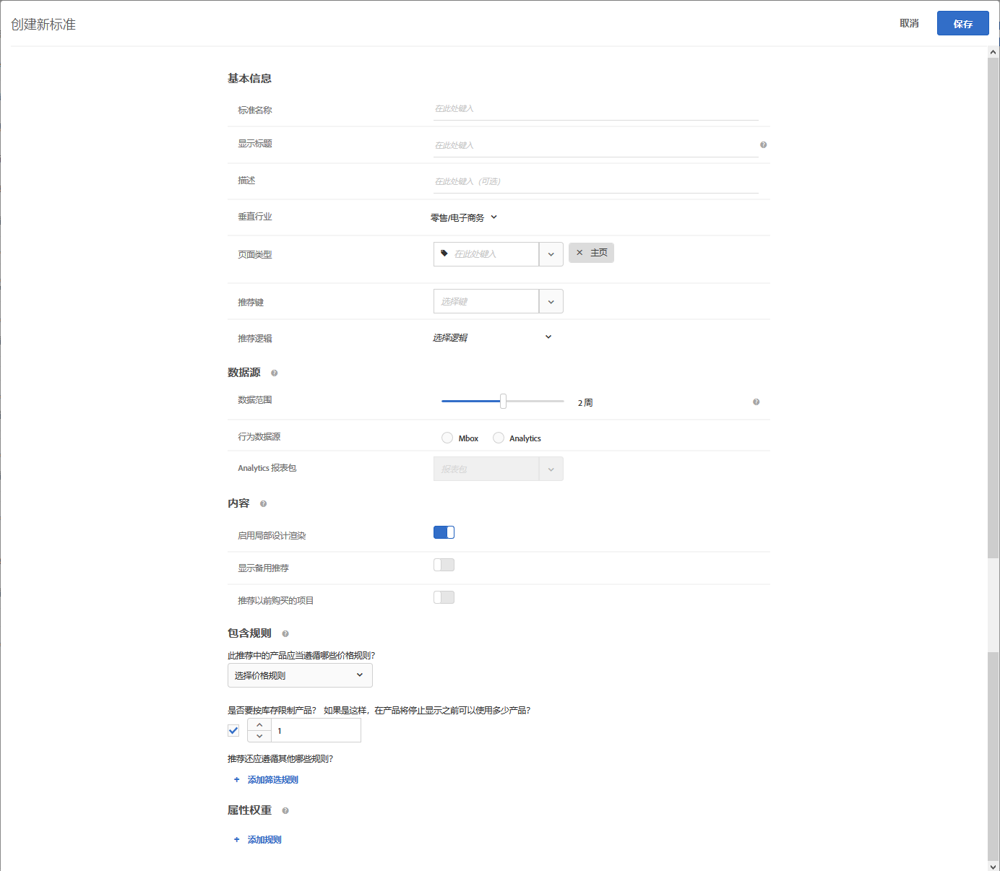

#  创建标准

中的标准 [!UICONTROL Adobe Target] [!UICONTROL Recommendations] 控制 [!UICONTROL Recommendations] 活动。 可创建标准以显示最适合您的活动的推荐。这些标准使用访客的操作来确定要显示的内容或产品。

以下各节介绍如何创建新标准。

## 访问“创建新标准”屏幕

可通过多种方式来访问“[!UICONTROL 创建新标准]”屏幕。某些屏幕选项会根据您访问该屏幕的方式而有所不同。

* 在 **[!UICONTROL Recommendations]** > **[!UICONTROL 标准]** 库屏幕，单击 **[!UICONTROL 创建标准]** > **[!UICONTROL 创建标准]**. 您在此处创建的标准会自动设置为可用于所有 [!DNL Recommendations] 活动。
* 创建 [!DNL Recommendations] 活动 [!UICONTROL 可视化体验编辑器] (VEC)，您会立即转到 [!UICONTROL 选择标准] 屏幕，在您的页面上选择元素并单击 [!UICONTROL 替换为Recommendations], [!UICONTROL 此项前插入Recommendations]或 [!UICONTROL 此项后插入Recommendations]. 然后，您可以选择可用的标准，或单击 **[!UICONTROL 创建标准]**. 如果您创建新标准，则可以选择保存标准以供与其他 [!DNL Recommendations] 活动。 有关更多信息，请参阅 [创建Recommendations活动](/help/c-recommendations/t-create-recs-activity/create-recs-activity.md).
* 编辑 [!DNL Recommendations] 活动时，在页面上的[!UICONTROL 推荐位置]框中单击，然后选择&#x200B;**[!UICONTROL 更改标准]**。在 [!UICONTROL 选择标准] 屏幕，单击 **[!UICONTROL 创建标准]**. 您将可以选择保存新建的标准，以供在其他 [!DNL Recommendations] 活动中使用。

以下步骤假定您访问 [!UICONTROL 创建新标准] 使用第一种方法进行筛选：the **[!UICONTROL Recommendations]** > **[!UICONTROL 标准]** 库屏幕。

1. 单击 **[!UICONTROL Recommendations]** > **[!UICONTROL 标准]**.

1. 单击 **[!UICONTROL 创建标准]** > **[!UICONTROL 创建标准]**.

   

1. 在以下部分中配置信息。

## [!UICONTROL 基本信息] {#info}

1. 键入&#x200B;**[!UICONTROL 标准名称]**。

   这是用于描述标准的“内部”名称。例如，您可能希望将标准命名为“利润最高的产品”，但是不希望公开显示此名称。请参阅下一步骤，以设置公开显示的标题。

   

1. 为使用该标准的所有“推荐”键入一个要在页面上公开显示的&#x200B;**[!UICONTROL 显示标题]**。

   例如，使用此标准显示推荐时，您可能想要显示“查看了这个项目，也查看了那个项目的人”或“相似产品”。

1. 键入对标准的简短&#x200B;**[!UICONTROL 描述]**。

   描述应该有助于您识别标准，并可能包含有关标准用途的信息。

1. 根据“推荐”活动的目标，选择垂直行业。

   | 垂直行业 | 目标 |
   |--- |--- |
   | 零售/电子商务 | 转化促进完成购买 |
   | 潜在客户拓展/B2B/金融服务 | 转化但不购买 |
   | 媒体/出版 | 参与度 |

   根据您选择的垂直行业，其他标准选项将会发生相应的更改。

1. 选择&#x200B;**[!UICONTROL 页面类型]**。

   您可以选择多个页面类型。

   垂直行业和页面类型可一起用于对已保存的标准进行分类，从而使其更易于在其他 [!DNL Recommendations] 活动中重复使用。

## [!UICONTROL Recommendations算法] {#rec-algo}

1. 选择 **[!UICONTROL 算法类型]** 和 **[!UICONTROL 算法]**:

   

   | 算法类型 | 何时使用 | 可用算法 |
   | --- | --- | --- |
   | [!UICONTROL 基于热门程度] | 根据网站上某个项目的整体受欢迎程度或用户最喜爱或最常查看的类别、品牌、流派等项目的受欢迎程度，提出推荐。 | <ul><li>整个网站查看次数最多</li><li>按类别查看次数最多</li><li>按项目属性查看次数最多</li><li>网站最畅销商品</li><li>按类别划分的最畅销商品</li><li>按物料属性列出的最畅销商品</li><li>按Analytics量度排名最前</li></ul> |
   | [!UICONTROL 基于项目] | 根据查找与用户当前正在查看或最近已查看的项目类似的项目来提供推荐。 | <ul><li>查看了这个项目，也查看了那个项目的人</li><li>查看了这个项目，但购买了那个项目的人</li><li>购买了这个项目，也购买了那个项目的人</li><li>具有相似属性的项目</li></ul> |
   | [!UICONTROL 基于用户] | 根据用户的行为进行推荐。 | <ul><li>最近查看的项目</li><li>为您推荐</li></ul> |
   | 基于购物车 | 根据用户的购物车内容进行推荐。 | <ul><li>查看了这些项目，也查看了这些项目的人</li><li>查看了这些项目，购买了这些项目的人</li><li>购买了这些，也购买了那些的人</li></ul> |
   | [!UICONTROL 自定义标准] | 根据您上传的自定义文件进行推荐。 | <ul><li>自定义算法</li></ul> |

   >[!NOTE]
   >
   >如果您选择 **[!UICONTROL 项目]**/ **[!UICONTROL 具有相似属性的媒体]**，则您将可以选择 [内容相似度规则](#similarity).

1. 根据需要，选择 **物料属性** 和 **要匹配的配置文件属性**, a **推荐键**, **筛选键**&#x200B;和/或 **Analytics量度** 来配置算法。

有关选择推荐键的更多信息，请参阅 [使推荐基于推荐键](/help/c-recommendations/c-algorithms/base-the-recommendation-on-a-recommendation-key.md).

## [!UICONTROL 数据源] {#data-source}

1. 选择所需的 **[!UICONTROL 行为数据源]**: [!UICONTROL Adobe Target] 或 [!UICONTROL Analytics].

   >[!NOTE]
   >
   >的 [!UICONTROL 行为数据源] 部分 [Analytics for Target](/help/c-integrating-target-with-mac/a4t/a4t.md) (A4T)。

   

   如果您选择“[!UICONTROL Analytics]”，则还应选择所需的报表包。

   如果标准使用 [!DNL Adobe Analytics] 作为行为数据源，创建标准后，其可用性的时间取决于所选报表包和回顾窗口是否已用于任何其他标准，如下所述：

   * **一次性报表包设置**：首次将报表包与给定数据范围回顾时间范围一起使用时，[!DNL Target Recommendations] 可能需要 2 到 7 天的时间才能从 [!DNL Analytics] 完全下载所选报表包的行为数据。此时间范围取决于 [!DNL Analytics] 系统负载。
   * **使用已经可用的报表包新建或编辑标准**：在创建新标准或编辑现有标准时，如果所选报表包已经与 [!DNL Target Recommendations] 一起使用，并且其数据范围等于或小于所选的数据范围，则数据立即可用，而无需一次性设置。在这种情况下，或者如果在未修改所选报表包或数据范围的情况下对算法的设置进行编辑，则该算法将在 12 小时内运行或者重新运行。
   * **持续的算法运行**：数据每天从 [!DNL Analytics] 流向 [!DNL Target Recommendations]。例如，对于[!UICONTROL 已查看的亲和度]推荐，当用户查看产品时，产品查看跟踪调用将以近实时的方式传递到 [!DNL Analytics]。[!DNL Analytics] 数据会在第二天早些时候被推送到 [!DNL Target]，然后 [!DNL Target] 会在 12 小时内运行算法。

   有关更多信息，请参阅 [将Adobe Analytics与Target Recommendations结合使用](/help/c-recommendations/c-algorithms/use-adobe-analytics-with-recommendations.md).

1. 设置 **[!UICONTROL 回顾窗口]** ，以确定在确定要显示的推荐时要使用的可用历史用户行为数据的时间范围。 此选项适用于除具有相似属性的项目和自定义算法之外的所有算法。

   

   如果您的网站拥有大量流量且行为更改频繁，请选择较短的数据范围。较短的范围可使 [!DNL Recommendations] 能够更好地响应市场和业务的变化。例如，较短的范围意味着 [!DNL Recommendations] 将在访客开始季节性购物时就检测到访客行为的变化（例如返校购物季或圣诞节），并推荐适合这些购物季的项目。

   如果您没有大量数据，或访客行为不经常更改，则您可以选择较长的范围。但是，对于许多网站，较短的范围会产生更高质量的推荐。

   可用的数据范围包括：

   | 回顾窗口选项 | 更新了频度（悬停时显示） | 支持的alogrithms |
   | --- | --- | --- |
   | 六小时 | 算法每3-6小时运行一次 | [!UICONTROL 基于热门程度] 算法 [!UICONTROL 行为数据源] is [!DNL Adobe Target] |
   | 一天 | 算法每12-24小时运行一次 | [!UICONTROL 基于热门程度] 算法 |
   | 两天 | 算法每12-24小时运行一次 | <ul><li>[!UICONTROL 基于热门程度] 算法</li><li>[!UICONTROL 基于项目] 算法</li><li>[!UICONTROL 基于用户] 算法</li><li>[!UICONTROL 基于购物车] 算法</li></ul> |
   | 一周 | 算法每24-48小时运行一次 | <ul><li>[!UICONTROL 基于热门程度] 算法</li><li>[!UICONTROL 基于项目] 算法</li><li>[!UICONTROL 基于用户] 算法</li><li>[!UICONTROL 基于购物车] 算法</li></ul> |
   | 两周 | 算法每24-48小时运行一次 | <ul><li>[!UICONTROL 基于热门程度] 算法</li><li>[!UICONTROL 基于项目] 算法</li><li>全部 [!UICONTROL 基于用户] 算法</li><li>[!UICONTROL 基于购物车] 算法</li></ul> |
   | 一个月（30天） | 算法每24-48小时运行一次 | <ul><li>[!UICONTROL 基于热门程度] 算法</li><li>[!UICONTROL 基于项目] 算法</li><li>[!UICONTROL 基于用户] 算法</li><li>[!UICONTROL 基于购物车] 算法</li></ul> |
   | 两个月（61天） | 算法每24-48小时运行一次 | <ul><li>[!UICONTROL 基于热门程度] 算法</li><li>[!UICONTROL 基于项目] 算法</li><li>[!UICONTROL 基于用户] 算法</li><li>[!UICONTROL 基于购物车] 算法</li></ul> |

## [!UICONTROL 备份内容] {#content}

[!UICONTROL 备份内容] 规则决定了如果推荐项目数量未填充您的 [推荐设计](/help/c-recommendations/c-design-overview/design-overview.md). 有可能 [!DNL Recommendations] 标准，可返回的推荐少于您的设计所需的推荐数量。 例如，如果您的设计有四个项目的版块，但您的标准仅导致推荐两个项目，则可以将剩余版块留空，可以使用备用推荐来填充额外的版块，或者您可以选择不显示推荐。

1. （可选）将 **[!UICONTROL 部分设计渲染]** 切换到“开”位置。

   将尽可能多地填充槽，但设计模板可能包含剩余槽的空白空间。 如果禁用此选项，并且没有足够的内容来填充所有可用的版块，则不会提供推荐，而是会显示默认内容。

   如果您希望推荐与空白版块一起提供，请启用此选项。 如果您希望根据您的标准在推荐推荐时段中填充内容，而空白时段中填充了您网站中类似或热门内容，请使用备用推荐，如下一步中所述。

1. （可选）将 **[!UICONTROL 显示备份内容]** 切换到“开”位置。

   在设计中的任何剩余空版块中，使用您网站上查看次数最多的产品的随机选择填充。

   使用备用推荐可确保您的推荐设计填满所有可用的版块。 假定您有4 x 1设计，如下图所示：

   

   假定您的标准仅导致推荐两个项目。 如果启用 [!UICONTROL 部分设计渲染] 选项，前两个插槽已填满，但其余两个插槽仍为空。 但是，如果启用 [!UICONTROL 显示备用Recommendations] 选项，将根据您指定的标准填充前两个版块，并根据您的备用推荐填充其余两个版块。

   下面的矩阵显示了在使用 [!UICONTROL 部分设计渲染] 和 [!UICONTROL 备份内容] 选项：

   | 局部设计渲染 | 备份内容 | 结果 |
   |--- |--- |--- |
   | 禁用 | 禁用 | 如果返回的推荐少于设计所需的推荐，则推荐设计将被替换为默认内容，并且不显示任何推荐。 |
   | 启用 | 禁用 | 设计会进行渲染，但如果返回的推荐少于设计所需的推荐，则可能包含空白区域。 |
   | 启用 | 启用 | 备用推荐将填满可用的设计“版块”，从而完全渲染您的设计。 如果将包含规则应用于备用推荐时会限制符合条件的备用推荐的数量，以致于设计无法填满，则会局部渲染设计。 如果标准未返回任何推荐，并且包含规则将备用推荐限制为零，则设计将被替换为默认内容。 |
   | 禁用 | 启用 | 备用推荐将填满可用的设计“版块”，从而完全渲染您的设计。 如果将包含规则应用于备用推荐时会限制符合条件的备用推荐的数量，以致于设计无法填满，则设计将被替换为默认内容，并且不会显示任何推荐。 |

   有关更多信息，请参阅 [使用备用推荐](/help/c-recommendations/c-algorithms/backup-recs.md).

1. （视情况而定）如果您选择 **[!UICONTROL 显示备份内容]** 在上一步中，您可以 **[!UICONTROL 将包含规则应用于备用推荐]**.

   包含规则可确定推荐中包含哪些项目。 可用的选项取决于您的垂直行业。

   有关更多详细信息，请参阅 [指定包含规则](#inclusion) 下。

1. （可选）将 **[!UICONTROL 推荐以前购买的项目]** 切换到“开”位置。

   此设置基于 `productPurchasedId`。默认行为是不推荐以前购买的项目。在大多数情况下，您不想促销客户最近购买的项目。如果您销售的是人们通常只买一次的物品，例如皮划艇，那么此选项很有用。如果您销售的是人们反复回来购买的物品，例如洗发水或其他个人物品，则应启用此选项。

## 内容相似度 {#similarity}

使用“[!UICONTROL 内容相似度]”规则，可根据项目或媒体属性进行推荐。

>[!NOTE]
>
>如果已选择 **[!UICONTROL 基于项目]**/ **[!UICONTROL 具有相似属性的媒体]** 作为“算法类型”和“算法”，您可以选择设置内容相似度规则。

内容相似度会比较项目属性关键字，并根据不同项目共有的关键字数量进行推荐。基于内容相似度的推荐不需要过去的数据便可交付高效的结果。

使用内容相似度生成推荐对于新项目尤其有效，这些新项目不可能会显示在使用“查看了这个项目，也查看了那个项目的人”**&#x200B;以及基于过去行为的其他逻辑的推荐中。您还可以使用内容相似度为没有过去购买数据或其他历史数据的新访客生成有用的推荐。

选择 **[!UICONTROL 基于项目]**/ **[!UICONTROL 具有相似属性的媒体]**，则您可以选择创建规则，以在确定推荐时提高或降低特定项目属性的重要性。 对于书籍等项目，您可能希望提升“流派”**、“作者”**、“系列”**&#x200B;等属性的重要性，以便推荐类似的书籍。

由于内容相似度使用关键字来比较项目，因此某些属性（例如“消息”**&#x200B;或“描述”**）可能会在比较中引入“干扰信息”。您可以创建规则来忽略这些属性。

默认情况下，所有属性都设置为“基准线”**。除非您要更改此设置，否则无需创建规则。

>[!NOTE]
>
>内容相似度算法可能使用随机采样来计算项目之间的相似度。 因此，项目之间的相似度等级可能会因算法运行的不同而有所不同。

## 包含规则 {#inclusion}

一些选项可帮助您缩小在推荐中显示的项目范围。您可以在创建标准或促销活动时使用包含规则。

包含规则是可选的；但是，通过设置这些详细信息，您可以更好地控制推荐中显示的项目。配置的每个详细信息都会进一步限定显示条件。

例如，您可以选择仅显示库存超过 50 双且价格在 25 美元至 45 美元之间的女鞋。您还可以对每个属性设置权重，以使对您的业务更为重要的项目最有可能显示出来。

再比如，您可以选择向仅从某些城市访问您的网站并且具有所需大学学位的访客显示职位空缺。

包含规则选项会因垂直行业而异。默认情况下，包含规则会应用于备用推荐。

>[!IMPORTANT]
>
>您应谨慎使用包含规则。在某些情况下动态属性筛选非常有用，例如您的组织设置了一些规则，要求不推荐某个品牌但显示另一品牌。但是，此功能存在机会成本。通过限制某些项目使其不显示（按活动标准通常会显示这些项目），您可能会损失一定比例的提升度。

包含规则会使用“与”连接在一起。所有规则都必须得到满足，才能在推荐中包含某个项目。

如前所述，要创建一个简单的包含规则以仅显示库存超过 50 双且价格在 25 美元至 45 美元之间的女鞋，请执行以下步骤：

1. 设置您要推荐的产品的价格范围。
1. 设置您要推荐的产品的最低库存量。
1. 将推荐配置为仅显示满足特定条件的项目。

   

   您可以指定仅当列表中的某个属性符合或不符合一个或多个指定的条件时才包含项目。

   可用的计算器取决于您在第一个下拉列表中选择的值。您可以列出多个项目。这些项目会使用“或”进行评估。

   多个规则会使用“与”连接在一起。

   >[!NOTE]
   >
   >此选项限制了在推荐中显示的项目数。它不影响推荐在哪些页面上显示。要限制显示推荐的位置，请在体验编辑器中选择页面。

有关更多信息，请参阅 [使用动态和静态包含规则](/help/c-recommendations/c-algorithms/use-dynamic-and-static-inclusion-rules.md).

## 属性权重 {#weighting}

您可以添加多个规则，以根据有关内容目录的重要信息或元数据“微移”算法，这样某些项目更有可能显示。

例如，您可以对促销项目应用更高的权重，以便它们更频繁地显示在推荐中。非促销项目不会完全排除，但它们的显示频率会降低。可以将多个加权属性应用到同一算法，并且可以在推荐中对拆分流量测试加权属性。

1. 选择一个值。

   该值会根据多个可用标准中的一个标准确定更有可能显示的项目类型。

1. 选择计算器。

1. 键入关键字以完成规则属性。

   例如，完整的规则可能是“类别包含子字符串鞋”。

   

1. 选择要分配给规则的权重。

   选项介于 0 到 100 之间，增量为 25。

1. 如果需要，添加其他规则。

完成后，单击&#x200B;**[!UICONTROL 保存]**。

如果您是在创建新的“[!UICONTROL 推荐]”活动或编辑现有活动，则默认情况下会选中&#x200B;**[!UICONTROL 保存标准供以后使用]**&#x200B;复选框。如果您不想在其他活动中使用该标准，请在保存前清除该复选框。

## 培训视频：在Recommendations中创建标准(12:33) 

本视频包含以下信息：

* 创建标准
* 创建标准序列
* 上传自定义标准

>[!VIDEO](https://video.tv.adobe.com/v/27694?quality=12)
