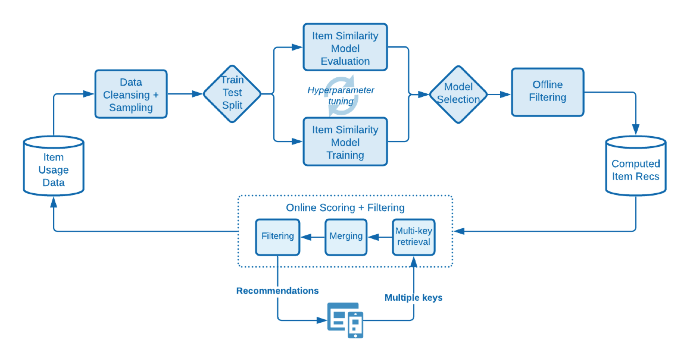

#  Recommendations算法背后的科学

对中使用的算法的深入描述 [!DNL Adobe Target Recommendations]包括模型训练的逻辑和数学细节以及模型服务过程。

模型培训是指在 [!DNL Adobe Target] 学习算法。 模型服务就是 [!DNL Target] 向网站访客提供推荐（也称为内容交付）。

[!DNL Target] 在 [!DNL Recommendations]:

* **基于项目的算法**:包括遵循逻辑“查看/购买此项目的用户也查看/购买了这些项目”的算法。 这些算法分组在“伞形项 — 项”协同过滤下，以及 [!UICONTROL 具有相似属性的项目] 算法。

* **基于用户的算法**:包括 [!UICONTROL 最近查看的] 和 [!UICONTROL 为您推荐] 算法。

* **基于热门程度的算法**:包括算法，可返回网站中查看次数最多或购买次数最多的项目，或按类别或项目属性返回查看次数最多或购买次数最多的项目。

* **基于购物车的算法**:包括基于多项目的推荐，其逻辑为“查看/购买了这些项目，也查看/购买了这些项目的人”。

* **自定义标准**:根据上传到的自定义文件包含推荐 [!DNL Target].

>[!NOTE]
>
>有关每种算法类型和各种算法的更多常规信息，请参阅 [使推荐基于推荐键](/help/c-recommendations/c-algorithms/base-the-recommendation-on-a-recommendation-key.md).

上面列出的许多算法都基于一个或多个密钥的存在。 这些键用于在内容交付时（在推荐时）检索类似项目。 客户指定的键值可以包括访客正在查看的当前项目、查看或购买的上一个项目、最常查看的项目、当前类别或该访客最喜爱的类别。 其他算法（例如基于购物车或基于用户的推荐）使用隐式键（客户无法配置）。 有关更多信息，请参阅 *推荐键*，在 [使推荐基于推荐键](/help/c-recommendations/c-algorithms/base-the-recommendation-on-a-recommendation-key.md#keys). 但请注意，这些键值仅与模型提供时间（内容交付）相关。 这些键不会影响“离线”或模型培训时间逻辑。

以下各节将以与上述算法类型稍有不同的方式对算法进行分组。 以下分组是基于模型训练逻辑的相似性。

## 物料 — 物料协同筛选

算法包括：

* [!UICONTROL 查看了这个项目，也查看了那个项目的人]
* [!UICONTROL 查看了这个项目，但购买了那个项目的人]
* [!UICONTROL 购买了这个项目，也购买了那个项目的人]

项目 — 项目协作筛选推荐算法基于这样的想法：您应使用许多用户的行为模式（由此实现协作）来为给定项目提供有用的推荐（例如，筛选可能要推荐的项目目录）。 尽管有许多不同的算法属于 [协同过滤](https://en.wikipedia.org/wiki/Collaborative_filtering)，这些算法会普遍使用行为数据源作为输入。 在 [!DNL Target Recommendations]，则这些输入是指用户对项目的独特查看和购买。

对于“查看/购买此项目的人员也查看/购买了这些项目”算法，其目标是计算所有对项目之间的相似度s(A、B)。 对于给定项目A，则排名最前的推荐按其相似度s(A，B)进行排序。

此类相似性的一个示例是项目之间的共现情况：购买了这两个项目的用户数量的简单计数。 尽管这种量度很直观，但它偏向于推荐热门项目，因此这种量度很幼稚。 例如，如果在一家杂货店，大多数人都购买面包，面包与所有商品的共存度会很高，但它不一定是一个好推荐。 [!DNL Target] 相反，会使用更复杂的相似度量度，称为对数似然比(LLR)。 当A和B两个项目（共同出现）的概率与它们不共同出现的概率大不相同时，此数量会很大。 为具体起见，请考虑 [!UICONTROL 查看了这个项目，但购买了那个项目的人] 算法。 如果购买B的概率与某人是否查看了A无关，则LLR的相似性会很大。

例如，如果

则不应将项目B与项目A一起推荐。提供了此对数似然比相似度计算的完整详细信息 [在此PDF中](/help/c-recommendations/c-algorithms/assets/log-likelihood-ratios-recommendation-algorithms.pdf).

以下示意图中显示了实际算法实现的逻辑流程：

这些步骤的详细信息如下：

* **输入数据**:行为数据，以在您收集的访客的查看次数和购买次数的形式显示 [实施Target](/help/c-recommendations/plan-implement.md#pass-behavioral) 或 [Adobe Analytics](/help/c-recommendations/c-algorithms/use-adobe-analytics-with-recommendations.md).

* **模型培训**:

   * **数据清理和采样**:对于具有N天回顾时间的算法，首先会过滤行为数据，以仅包含那些N天的数据。 然后，会应用收集规则和全局排除来删除任何不应推荐的项目。 最后，任何与1,000多个项目进行交互的访客的使用数据都只采样到1,000个项目。
   * **项目相似度计算**:这是核心计算步骤：通过此相似度得分计算所有候选项目对之间的对数似然比相似度，并对项目对进行排名。
   * **脱机过滤**:最后，应用任何其他适用的动态过滤器（例如，动态类别排除）。 在此步骤之后，会全局缓存预计算的推荐以便提供。

* **模型服务**:Recommendations内容从 [!DNL Target]&#39;s [全局“边缘”网络](/help/c-intro/how-target-works.md#concept_0AE2ED8E9DE64288A8B30FCBF1040934). 在向 [!DNL Target] 并且确定应将推荐内容交付到页面，以请求适当的 [项目键](/help/c-recommendations/c-algorithms/base-the-recommendation-on-a-recommendation-key.md#keys) 对于，将从请求中解析或从用户配置文件中查找推荐算法，然后使用该算法检索在前面的步骤中计算的推荐。 此时，会在适当的 [设计](/help/c-recommendations/c-design-overview/create-design.md) 呈现。

## 内容相似度

算法包括：

* [!UICONTROL 具有相似属性的项目]

在此类算法中，如果两个项目的名称和文本描述语义上相似，则两个项目会被视为相关项目。 与必须使用行为数据源的大多数推荐算法不同，内容相似度算法使用产品目录中的元数据来推导项目之间的相似度。 [!DNL Target] 因此，能够在所谓的“冷启动”场景中推荐，在该场景中，未收集任何行为数据(例如，在 [!DNL Target] 活动)。

尽管 [!DNL Target]其内容相似度算法与其他基于项目的算法相同，模型训练步骤截然不同，涉及一系列自然语言处理和预处理步骤，如下图所示。 相似度计算的核心是使用修改的tf-idf向量的余弦相似度来表示目录中的每个项目。

这些步骤的详细信息如下：

* **输入数据**:如前所述，此算法完全基于目录数据(摄取到 [!DNL Target] 通过 [目录馈送、实体API或页面上的更新](/help/c-recommendations/plan-implement.md#rec-catalog).

* **模型培训**:

   * **属性提取**:在应用常规静态过滤器、目录规则和全局排除后，该算法从实体模式中提取相关的文本字段。 [!DNL Target] 自动使用实体属性中的名称、消息和类别字段，并尝试从自定义中提取任何字符串字段 [实体属性](/help/c-recommendations/c-products/entity-attributes.md). 此过程的完成方式是确保该字段的大多数值不可作为数字、日期或布尔值。
   * **词干和止词删除**:为了更准确地匹配文本相似度，请务必删除非常常见的“停止”字词，这些字词不会显着改变项目的含义（例如，“was”、“is”、“and”等）。 同样，词干词是指在词根词后缀不同的词减少过程，其含义相同(例如，“connect”、“connecting”和“connection”都具有相同的根词：“连接”)。 [!DNL Target] 用雪球锤。 [!DNL Target] 首先执行自动语言检测，并可以对多达50种语言和18种语言执行停止词汇删除。
   * **n-gram创建**:在上述步骤之后，每个词都会被视为令牌。 将连续的令牌序列合并为单个令牌的过程称为n-gram创建。 [!DNL Target]的算法考虑的最多为2克。
   * **tf-idf计算**:下一步涉及创建tf-idf矢量，以反映令牌在项目描述中的相对重要性。 对于项目i中的每个令牌/术语t，在目录D中使用 |D|项，首先计算术语频度TF(t，i)（该术语在项i中出现的次数），以及文档频度DF(t，D)。 实质上，令牌存在的项数。 然后，将tf-idf测量

      

      [!DNL Target] 使用Apache Spark的 *tf-idf* 功能实施，该实施在hood下将每个令牌哈希为218个令牌空间。 在此步骤中，还通过根据 [标准](/help/c-recommendations/c-algorithms/create-new-algorithm.md#similarity).

   * **项目相似度计算**:最终项目相似度计算是使用近似余弦相似度来完成的。 对于两个项目， *A* 和 *B*，对于向量tA和tB，余弦相似度定义为：

      

      为避免在计算所有N x N项之间的相似性时出现显着的复杂性， *tf-idf* 矢量被截断为仅包含其最大500个条目，然后使用此截断矢量表示计算项目之间的余弦相似度。 与其他近似近邻(ANN)技术（如局部敏感哈希）相比，该方法对稀疏向量相似度计算更加稳健。

* **模型服务**:此过程与上一节所述的物料 — 物料协同筛选技术相同。

## 多键推荐

算法包括：

* 基于购物车的推荐
* [!UICONTROL 推荐给您]

最近添加的 [!DNL Target] 推荐算法包包括 [!UICONTROL 推荐给您] 以及一系列基于购物车的推荐算法。 这两种算法都使用协作筛选技术来形成基于项目的单个推荐。 然后，在服务时，用户浏览历史记录中的多个项目(对于 [!UICONTROL 推荐给您])，或者用户当前的购物车（对于基于购物车的推荐）用于检索这些基于项目的推荐，这些推荐随后会进行合并以形成推荐的最终列表。 请注意，存在多种类型的个性化推荐算法。 选择多键算法意味着，在访客具有任何浏览历史记录且推荐可以更新以响应最新访客行为后，便可立即使用推荐。

这些算法基于基于项目的推荐部分中描述的基本协作筛选技术，但也加入了超参数调整以确定项目之间的最佳相似度量度。 该算法对每个用户的行为数据按时间顺序进行拆分，并在尝试预测用户稍后查看或购买的项目时对早期数据训练推荐模型。 可产生最佳值的相似度量度 [平均精度](https://en.wikipedia.org/wiki/Evaluation_measures_(information_retrieval)#Mean_average_precision) 选择。

以下图表显示了模型培训和评分步骤的逻辑：

这些步骤的详细信息如下：

* **输入数据**:这与项目 — 项目协作过滤(CF)方法相同。 [!UICONTROL 都建议您] 和基于购物车的算法使用行为数据，以在您 [实施Target](/help/c-recommendations/plan-implement.md#pass-behavioral) 或 [Adobe Analytics](/help/c-recommendations/c-algorithms/use-adobe-analytics-with-recommendations.md).

* **模型培训**:

   * **数据清理和采样**:这同样与协作筛选方法相同，协作筛选方法会应用回顾窗口将行为数据筛选到适当的日期范围，然后应用目录规则和全局排除。 与超过1,000个项目进行交互的访客，只考虑其最近的1,000个使用实例。
   * **列车测试分体**:对每个用户的使用情况按时间顺序进行拆分，将其前80%的使用情况分配给培训数据，其余20%分配给测试数据。
   * **项目相似度模型训练**:核心项目相似度计算的不同之处在于 [!UICONTROL 推荐给您] 和基于购物车的算法。 对于 [!UICONTROL 推荐给您]，则项目矢量具有维度NUsers，其中每个条目表示该项目用户的隐式评级总和 — 购买项目的权重为项目查看次数的2倍。 对于基于购物车的推荐，项目矢量包含二进制条目；如果仅考虑会话内行为，则每个会话都有一个新条目。 否则，此项目矢量中会有每个访客对应的条目。

   训练步骤会计算几种类型的矢量相似度：LLR相似度([此处讨论](/help/c-recommendations/c-algorithms/assets/log-likelihood-ratios-recommendation-algorithms.pdf))、余弦相似度（以前定义）和标准化的L2相似度，定义如下：

   

   * **项目相似度模型评估**:模型评估是采用上一步中生成的推荐对测试数据集进行预测。 通过在测试数据集中按时间顺序排列每个用户的项目使用情况，然后对项目的排序子集提出100条建议，以尝试预测后续的查看和购买，从而模拟在线评分阶段。 信息检索量度， [平均精度](https://en.wikipedia.org/wiki/Evaluation_measures_(information_retrieval)#Mean_average_precision))来评估这些推荐的质量。 此量度会考虑推荐的顺序，并且青睐推荐列表中排名靠前的相关项目，这是对系统进行排名的重要属性。
   * **模型选择**:离线评估后，将选择平均精度最高的模型，并为其计算所有单个项目 — 项目推荐。
   * **脱机过滤**:模型训练的最后阶段是应用任何适用的动态滤波器。 在此步骤之后，会全局缓存预计算的推荐以便提供。

* **模型服务**:与以前的算法不同，在这些算法中，为推荐提供服务需要指定一个用于检索的密钥，然后应用业务规则。 [!UICONTROL 为您推荐] 而基于购物车的算法则采用更复杂的运行时过程。

   * **多键检索与合并**:对于基于购物车的推荐，购物车中传递的最多十个项目将被视为检索的键值，而每个项目的推荐的权重均等。 对于 [!UICONTROL 为您推荐]，最多可将最近查看的五个独特项目和最近五个独特购买项目视为检索关键项，而由购买项目产生的推荐的权重是由已查看项目产生的推荐的两倍。 在合并推荐时，如果某个项目出现在多个单独的推荐列表中，则会添加其加权相似度得分。 此阶段的最终推荐列表是经过重新加权的推荐合并列表，按降序排列。
   * **筛选**:接下来，将应用筛选规则（如删除以前查看和/或购买的项目）以及其他动态业务规则。

以下图像说明了这些过程，访客在其中查看了项目A和购买的项目B。可使用每个项目标签下方显示的离线相似度得分来检索各个推荐。 检索后，推荐会与加权相似度得分合并。 最后，在客户指定之前查看过和购买过的项目必须过滤掉的情况下，过滤步骤会从推荐列表中删除项目A和B。

## 基于热门程度

算法包括：

* [!UICONTROL 整个网站查看次数最多]
* [!UICONTROL 按类别查看次数最多]
* [!UICONTROL 按项目属性查看次数最多]
* [!UICONTROL 网站最畅销商品]
* [!UICONTROL 按类别划分的最畅销商品]
* [!UICONTROL 按物料属性列出的最畅销商品]

[!DNL Target] 为查看次数最多的项目以及网站中最畅销的项目提供基于热门程度的算法，或按项目属性或类别划分。 基于热门程度的算法根据给定时间段内查看或购买该项目的会话数对项目进行排名。

所有这些算法都会合并聚合行为数据，其中查看和购买项目的会话总数会以每小时和每天的分辨率进行记录。 然后，各个算法会针对客户配置的回顾窗口查找查看次数最多或购买次数最多的项目。

算法的细微差别如下：

* [!UICONTROL 整个网站查看次数最多] 和 [!UICONTROL 网站最畅销商品] 按分别查看或购买这些项目的会话总数对项目进行排名。 输出是推荐项目的单个（无键）列表。
* “按类别/项目属性查看次数最多/最畅销商品”是推荐，其中项目按查看或购买这些项目的会话总数进行排序，但按项目类别或特定项目属性分组。 输出是推荐项目列表，按类别值或项目属性值进行键值。

## 最近查看的

“最近查看的”推荐算法允许对推荐进行会话内个性化。 此算法不需要离线“模型培训”。 相反， [!DNL Target] 使用唯一 [访客资料](/help/c-target/c-visitor-profile/visitor-profile.md) 以维护在给定会话中已查看并可在“推荐”活动中显示这些项目的运行列表。 这允许对推荐和下一页个性化进行实时更新。

## 自定义标准

自定义标准允许客户 [将自己的推荐上传到 [!DNL Target]](/help/c-recommendations/c-algorithms/recommendations-csv.md)，提供重要的灵活性并允许“自带模型”功能。 自定义标准将替换 [!UICONTROL 基于项目] 推荐，但其行为与在线内容交付阶段基于项目的推荐算法类似，即使用单个键值检索推荐，然后应用业务规则/过滤器。