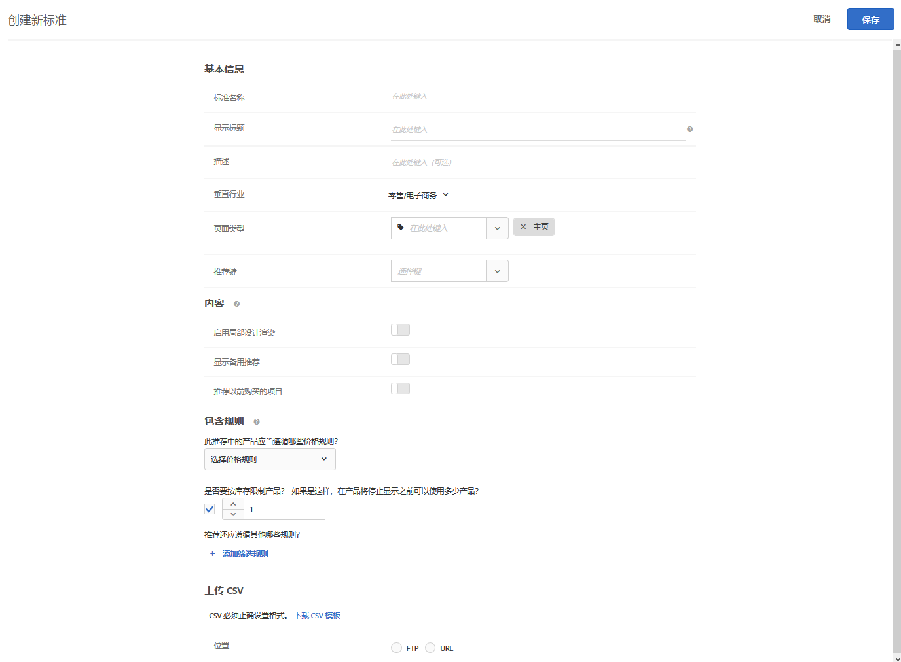

#  上传自定义标准{#upload-custom-criteria}

可上传 CSV 文件以自定义您的推荐。

可通过多种方式来访问“[!UICONTROL 创建新标准]”屏幕。某些屏幕选项会根据您访问该屏幕的方式而有所不同。

* 创建“[!UICONTROL 推荐]”活动时，在“**[!UICONTROL 选择标准]”屏幕上单击**[!UICONTROL 新建]。您将可以选择保存新建的标准，以供在其他“[!UICONTROL 推荐]”活动中使用。
* 编辑[!UICONTROL 推荐]活动时，在页面上的[!UICONTROL 推荐位置]框中单击，然后选择&#x200B;**[!UICONTROL 更改标准]**。在[!UICONTROL 选择标准]屏幕上，单击&#x200B;**[!UICONTROL 新建]**。您将可以选择保存新建的标准，以供在其他“[!UICONTROL 推荐]”活动中使用。
* 在&#x200B;**[!UICONTROL 推荐]** &gt; **[!UICONTROL 标准]**&#x200B;库屏幕上，单击&#x200B;**[!UICONTROL 创建标准]**。您在此处创建的标准会自动设置为可用于所有“[!UICONTROL 推荐]”活动。

1. 单击&#x200B;**[!UICONTROL 创建标准]**。

   

1. 选择&#x200B;**[!UICONTROL 上传自定义标准]**。

   

1. 键入&#x200B;**[!UICONTROL 标准名称]**。

   这是用于描述标准的“内部”名称。例如，您可能希望将标准命名为“利润最高的产品”，但是不希望公开显示此名称。请参阅下一步骤，以设置公开显示的标题。
1. 为使用该标准的所有“推荐”键入一个要在页面上公开显示的&#x200B;**[!UICONTROL 显示标题]**。

   例如，使用此标准显示推荐时，您可能想要显示“查看了这个项目，也查看了那个项目的人”或“相似产品”。
1. 键入对标准的简短&#x200B;**[!UICONTROL 描述]**。

   描述应该有助于您识别该标准，并且可以包含与标准用途相关的信息。
1. 选择&#x200B;**[!UICONTROL 垂直行业]**。

   根据您选择的垂直行业，其他标准选项可能会发生相应的更改。1. 选择&#x200B;**[!UICONTROL 页面类型]**。

   您可以选择多个页面类型。

   垂直行业和页面类型可一起用于对已保存的标准进行分类，从而使其更易于在其他“[!UICONTROL 推荐]”活动中重复使用。
1. 选择&#x200B;**[!UICONTROL 推荐键]**。

   有关基于键的标准的更多信息，请参阅[使推荐基于推荐键](../../c-recommendations/c-algorithms/create-new-algorithm.md#task_2B0ED54AFBF64C56916B6E1F4DC0DC3B)。
1. 设置&#x200B;**[!UICONTROL 内容]**&#x200B;规则。

   内容规则用于确定当推荐的项目数量不足以填满您的设计时，将发生什么情况。例如，如果您的设计有五个项目的空间，但您的标准只会导致推荐三个项目，那么您可以将剩余的空间留空，也可以使用备用推荐来填满额外的空间。选择相应的切换开关。请参阅[内容设置](../../c-recommendations/c-algorithms/create-new-algorithm.md#concept_BC16005C7A1E4F1A87E33D16221F4A96)。
1. 设置&#x200B;**[!UICONTROL 包含规则]**。

   包含规则可帮助您缩小在推荐中显示的项目范围。请参阅[包含规则](../../c-recommendations/c-algorithms/create-new-algorithm.md#task_28DB20F968B1451481D8E51BAF947079)。1. 选择 CSV 文件的&#x200B;**[!UICONTROL 位置]**。

   要成功上传，CSV 文件的格式设置必须正确。单击&#x200B;**[!UICONTROL 下载 CSV 模板]，可获取格式正确的 CSV 文件。**

   您可以选择以下两个位置：

   * **FTP：**&#x200B;要通过 FTP 服务器上传 CSV 文件，请选择 **[!UICONTROL FTP]**，然后输入所需信息。您可以选择使用 SSL，SSL 会使用 FTPS 协议安全地传输 CSV 文件。
   * **URL：**&#x200B;要通过 URL 上传 CSV 文件，请选择 **[!UICONTROL URL]**，然后输入一个信息源 URL。

1. 单击&#x200B;**[!UICONTROL 保存]**。

   >[!NOTE]
   >
   >自定义标准实体（行）最多可包含 1,000 个推荐项目（列）。

自定义标准更新默认为“累计”。CSV 上传文件中指定的新键值对会覆盖现有的键值对。Existing key-value pairs that don't have keys specified in the CSV upload will still be available for delivery and will expire in 31 days from the time they are last uploaded as part of the CSV file.

要使设置能够放弃下一次 CSV 上传中未包含的现有结果，请与客户关怀团队联系。如果启用此设置，则只有自定义 CSV 信息源文件中存在的键才可用于交付。此设置适用于所有自定义标准。

自定义标准信息源每 24 小时更新一次。

您可以在“推荐”&gt;“标准”页面上各标准卡片的底部查看自定义标准的上传状态和同步状态。您还可以在编辑自定义标准时在“编辑”对话框中查看状态。

正确无误的上传流程应当为“已计划”&gt;“正在下载信息源文件”&gt;“正在导入”&gt;“成功”。

如果 Target 遇到与上传有关的问题，您可能会收到以下错误消息：

| 错误消息 | 详细信息 |
|--- |--- |
| 未知错误 | 指示出现内部技术错误。 |
| 解析错误 | 信息源文件格式可能出现问题。请更正文件格式，然后重新保存算法，这将重新启动文件下载流程。 |
| 未找到服务器 | 请提供 Internet 上可见的 IP 或主机名称。 |
| 凭据错误 | 请提供服务器上某个活跃帐户的有效用户名和密码。 |
| 未找到目录 | 请提供服务器上存在的目录。 |
| 未找到文件 | 请提供服务器上所指示目录中存在的文件名称。 |

## Training video: Create criteria in Recommendations (12:33)

此视频包含以下信息：

* 创建标准
* 创建标准序列
* 上传自定义标准

>[!VIDEO](https://video.tv.adobe.com/v/27694?quality=12&captions=chi_hans)