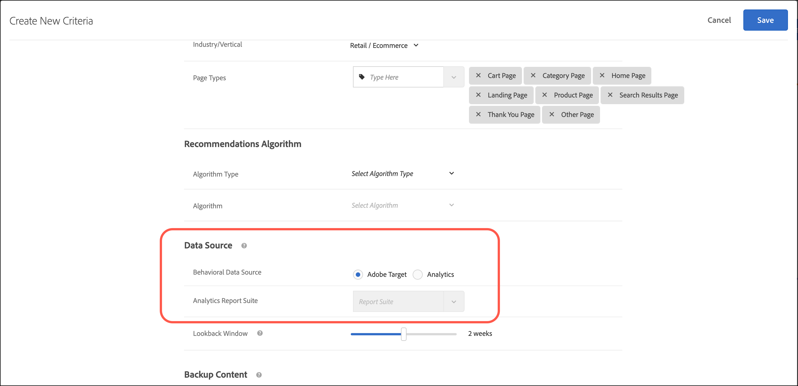

#  使用 [!DNL Adobe Analytics] with [!DNL Recommendations]

使用 [!DNL Adobe Analytics] 作为行为数据源，允许客户使用 [!DNL Analytics] in [!DNL Adobe Target] [!DNL Recommendations] 活动。 当 [!DNL Target Recommendations] 设置是新的，并且 [!DNL Analytics] 有大量历史数据可供使用。

使用 [!DNL Analytics] 因为行为数据源可以充当有关用户行为的丰富信息源。 此信息可能包括来自第三方源或仅与共享的馈送的数据 [!DNL Analytics].

While [创建标准](/help/c-recommendations/c-algorithms/create-new-algorithm.md) in [!DNL Recommendations]，可通过两个单选按钮选择要使用的数据源： [!UICONTROL mboxes] 或 [!UICONTROL Analytics]. 要创建标准，请单击 [!UICONTROL Recommendations] > [!UICONTROL 标准] > [!UICONTROL 创建标准] > [!UICONTROL 创建标准]. 有关更多信息，请参阅[创建标准](/help/c-recommendations/c-algorithms/create-new-algorithm.md)。

>[!NOTE]
>
>如果这两个按钮未在您的帐户中显示，请联系 [客户关怀](/help/cmp-resources-and-contact-information.md#reference_ACA3391A00EF467B87930A450050077C).

## Target中Analytics数据的用例

使用 [!DNL Analytics] 作为推荐的行为数据源，您还可以部署特定用例，而无需使用所有 [!DNL Target] 实体参数。 尽管这要求满足一定的先决条件，但“产品变量”的可用性是该功能无缝运行的最重要因素。 常规eVar和Prop不足以使这种握手在 [!DNL Analytics] 和 [!DNL Target].

您可以使用 [!DNL Analytics] 作为行为数据源：

* 在零售网站上根据其他用户上个月从同一类别购买的商品，使用 [!DNL Analytics] 数据。
* 根据 [!DNL Analytics] 数据。

## 实施 [!DNL Analytics]

以下部分可帮助您在 [!DNL Analytics] 侧。

### 先决条件：在 [!DNL Analytics]

在中实施产品变量 [!DNL Analytics] 具有 [!DNL Target Recommendations].

A [!DNL Target Recommendations] 示例信息源格式用作指南，在指南中必须在产品变量中定义所有属性。 以后，这些值必须在 [!DNL Target] 各自的UI [!DNL Target] 实体值。

>[!NOTE]
>
>如果内容网站是内容网站，则相应的内容片段必须被视为“产品”，并且有关该内容的关联属性必须作为属性传递。 此类属性可以包括作者名称、发布日期、内容标题、发布月份等。 类别级别或类别类型的粒度应由业务根据用例要求确定。

有关如何设置产品变量的更多详细信息，请参阅 [产品](https://experienceleague.adobe.com/docs/analytics/implementation/vars/page-vars/products.html) 在 *实施Adobe Analytics* 的双曲余切值。 该文档中的某些注释需要由部署该注释的团队自行决定(例如：类别)。 我们始终建议与 [!DNL Adobe] 执行此活动之前，请执行以下操作：

### 注意事项

[!DNL Analytics] 数据通过每日馈送发送。 行为结果可能需要长达24小时才能反映在网站上的推荐结果中。 与所有 [!DNL Recommendations] 标准设置中，此数据源可以且应该进行测试。

为了快速决策要使用哪个数据源，如果用户每天生成的自然数据过多，并且对历史数据的依赖性不大，则使用 [!DNL Target] mbox作为行为数据源非常适合。 如果最近生成的有机数据的可用性较低，如果您希望依赖 [!DNL Analytics] 数据，然后使用 [!DNL Analytics] 因为行为数据源非常适合。

现在该在 [!DNL Target] 连续提供行为数据的侧面。

## 在中实施 [!DNL Target]

1. 在 [!DNL Target]，单击 **[!UICONTROL Recommendations]**，然后单击 **[!UICONTROL 信息源]** 选项卡。

   

1. 单击 **[!UICONTROL 创建信息源]**.

1. 选择 **[!UICONTROL Analytics分类]**，然后指定报表包。

   

1. 单击 **[!UICONTROL 下一个]** 向 **[!UICONTROL 计划]** 设置，请为馈送选择一个频率段：

   * [!UICONTROL 每日]
   * [!UICONTROL 每周]
   * [!UICONTROL 每2周]
   * [!UICONTROL 从不]

   您还可以选择一天中的时间来处理馈送。

1. 单击 **[!UICONTROL 下一个]** 向  **[!UICONTROL 映射]** 设置，然后将字段列标题映射到相应的 [!UICONTROL Recommendations] 字段名称。

   

1. 单击&#x200B;**[!UICONTROL 保存]**。

## 常见问题解答

在使用时请考虑以下常见问题解答 [!DNL Analytics] with [!DNL Target]:

### 是 `entity.id` 和 `entity.categoryId` 在 [!DNL Target] mbox调用？

是，这两个值仍然是必需的。 其余的属性可通过 [!DNL Analytics] 信息源，如本文档中所述。

### 我是否可以使用动态包含规则，例如实体参数与使用 [!DNL Analytics] 信息源方法？

是的，你可以。 在使用 [!DNL Target] 独立。 但是，在这种情况下，您必须注意时间因素。 应该与配置文件变量匹配的实体变量取决于可能在页面稍后显示的数据层。
