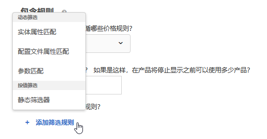
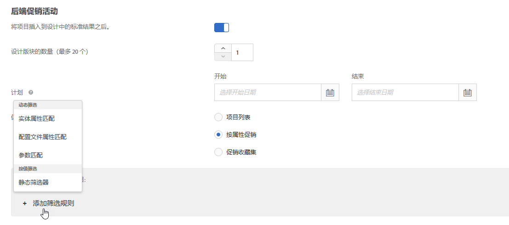
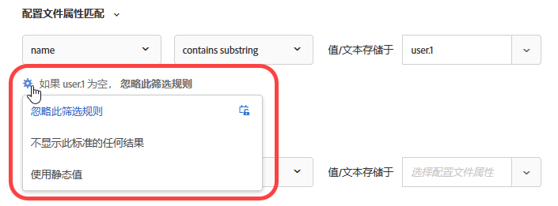

#  使用动态和静态包含规则{#use-dynamic-and-static-inclusion-rules}

此信息介绍了如何为标准和促销活动创建包含规则，以及如何添加更多动态或静态筛选规则以获取更好的结果。

如用例和示例所述，针对标准和促销活动创建和使用包含规则的过程类似。本主题介绍了标准和促销活动以及对包含规则的使用。

## 将筛选规则添加到标准 {#section_CD0D74B8D3BE4A75A78C36CF24A8C57F}

[创建标准](../../c-recommendations/c-algorithms/create-new-algorithm.md#task_8A9CB465F28D44899F69F38AD27352FE)时，单击&#x200B;**[!UICONTROL 包含规则]**&#x200B;下的&#x200B;**[!UICONTROL 添加筛选规则]**。



可用选项取决于所选垂直行业和推荐键。

## 将筛选规则添加到促销活动 {#section_D59AFB62E2EE423086281CF5D18B1076}

[创建促销活动](../../c-recommendations/t-create-recs-activity/adding-promotions.md#task_CC5BD28C364742218C1ACAF0D45E0E14)时，选择&#x200B;**[!UICONTROL 按属性促销]**，然后单击&#x200B;**[!UICONTROL 添加筛选规则]**。



## 筛选类型 {#section_0125F1ED10A84C0EB45325122460EBCD}

下表列出了标准和促销活动的筛选选项类型：

| 类型 | 选项 | 可用运算符 |
|--- |--- |--- |
| **动态筛选** | **实体属性匹配：**&#x200B;通过将潜在推荐项目池与用户交互的特定项目进行比较来进行动态筛选。<br>例如，只推荐与当前项目品牌相匹配的项目。 | 等于<br>不等于<br>介于<br>包含<br>不包含<br>始于<br>止于<br>值存在<br>值不存在<br>大于或等于<br>小于或等于 |
|  | **配置文件属性匹配：**&#x200B;通过比较项目（实体）与用户配置文件中的值来进行动态筛选。<br>例如，只推荐与访客最喜爱的品牌相匹配的项目。 | 等于<br>不等于<br>包含<br>不包含<br>始于<br>止于<br>大于或等于<br>小于或等于<br>介于 |
|  | **参数匹配：**&#x200B;通过比较项目（实体）与请求中的值（API 或 mbox）来进行动态筛选。<br>例如，只推荐与“行业”页面参数相匹配的内容。<br>**重要信息：**&#x200B;如果该活动于 2016 年 10 月 31 日之前创建，则当它使用“参数匹配”筛选器时，交付将会失败。要解决此问题，请执行以下操作：<ul><li>创建一个新的活动并在其中添加您的标准。</li><li>使用不包含“参数匹配”筛选器的标准。</li><li>从您的标准中删除“参数匹配”筛选器。</li></ul> | 等于<br>不等于<br>包含<br>不包含<br>始于<br>止于<br>大于或等于<br>小于或等于<br>介于 |
| **按值筛选** | **静态筛选器：**&#x200B;手动输入一个或多个静态值进行筛选。<br>例如，只推荐美国电影协会 (MPAA) 评级为“G”或“PG”的内容。 | 等于<br>不等于<br>包含<br>不包含<br>始于<br>止于<br>值存在<br>值不存在<br>大于或等于<br>小于或等于 |

>[!NOTE]
>
>如果您熟悉 Target 17.6.1 版本（2017 年 6 月）之前的包含规则配置方式，那么您可能会注意到一些选项和运算符已经发生了变化。为了更加一致和直观，现在，只有那些适用于选定选项的运算符才会显示，而且部分运算符进行了重命名（“匹配”现在为“等于”）。此版本之前创建的所有已有排除规则均会迁移到新的结构中。您不需要重新调整结构。

您可以根据需要创建不限数量的包含规则。包含规则使用“与”运算符进行结合。所有规则都必须得到满足，才能在推荐中包含某个项目。

动态标准和促销活动比静态标准和促销活动更强大，可产生更好的结果和参与度。以下示例可以为您提供一些想法，介绍如何在您的营销工作中使用动态促销活动：

**等于：**&#x200B;在动态促销活动中使用“等于”运算符时，如果访客正在查看网站上的项目（例如产品、文章或影片），您可以向其促销以下分类的其他项目：

* 同一品牌
* 同一类别
* 同一类别和同一厂商
* 同一商店

**不等于：**&#x200B;在动态促销活动中使用“不等于”运算符时，如果访客正在查看网站上的项目（例如产品、文章或影片），您可以向其促销以下分类的其他项目：

* 不同的电视连续剧
* 不同的类别
* 不同的产品系列
* 不同的风格 ID

**介于：**&#x200B;在动态促销活动中使用“介于”运算符时，如果访客正在查看网站上的项目（例如产品、文章或影片），您可以向其促销以下其他项目：

* 更贵
* 更便宜
* 费用高或低 30%
* 同一季的后续集数
* 一套书中之前出版的书

## 按实体属性匹配、配置文件属性匹配和参数匹配进行筛选时处理空值 {#section_7D30E04116DB47BEA6FF840A3424A4C8}

按“实体属性匹配”、“配置文件属性匹配”和“参数匹配”进行筛选时，您可以选择多个选项来处理空值，以退出标准和促销活动。

以前，如果值为空，则不会返回任何结果。如果标准包含空值，则“如果 *x* 为空”下拉列表允许您选择适当的操作，如下图所示：



要选择所需的操作，请将鼠标悬停在齿轮图标 () 上，然后选择所需的操作：

| 操作 | 适用选项 | 详细信息 |
|--- |--- |--- |
| 忽略此筛选规则 | 配置文件属性匹配<br>参数匹配 | 这是“配置文件属性匹配”和“参数匹配”的默认操作。<br>该选项指定忽略该规则。例如，如果有三个筛选规则，第三个规则不传递任何值，则您只需忽略具有空值的第三个规则，而不是不返回任何结果。 |
| 不显示此标准的任何结果 | 实体属性匹配<br>配置文件属性匹配<br>参数匹配 | 这是“实体属性匹配”的默认操作。<br>此操作是 Target 在添加此选项之前处理空值的方式：不显示此标准的结果。 |
| 使用静态值 | 实体属性匹配<br>配置文件属性匹配<br>参数匹配 | 如果值为空，您可以选择使用静态值。 |

## 配置文件属性匹配示例 {#section_9873E2F22E094E479569D05AD5BB1D40}

[!UICONTROL 配置文件属性匹配] (Profile Attribute Matching)允许您仅推荐与访客配置文件中的属性匹配的项目，如下例所示。

**示例1:推荐来自用户最喜爱品牌的项目例如**，您可以使用 [!UICONTROL Profile Attribute Matching] （配置文件属性匹配）选项来创建规则，该规则建议仅在品牌等于值或存储在中的文本时才推荐项目 `profile.favoritebrand`。 在此规则下，如果访客正在查看特定品牌的运动裤，则只会显示与该用户最喜爱的品牌（存储在该访客配置文件的 `profile.favoritebrand` 中的值）相匹配的推荐。

```
Profile Attribute Matching
brand - equals - the value/text stored in - profile.favoritebrand
```

**示例2:将工作与求职者匹配**&#x200B;假设你试图将工作与求职者匹配起来。 你只想推荐和求职者在同一城市的工作。

您可以使用包含规则将求职者的位置从访客资料匹配到工作列表，如下例所示：

```
Profile Attribute Matching
jobCity - equals - the value/text stored in - profile.usersCity
```

## 实体属性匹配示例

[!UICONTROL “实体属性匹配] ”允许您仅推荐与用户当前查看的项目、用户最近查看的项目、用户最近购买的项目、用户最常查看的项目或访客配置文件中自定义属性中存储的项目的属性匹配的项目，如以下示例所示。

**示例3:向上销售更昂贵的产品**-假定您是服装零售商并希望鼓励用户考虑价格更高、因此利润更高的商品。 您可以使用“等于”和“介于”运算符来宣传来自同一类别和同一品牌的更昂贵的物品。 例如，看到跑鞋公司的访客可以推广更贵的跑鞋，以向上销售看跑鞋的访客。

```
Entity Attribute Matching
category - equals - current item's - category 
And 
Entity Attribute Matching
brand - equals - current item's - brand 
And 
Entity Attribute Matching
value - is between - 100% and 1000% of - current item's - value
```

**示例4:提升专用标签产品**&#x200B;您可以混合使用动态和静态过滤器来提升专用标签产品。 例如，一家办公室供应公司可以推广公司家用品牌的碳粉盒，以便为查看碳粉的访客带来利润更高的销售，并推广公司家用品牌的钢笔，以便为查看钢笔的访客带来利润更高的销售。

```
Entity Attribute Matching
category - equals - current item's - category 
And
Static Filter
IsHouseBrand - equals - true
```

## 注意事项 {#section_A889FAF794B7458CA074DEE06DD0E345}

>[!IMPORTANT]
>
>在运行时，不同的数据类型属性可能在动态标准或促销活动中与“等于”和“不等于”运算符不兼容。如果左侧具有预定义属性或自定义属性，则应在右侧合理地使用值、利润、库存和环境值。


下表显示了有效规则和在运行时可能不兼容的规则：

| 兼容规则 | 可能不兼容的规则 |
|--- |--- |
| value - 介于 - 当前项目的 90% 至 110% - salesValue | salesValue - 介于 - 当前项目的 90% 至 110% - value |
| value - 介于 - 当前项目的 90% 至 110% - value | clearancePrice - 介于 - 当前项目的 90% 至 110% - margin |
| margin - 介于 - 当前项目的 90% 至 110% - margin | storeInventory - 等于 - 当前项目的 - inventory |
| inventory - 等于 - 当前项目的 - inventory |  |
