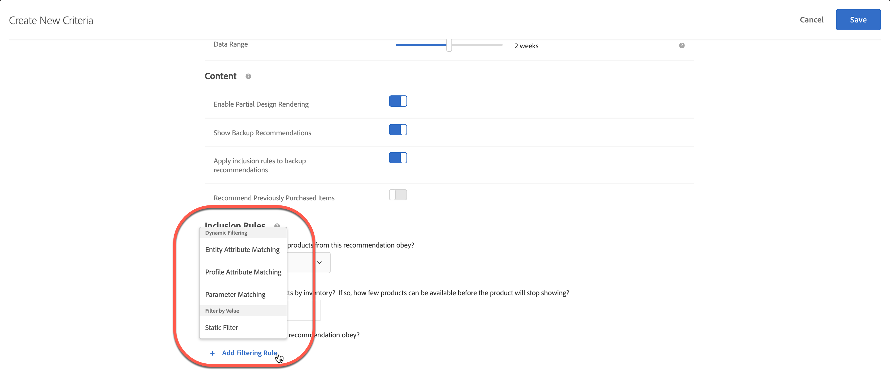

#  使用动态和静态包含规则

有关在[!DNL Adobe Target]中为标准和促销创建包含规则以及添加动态或静态筛选规则以更好地实现推荐的信息。

如用例和示例所述，针对标准和促销活动创建和使用包含规则的过程类似。本节将介绍标准和促销以及使用包含规则。

## 将筛选规则添加到标准 {#section_CD0D74B8D3BE4A75A78C36CF24A8C57F}

[创建标准](/help/c-recommendations/c-algorithms/create-new-algorithm.md#task_8A9CB465F28D44899F69F38AD27352FE)时，单击&#x200B;**[!UICONTROL 包含规则]**&#x200B;下的&#x200B;**[!UICONTROL 添加筛选规则]**。

可用选项取决于所选垂直行业和推荐键。

## 将筛选规则添加到促销活动 {#section_D59AFB62E2EE423086281CF5D18B1076}

[创建促销活动](/help/c-recommendations/t-create-recs-activity/adding-promotions.md#task_CC5BD28C364742218C1ACAF0D45E0E14)时，选择&#x200B;**[!UICONTROL 按属性促销]**，然后单击&#x200B;**[!UICONTROL 添加筛选规则]**。

## 筛选类型 {#section_0125F1ED10A84C0EB45325122460EBCD}

以下各节列表了[!UICONTROL 动态筛选]和[!UICONTROL 按值筛选]的筛选选项类型，以用于标准和促销：

### 动态筛选

动态包含规则比静态包含规则更强大，并且会产生更好的结果和参与度。 请考虑以下事项：

* 动态包含规则通过匹配用户的用户档案参数或mbox调用中的属性来提供推荐。

   例如，您可以创建“最受欢迎的标准”推荐。 从返回的推荐集中，您可以根据用户访问显示推荐的页面时传递的属性过滤出任何推荐（实时）。

* 使用静态规则限制推荐中包含的项目（而不是使用集合）。

* 您可以根据需要创建任意数量的动态包含规则。 包含规则使用“与”运算符进行结合。所有规则都必须得到满足，才能在推荐中包含某个项目。

以下选项可用于动态筛选：

| 动态筛选选项 | 详细信息 |
| --- | --- |
| [实体属性匹配](/help/c-recommendations/c-algorithms/entity-attribute-matching.md) | 通过将潜在推荐项目池与用户与之交互的特定项目进行比较，动态筛选。 当您 [!UICONTROL 希望显] 示最可能吸引访客(如访客喜爱的品牌)的推荐时，请使用实体属性匹配。 |
| [配置文件属性匹配](/help/c-recommendations/c-algorithms/profile-attribute-matching.md) | 通过比较项目（实体）与用户用户档案中的值来动态筛选。 如果 [!UICONTROL 要显] 示与访客用户档案中存储的值（如大小或喜爱的品牌）匹配的推荐，请使用“用户档案属性匹配”。 |
| [参数匹配](/help/c-recommendations/c-algorithms/parameter-matching.md) | 通过比较项（实体）与请求（API或mbox）中的值来动态筛选。 使用 [!UICONTROL 参] 数匹配可推荐与页面参数或访客参数（如设备尺寸或地理位置）匹配的内容。 |

### 按值筛选

可以按值筛选以下选项：

| 按值筛选选项 | 详细信息 |
| --- | --- |
| [静态滤镜](/help/c-recommendations/c-algorithms/static-value.md) | 手动输入要筛选的一个或多个静态值。 |

## 可用运算符{#operators}

动态标准和促销比静态标准和促销更加强大，并产生更好的结果和参与度。

以下示例提供了有关如何在营销工作中使用动态促销和排除的一般说明：

| 运算符 | 示例 |
| --- | --- |
| Equals (可用于实体属性匹配、用户档案属性匹配、参数匹配和静态筛选器。) | 在动态促销中使用“equals”运算符，当访客查看您网站上的项目（如产品、文章或电影）时，您可以从以下位置提升其他项目：<ul><li>同一品牌</li><li>相同的类别</li><li>相同的类别和来自品牌</li><li>同一商店</li></ul> |
| Does Not Equal (Available with Entity Attribute Matching， 用户档案 Attribute Matching， Parameter Matching， and Static Filter.) | 在动态促销中使用“does not equal”运算符，当访客在您的网站上查看项目（如产品、文章或电影）时，您可以从以下位置提升其他项目：<ul><li>另一部电视剧</li><li>另一种类型</li><li>其他产品系列</li><li>其他样式ID</li></ul> |
| 包含子字符串 (可用于实体属性匹配、用户档案属性匹配、参数匹配和静态筛选器。) | 使用“contains substring”运算符，当访客在您的网站（如产品）上查看项目时，您可以提升以下其他项目：<ul><li></li></ul> |  |
| 不包含子字符串 (可用于实体属性匹配、用户档案属性匹配、参数匹配和静态筛选器。) | 使用“does not contain substring”运算符，当访客在您的网站（如产品）上查看项目时，您可以提升以下其他项目：<ul><li></li></ul> |
| 开始具有 (可用于实体属性匹配、用户档案属性匹配、参数匹配和静态筛选器。) | 使用“开始”运算符，当访客在您的网站（如产品）上查看项目时，您可以提升以下项目：<ul><li></li></ul> |
| 以 结尾(可用于实体属性匹配、用户档案属性匹配、参数匹配和静态筛选器。) | 使用“结束于”运算符，当访客在您的网站（如产品）上查看项目时，您可以提升以下其他项目：<ul><li></li></ul> |
| 大于或等于 (可用于实体属性匹配、用户档案属性匹配、参数匹配和静态筛选器。) | 使用“大于或等于”运算符，当访客在您的网站（如产品）上查看项目时，您可以推广其他项目：<ul><li>成本相同或更贵</li></ul> |
| 小于或等于 (可用于实体属性匹配、用户档案属性匹配、参数匹配和静态筛选器。) | 使用“小于或等于”运算符，当访客在您的网站（如产品）上查看项目时，您可以推广其他项目：<ul><li>成本相同或更便宜</li><li>排除较便宜的项目</li></ul> |
| 介于 (可用于实体属性匹配、用户档案属性匹配和参数匹配。) | 在动态促销中使用“is between”运算符，当访客在您的网站上查看项目（如产品、文章或电影）时，您可以提升以下项目：<ul><li>更贵</li><li>更便宜</li><li>成本正负30%</li><li>同一季的后几集</li><li>系列中的先前书籍</li></ul> |
| 包含在列表 中(可用于用户档案属性匹配和参数匹配。) | 在用户档案属性匹配中使用“is contained in 列表”运算符，当访客在您的网站上查看项目（如产品、文章或电影）时，您可以提升以下项目：<ul><li>在访客的地理位置提供</li></ul>使用此运算符时，规则的[右侧](#caveats)中应有列表。 |
| 未包含在列表 中(可用于用户档案属性匹配和参数匹配。) | 在用户档案属性匹配中使用“is not contained in 列表”运算符，当访客在您的网站（如产品、文章或电影）上查看项目时，您可以排除其他项目：<ul><li>在列表中，访客已查看的最后十个项目</li></ul></ul>使用此运算符时，规则的[右侧](#caveats)中应有列表。 |
| 列表包含 中的项(可用于实体属性匹配、用户档案属性匹配和参数匹配。) | 在用户档案属性匹配中使用“列表包含项目在”运算符，当访客在您的网站上查看项目（如产品、文章或影片）时，您可以推荐以下项目：<ul><li>与访客喜爱的团队之一关联</li></ul></ul>使用此运算符时，规则的[两侧](#caveats)应显示列表。 |
| 列表不包含 中的项(可用于实体属性匹配、用户档案属性匹配和参数匹配。) | 在参数属性匹配中使用“列表不包含项目”运算符，当访客在您的网站（如产品、文章或电影）上查看项目时，您可以排除其他以下项目：<ul><li>包含在禁止的列表中</li></ul>使用此运算符时，规则的[两侧](#caveats)应显示列表。 |
| 列表包含 中的所有项(可用于实体属性匹配、用户档案属性匹配和参数匹配。) | 在参数属性匹配中使用“列表包含所有项目”运算符时，当访客在您的网站上查看项目（如产品、文章或电影）时，您可以提升以下项目：<ul><li></li></ul>使用此运算符时，规则的[两侧](#caveats)应显示列表。 |
| 列表不包含 中的所有项(可用于实体属性匹配、用户档案属性匹配和参数匹配。) | 在参数属性匹配中使用“列表不包含所有项目”运算符，当访客在您的网站（如产品、文章或电影）上查看项目时，您可以提升以下项目：<ul><li></li></ul>使用此运算符时，规则的[两侧](#caveats)应显示列表。 |

## 按“实体属性匹配”、“用户档案属性匹配”和“参数匹配”{#section_7D30E04116DB47BEA6FF840A3424A4C8}筛选时处理空值

在通过[!UICONTROL 实体属性匹配]、[!UICONTROL 用户档案属性匹配]和[!UICONTROL 参数匹配]筛选退出条件和促销时，可以选择多个选项来处理空值。

以前，如果值为空，则不会返回任何结果。如果标准包含空值，则“如果 *x* 为空”下拉列表允许您选择适当的操作，如下图所示：

要选择所需的操作，请将鼠标悬停在齿轮图标 () 上，然后选择所需的操作：

| 操作 | 适用选项 | 详细信息 |
|--- |--- |--- |
| [!UICONTROL 忽略此筛选规则] | [!UICONTROL 用户档案属] 性匹配 [!UICONTROL 与参数匹配] | 此操作是[!UICONTROL 用户档案属性匹配]和[!UICONTROL 参数匹配]的默认操作。 该选项指定忽略该规则。例如，如果有三个筛选规则，第三个规则不传递任何值，则您只需忽略具有空值的第三个规则，而不是不返回任何结果。 |
| [!UICONTROL 不显示此条件的任何结果] （仅限条件） | [!UICONTROL 实体属性匹配]、 [!UICONTROL 用户档案属性匹配]、参 [!UICONTROL 数匹配] | 此操作是[!UICONTROL 实体属性匹配]的默认操作。 此操作是在添 [!DNL Target] 加此选项之前处理空值的方式：此条件没有显示任何结果。 |
| [!UICONTROL 不提升任何项目 （仅限促销）] | [!UICONTROL 实体属性匹配]、 [!UICONTROL 用户档案属性匹配]、参 [!UICONTROL 数匹配] | 此操作是[!UICONTROL 实体属性匹配]的默认操作。 此操作是在添 [!DNL Target] 加此选项之前处理空值的方式：此条件没有显示任何结果。 |
| [!UICONTROL 使用静态值] | [!UICONTROL 实体属性匹配]、 [!UICONTROL 用户档案属性匹配]、参 [!UICONTROL 数匹配] | 如果值为空，您可以选择使用静态值。 |

## 注意事项 {#caveats}

>[!IMPORTANT]
>
>在运行时，不同的数据类型属性可能在动态标准或促销活动中与“等于”和“不等于”运算符不兼容。如果左侧具有预定义属性或自定义属性，请在右侧明智地使用[!UICONTROL 值]、[!UICONTROL Margin]、[!UICONTROL Inventory]和[!UICONTROL 环境]值。

下表显示了有效规则和在运行时可能不兼容的规则：

| 兼容规则 | 可能不兼容的规则 |
|--- |--- |
| value - 介于 - 当前项目的 90% 至 110% - salesValue | salesValue - 介于 - 当前项目的 90% 至 110% - value |
| value - 介于 - 当前项目的 90% 至 110% - value | clearancePrice - 介于 - 当前项目的 90% 至 110% - margin |
| margin - 介于 - 当前项目的 90% 至 110% - margin | storeInventory - 等于 - 当前项目的 - inventory |
| inventory - 等于 - 当前项目的 - inventory |  |
