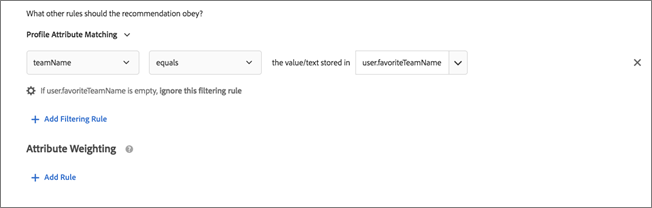

#  使用动态和静态包含规则{#use-dynamic-and-static-inclusion-rules}

此信息介绍了如何为标准和促销活动创建包含规则，以及如何添加更多动态或静态筛选规则以获取更好的结果。

如用例和示例所述，针对标准和促销活动创建和使用包含规则的过程类似。本主题介绍了标准和促销活动以及对包含规则的使用。

## 将筛选规则添加到标准 {#section_CD0D74B8D3BE4A75A78C36CF24A8C57F}

[创建标准](../../c-recommendations/c-algorithms/create-new-algorithm.md#task_8A9CB465F28D44899F69F38AD27352FE)时，单击&#x200B;**[!UICONTROL 包含规则]**&#x200B;下的&#x200B;**[!UICONTROL 添加筛选规则]**。


可用选项取决于所选垂直行业和推荐键。

## 将筛选规则添加到促销活动 {#section_D59AFB62E2EE423086281CF5D18B1076}

[创建促销活动](../../c-recommendations/t-create-recs-activity/adding-promotions.md#task_CC5BD28C364742218C1ACAF0D45E0E14)时，选择&#x200B;**[!UICONTROL 按属性促销]**，然后单击&#x200B;**[!UICONTROL 添加筛选规则]**。


## 筛选类型 {#section_0125F1ED10A84C0EB45325122460EBCD}

下表列出了标准和促销活动的筛选选项类型：

| 类型 | 选项 | 可用运算符 |
|--- |--- |--- |
| **动态筛选** | **实体属性匹配：**&#x200B;通过将潜在推荐项目池与用户交互的特定项目进行比较来进行动态筛选。<br>例如，只推荐与当前项目品牌相匹配的项目。 | 等于<br>不等于<br>介于<br>包含<br>不包含<br>始于<br>止于<br>值存在<br>值不存在<br>大于或等于<br>小于或等于 |
|  | **配置文件属性匹配：**&#x200B;通过比较项目（实体）与用户配置文件中的值来进行动态筛选。<br>例如，只推荐与访客最喜爱的品牌相匹配的项目。 | 等于<br>不等于<br>包含<br>不包含<br>始于<br>止于<br>大于或等于<br>小于或等于<br>介于 |
|  | **参数匹配：**&#x200B;通过比较项目（实体）与请求中的值（API 或 mbox）来进行动态筛选。<br>例如，只推荐与“行业”页面参数相匹配的内容。<br>**重要信息：**&#x200B;如果该活动于 2016 年 10 月 31 日之前创建，则当它使用“参数匹配”筛选器时，交付将会失败。要解决此问题，请执行以下操作：<ul><li>创建一个新的活动并在其中添加您的标准。</li><li>使用不包含“参数匹配”筛选器的标准。</li><li>从您的标准中删除“参数匹配”筛选器。</li></ul> | 等于<br>不等于<br>包含<br>不包含<br>始于<br>止于<br>大于或等于<br>小于或等于<br>介于 |
| **按值筛选** | **静态筛选器：**&#x200B;手动输入一个或多个静态值进行筛选。<br>例如，只推荐美国电影协会 (MPAA) 评级为“G”或“PG”的内容。 | 等于<br>不等于<br>包含<br>不包含<br>始于<br>止于<br>值存在<br>值不存在<br>大于或等于<br>小于或等于 |

>[!NOTE]
>
>如果您熟悉 Target 17.6.1 版本（2017 年 6 月）之前的包含规则配置方式，那么您可能会注意到一些选项和运算符已经发生了变化。为了更加一致和直观，现在，只有那些适用于选定选项的运算符才会显示，而且部分运算符进行了重命名（“匹配”现在为“等于”）。此版本之前创建的所有已有排除规则均会迁移到新的结构中。您不需要重新调整结构。

您可以根据需要创建不限数量的包含规则。包含规则使用“与”运算符进行结合。所有规则都必须得到满足，才能在推荐中包含某个项目。

动态标准和促销活动比静态标准和促销活动更强大，可产生更好的结果和参与度。以下示例可以为您提供一些想法，介绍如何在您的营销工作中使用动态促销活动：

**等于：**&#x200B;在动态促销活动中使用“等于”运算符时，如果访客正在查看网站上的项目（例如产品、文章或影片），您可以向其促销以下分类的其他项目：

* 同一品牌
* 同一类别
* 同一类别和同一厂商
* 同一商店

**不等于：**&#x200B;在动态促销活动中使用“不等于”运算符时，如果访客正在查看网站上的项目（例如产品、文章或影片），您可以向其促销以下分类的其他项目：

* 不同的电视连续剧
* 不同的类别
* 不同的产品系列
* 不同的风格 ID

**介于：**&#x200B;在动态促销活动中使用“介于”运算符时，如果访客正在查看网站上的项目（例如产品、文章或影片），您可以向其促销以下其他项目：

* 更贵
* 更便宜
* 费用高或低 30%
* 同一季的后续集数
* 一套书中之前出版的书

## 按实体属性匹配、配置文件属性匹配和参数匹配进行筛选时处理空值 {#section_7D30E04116DB47BEA6FF840A3424A4C8}

按“实体属性匹配”、“配置文件属性匹配”和“参数匹配”进行筛选时，您可以选择多个选项来处理空值，以退出标准和促销活动。

以前，如果值为空，则不会返回任何结果。如果标准包含空值，则“如果 *x* 为空”下拉列表允许您选择适当的操作，如下图所示：


要选择所需的操作，请将鼠标悬停在齿轮图标 () 上，然后选择所需的操作：

| 操作 | 适用选项 | 详细信息 |
|--- |--- |--- |
| 忽略此筛选规则 | 配置文件属性匹配<br>参数匹配 | 这是“配置文件属性匹配”和“参数匹配”的默认操作。<br>该选项指定忽略该规则。例如，如果有三个筛选规则，第三个规则不传递任何值，则您只需忽略具有空值的第三个规则，而不是不返回任何结果。 |
| 不显示此标准的任何结果 | 实体属性匹配<br>配置文件属性匹配<br>参数匹配 | 这是“实体属性匹配”的默认操作。<br>此操作是 Target 在添加此选项之前处理空值的方式：不显示此标准的结果。 |
| 使用静态值 | 实体属性匹配<br>配置文件属性匹配<br>参数匹配 | 如果值为空，您可以选择使用静态值。 |

有关处理空值的示例，请参见下面的[情景 9](../../c-recommendations/c-algorithms/use-dynamic-and-static-inclusion-rules.md#section_9873E2F22E094E479569D05AD5BB1D40)：

## 动态筛选情景 {#section_9873E2F22E094E479569D05AD5BB1D40}

**情景 1：**&#x200B;您可以使用动态筛选器将目录中的项目与访客配置文件中的某个属性进行匹配，而不是使用静态筛选器将目录中的某个项目与目录中的其他项目进行匹配。

例如，您可以使用“[!UICONTROL 配置文件属性匹配]”选项创建一个规则，仅在品牌等于 `profile.favoritebrand` 中存储的值或文本时推荐项目。在此规则下，如果访客正在查看特定品牌的运动裤，则只会显示与该用户最喜爱的品牌（存储在该访客配置文件的 `profile.favoritebrand` 中的值）相匹配的推荐。

**情景 2：**&#x200B;在 Target 添加使用访客配置文件中的属性信息这一功能之前，如果您要设置仅显示给特定位置并具有特定学位的求职者的职位列表，则必须使用不同的受众（每个城市和学位各一个）设置多个活动。如果您在很多城市设置了职位列表，则这项任务会变得非常繁琐。

现在，您可以使用包含规则，将求职者的位置和学位从其访客配置文件中匹配到职位列表，如下例所示：


左侧的职位列表要求旧金山、纽约或洛杉矶 (`entity.jobCity`) 的访客拥有 BSCS 或 MBA 学位 (`entity.requiredDegree`)。

右侧的这位求职者位于洛杉矶 (`profile.usersCity`)，且拥有 MBA 学位 (`profile.degree`)。

使用具有配置文件属性匹配的动态筛选器，您可以创建如上图下方所示的筛选器，根据位置和学位仅推荐与访客相符的职位列表。

这些筛选器的标准如下：

```
entity.jobCity - equals - the value/text stored in - profile.usersCity
```

和

```
entity.requiredDegree - equals - the value/text stored in - profile.degree
```

通过使用配置文件属性匹配的动态筛选器，您可以使用更少的活动完成更多操作，如下所示：


在上图中，上方的图表描述了使用配置文件属性的动态筛选器是如何工作的。您可以创建一个符合标准（上述场景中的城市和学位）的受众来显示与访客相符的职位列表。此筛选器适用于几乎所有与位置和学位相关的可能性。

如果您没有通过使用配置文件属性的动态筛选器来配置标准或促销活动，则必须设置很多受众，上图下部的图表所描述的仅仅是这众多受众当中的两个。您必须为每个城市和每个学位设置不同的受众。所需受众的数量可能很快会变得难以管理，特别是如果您在各个城市设置了大量的职位列表。

在不使用配置文件属性的情况下，您的受众和体验就会如下图的上半部分所示，要为每个可以想到的方案再添加一对受众/体验。


使用配置文件属性动态筛选器，您可以将实体属性与用户属性进行匹配，从而设置一个可以动态、实时提供所需体验的受众，如上图的下半部分所示。

只要您将所需信息嵌入到每个职位列表中，并且您从用户配置文件中获取了所需的信息，就可以大大简化创建和管理受众和体验的过程。

**情景 3：**&#x200B;一家体育用品公司希望在其网站上显示某个人关注的球队的文章。每篇文章都可以有一个包含 `entity.featuredTeams` 的字段，其中包含该文章中讨论的所有球队。每个配置文件属性都可以有一个用户要“订阅”的最喜爱球队的列表。

包含规则示例可能如下所示：

仅当 `entity.featuredTeam` 包含一个或多个匹配 `profile.favoriteTeams` 的值时才包含在内。

在查看以下示例时，请记住至少要有一个完整的字符串值需要（完全）匹配。如果没有任何字符串匹配，则不存在匹配。请注意匹配规则中的实体属性可分离。这允许在不同元数据字段之间进行匹配。

示例/描述

`"entity.featuredTeam" - "Athletics,Red Sox" equals "profile.favoriteTeams" - "Athletics"`

匹配，因为即便“Red Sox”不匹配，但“Athletics”匹配。

`"entity.featuredTeam" - "Athletics,Red Sox" equals "profile.favoriteTeams" - "Athletics,Red Sox"`

匹配，因为“Athletics”和“Red Sox”都匹配，尽管并不要求两队都匹配。

`"entity.featuredTeam" - "Athletics" equals "profile.favoriteTeams" - "Athletics,Red Sox"`

匹配，因为即便“Red Sox”不匹配，但“Athletics”匹配。

`"entity.featuredTeam" - "Athletics" equals "profile.favoriteTeams" - "Athletic"`

不匹配，因为“Athletics”（复数）不等于“Athletic”（单数）。

或者，您可以使用“包含”而不是“等于”来进行匹配。

`"entity.featuredTeam" - "Athletic" equals "profile.favoriteTeams" - "Athletics"`

不匹配，因为“Athletic”（单数）不等于“Athletics”（复数）。

或者，您可以使用“始于”而不是“等于”来进行匹配。

**情景 4：**&#x200B;下图演示了如何使用“等于”和“介于”运算符来促销来自同一类别和同一品牌的更贵的商品。例如，一家体育服装公司可以向查看运动裤的访客追加销售价格更贵的跑鞋来进行促销。


本例中使用以下规则：

```
category - equals - current item's - category 
And 
brand - equals - current item's - brand 
And 
value - is between - 100% and 1000% of - current item's - value
```

>[!NOTE]
>
>您无法更改使用多个规则的动态促销活动中的键（上图前两个规则中，标记为“当前项目的”第三个下拉列表）。

**情景 5：**&#x200B;第二个图，用于演示如何使用“等于”和“介于”运算符来促销来自同一类别、同一品牌和同一厂商的更贵的商品。例如，一家办公用品公司可以向查看打印机的访客追加销售价格更贵的同一品牌和同一厂商的墨盒来进行推销。


本例中使用以下规则：

```
category - equals - current item's - category 
And 
IsHouseBrand - equals - true 
And 
value - is between - 100% and 1000% of - current item's - value
```

请注意，此示例中使用了两个动态规则和一个静态规则。

**情景 6：**&#x200B;第三个图，用于演示如何使用“不等于”运算符来促销与访客当前正在查看的连续剧不同的剧集。例如，媒体网站可以促销与访客当前正在查看的连续剧不同的电视剧。


本例中使用以下规则：

```
series - does not equal - current item's - series
```

**情景 7：**&#x200B;第四个图，用于演示如何促销与访客上次购买的商品兼容的配件。例如，如果有人购买了一台新的电视机，那么您可以动态促销 HDMI 电缆。


本例中使用以下规则：

```
id - equals - last purchased item's - compatibleAccessoryids
```

**情景 8：**&#x200B;下一个图演示了如何促销价格是访客正在查看的商品的 90% 至 110% 的商品。例如，如果有人正在查看电视机，那么您可以动态地促销与其价格大致相同的类似的电视机。


本例中使用以下规则：

```
salesPrice - is between - 90% and 110% of - current item's - price
```

**情景 9：**&#x200B;考虑以下体育媒体网站如何处理空值的情形，如上文[按实体属性匹配、配置文件属性匹配和参数匹配进行筛选时处理空值](../../c-recommendations/c-algorithms/use-dynamic-and-static-inclusion-rules.md#section_7D30E04116DB47BEA6FF840A3424A4C8)中所述：

一家体育媒体网站的内容团队希望向用户展示他们最喜爱的球队的内容。如果用户指定了最喜爱的球队，则内容团队想为该用户显示该球队的媒体内容。如果用户未指定最喜爱的团队，则内容团队可以使用“如果 *x* 为空”下拉列表执行以下操作之一：

* 使用“[!UICONTROL 忽略此筛选规则]”选项以完全忽略球队筛选，如下图所示：

   

* 使用“[!UICONTROL 不显示此标准的任何结果]”选项，不显示此标准的任何媒体内容，如下图所示：

   

* 使用“[!UICONTROL 使用静态值]”选项以显示特定球队（例如 49ers）的媒体，如下图所示：

   

## 注意事项 {#section_A889FAF794B7458CA074DEE06DD0E345}

>[!IMPORTANT]
>
>在运行时，不同的数据类型属性可能在动态标准或促销活动中与“等于”和“不等于”运算符不兼容。如果左侧具有预定义属性或自定义属性，则应在右侧合理地使用值、利润、库存和环境值。


下表显示了有效规则和在运行时可能不兼容的规则：

| 兼容规则 | 潜在的不兼容规则 |
|--- |--- |
| value - 介于 - 当前项目的 90% 至 110% - salesValue | salesValue - 介于 - 当前项目的 90% 至 110% - value |
| value - 介于 - 当前项目的 90% 至 110% - value | clearancePrice - 介于 - 当前项目的 90% 至 110% - margin |
| margin - 介于 - 当前项目的 90% 至 110% - margin | storeInventory - 等于 - 当前项目的 - inventory |
| inventory - 等于 - 当前项目的 - inventory |  |