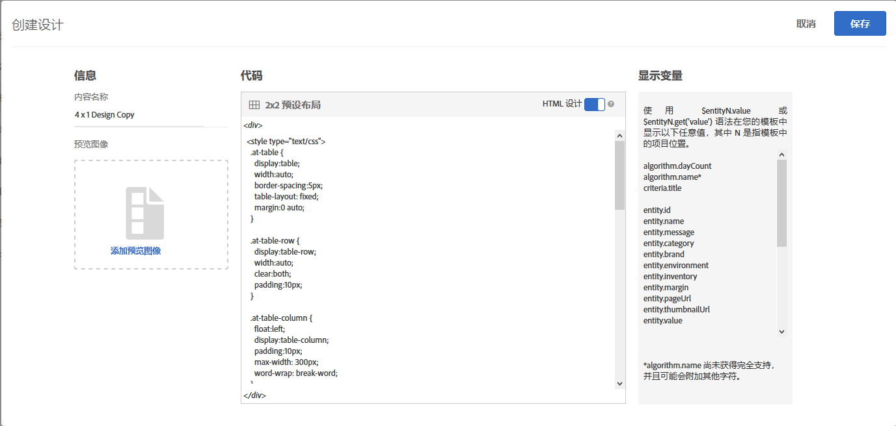

#  创建设计{#create-a-design}

设计可定义推荐在页面上的显示方式。

您可以使用默认设计或通过创建自定义设计来创建[!UICONTROL 推荐]设计。**[!UICONTROL 推荐 &gt; 设计]屏幕显示了默认设计卡片以及您创建的所有设计。**&#x200B;默认设计无法编辑或删除。

1. 在&#x200B;**[!UICONTROL 推荐 &gt; 设计]**&#x200B;屏幕上，将鼠标悬停在要创建的设计的卡片上。

   

1. 要复制或编辑现有设计，请单击&#x200B;**[!UICONTROL 复制]**&#x200B;图标。

   或

   要创建自定义设计，请在&#x200B;**[!UICONTROL 推荐 &gt; 设计]屏幕上单击****创建设计[!UICONTROL 。]**

   

1. 添加&#x200B;**[!UICONTROL 内容名称]**。

   如果使用默认设计，则&#x200B;**[!UICONTROL 内容名称]字段中会显示该设计的名称和“副本”字样。**&#x200B;您可以编辑该名称。1. （可选）单击以选择要在设计卡片上显示的图像。
1. 编辑设计&#x200B;**[!UICONTROL 代码]**。

   推荐设计使用的是开源 Velocity 设计语言。有关 Velocity 的信息可在 https://velocity.apache.org 中找到。

   设计可以是 HTML 形式，也可以是非 HTML 形式。默认情况下，HTML 设计将使用 
 标记封装，以便允许在 Web 环境中进行点击跟踪。非 HTML 设计适用于无法进行点击跟踪的非 Web 环境。

   >[!NOTE]
   >
   >设计中可引用（无论是以硬编码方式引用还是通过循环引用）的最大实体数为 99。

1. 单击&#x200B;**[!UICONTROL 保存]**。

## 培训视频：在“推荐”中创建自定义设计 (3:20)

本视频包含以下信息：

* 创建自定义设计
* 了解如何在设计中引用显示变量

>[!VIDEO](https://video.tv.adobe.com/v/27687?captions=chi_hans)
