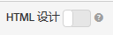

# 设计概述{#design-overview}

此信息概述了用于定义推荐如何在页面上显示的设计。

Target 可以为您的推荐设计出完美的外观和风格，如下图所示。设计中可以包含 HTML、JavaScript 和 CSS。


Target 还可以将您的推荐作为 JSON 对象来发送，而 JSON 对象可以在电子邮件消息、IoT（物联网）设备、控制台或语音用例（Amazon Alexa 或 Google Home）中使用。

## JSON 示例 {#section_75BFB2537CFF4FBD9B560F59EB32C8DD}

以下示例显示了通过基于表单的编辑器配置活动时可以如何返回 JSON 响应。

1. 在设计库中或基于表单的工作流中创建一个设计。如果您尝试在可视化体验编辑器 (VEC) 工作流中创建设计，则只能创建 HTML 设计，此类设计封装在`<div>`中，用于执行点击跟踪。
1. 确保已关闭“HTML 设计”选项：

   

1. 下面是一个示例代码，您可以将此代码粘贴到自己的设计中：

   ```
       #* 
       * "Return a simple list of recommended entity ids"   
       *#
   
       {   
         "notes":{   
         "purpose": "Return a simple list of recommended entity ids",   
         "use-case": "Use this approach if you prefer to do a real-time lookup of entity attribute details (such as inventory, price, rating) from another system (such as a CMS, PIM or ecommerce platform)",   
         "version": "01"   
         },   
         "recommendedItems": {   
           "key": "$key.id",   
           "slot-01": "$entity1.id",   
           "slot-02": "$entity2.id",   
           "slot-03": "$entity3.id",   
           "slot-04": "$entity4.id",   
           "slot-05": "$entity5.id",   
           "slot-06": "$entity6.id",   
           "slot-07": "$entity7.id",   
           "slot-08": "$entity8.id",   
           "slot-09": "$entity9.id",   
           "slot-10": "$entity10.id"   
         }   
       }  
   ```

1. 设置一个基于表单的“推荐”活动，使其使用此设计。

   1. 导航到“活动”页面。
   1. 单击&#x200B;**[!UICONTROL 创建活动]**。
   1. 选择&#x200B;**[!UICONTROL 推荐]**。
   1. 在&#x200B;**[!UICONTROL 选择体验编辑器]**&#x200B;下方，选择&#x200B;**[!UICONTROL 表单]**。

   1. 在“位置”下方，输入文本：“Sample_Recs_Response”
   1. 在&#x200B;**[!UICONTROL 默认内容]**&#x200B;下方，单击向下箭头，然后单击&#x200B;**[!UICONTROL 添加推荐]**。
   1. 选择一种页面类型。这决定了对接下来要显示的屏幕的初步筛选。
   1. 选择一个标准卡片，然后单击&#x200B;**[!UICONTROL 下一步]**。
   1. 选择在上一步中创建的设计，然后单击&#x200B;**[!UICONTROL 保存]**。
   1. 完成设置过程。
   1. 单击&#x200B;**[!UICONTROL 不活跃]**&#x200B;旁边的向右箭头，然后选择&#x200B;**[!UICONTROL 激活]**。

1. 设置活动并将其激活后，您可以设置示例请求，以获取简洁的 JSON 响应。

   从保存活动时起，Target 将需要构建一个模型来支持选定的标准配置。此过程可能会花费一些时间，具体时间取决于众多因素。构建模型后，便会显示结果。

   例如：

   ```
   https://[YOUR_CLIENT_CODE].tt.omtrdc.net/m2/YOUR_CLIENT_CODE/ubox/raw?mbox=[YOUR_MBOX_NAME]&mboxContentType=text/html&mboxXDomain=disabled&entity.id=[ENTITY_ID]&mboxHost=rawbox_sample&at_property=[AT_PROPERTY_TOKEN]&mboxNoRedirect=true&mboxPC=1234-4321&mboxSession=9876-7000
   ```

   其中

| 参数 | 值 |
|--- |--- |
| `[YOUR_CLIENT_CODE]` | Target 客户端代码（位于 ../target/products.html#recsSettings &gt;“推荐 API 令牌”&gt;“客户端代码”）。 |
| `[YOUR_MBOX_NAME]` | 您在基于表单的Recommendations的“位置”部分中选择的名称，在此示例中为Sample_Recs_Response。 |
| `[ENTITY_ID`] | 您目录中的项目的 `entity.id`。 |
| `[AT_PROPERTY_TOKEN]` | （可选）如果您在活动设置过程中选择了某个属性（“企业权限”的一部分），则需添加此参数。 |

在运行算法并获取结果后，您的响应应当类似于以下示例：

{width="575px"}

## 其他 JSON 对象提示和技巧 {#section_C305673C68944749969DB239E3221DC2}

您还可以使用以下语法设置设计，以便仅发送回以逗号分隔的项目简单列表：

```
entity1.id, $entity2.id, $entity3.id, $entity4.id, $entity5.id, 
```

或者，您也可以在响应中发送更多信息。下面是一个更为复杂的代码文件示例，此代码不仅仅返回了实体 ID 及其关联的版块（顺序），还返回了更多其他内容。此设计示例还返回了活动详细信息、Target 配置文件详细信息（如适用），及其他与返回的项目关联的 `entity.attributes`。

```
    {   
     "adobeRecommendations": {   
      "notes": {   
       "purpose": "Return a list of entity ids with their associated entity.attributes",   
       "use-case": "Use this approach to avoid looking up attribute details after receiving a response from Target",   
       "version": "01"   
      },   
      "recommendedItems": {   
       "slot-01": "$entity1.id",   
       "slot-02": "$entity2.id",   
       "slot-03": "$entity3.id",   
       "slot-04": "$entity4.id",   
       "slot-05": "$entity5.id",   
       "slot-06": "$entity6.id",   
       "slot-07": "$entity7.id",   
       "slot-08": "$entity8.id",   
       "slot-09": "$entity9.id",   
       "slot-10": "$entity10.id"   
      },   
      "activityDetails": {   
       "mbox.name": "email-mbox",   
       "campaign.name": "\${campaign.name}",   
       "campaign.id": "\${campaign.id}",   
       "campaign.recipe.name": "\${campaign.recipe.name}",   
       "campaign.recipe.id": "\${campaign.recipe.id}",   
       "offer.name": "\${offer.name}",   
       "offer.id": "\${offer.id}",   
       "criteria.title": "$criteria.title",   
       "algorithm.name": "$algorithm.name",   
       "algorithm.dayCount": "$algorithm.dayCount"   
      },   
      "visitorProfile": {   
       "profile.favorite-category": "\${profile.favorite-category}",   
       "profile.test": "\${profile.test}",   
       "user.endpoint.lastPurchasedEntity": "\${user.endpoint.lastPurchasedEntity}",   
       "user.endpoint.lastViewedEntity": "\${user.endpoint.lastViewedEntity}",   
       "user.endpoint.mostViewedEntity": "\${user.endpoint.mostViewedEntity}",   
       "user.endpoint.categoryAffinity": "\${user.endpoint.categoryAffinity}",   
       "profile.geolocation.city": "\${profile.geolocation.city}",   
       "profile.geolocation.dma": "\${profile.geolocation.dma}",   
       "profile.geolocation.state": "\${profile.geolocation.state}",   
       "profile.geolocation.country": "\${profile.geolocation.country}",   
       "profile.sessionCount": "\${profile.sessionCount}",   
       "profile.averageDaysBetweenVisits": "\${profile.averageDaysBetweenVisits}",   
       "profile.browserTime": "\${profile.browserTime}",   
       "user.activeActivities": "\${user.activeActivities}",   
       "user.pcId": "\${user.pcId}",   
       "user.isFirstSession": "\${user.isFirstSession}",   
       "user.isNewSession": "\${user.isNewSession}",   
       "user.header": "\${user.header}",   
       "user.parameter": "\${user.parameter}"   
      },   
      "recKey": {   
       "recKeyDetails": {   
        "id": "$key.id",   
        "name": "$key.name",   
        "category": "$key.category",   
        "pageUrl": "$key.pageUrl",   
        "thumbnailUrl": "$key.thumbnailUrl"   
       }   
      },   
      "recDetailedResults": {   
       "recEntity1Details": {   
        "id": "$entity1.id",   
        "name": "$entity1.name",   
        "category": "$entity1.category",   
        "pageUrl": "$entity1.pageUrl",   
        "thumbnailUrl": "$entity1.thumbnailUrl"   
       },   
       "recEntity2Details": {   
        "id": "$entity2.id",   
        "name": "$entity2.name",   
        "category": "$entity2.category",   
        "pageUrl": "$entity2.pageUrl",   
        "thumbnailUrl": "$entity2.thumbnailUrl"   
       },   
       "recEntity3Details": {   
        "id": "$entity3.id",   
        "name": "$entity3.name",   
        "category": "$entity3.category",   
        "pageUrl": "$entity3.pageUrl",   
        "thumbnailUrl": "$entity3.thumbnailUrl"   
       },   
       "recEntity4Details": {   
        "id": "$entity4.id",   
        "name": "$entity4.name",   
        "category": "$entity4.category",   
        "pageUrl": "$entity4.pageUrl",   
        "thumbnailUrl": "$entity4.thumbnailUrl"   
       },   
       "recEntity5Details": {   
        "id": "$entity5.id",   
        "name": "$entity5.name",   
        "category": "$entity5.category",   
        "pageUrl": "$entity5.pageUrl",   
        "thumbnailUrl": "$entity5.thumbnailUrl"   
       },   
       "recEntity6Details": {   
        "id": "$entity6.id",   
        "name": "$entity6.name",   
        "category": "$entity6.category",   
        "pageUrl": "$entity6.pageUrl",   
        "thumbnailUrl": "$entity6.thumbnailUrl"   
       },   
       "recEntity7Details": {   
        "id": "$entity7.id",   
        "name": "$entity7.name",   
        "category": "$entity7.category",   
        "pageUrl": "$entity7.pageUrl",   
        "thumbnailUrl": "$entity7.thumbnailUrl"   
       },   
       "recEntity8Details": {   
        "id": "$entity8.id",   
        "name": "$entity8.name",   
        "category": "$entity8.category",   
        "pageUrl": "$entity8.pageUrl",   
        "thumbnailUrl": "$entity8.thumbnailUrl"   
       },   
       "recEntity9Details": {   
        "id": "$entity9.id",   
        "name": "$entity9.name",   
        "category": "$entity9.category",   
        "pageUrl": "$entity9.pageUrl",   
        "thumbnailUrl": "$entity9.thumbnailUrl"   
       },   
       "recEntity10Details": {   
        "id": "$entity10.id",   
        "name": "$entity10.name",   
        "category": "$entity10.category",   
        "pageUrl": "$entity10.pageUrl",   
        "thumbnailUrl": "$entity10.thumbnailUrl"   
       }   
      }   
     }   
    }  
```

