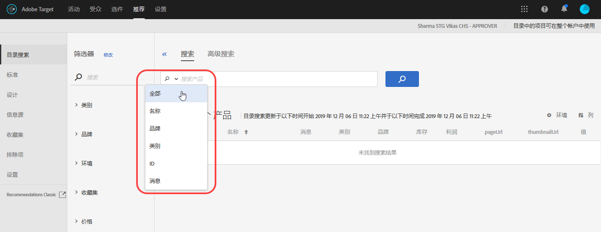

#  目录搜索 {#catalog-search}

目录搜索可帮助您在目录中查找产品或内容。

要访问目录搜索，请单击&#x200B;**[!UICONTROL 推荐]** &gt; **[!UICONTROL 目录搜索]**。

您可以对搜索进行优化，方式是单击搜索字段中的向下箭头，然后从显示的选项菜单中选择搜索选项。

搜索选项包括：

* ALL
* 名称
* 品牌
* 类别
* ID
* 消息

**[!UICONTROL 所有]**&#x200B;选项会使用 OR 逻辑搜索所有其他搜索标准所产生的结果。

在搜索结果中，单击&#x200B;**[!UICONTROL 环境]**&#x200B;筛选器可指定要显示哪个生产[主机组环境](/help/administrating-target/hosts.md)的目录。您还可以滚动浏览搜索结果中的项目，以查看缩览图和其他产品信息。

“产品”旁边显示的数字表示指定环境的可用产品总数中与搜索词相匹配的产品数量。

通过信息源文件、API 或 mbox 更新接收更新时，目录将自动刷新。更新通常在一小时内完成。如果更新正在进行，则显示最近的更新开始时间。如果没有正在进行的更新，则显示最近的更新开始时间和结束时间。

## 基于高级搜索创建收藏集或排除项

您可以使用“目录搜索”页面上的“高级搜索”（[!UICONTROL 推荐] &gt; [!UICONTROL 目录搜索] &gt; [!UICONTROL 高级搜索]）来创建[收藏集](/help/c-recommendations/c-products/collections.md)或[排除项](/help/c-recommendations/c-products/exclusions.md)。

例如，在使用“ID”&gt;“包含”创建搜索后，您可以单击[!UICONTROL 另存为] &gt; [!UICONTROL 收藏集或排除项]。

>[!IMPORTANT]
>
>“高级搜索”功能不区分大小写；但在进行产品交付时，会根据区分大小写的搜索来返回产品。这种不匹配可能会导致产生混淆。因此，在基于使用“高级搜索”功能搜索到的结果创建收藏集或排除项时，请务必考虑大小写问题。例如，如果您搜索“Holiday”，初始搜索会列出包含“Holiday”和“holiday”的结果。如果您随后创建一个目录，以用于返回包含“holiday”的产品，则只会返回包含“holiday”的产品，而不会返回包含“Holiday”的产品。可以采用类似的方式处理排除项。
