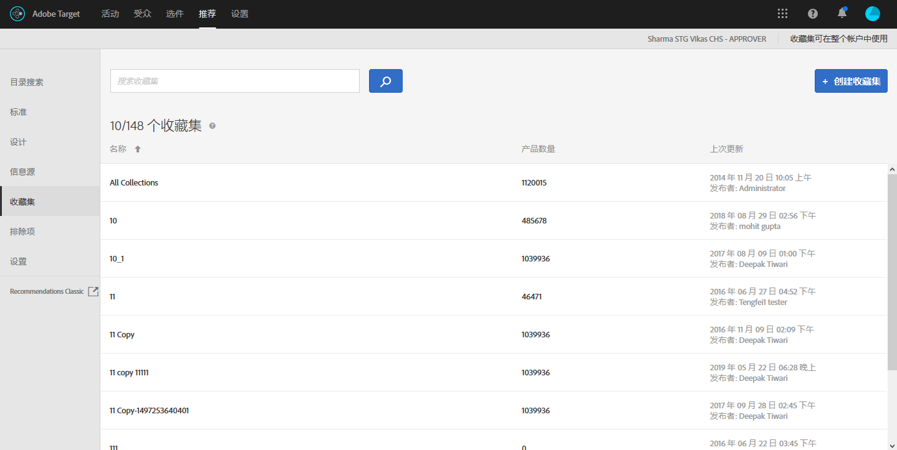

#  收藏集 {#collections}

收藏集是一组符合推荐标准的产品或项目。

一般情况下，收藏集是一组相似或相关的项目，例如单个产品收藏集。不过，您可以将任何项目分组到一个对您的业务有意义的类别中，例如可以将属于某个价格范围内或具有某种颜色的产品分组到一个类别中，或将可能在某个特定地区引起客户关注的项目分组到一个类别中。

使用收藏集，可将您的产品组织到逻辑分段中。例如，如果有些项目可在某个地区提供，而无法在其他地区提供，则您可能想要创建一个收藏集，以排除访客所在地区不能提供的项目。您还可以使用收藏集来组织季节性项目，或使用任何其他对您的业务适用的组织参数。

为推荐中的每个标准生成的[备用推荐](/help/c-recommendations/c-algorithms/backup-recs.md)也使用该收藏集，因此备用推荐中仅包含收藏集中的项目。使用收藏集，您可以确保仅在某个位置显示对其有意义的产品。

每次运行各个标准时，都会重新构建或更新收藏集。

您可以将项目分组到不同的目录中，然后分别为每个收藏集创建单独的推荐。

包含标准与收藏集的功能类似，通过包含标准可以执行类似的操作，但不同的是您每次创建活动时都必须设置包含标准。而收藏集允许您一次性创建一组项目，之后不论何时需要使用这些项目，都可以直接使用，而无需再次设置。

创建或编辑 [!DNL Recommendations] 活动时，收藏集名称会显示在活动图上的[!UICONTROL 标准]标签旁边。

>[!NOTE]
>
>使用[!UICONTROL 最近查看的项目]推荐键时，不会应用收藏集。

## 创建收藏集 {#task_1256DFF6842141FCAADD9E1428EF7F08}

可创建收藏集以组织要在推荐中显示的产品。

1. 单击&#x200B;**[!UICONTROL 推荐]** > **[!UICONTROL 收藏集]**&#x200B;以显示现有收藏集列表。

   

   [!UICONTROL 收藏集]列表视图中为每个收藏集报告的“项目数”是指，在配置的默认“推荐”[主机组](/help/administrating-target/hosts.md)（环境）中与该收藏集的规则相匹配的产品数量。请参阅[设置](../../c-recommendations/plan-implement.md#concept_C1E1E2351413468692D6C21145EF0B84)以更改默认主机组。

1. 单击&#x200B;**[!UICONTROL 创建收藏集]**。

1. （视情况而定）在创建（或更新）收藏集时从&#x200B;**[!UICONTROL 环境]**&#x200B;筛选器中选择一个环境，以预览该环境中收藏集的内容。默认情况下，会显示默认主机组的结果。

   

1. 键入收藏集的&#x200B;**[!UICONTROL 名称]**。

   您还可以输入可选&#x200B;**[!UICONTROL 描述]**。

1. 设置用于构建收藏集的规则。

   例如，您可以根据产品 ID 或类别、利润或列表中的任何其他参数来构建收藏集。

   您可以添加规则，以使用多个参数来定义收藏集。通过“AND”关系将多个规则结合在一起。必须匹配指定的所有规则，才能应用收藏集。

1. 单击&#x200B;**[!UICONTROL 保存]**。

## 使用高级搜索创建收藏集

您还可以使用[目录搜索](/help/c-recommendations/c-products/catalog-search.md)页面上的“高级搜索”（[!UICONTROL 推荐] > [!UICONTROL 目录搜索] > [!UICONTROL 高级搜索]）来创建收藏集。

例如，在使用“ID”>“包含”创建搜索后，您可以单击[!UICONTROL 另存为] > [!UICONTROL 收藏集]。

>[!IMPORTANT]
>
>“高级搜索”功能不区分大小写；但在进行产品交付时，会根据区分大小写的搜索来返回产品。这种不匹配可能会导致产生混淆。因此，在基于使用“高级搜索”功能搜索到的结果创建收藏集时，请务必考虑大小写问题。例如，如果您搜索“Holiday”，初始搜索会列出包含“Holiday”和“holiday”的结果。如果您随后创建一个目录，以用于返回包含“holiday”的产品，则只会返回包含“holiday”的产品，而不会返回包含“Holiday”的产品。

## 培训视频：在“推荐”中创建收藏集和排除项 (7:05) 

本视频包含以下信息：

* 创建收藏集
* 创建排除项

>[!VIDEO](https://video.tv.adobe.com/v/27689)