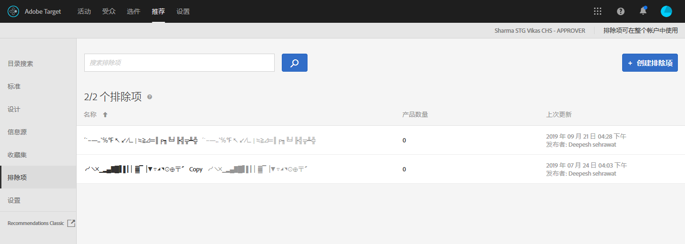

# 排除项{#exclusions}

可创建排除列表以阻止推荐某些项目。

>[!IMPORTANT]
>
>静态和动态排除规则是可帮助您完成营销工作的强大功能。有关详细信息、示例和用例情景，请参阅[使用动态和静态包含规则](../../c-recommendations/c-algorithms/use-dynamic-and-static-inclusion-rules.md#concept_4CB5C0FA705D4E449BD0B37B3D987F9F)。

**要创建排除，请执行以下操作：**

1. 单击&#x200B;**[!UICONTROL 推荐]** &gt; **[!UICONTROL 排除项]**&#x200B;以显示现有排除项列表。

   

   [!UICONTROL 排除项]列表视图中为每个排除项报告的“项目数”是指，在配置的默认“推荐”[主机组](/help/administrating-target/hosts.md)（环境）中与该排除项规则相匹配的产品数。请参阅[设置](../../c-recommendations/plan-implement.md#concept_C1E1E2351413468692D6C21145EF0B84)以更改默认主机组。

1. 单击&#x200B;**[!UICONTROL 创建排除项]**。

1. （视情况而定）在创建（或更新）排除项时从&#x200B;**[!UICONTROL 环境]**&#x200B;筛选器中选择一个环境，以预览该环境中排除项的内容。默认情况下，会显示默认主机组的结果。

   

1. 键入排除项&#x200B;**[!UICONTROL 名称]**，并输入可选描述。

1. 使用规则生成器创建排除项。

   在“规则”列表中选择一个参数，选择一个运算符，然后输入一个或多个值以标识产品。使用逗号分隔多个值。

1. 单击&#x200B;**[!UICONTROL 保存]**。

## Create an exclusion using Advanced Search

您还可以使用“目录搜索”页面上的“高级搜索”（“[!UICONTROL 推荐]”&gt;“[!UICONTROL 目录搜索]”&gt;“[!UICONTROL 高级搜索]”）来创建排除项。

[另存为](/help/c-recommendations/c-products/assets/save-as.png)

例如，在使用“ID”&gt;“包含”创建搜索后，您可以单击“[!UICONTROL 另存为]”&gt;“[!UICONTROL 排除项]”。For more information, see Catalog search.

>[!IMPORTANT]
>
>“高级搜索”功能不区分大小写；但在进行产品交付时，会根据区分大小写的搜索来返回产品。这种不匹配可能会导致产生混淆。因此，在基于使用“高级搜索”功能搜索到的结果创建排除项时，请务必考虑大小写问题。例如，如果您搜索“Holiday”，初始搜索会列出包含“Holiday”和“holiday”的结果。如果您随后创建一个排除项，以用于排除包含“holiday”的产品，则只会排除包含“holiday”的产品，而不会排除包含“Holiday”的产品。

## Training video: Create collections and exclusions in Recommendations (7:05)

此视频包含以下信息：

* 创建集合
* Create an exclusion

>[!VIDEO](https://video.tv.adobe.com/v/27689?captions=chi_hans)