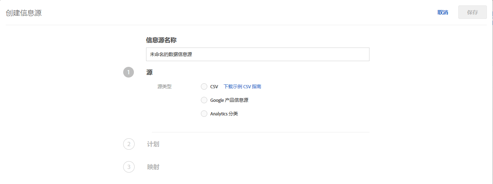
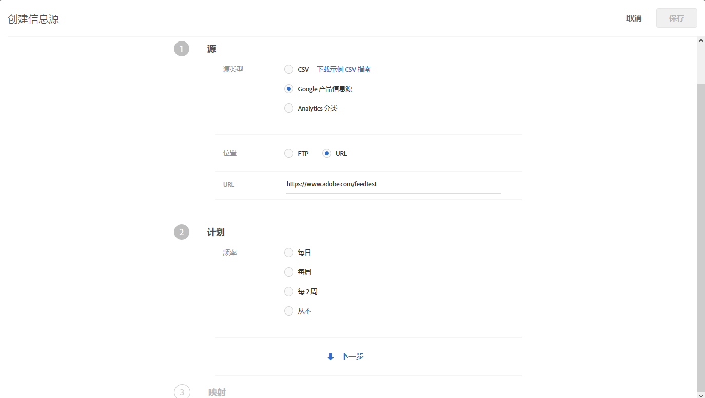
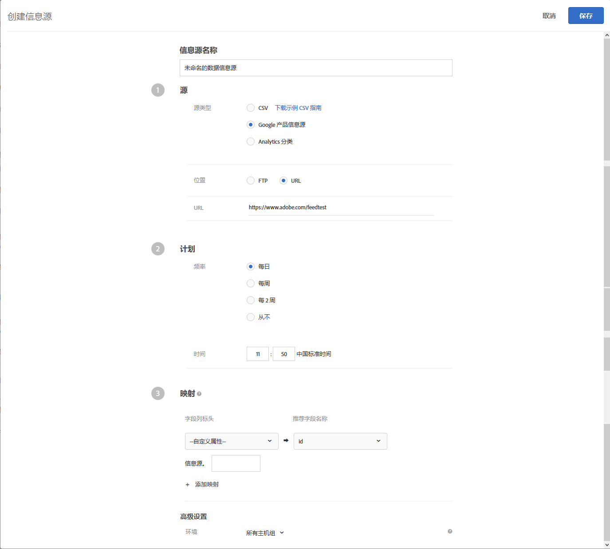

#  信息源{#feeds}

可使用信息源将实体导入到 [!DNL Recommendations] 中。可以使用 CSV 文件、Google Product Search 信息源格式和 Adobe Analytics 产品分类来发送实体。

## 信息源概述 {#concept_D1E9C7347C5D4583AA69B02E79607890}

信息源允许您传递[实体](/help/c-recommendations/c-products/products.md)，或者使用页面上没有提供或不能直接从页面安全发送（例如利润、COGS 等）的信息来扩充您的 mbox 数据。

您可以从 [!DNL Target] 产品分类文件或 Google Product Search 文件中选择要发送到 [!DNL Recommendations] 服务器的列。这些关于每个项目的数据然后可在显示的模板中使用，还可用于控制推荐。

如果同时通过实体源和 mbox 收集数据，则采用最新的数据。通常，最新的数据来自 mbox，因为 mbox 的查看频率更高。在极少数情况下，实体源数据和 mbox 数据的时间相同，这时使用 mbox 数据。

“[!UICONTROL 信息源]”列表（**[!UICONTROL 推荐]** > **[!UICONTROL 信息源]**）提供了有关您创建的所有信息源的信息。


“信息源”页面包含以下列：

* **名称**：创建过程中指定的信息源的名称。要编辑信息源的名称，您必须编辑信息源本身。使用新名称保存时，信息源会刷新。
* **类型**：类型包括 [CSV](/help/c-recommendations/c-products/feeds.md#section_65CC1148C7DD448FB213FDF499D35FCA)、[Google 产品信息源](/help/c-recommendations/c-products/feeds.md#section_8EFA98B5BC064140B3F74534AA93AFFF)和 [Analytics 分类](/help/c-recommendations/c-products/feeds.md#section_79E430D2C75443BEBC9AA0916A337E0A)。
* **状态**：信息源的当前[状态](/help/c-recommendations/c-products/feeds.md#concept_E475986720D1400999868B3DFD14A7A0)。
* **计划**：显示信息源的更新计划：每日、每周、每两周或从不。
* **项目**：显示信息源中的项目数。
* **上次更新**：显示上次更新信息源的日期和时间，以及更新信息源的人员姓名。如果[!UICONTROL 上次更新]信息源显示为“未定义”，则表示该信息源来自 [!DNL Recommendations Classic]，不能在 [!DNL Target Premium Recommendations] 中进行更改。

>[!IMPORTANT]
>
>上传的实体和实体属性将在61天后过期。 这意味着：
>
>* 您的源应至少每月运行，以确保您的目录内容不会过期。
>* 从源文件删除项目不会从目录中删除该项目。 要从目录中删除项目，请通过Target UI或API手动删除项目。 或者，修改物料属性（如库存）以确保将物料排除在考虑之外。


## CSV {#section_65CC1148C7DD448FB213FDF499D35FCA}

您可以使用 Adobe 专有的 CSV 上传格式创建 `.csv` 文件。该文件包含有关产品的保留属性和自定义属性的显示信息。要上传特定于您的实施的属性，请将标头行中的 `CustomN` 替换为您要使用的属性的名称。在下面的示例中，`entity.Custom1` 被替换为 `entity.availability`。然后，您可以将文件批量上传到 [!DNL Recommendations] 服务器。

与 Google 信息源格式相比，使用 .csv 格式具有以下优势：

* 无需字段映射。
* 支持多值属性（请参阅下面的示例）。
* 最多支持 100 个自定义属性。如果您需要 100 个以上的自定义属性，则可以使用指定的一组不同的自定义属性创建第二个信息源文件。

如果在您的页面上没有 mbox，或如果您要增加您网站上没有的项目的显示信息，则可以使用批量上传方法发送显示信息。例如，您可能想要发送不会在您的网站上发布的库存信息。

使用 .csv 文件、Google 产品信息源或 Analytics 产品分类信息源上传的任何数据都会覆盖我们数据库中的现有实体属性值。如果您通过 mbox 请求发送价格信息，然后使用文件发送不同的价格值，则文件中的值将覆盖使用 mbox 请求设置的值。一个例外是 `categoryId` 实体属性，该属性会附加类别值，而不是被覆盖以符合 250 个字符限制。

>[!IMPORTANT]
>
>在 .csv 文件中，不要用双引号 (&quot;) 引住值，除非是有意为之。如果用双引号引住值，则必须使用另一组双引号将其引住来进行转义。未转义的双引号会导致推荐信息源无法正确加载。

例如，以下语法不正确：

```
"Apples "Bananas" Grapes"",
```

以下语法正确：

```
"Apples ""Bananas"" Grapes""",
```

>[!NOTE]
>
>无法使用空白值覆盖现有值。您必须在其位置中传递其他值来进行覆盖。对于销售价格，常用的解决方案是通过一个实际的“NULL”或某些其他消息传递。然后，可以写入一个模板规则，以排除具有该值的项目。

成功上传产品实体约两个小时后，产品将显示在管理界面中。

以下是 .csv 文件的代码示例：

```
## RECSRecommendations Upload File 
## RECS''## RECS'' indicates a Recommendations pre-process header. Please do not remove these lines. 
## RECS 
## RECSUse this file to upload product display information to Recommendations. Each product has its own row. Each line must contain 19 values and if not all are filled a space should be left. 
## RECSThe last 100 columns (entity.custom1 - entity.custom100) are custom. The name 'customN' can be replaced with a custom name such as 'onSale' or 'brand'. 
## RECSIf the products already exist in Recommendations then changes uploaded here will override the data in Recommendations. Any new attributes entered here will be added to the product''s entry in Recommendations. 
## RECSentity.id,entity.name,entity.categoryId,entity.message,entity.thumbnailUrl,entity.value,entity.pageUrl,entity.inventory,entity.margin,entity.last_updated_by,entity.multi_english,entity.availability,entity.tax_country,entity.tax_region,entity.tax_rate,entity.product_type,entity.item_group_id,entity.color,entity.size,entity.brand,entity.gtin 
na3456,RipCurl Watch with Titanium Dial,Watches & Sport,Cutting edge titanium with round case,https://example.com/s7/na3456_Viewer,425,https://example.com/shop/en-us/na3456_RipCurl,24,0.25,csv,"[""New"",""Web"",""Sales"",""[1,2,34,5]""]",in stock,US,CA,9.25,Shop by Category > Watches,dz1,Titanium,44mm,RipCurl,"075380 01050 5" 
na3457,RipCurl Watch with Black Dial,Watches & Sport,Cutting edge matte black with round case,https://example.com/s7/na3457_Viewer,275,https://example.com/shop/en-us/na3457_RipCurl,24,0.27,csv,"[""New"",""Web"",""Sales"",""[1,2,34,5]""]",in stock,US,CA,9.25,Shop by Category > Watches,dz1,Black,44mm,RipCurl,"075340 01060 7"
```

## Google {#section_8EFA98B5BC064140B3F74534AA93AFFF}

Google Product Search 信息源类型使用 Google 格式。这与 Adobe 专有的 CSV 上传格式不同。

如果您已有 Google 产品信息源，则可以将其用作导入文件。

>[!NOTE]
>
>无需使用 Google 数据。[!DNL Recommendations] 使用与 Google 相同的格式。您可以使用此方法上传您的任何数据，并且还可以使用可用的计划功能。但是，您必须在设置文件时保留 Google 的预定义属性名称。

大多数零售商会将产品上传到 Google，因此当访客使用 Google Product Search 时，他们的产品将会显示出来。[!DNL Recommendations] 完全遵循 Google 对实体源的规范要求。Entity feeds can be sent to [!DNL Recommendations] via [!DNL .xml], [!DNL .txt], or [!DNL .tsv], and can use the [attributes defined by Google](https://support.google.com/merchants/answer/188494?hl=en&topic=2473824&ctx=topic#US). 可以在 [Google 购物页面](https://www.google.com/prdhp)上搜索结果。

>[!NOTE]
>
>托管 Google 信息源内容的服务器上必须可以使用 POST 方法。

由于 [!DNL Recommendations] 用户已将 [!DNL .xml] 或 [!DNL .txt] 信息源配置为通过 URL 或 FTP 发送到 Google，因此实体信息源将接受这些产品数据并使用这些数据构建 Recommendations 目录。指定此信息源存在的位置后，推荐服务器随即会检索数据。

如果在使用 Google Product Search 进行实体信息源上传时，想要在此显示推荐或跟踪产品浏览次数以根据浏览次数进行算法交付，则页面上仍需要有产品页面 mbox。

Google 信息源不支持自定义属性具有多个值。

此信息源将在您保存并激活它时运行。此信息源将在您保存它时运行，之后会在每天晚一小时的时候运行。

以下是 Google Product Search 信息源 .xml 文件的代码示例：

```
<?xml version="1.0" encoding="UTF-8" standalone="yes"?> 
<feed xmlns="https://www.w3.org/2005/Atom" xmlns:ns2="https://base.google.com/ns/1.0" xmlns:ns3="https://base.google.com/cns/1.0"> 
    <title>Product Feed</title> 
    <link href="https://example.com"/> 
    <updated>2017-12-13T08:45:04.918-08:00</updated> 
    <author> 
        <name>Product Feed Author</name> 
    </author> 
    <id>https://example.com</id> 
    <entry> 
        <title>RipCurl Watch with Titanium Dial</title> 
        <description>Cutting edge Titanium with Round case</description> 
        <ns2:id>na3452</ns2:id> 
        <ns2:link>https://example.com/shop/en-us/na3452_RipCurl</ns2:link> 
        <ns2:availability>in stock</ns2:availability> 
        <ns2:condition>NEW</ns2:condition> 
        <ns2:google_product_category>Watches &amp; Sport</ns2:google_product_category> 
        <ns2:gtin>075380 01050 5</ns2:gtin> 
        <ns2:image_link>https://example.com/s7/na3452_Viewer</ns2:image_link> 
        <ns2:mobile_link>https://m.example.com/s7/na3452_Viewer</ns2:mobile_link> 
        <ns2:mpn>71050</ns2:mpn> 
        <ns2:price>425</ns2:price> 
        <ns2:product_review_average>5.0</ns2:product_review_average> 
        <ns2:product_review_count>30</ns2:product_review_count> 
        <ns2:product_type>Shop by Category > Watches </ns2:product_type> 
        <ns2:brand>RipCurl</ns2:brand> 
        <ns2:sale_price>375</ns2:sale_price> 
        <ns2:tax> 
          <ns2:country>US</ns2:country> 
          <ns2:region>CA</ns2:region> 
          <ns2:rate>9.25</ns2:rate> 
          <ns2:tax_ship>y</ns2:tax_ship> 
        </ns2:tax> 
        <ns2:is_bundle>N</ns2:is_bundle> 
    </entry> 
    <entry> 
        <title>RipCurl Watch with Black Dial</title> 
        <description>Cutting edge matte black with Round case</description> 
        <ns2:id>na3453</ns2:id> 
        <ns2:link>https://example.com/shop/en-us/na3453_RipCurl</ns2:link> 
        <ns2:availability>in stock</ns2:availability> 
        <ns2:condition>NEW</ns2:condition> 
        <ns2:google_product_category>Watches &amp; Sport</ns2:google_product_category> 
        <ns2:gtin>075380 013450 5</ns2:gtin> 
        <ns2:image_link>https://example.com/s7/na3453_Viewer</ns2:image_link> 
        <ns2:mobile_link>https://m.example.com/s7/na3453_Viewer</ns2:mobile_link> 
        <ns2:mpn>71050</ns2:mpn> 
        <ns2:price>275</ns2:price> 
        <ns2:product_review_average>4.8</ns2:product_review_average> 
        <ns2:product_review_count>23</ns2:product_review_count> 
        <ns2:product_type>Shop by Category > Watches </ns2:product_type> 
        <ns2:brand>RipCurl</ns2:brand> 
        <ns2:sale_price>249</ns2:sale_price> 
        <ns2:tax> 
          <ns2:country>US</ns2:country> 
          <ns2:region>CA</ns2:region> 
          <ns2:rate>9.25</ns2:rate> 
          <ns2:tax_ship>y</ns2:tax_ship> 
        </ns2:tax> 
        <ns2:is_bundle>N</ns2:is_bundle> 
    </entry> 
</feed> 
```

以下是 Google Product Search 信息源 .tsv 文件的代码示例：

```
id    title    description    link    price    condition    availability    image_link    tax    shipping_weight    shipping    google_product_category    product_type    item_group_id    color    size    gender    age_group    pattern    brand    gtin    mpn 
na3454    RipCurl Watch with Titanium Dial    Cutting edge titanium with round case    https://example.com/shop/en-us/na3454_RipCurl    425    new    in stock    https://example.com/s7/na3452_Viewer    US:CA:9.25:y    1.5 oz    US:::0.00 USD    Watches & Sport    Shop by Category > Watches    dz1    Black    44mm    male    adult    Solid    RipCurl    075380 01050 5    DZ1437 
na3455    RipCurl Watch with Black Dial    Cutting edge matte black with round case    https://example.com/shop/en-us/na3455_RipCurl    275    new    in stock    https://example.com/s7/na3452_Viewer    US:CA:9.25:y    1.5 oz    US:::0.00 USD    Watches & Sport    Shop by Category > Watches    dz1    Black    44mm    male    adult    Solid    RipCurl    075340 01060 7    DZ1446
```

## Analytics 产品分类 {#section_79E430D2C75443BEBC9AA0916A337E0A}

Analytics 产品分类是唯一可用于推荐的分类。For more information about this classification file, see [About classifications](https://docs.adobe.com/content/help/en/analytics/components/classifications/c-classifications.html) in the *Analytics Components* guide. 推荐需要的所有信息并非都可通过当前的实施获得，因此，如果要在分类文件中添加新内容，请按此用户指南操作。

>[!IMPORTANT]
>
>在使用 Analytics 产品分类将实体数据导入推荐之前，请注意，这不是首选方法。
>
> 请注意以下事项：
>* 更新实体属性会导致长达 24 小时的额外延迟。
>* Target 仅支持“产品分类”。必须将 Analytics 产品 SKU 映射到与推荐 `entity.id` 相同的级别。可以使用 Adobe 咨询服务对自定义 Analytics 分类进行工程方面的处理。如有任何疑问，请联系您的帐户管理员。


## 创建信息源 {#steps}

可创建一个信息源，以将有关产品或服务的信息插入到 [!DNL Recommendations] 中。

1. 在 Target 界面中，单击&#x200B;**[!UICONTROL 推荐]** > **[!UICONTROL 信息源]** > **[!UICONTROL 创建信息源]**。

   

1. 为您的信息源指定一个描述性名称。
1. 选择&#x200B;**[!UICONTROL 源类型]**。

   * CSV
   * Google 产品信息源
   * Analytics 分类
   有关 CSV 和“Google 产品信息源”信息源类型的信息，请参阅[信息源概述](../../c-recommendations/c-products/feeds.md#concept_D1E9C7347C5D4583AA69B02E79607890)。You can also [download a model CSV guide](https://recspm2.experiencecloud.adobe.com/content/mac/default/target/files/EntityFileUploadTemplate.csv) to help you format the feed correctly.

1. （视情况而定）如果您选择 **[!UICONTROL CSV]** 或者 **[!UICONTROL Google 产品信息源]**，请指定可以访问信息源的位置。

   * **FTP**：如果您选择 FTP，请提供 FTP 服务器信息、登录凭据、文件名和 FTP 目录。您可以选择使用带有 SSL 的 FTP (FTPS) 进行更安全的上传。

      支持的 FTP 服务器设置：

      * 必须将 FTP 和 FTPS 设置为使用被动 FTP。
      * 对于 FTPS，请将服务器配置为接受显式 FTPS 连接。
      * 不支持 SFTP。
      * 您可以手动指定启动连接的端口（例如，`ftp://ftp.yoursite.com:2121`）。如果未指定端口，则将使用默认的 FTP 或 FTPS 端口。
   * **URL**：如果您选择 URL，请指定 URL。


1. （视情况而定）如果您选择 **[!UICONTROL Analytics 分类]**，请从下拉列表中选择报表包。

1. 单击&#x200B;**[!UICONTROL 下一步]**&#x200B;箭头以显示[!UICONTROL 计划]选项。

   

1. 选择一个更新选项：

   * 每日
   * 每周
   * 每 2 周
   * 从不：不计划更新。如果您不希望运行此信息源，请选择此选项。

1. 指定要运行信息源的时间。

   此选项基于浏览器中使用的时区。如果您想要使用不同时区的时间，则必须根据您所在的时区计算该时间。

1. 单击&#x200B;**[!UICONTROL 下一步]**&#x200B;箭头以显示[!UICONTROL 映射]选项，然后指定您希望如何将数据映射到 [!DNL Target] 定义。

   

1. （可选）如果您希望信息源属于某个环境（主机组），请选择该主机组。

   默认情况下，信息源属于所有主机组。这可确保此信息源中的项目可在任何环境中使用。有关更多信息，请参阅[主机](../../administrating-target/hosts.md#concept_516BB01EBFBD4449AB03940D31AEB66E)。

1. 单击&#x200B;**[!UICONTROL 保存]**。

创建或编辑信息源后，该信息源会立即运行，然后将根据您设置的参数进行更新。所有信息需要一段时间才能使用。首先，信息源必须同步，接着必须对其进行处理并将其编入索引，然后才能对其发布并使其可供使用。当前状态显示在“信息源”列表中的[信息源状态](/help/c-recommendations/c-products/feeds.md#status)下。在该过程完成之前，您可以关闭 [!DNL Target]，该过程会继续执行。

编入索引期间，在将各个值编入索引之前，将会显示产品和信息源标头。这使您可以搜索和查看产品，以便在编入索引完成之前创建收藏集、排除项、设计和活动。

如果状态显示为“成功”，则表示文件已找到且已正确解析。在将该文件编入索引之前，无法在 [!DNL Recommendations] 中使用相应的信息，编入索引可能需要一些时间，具体取决于文件的大小。如果该过程失败，则表示未找到文件（例如，您使用的 URL 不正确或您的 FTP 信息不正确），或者存在解析错误。

## 信息源状态和指示器 {#concept_E475986720D1400999868B3DFD14A7A0}

有关可能的信息源状态及其指示器的信息。

### 信息源状态 {#status}

以下是信息源可能具有的几种状态：

| 状态 | 描述 |
|--- |--- |
| 正在同步 | 正在将信息源设置详细信息保存到 Target。 |
| 同步失败 | 无法将信息源设置详细信息保存到 Target。请重试。 |
| 未运行信息源 | 您已创建一个信息源，但尚未设置运行计划（频率设置为“从不”）。 |
| 已计划在 &lt;日期和时间>** 运行 | 信息源尚未运行，但已计划在指定的日期和时间运行。 |
| 正在等待下载 | Target 正准备下载信息源文件。 |
| 正在下载信息源文件 | Target 正在下载信息源文件。 |
| 正在导入项目 | Target 正在从信息源文件中导入项目。 |
| 已在&#x200B;*指定时间*&#x200B;成功导入信息源 | Target 已将信息源文件导入其内容交付系统。已在内容交付系统中对项目属性进行了更改，并且此更改将很快地反映在交付的推荐中。如果没有看到预期的更改，请稍后重试并刷新包含推荐的页面。<br>*注意 1：*如果对项目属性所做的更改导致项目被排除在推荐之外，则会立即反映该排除项。如果项目是新添加的，或者对属性的更改导致该项目*&#x200B;不再&#x200B;*被排除在推荐之外，则在下一次算法更新之前不会反映此项目，此过程将在 24 小时内发生。<br>*注意 2：*&#x200B;显示此状态时，更新可能尚未反映在“目录搜索”用户界面中。“目录搜索”中会列出一个单独的状态，指示上次更新可搜索目录的时间。 |
| 未能编入索引 | 索引操作失败。请重试。 |
| 未找到服务器 | FTP 或 URL 位置无效或无法访问。 |

要更新信息源（例如，更改信息源配置或信息源文件），请打开该信息源，进行任何所需更改，然后单击&#x200B;**[!UICONTROL 保存]**。

>[!IMPORTANT]
>
>上传的实体会在 61 天后过期。这意味着您应该至少每 60 天上传一次信息源文件，以避免对您的推荐活动造成干扰。如果某个项目在 60 天内至少有一次未包含在信息源文件（或其他实体更新方法）中，则 Adobe Target 会推断该项目不再相关，并将其从目录中删除。

### 信息源状态指示器 {#section_3C8A236C5CB84C769A9E9E36B8BFABA4}

以下信息源状态指示器将显示在“[!UICONTROL 状态]”列中：

| 状态指示器 | 描述 |
|--- |--- |
| 绿色状态指示器 | 当成功将信息源编入索引时，会显示绿色状态圆点，以指示该信息源处于成功状态。 |
| 黄色状态指示器 | 当信息源或信息源索引延迟的时间为信息源频率的 25% 时，会显示黄色状态圆点。例如，对于设置为每日运行的信息源，如果在计划时间后的六小时内没有完成索引，则会显示黄色圆点。注意：如果信息源状态为“正在等待索引队列”，则最近更新的值可在交付和标准处理过程中使用。 |
| 白色状态指示器 | 当未设置信息源运行计划时，会显示白色状态圆点，以指示信息源尚未运行。 |
| 红色状态指示器 | 如果信息源未能将数据上传到服务器，则会显示红色状态指示器。 |
请仔细研究下面的示例：

**示例 1:**

* 第一天：每日信息源于太平洋标准时间上午 9:00 运行
* 第二天：现在是下午 3:30，信息源从昨天上午 9 点之后就没有运行。

状态应为黄色，因为索引原本应在大约 6.5 小时之前运行。6.5 小时 + 24 等于信息源运行期限的 127%。

**示例 2:**

* 1 月 1 日：每月信息源于太平洋标准时间上午 9 点运行
* 2 月 3 日：现在是上午 10 点，信息源已有一个月加一天零一小时没有运行

状态应为黄色，因为索引原本应在大约一天零一小时之前运行。虽然这只是频率设置的 (31+(1/25))/30 = 1.03%，但它超过了延迟一天的最大值。

## 培训视频

以下视频包含有关本文中所讨论概念的详细信息。

### 了解“推荐”中的信息源 (3:01) 

本视频包含以下信息：

* 了解信息源的用途
* 了解信息源的值

>[!VIDEO](https://video.tv.adobe.com/v/27695)

### 创建信息源 (6:44) 教 

本视频包含以下信息：

* 设置信息源
* 了解要使用哪种类型的信息源

>[!VIDEO](https://video.tv.adobe.com/v/27696)
