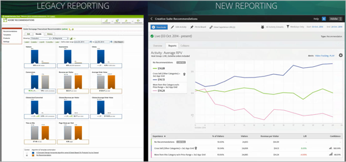

#  Recommendations Classic 与 Target Premium 中的“推荐”活动 {#recommendations-classic-versus-recommendations-activities-in-target-premium}

此信息可帮助您在 Recommendations Classic 与 Target Premium 中的“推荐”活动之间进行选择。

>[!NOTE]
>
>“推荐”活动作为 [!DNL Target Premium] 解决方案的一部分提供。如果没有 [!DNL Target Premium] 许可证，它们将无法在 [!DNL Target Standard] 中使用。

在 [!DNL Recommendations] Classic 产品中，显示推荐的方法是先在页面上创建一个数据收藏集 mbox，然后在页面上的某个特定位置添加一个显示 mbox。通过 [!DNL Target Premium] 中的 [!DNL Recommendations] 活动，您可以收集访客信息，并在页面上的任意位置创建推荐，而无需为要用于推荐产品或内容的每个位置分别创建一个 mbox。只需在页面的标头中使用一个简单的 JavaScript 引用，便可以在页面上的任意位置创建推荐。使用此 JavaScript 引用可将 [!DNL Target] 和 `entity.id` 等键传递到全局 `entity.categoryId` mbox。

[!DNL Recommendations Classic] 在 [!DNL Experience Cloud] UI 中显示为其自身的卡片。[!DNL Recommendations] 活动可在 [!DNL Target Premium] 工作流中找到。

[!DNL Recommendations Classic] 用户可以继续在 [!DNL Target Recommendations] 中使用他们的 [!DNL Recommendations] mbox。这些用户也可以将经典方法与 [!DNL Target] 方法结合使用，方法是保留其 mbox，并在标头中使用 JavaScript 代码来激活 [!DNL Recommendations] 功能，以便用于页面上的其他元素。但是，为获取完整的 [!DNL Target] 功能，[!DNL Recommendations Classic] 用户可能倾向于删除旧的 mbox，而仅依赖 [!DNL Target Recommendations]。

与 [!DNL Recommendations Classic] 相比，[!DNL Target] 中的 [!DNL Recommendations] 活动主要在以下方面做出了改进：

## “推荐”作为选件

您可以在 [!UICONTROL A/B 测试]（包括[!UICONTROL 自动分配]和[!UICONTROL 自动定位]）和[!UICONTROL 体验定位] (XT) 活动中包含推荐。

此功能提供了几项全新的功能，例如：

* 可在同一活动中测试和定位推荐和非推荐内容。
* 可轻松尝试在页面上放置推荐内容，包括为多个推荐排序。
* 可使用[!UICONTROL 自动分配]自动将流量推送到性能最佳的推荐体验。
* 可使用[!UICONTROL 自动定位]根据访客的配置文件动态地为他们分配量身定制的推荐体验。

要开始使用此功能，请使用[!UICONTROL 可视化体验编辑器]创建 [!UICONTROL A/B 测试]或[!UICONTROL 体验定位]活动，然后执行[!UICONTROL 此项前插入]、[!UICONTROL 此项后插入]或[!UICONTROL 替换为]操作以向体验添加推荐。

有关更多信息，请参阅[将推荐作为选件](/help/c-recommendations/recommendations-as-an-offer.md)。

## 标准 {#section_117709846DAA404580EBE879FFCBD9BA}

[!DNL Target Recommendations] 具有一个标准库，其中包含预先打包的规则集和配置集。而在 [!DNL Recommendations Classic] 中，需要通过填写表单并从很长的规则列表中选择规则来手动构建每个推荐。现在，创建 [!DNL Recommendations] 活动时，您只需选择预先配置的标准集即可。您仍可创建自定义推荐，但是标准库中包含很多最常用的配置，这些配置是为了简化流程而预先构建的，而且使用的是用户易于理解的语言。您可以原封不动地使用这些预先打包的标准，也可以复制并编辑这些标准以满足您的具体需求。

预先配置的标准按垂直行业、页面类型和实施进行排序。例如，您可以查找以下标准：适用于零售行业，要用在产品页面上，且显示属于某个特定类别（由 `entity.categoryID` 参数定义）的产品。

有关使用和创建标准的更多信息，请参阅[标准](../../c-recommendations/c-algorithms/algorithms.md#concept_4BD01DC437F543C0A13621C93A302750)。

## 工作流 {#section_76B4A26297BF422382DE2C79A2713D3C}

[!DNL Recommendations] 工作流已得到简化。现在，您只需按照可视化工作流执行以下操作，而无需填写复杂的表单：

1. 选择标准。
1. 选择预先配置的 [design（设计）](../../c-recommendations/c-design-overview/create-design.md#task_CC5BD28C364742218C1ACAF0D45E0E14)。
1. 预览生成的推荐。

## 可视化预览 {#section_639B9E38C9EC4093BF9023EE0F2A15AC}

设置推荐后，您可以预览推荐，并进行任何必要的更改，而无需在页面上创建推荐，然后对其进行测试。可从 [!DNL Target] 中进行预览。

## 定位 {#section_93295EA0DBA14210B8518AF4802A459F}

在 [!DNL Recommendations Classic] 中，有 6 个定位选项，而“推荐”活动可使用 Target 的全部定位选项。使用 [!DNL Target] 或其他 [!DNL Adobe Experience Cloud] 受众（例如 [!DNL Audience Manager] 和 [!DNL Analytics]）定义受众，然后选择看到每个设计的活动参加者所占的百分比，以及看到控制的参加者所占的百分比。

## 报表 {#section_25C2FCCE4BC1488496C517C0470B5CD6}

在 [!DNL Target] 中，[!DNL Recommendations] 提供了改进的报表，现在，报表可以利用 [!DNL Target] 和 [!DNL Experience Cloud] 提供的各项功能。以前只会显示由 [!DNL Recommendations] 产生的提升度（与没有推荐的结果相比），但现在，您可以查看与 [!DNL Recommendations] 活动有关的各个方面的信息。

