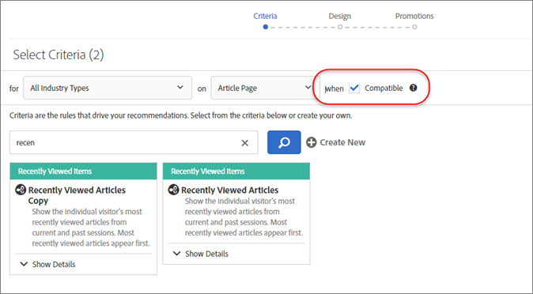
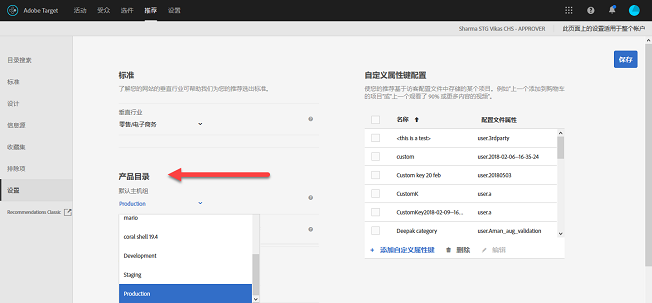
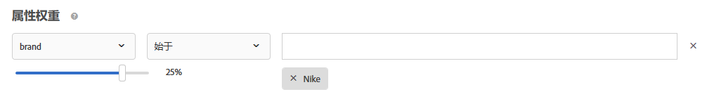

#  “推荐”常见问题解答 {#recommendations-faq}

列表关于Adobe TargetRecommendations活动的常见问题解答(FAQ)。

## 目录中的项目更新将需要多长时间才会反映在我的网站上？

导入信息源文件后，或者通过 API 或 mbox 接收实体更新后，将在 60 分钟内反映以下更改：

* 在设计模板中返回的项目属性。
* 在全局排除规则（用于防止将项目包含在返回的推荐中）中使用的项目属性。
* 在包含规则（其所属的标准决定是将项目包含在返回的推荐中还是将其从返回的推荐中排除）中使用的项目属性。

在下一个算法运行后（12-24 小时内），才会反映以下更改：

* 在用于活动的收藏集规则中使用的项目属性。
* 在基于与活动关联的属性或收藏集的促销活动中使用的项目属性。
* 项目在其中显示为“最畅销商品”或“查看次数最多”算法中的“当前类别”或“最喜爱的类别”的项目类别。
* 当更改的属性是用作算法自定义键的自定义属性时的推荐项目排名。
* 当推荐逻辑为“具有相似属性的项目”或者当使用了“内容相似度”权重因子或“属性权重”因子时，基于已更改属性的推荐项目排名。

>[!NOTE]
>
>当信息源文件的状态从“正在导入项目”变为“正在准备搜索索引更新”时，信息源文件会被视为已导入。更新可能需要超过 60 分钟的时间才能反映在“目录搜索”用户界面中；当信息源状态变为“更新已完成”时，“目录搜索”将处于最新状态。即使“目录搜索”尚未处于最新状态，您的网站仍会在上面列出的时间范围内反映更新。最新的“目录搜索”索引更新时间将显示在“目录搜索”页面上。

## 如果特殊字符破坏了数组，我应该怎么做？{#section_D27214116EE443638A60887C7D1C534E}

在 JavaScript 中使用转义值。引号 (&quot;) 可能会破坏数组。以下代码片段是一个转义值示例：

```
#set($String='') 
#set($escaper=$String.class.forName('org.apache.commons.lang.StringEscapeUtils')) 
<script type="text/javascript"> 
console.log("$escaper.escapeJavaScript($entity1.name)") 
console.log("$escaper.escapeJavaScript($entity2.name)") 
console.log('$escaper.escapeJavaScript($entity3.name)') 
names.push("$escaper.escapeJavaScript($entity4.name)") 
</script>
```

## 创建“推荐”活动时，为何并不是所有标准（包括自定义标准）都可选择？ {#section_B2265AC8B8A94E0298D495A05C5D817F}

可用的标准依据当前类别而定。创建推荐选件时，算法选择器会根据类别 ID 显示标准。

如果要应用标准的位置不包含类别 ID，则算法选择器中不会提供相应的标准。

如果您所用位置的 mbox 中存在类别 ID，则标准选择器中将包含所有适用标准。

Target 提供了一个[筛选不兼容的标准](../../c-recommendations/plan-implement.md#concept_C1E1E2351413468692D6C21145EF0B84)设置，可用于控制算法选择器的智能筛选。

>[!NOTE]
>
>此设置仅适用于在可视化体验编辑器 (VEC) 中创建的活动。此设置不适用于在基于表单的体验编辑器中创建的活动（Target 没有位置上下文）。

要访问“[!UICONTROL 筛选不兼容的标准]”设置，请单击“[!UICONTROL 推荐]”>“[!UICONTROL 设置]”：


如果“[!UICONTROL 筛选不兼容的标准]”设置未启用，则 Target 不会对算法选择器中的算法进行筛选，因而会显示所有算法。

如果“[!UICONTROL 筛选不兼容的标准]”设置已启用，则在 VEC 活动中，Target 会从选定的位置中读取实体 ID 和类别 ID，然后根据 `currentItem|currentCategory` 显示算法（前提是该位置中存在相应的值）。因此，默认情况下，算法选择器中仅会显示选定位置的兼容算法。

如果“[!UICONTROL 筛选不兼容的标准]”设置已启用，您仍然能够查看不兼容的算法，方法是在选择标准时取消选中“[!UICONTROL 兼容]”复选框。



下面列出了 Target 不会显示“[!UICONTROL 兼容]”复选框的几种特殊情况：

* 位置中同时存在实体 ID 和类别 ID，在这种情况下将不进行任何筛选。
* 您使用的是 [!DNL mbox.js] 版本 55 或更低版本。
* 未从页面触发任何 mbox 调用 (!config.isAutoCreateGlobalMbox &amp;&amp; !config.isRegionalMbox)
* 未定义 Target 参数。

## 如果“推荐”中的某个收藏集变为零 (0)，我应该怎么做？ {#section_E2DB2FE67CF24EEC81412BFF3FA6385D}

如果您看到某个之前不为零的收藏集变为零，请考虑以下信息：

* 您可以重新保存该收藏集，然后查看其数值是否进行了更新。请注意，重新保存后，该收藏集将重新运行所有使用它的算法。
* 您所查看的环境是否正确？请转到 [!DNL /target/products.html#recsSettings] 进行复查（如下所示）。

   

* 索引是否为最新？请转到 [!DNL /target/products.html#productSearch]，然后查看索引是在多少小时之前编入的（例如“已在 3 小时前编入索引”）。如有需要，您可以刷新索引。
* 您是否更改过信息源或数据层，从而导致实体不再匹配收藏集规则？请确保大小写匹配（区分大小写）。
* 信息源是否已成功运行？是否有人更改过 FTP 目录、密码等？
* Target 会尽可能在最短的时间内生成交付更新（在客户的页面/应用程序中）。不过与此同时，我们还必须在 UI 中提供一些图表，以供营销人员使用。但是，我们不必延迟交付更新来等待 UI 更新实现同步。您可以使用 [mboxTrace](/help/c-activities/c-troubleshooting-activities/content-trouble.md) 来查看收到请求时系统中包含哪些内容。

## 一般的属性权重与特定于内容相似度的属性权重之间有何区别？{#section_FCD96598CBB44B16A4C6C084649928FF}

属性权重存在两种形式：“标准属性权重”和“内容相似度属性权重”。

“标准属性权重”适用于大部分（如果不是适用于全部）标准类型（不仅仅包括内容相似度）。此类型的权重会赋予某些属性值较高的权重。在以下示例中，耐克产品在输出推荐中具有较高的权重。



“内容相似度属性权重”仅适用于内容相似度标准。

这是一种更为动态的权重类型，以当前的“推荐键”（当前查看的项目）为基础。在以下示例中（品牌 x 16），如果访客在查看耐克运动鞋，则很有可能向该访客推荐其他耐克产品（不一定只是运动鞋），而不是向其推荐竞争品牌的运动鞋。如果访客在查看阿迪达斯运动鞋，则很有可能向其推荐阿迪达斯产品。


## Target 为何有时无法显示推荐？ {#section_DB3F40673AED42228E407C05437D99E9}

Target 有时无法显示推荐，原因在于可用推荐的数量过低。

每个标准所生成的值的数量是设计中指定的实体数量的 3 倍。运行时筛选（例如库存和 mbox 属性匹配）将在生成 3 倍的值后进行应用，因此有可能在交付时最终生成的值不足 3 倍。为缓解这一情况，可通过隐藏额外的实体来增加设计中的实体数量。

可在设计开始时使用以下 JavaScript 来增加请求实体的数量。在此示例中，请求的实体计数将为 30 (3x10)。

```
#foreach($entity in $entities) 
 #if( $foreach.count > 10 ) 
  #break 
 #end 
 #set ($foo = $entity.id) 
#end 
```

## 用于插入/更新产品的 API 调用的大小限制是多少？我能否使用 API 而不是信息源在一次调用中更新 50,000 个产品？ {#section_434FE1F187B7436AA39B7C14C7895168}

Target 在应用程序级别施加了 50 MB 的发布限制；但是，仅当您传递 `application/x-www-form-urlencoded` 内容类型标头时才会受到此限制。

您当然可以尝试在一次调用中发送 50,000 个产品。如果发送失败，您应将这些产品分批进行发送。我们通常建议客户将其调用分成 5,000 个产品或 10,000 个产品为一批，以降低因系统负载导致超时的可能性。

## 创建推荐标准、促销活动或模板测试规则时，是否需要指定 mbox 名称？ {#section_FFA42ABCC5954B48A46526E32A3A88A2}

在基于 mbox 参数创建推荐标准、促销活动或模板测试规则时，`mboxParameter` 不再提示您输入 `mboxName`。mbox 名称现在是可选的。通过这项更改，您可以使用多个 mbox 中的参数或引用尚未记录到 Edge 的参数。

要选择所需的参数，请执行以下操作：

* 在创建新标准、促销活动或模板测试规则时，从列表中选择一个参数名称，开始键入所需参数名称的前面几个字符，或键入所需参数名称的全名。
* 如果您记得 mbox 名称而不记得参数名称，则使用复选框筛选传递所需参数的已知 mbox。

无论使用哪种方法，mbox 和参数之间均没有链接。标准、促销活动或模板测试规则的运行将以传递参数的所有 mbox 中的相应参数为基础。

如果您编辑现有标准、促销活动或模板测试规则，则会显示筛选标准以及在创建期间提供的 mbox 名称。

## 在定义新受众后，为什么我无法保存旧版“推荐”活动？ {#section_1E47C40B1FE7479BAC3EE0F50CE7C2C4}

确保受众具有唯一的名称。如果您为受众指定了与现有受众相同的名称，则无法保存旧版“推荐”活动（在 2016 年 10 月之前创建的“推荐”活动）。

## 可用于信息源上传的 CSV 文件的最大大小是多少？ {#section_20F1AF4839A447B9889B246D6E873538}

对于上传信息源的 CSV 文件，其行数或文件大小没有硬性限制。但是，作为最佳实践，我们建议将 CSV 文件大小限制为 1 GB，以避免在文件上传过程中出现故障。如果文件大小超过 1 GB，最好将其拆分为多个信息源文件。自定义属性列的最大数量为 100，自定义属性限制为 4,096 个字符。有关所需列长度的其他限制，请参阅 [Target 限制页面](../../r-troubleshooting-target/target-limits.md#reference_BEFE60C3AAA442FF94D4EBFB9D3CC9B1)。

## 我可以动态排除实体吗？

在查询字符串中，您可以传递要从推荐中排除的实体 ID。例如，您可能需要排除购物车中已有的项目。

要启用排除功能，请使用 `excludedIds` mbox 参数。此参数指向一个以逗号分隔的实体 ID 列表。例如，`mboxCreate(..., "excludedIds=1,2,3,4,5")`。该值将在请求推荐时发送。

仅对当前目标调用执行排除；在后续目标调用中不排除项目，除非 `excludedIds` 再次传递值。 要从每页的推荐中排除购物车中的项目，请继续在每页 `excludedIds` 上传递值。

>[!NOTE]
>
>如果排除的实体过多，则 Recommendations 所表现出的行为就像是没有足够的实体来填充推荐模板。

To exclude `entityIds`, append the `&excludes=${mbox.excludedIds}` token to the offer content url. 在提取了内容 URL 之后，所需参数将使用当前的 mbox 请求参数替代。

默认情况下，新创建的推荐将启用此功能。现有推荐必须进行保存才能支持动态排除的实体。

## 在Recommendations内容跟踪中有时返回的NO_CONTENT响应表示什么？

当请求的算法和密钥组合的建议不可用时，将返回NO_CONTENT。 通常，当算法禁用备份且下列一个或多个情况也适用时，会发生这种情况：

* 结果尚未就绪。

   这通常发生在首次保存新创建的活动时或对活动中使用的集合、条件或促销进行配置更改后。

* 对于所请求的算法／密钥组合，结果已就绪，但尚未在最近的边缘服务器上缓存。

   刚刚发出的请求将启动缓存操作，因此在重新加载几页和／或经过几分钟后，这应会解析自身。

* 结果已就绪，但对于提供的键值不可用。

   通常，当在最新算法运行后请求添加到目录的项目的建议时，会发生这种情况，并在下一个算法运行后解析自身。

* 部分模板渲染已禁用，并且没有足够的结果可用于填充模板。

   通常，当您有动态包含规则时，会发生这种情况，该规则会从可能的结果中积极过滤器许多项目。 要避免这种情况，请启用备份，但不要将包含规则应用于备份，或者以较少筛选的条件按顺序使用条件。
